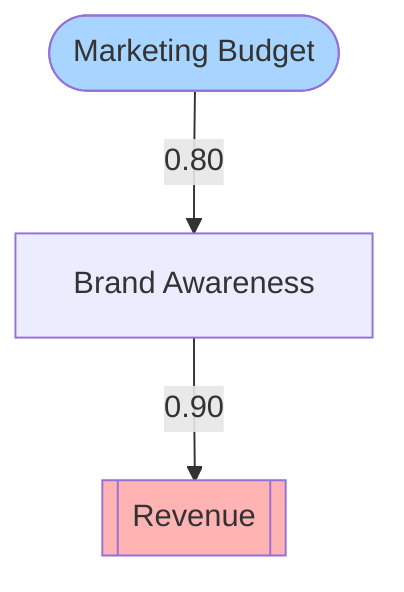

# DeepThinking MCP v3.4.5

A comprehensive Model Context Protocol (MCP) server featuring **18 advanced reasoning modes** with intelligent mode recommendation, visual export capabilities, high-performance validation caching, production-ready features, comprehensive testing, and automated CI/CD for complex problem-solving, analysis, and decision-making.

## Quality Metrics (v3.4.5)

- **TypeScript Compilation**: ✅ 0 errors, 0 warnings, **0 suppressions** - 100% type-safe codebase
- **Test Pass Rate**: 🟢 **97.5%** (575/589 tests passing) - **+5 tests improved from v3.4.4**
- **Test Files**: 93.5% passing (29/31 files)
- **Type Safety**: ✅ **100% elimination** of suppressions (231 → 0)
- **LaTeX Export**: 100% test coverage (27/27 tests passing)
- **Taxonomy Tests**: 86.5% passing (32/37 tests) - **+4 tests fixed**
- **Code Quality**: 3 critical bugs fixed, 2,424 duplicate lines removed, 20 deprecated methods updated
- **Latest Release**: v3.4.5 (2025-11-24) - [See CHANGELOG](CHANGELOG.md)

## Overview

DeepThinking MCP v3.4 provides a complete toolkit for structured reasoning with 18 specialized modes, an intelligent recommendation system, powerful visual export capabilities, production-ready features (search, analytics, templates, batch processing, caching, webhooks, backup/restore), and optimized performance through validation caching:

### Core Modes
- **Sequential**: Iterative refinement with revision capabilities
- **Shannon**: 5-stage systematic problem-solving methodology
- **Mathematics**: Theorem proving and symbolic computation
- **Physics**: Tensor mathematics and field theory
- **Hybrid**: Intelligently combines multiple approaches

### Advanced Modes (v2.0)
- **Abductive**: Inference to the best explanation, hypothesis generation and evaluation
- **Causal**: Cause-effect analysis with causal graphs and interventions
- **Bayesian**: Probabilistic reasoning with evidence updates
- **Counterfactual**: What-if scenario analysis and alternative histories
- **Analogical**: Cross-domain pattern matching and knowledge transfer
n### Phase 3 Modes (v2.3+)
- **Temporal**: Event timelines, temporal constraints, Allen's interval algebra, causal relations over time
- **Game Theory**: Nash equilibria, strategic analysis, payoff matrices, dominant strategies, game trees
- **Evidential**: Dempster-Shafer theory, belief functions, evidence combination, uncertainty intervals
- **First-Principles**: Deductive reasoning from foundational axioms and principles

### Phase 4 Modes (v3.2+) - Remote Contributions
- **Systems Thinking**: Holistic analysis of complex systems, feedback loops, emergence, and interconnections
- **Scientific Method**: Hypothesis-driven experimentation with research questions, experimental design, data collection, and statistical analysis
- **Optimization**: Constraint satisfaction and optimization problems with decision variables, objectives, and solution search
- **Formal Logic**: Rigorous logical reasoning with formal systems, inference rules, and proof verification

## Features

### 13 Specialized Reasoning Modes

#### Core Modes
- **Sequential**: Iterative refinement with revision capabilities and branching
- **Shannon**: Systematic 5-stage problem-solving (problem definition → constraints → model → proof → implementation)
- **Mathematics**: Theorem proving, lemma derivation, symbolic computation
- **Physics**: Tensor formulation, dimensional analysis, conservation laws
- **Hybrid**: Intelligently combines modes based on problem characteristics

#### Advanced Reasoning Modes (v2.0)
- **Abductive**: Generate and evaluate hypotheses to explain observations. Perfect for debugging, root cause analysis, and diagnostic reasoning.
- **Causal**: Build causal graphs with nodes and edges, analyze interventions and their effects. Ideal for impact analysis and system design.
- **Bayesian**: Update beliefs using probabilistic reasoning with priors, likelihoods, and evidence. Essential for risk assessment and A/B testing.
- **Counterfactual**: Explore alternative scenarios and compare outcomes. Excellent for post-mortems and strategic planning.
- **Analogical**: Transfer knowledge across domains by identifying structural similarities. Great for design patterns and innovative problem-solving.
n#### Phase 3 Reasoning Modes (v2.3+)
- **Temporal**: Model events, intervals, and temporal relationships using Allen's interval algebra. Track causality over time with timestamps, durations, and temporal constraints. Perfect for timeline analysis, scheduling problems, and understanding event sequences.
- **Game Theory**: Analyze strategic interactions between rational agents. Define games, players, and strategies. Compute Nash equilibria (pure and mixed), identify dominant strategies, construct payoff matrices, and build extensive-form game trees. Ideal for competitive analysis, mechanism design, and strategic decision-making.
- **Evidential**: Apply Dempster-Shafer theory for reasoning with uncertain and incomplete evidence. Define hypotheses, collect evidence with reliability scores, assign belief functions with mass assignments, combine evidence using Dempster's rule, compute belief and plausibility intervals, and make decisions under uncertainty. Ideal for sensor fusion, diagnostic reasoning, intelligence analysis, and situations with incomplete information.
- **First-Principles**: Derive conclusions from foundational axioms and principles using deductive reasoning. Define principles (axioms, definitions, observations), build derivation chains with logical inferences, track confidence levels, and reach conclusions with certainty analysis. Ideal for fundamental analysis, conceptual understanding, and reasoning from basic truths.

### Mathematical Enhancements
- **Symbolic computation** support with LaTeX and symbolic formats
- **Theorem and proof** structures
- **Lemma derivation** and corollary tracking
- **Algebraic manipulation** and numerical analysis
- **Logical form** with premises, conclusions, and inference rules

### Physics Capabilities
- **Tensor mathematics** with rank, symmetries, and invariants
- **Dimensional analysis** for unit consistency
- **Conservation law** verification
- **Field theory** context (Lagrangian, Hamiltonian, gauge symmetries)
- **Physical interpretation** with units and observables

### Session Management
- Persistent thinking sessions
- Automatic metrics tracking
- Mode switching during problem-solving
- Export to multiple formats (Markdown, LaTeX, JSON)

### Mode Recommendation System (v2.4)
- **Intelligent Mode Selection**: Automatically recommends the best reasoning modes based on problem characteristics
- **Combination Suggestions**: Identifies synergistic mode combinations for complex problems
- **Quick Recommendations**: Simple problem-type based recommendations
- **Problem Characteristics Analysis**: Analyzes domain, complexity, uncertainty, time-dependence, and more
- **Ranked Recommendations**: Returns modes sorted by suitability score with detailed reasoning

### Performance & Optimization (v3.0)
- **Validation Caching**: LRU cache with content-based hashing for validation results
  - **1.4-17x speedup** for repeated validations (typically 4-5x in realistic workloads)
  - **O(1) lookup complexity** regardless of cache size
  - **95%+ hit rates** in typical usage patterns
  - Configurable cache size (default: 1000 entries)
  - Automatic cache statistics tracking in session metrics
- **Modular Validator Architecture**: Clean separation of concerns with mode-specific validators
- **Session Metrics**: Comprehensive performance tracking including cache statistics

### Phase 4 Production Features (v3.4+)
- **Search System**: Full-text search with TF-IDF scoring, faceted search, autocomplete, and advanced filtering
- **Analytics Dashboard**: Real-time metrics, mode distribution, time series analysis, and quality tracking
- **Template System**: 7 built-in templates for common workflows (problem-solving, research, design, proof, decision-making, learning, analysis)
- **Batch Processing**: Parallel job execution for export, validation, analysis, and transformation tasks
- **Rate Limiting**: 4-tier quota system with burst allowances for API protection
- **Caching**: LRU/LFU/FIFO strategies for performance optimization
- **Webhook System**: HTTP event notifications for session lifecycle events
- **Backup & Restore**: Multi-provider backup with compression and integrity verification
- **Comparison Tools**: Session diff, similarity analysis, and multi-session comparison

### Configuration Options
```javascript
// Environment variables for performance tuning
MCP_ENABLE_VALIDATION_CACHE=true     // Enable/disable caching (default: true)
MCP_VALIDATION_CACHE_SIZE=1000        // Max cache entries (default: 1000)

// Phase 4 feature configuration
MCP_SEARCH_INDEX_SIZE=10000           // Max sessions in search index
MCP_BATCH_CONCURRENCY=3               // Max concurrent batch jobs
MCP_CACHE_STRATEGY='lru'              // Cache eviction policy (lru/lfu/fifo)
MCP_BACKUP_PROVIDER='local'           // Backup provider (local/s3/gcs/azure)
```

## Installation

```bash
npm install deepthinking-mcp
```

## Configuration

Add to your Claude Desktop config (`~/Library/Application Support/Claude/claude_desktop_config.json` on macOS or `%APPDATA%\Claude\claude_desktop_config.json` on Windows):

```json
{
  "mcpServers": {
    "deepthinking": {
      "command": "npx",
      "args": ["-y", "deepthinking-mcp"]
    }
  }
}
```

## Usage

### Basic Sequential Thinking

```
Use the deepthinking tool to help me think through this step by step...
```

The tool will automatically create a session and track your thoughts.

### Mathematical Reasoning

```
Use deepthinking in mathematics mode to prove the Pythagorean theorem...
```

### Physics Problems

```
Use deepthinking in physics mode to derive the electromagnetic tensor formulation...
```

### Hybrid Mode (Default)

```
Use deepthinking to solve this complex problem...
```

The hybrid mode automatically selects the best features from each mode.

### Mode Recommendations (v2.4)

The recommendation system helps you choose the best reasoning mode for your problem:

```
What mode should I use for debugging this application?
```

Returns: **Abductive mode** - Perfect for hypothesis generation and root cause analysis.

```
I need to analyze a competitive business scenario with multiple players. What modes should I use?
```

Returns: **Game Theory mode** for strategic analysis, potentially combined with **Counterfactual mode** for scenario exploration.

#### Problem Characteristics

The recommender analyzes:
- **Domain**: General, mathematics, physics, engineering, etc.
- **Complexity**: Low, medium, or high
- **Uncertainty**: How much unknown information exists
- **Time-dependent**: Whether events occur over time
- **Multi-agent**: Whether multiple actors interact strategically
- **Requires proof**: Whether formal mathematical proof is needed
- **Requires quantification**: Whether probabilities or measurements are needed
- **Incomplete information**: Whether data gaps exist
- **Requires explanation**: Whether understanding "why" is important
- **Has alternatives**: Whether alternative scenarios should be explored

#### Quick Recommendations

For simple cases, use problem-type keywords:
- `debugging` → Abductive mode
- `proof` → Mathematics mode
- `timeline` → Temporal mode
- `strategy` → Game Theory mode
- `uncertainty` → Evidential mode
- `causality` → Causal mode
- `probability` → Bayesian mode
- `what-if` → Counterfactual mode

### Visual Exports (v2.5)

Export your reasoning sessions as visual diagrams in multiple formats for presentation, documentation, and analysis:

#### Supported Formats
- **Mermaid**: Flowcharts, Gantt charts, and graphs (compatible with GitHub, Markdown renderers, and documentation tools)
- **DOT**: Graphviz format for professional graph visualization and publication-quality diagrams
- **ASCII**: Plain text diagrams for terminal output, logs, and text-based documentation

#### Supported Modes**All 14 modes now support visual export (100% coverage):**- **Causal Mode**: Export causal graphs showing cause-effect relationships with node types (causes, effects, mediators, confounders) and edge strengths- **Temporal Mode**: Export timelines as Gantt charts showing events, intervals, and temporal relationships- **Game Theory Mode**: Export game trees with strategies, decision nodes, and payoffs- **Bayesian Mode**: Export Bayesian networks showing prior/posterior relationships and evidence flow- **First-Principles Mode**: Export derivation chains showing question → principles → derivation steps → conclusion flow- **All Other Modes**: Generic thought sequence visualization showing reasoning progression for Sequential, Shannon, Mathematics, Physics, Hybrid, Abductive, Counterfactual, Analogical, and Evidential modes

#### Visual Export Examples

**Causal Graph to Mermaid:**
```json
{
  "action": "export",
  "sessionId": "session-id",
  "exportFormat": "mermaid"
}
```

Returns a Mermaid diagram:


**Temporal Timeline to ASCII:**
```json
{
  "action": "export",
  "sessionId": "session-id",
  "exportFormat": "ascii"
}
```

Returns a text timeline:
```
Timeline: Project Timeline (days)

t=   0 ⦿ Project Start
       Kickoff meeting

t=   5 ━ Development (duration: 10 days)
       Code implementation

t=  20 ⦿ Launch
       Product release
```

**Game Tree to DOT:**
```json
{
  "action": "export",
  "sessionId": "session-id",
  "exportFormat": "dot"
}
```

Returns Graphviz DOT format for rendering with `dot` or graph visualization tools.

#### Color Schemes
Visual exports support multiple color schemes:
- **default**: Vibrant colors for causes (blue), effects (red), mediators (yellow)
- **pastel**: Soft, pastel colors for presentations
- **monochrome**: No colors for print or accessibility

#### Integration
Visual exports work seamlessly with:
- GitHub Markdown (Mermaid diagrams render automatically)
- Documentation generators (MkDocs, Docusaurus, etc.)
- Graphviz tools (`dot`, `neato`, `fdp` for DOT format)
- Terminal output (ASCII format)
- Jupyter notebooks (via Mermaid magic)


## Tool Parameters

### Core Parameters
- `thought` (string, required): The thought content
- `thoughtNumber` (number, required): Position in sequence
- `totalThoughts` (number, required): Estimated total thoughts needed
- `nextThoughtNeeded` (boolean, required): Whether to continue thinking
- `mode` (string, optional): `sequential`, `shannon`, `mathematics`, `physics`, `hybrid`, `abductive`, `causal`, `bayesian`, `counterfactual`, `analogical`, or `temporal`, `gametheory`, `evidential`, `firstprinciple` (default: `hybrid`)

### Mode-Specific Parameters

#### Sequential Mode
- `isRevision`: Whether this revises a previous thought
- `revisesThought`: ID of thought being revised
- `revisionReason`: Why the revision was needed

#### Shannon Mode
- `stage`: Which Shannon stage (problem_definition, constraints, model, proof, implementation)
- `uncertainty`: Confidence level (0-1)
- `dependencies`: IDs of dependent thoughts
- `assumptions`: Explicit assumptions

#### Mathematics Mode
- `thoughtType`: Specific type (axiom_definition, theorem_statement, proof_construction, etc.)
- `mathematicalModel`: LaTeX and symbolic representation
- `proofStrategy`: Type and steps of proof
- `logicalForm`: Premises, conclusion, inference rules

#### Physics Mode
- `thoughtType`: Specific type (tensor_formulation, symmetry_analysis, etc.)
- `tensorProperties`: Rank, components, symmetries, invariants
- `physicalInterpretation`: Quantity, units, conservation laws
- `dimensionalAnalysis`: Unit consistency checking

#### Abductive Mode
- `observations`: Array of observations requiring explanation (id, description, confidence)
- `hypotheses`: Generated hypotheses with assumptions and predictions
- `evaluationCriteria`: Parsimony, explanatory power, plausibility, testability
- `evidence`: Supporting or contradicting evidence
- `bestExplanation`: Selected hypothesis that best explains observations

#### Causal Mode
- `causalGraph`: Nodes (causes, effects, mediators) and edges (causal relationships)
- `interventions`: Actions on nodes with expected effects
- `mechanisms`: Direct, indirect, or feedback mechanisms
- `confounders`: Variables affecting multiple nodes

#### Bayesian Mode
- `hypothesis`: Statement being evaluated
- `prior`: Prior probability with justification
- `likelihood`: P(Evidence|Hypothesis)
- `evidence`: Observations with likelihoods
- `posterior`: Updated belief after seeing evidence
- `bayesFactor`: Strength of evidence (optional)

#### Counterfactual Mode
- `actual`: The scenario that actually occurred
- `counterfactuals`: Alternative "what if" scenarios
- `interventionPoint`: Where the scenarios diverge
- `comparison`: Differences, insights, and lessons learned
- `causalChains`: Intervention → steps → outcome paths

#### Analogical Mode
- `sourceDomain`: Known domain with entities and relations
- `targetDomain`: Domain being analyzed
- `mapping`: Entity-to-entity mappings with justifications
- `insights`: Knowledge transferred from source to target
- `inferences`: Predictions based on analogical reasoning
- `limitations`: Where the analogy breaks down
- `analogyStrength`: Overall confidence in the analogy (0-1)
n#### Temporal Mode
- `timeline`: Timeline structure with id, name, timeUnit, events array
- `events`: Temporal events (instant or interval) with timestamps, duration, properties
- `intervals`: Time intervals with start, end, overlaps, contains relationships
- `constraints`: Allen's interval algebra constraints (before, after, during, overlaps, meets, starts, finishes, equals)
- `relations`: Temporal causal relations (causes, enables, prevents, precedes, follows) with strength and delay

#### Game Theory Mode
- `game`: Game definition (id, name, type, numPlayers, isZeroSum, isPerfectInformation)
- `players`: Player definitions with roles, rationality, available strategies
- `strategies`: Pure or mixed strategies with probabilities
- `payoffMatrix`: Normal-form payoff matrix with strategy profiles and payoffs
- `nashEquilibria`: Nash equilibrium solutions (pure/mixed, strict, stability)
- `dominantStrategies`: Dominant strategy analysis (strictly/weakly dominant)
- `gameTree`: Extensive-form game tree with decision, chance, and terminal nodes

#### Evidential Mode
- `frameOfDiscernment`: Set of all possible hypotheses being considered
- `hypotheses`: Hypothesis definitions (id, name, description, mutuallyExclusive, subsets)
- `evidence`: Evidence items with source, reliability (0-1), timestamp, supports, contradicts
- `beliefFunctions`: Belief function with mass assignments (hypothesisSet, mass, justification)
- `combinedBelief`: Belief function resulting from Dempster-Shafer combination (includes conflictMass)
- `plausibility`: Plausibility function with belief/plausibility values and uncertainty intervals
- `decisions`: Decision analysis (selectedHypothesis, confidence, reasoning, alternatives)
n#### First-Principles Mode
- `question`: The question being answered from first principles
- `principles`: Array of foundational principles with:
  - `id`: Unique identifier
  - `type`: Principle type (axiom, definition, observation, logical_inference, assumption)
  - `statement`: The principle statement
  - `justification`: Why this principle is valid
  - `dependsOn`: Optional array of principle IDs this depends on
- `derivationSteps`: Chain of reasoning steps with:
  - `stepNumber`: Step position in derivation
  - `principle`: The principle being applied
  - `inference`: What is inferred from this principle
  - `logicalForm`: Optional formal logic representation
  - `confidence`: Confidence in this step (0-1)
- `conclusion`: Final conclusion with:
  - `statement`: The conclusion statement
  - `derivationChain`: Array of step numbers leading to conclusion
  - `certainty`: Overall certainty level (0-1)
  - `limitations`: Optional array of known limitations or assumptions
- `alternativeInterpretations`: Optional array of other possible interpretations

### Actions
- `add_thought` (default): Add a new thought to session
- `summarize`: Generate session summary
- `export`: Export session (requires `exportFormat`)
- `switch_mode`: Change thinking mode (requires `newMode`)
- `get_session`: Get session metadata

## Examples

### Example 1: Sequential Problem Solving

```
Thought 1: "Let me break down this optimization problem..."
- mode: sequential
- thoughtNumber: 1
- nextThoughtNeeded: true

Thought 2: "Building on my previous thought, I realize..."
- mode: sequential
- thoughtNumber: 2
- buildUpon: [thought1_id]
- nextThoughtNeeded: true

Thought 3: "Actually, let me revise my first approach..."
- mode: sequential
- isRevision: true
- revisesThought: thought1_id
- revisionReason: "Found a more efficient approach"
```

### Example 2: Mathematical Proof

```
Thought 1: "State the theorem: For all right triangles..."
- mode: mathematics
- thoughtType: theorem_statement
- mathematicalModel: { latex: "a^2 + b^2 = c^2", symbolic: "a**2 + b**2 == c**2" }

Thought 2: "Proof by construction..."
- mode: mathematics
- thoughtType: proof_construction
- proofStrategy: { type: "construction", steps: ["Draw square on each side", ...] }
```

### Example 3: Physics Tensor Analysis

```
Thought 1: "Define the electromagnetic field tensor"
- mode: physics
- thoughtType: tensor_formulation
- tensorProperties: {
    rank: [2, 0],
    components: "F^{μν} = ∂^μ A^ν - ∂^ν A^μ",
    latex: "F^{\\mu\\nu}",
    symmetries: ["antisymmetric"],
    invariants: ["F_{μν}F^{μν}"],
    transformation: "contravariant"
  }
- physicalInterpretation: {
    quantity: "Electromagnetic field strength",
    units: "GeV^2",
    conservationLaws: ["Energy-momentum", "Charge"]
  }
```

### Example 4: Abductive Reasoning (Debugging)

```
Thought 1: "System crashes at 3 AM - need to find root cause"
- mode: abductive
- observations: [
    { id: "obs1", description: "Crash at 3 AM daily", confidence: 0.95 },
    { id: "obs2", description: "Memory usage spikes before crash", confidence: 0.8 }
  ]
- hypotheses: [
    {
      id: "h1",
      explanation: "Memory leak in background job",
      assumptions: ["Job runs at 3 AM"],
      predictions: ["Memory should grow until crash"],
      score: 0.85
    },
    {
      id: "h2",
      explanation: "External service timeout",
      assumptions: ["Service maintenance window at 3 AM"],
      predictions: ["Network errors in logs"],
      score: 0.6
    }
  ]
- evaluationCriteria: {
    parsimony: 0.7,
    explanatoryPower: 0.85,
    plausibility: 0.8,
    testability: true
  }
- bestExplanation: h1
```

### Example 5: Causal Analysis (Impact Assessment)

```
Thought 1: "Analyze impact of increasing marketing budget"
- mode: causal
- causalGraph: {
    nodes: [
      { id: "marketing", name: "Marketing Budget", type: "cause" },
      { id: "awareness", name: "Brand Awareness", type: "mediator" },
      { id: "leads", name: "Lead Generation", type: "mediator" },
      { id: "revenue", name: "Revenue", type: "effect" }
    ],
    edges: [
      { from: "marketing", to: "awareness", strength: 0.8, confidence: 0.9 },
      { from: "awareness", to: "leads", strength: 0.7, confidence: 0.85 },
      { from: "leads", to: "revenue", strength: 0.9, confidence: 0.95 }
    ]
  }
- interventions: [
    {
      nodeId: "marketing",
      action: "Increase budget by 20%",
      expectedEffects: [
        { nodeId: "revenue", expectedChange: "+12%", confidence: 0.7 }
      ]
    }
  ]
```

### Example 6: Bayesian Reasoning (A/B Test Analysis)

```
Thought 1: "Evaluate if new feature increases engagement"
- mode: bayesian
- hypothesis: { id: "h1", statement: "New feature increases engagement" }
- prior: {
    probability: 0.5,
    justification: "No prior information, neutral stance"
  }
- evidence: [
    {
      id: "e1",
      description: "Test group showed 15% increase",
      likelihoodGivenHypothesis: 0.8,
      likelihoodGivenNotHypothesis: 0.2
    }
  ]
- posterior: {
    probability: 0.8,
    calculation: "P(H|E) = P(E|H) * P(H) / P(E) = 0.8 * 0.5 / 0.5 = 0.8"
  }
- bayesFactor: 4.0  // Strong evidence for hypothesis
```

### Example 7: Counterfactual Analysis (Post-Mortem)

```
Thought 1: "What if we had chosen microservices instead of monolith?"
- mode: counterfactual
- actual: {
    id: "actual",
    name: "Monolithic Architecture",
    description: "Built as single application",
    conditions: [{ factor: "Architecture", value: "Monolith" }],
    outcomes: [
      { description: "Deployment bottleneck", impact: "negative", magnitude: 0.7 },
      { description: "Fast initial development", impact: "positive", magnitude: 0.8 }
    ]
  }
- counterfactuals: [
    {
      id: "cf1",
      name: "Microservices Architecture",
      description: "Built as independent services",
      conditions: [{ factor: "Architecture", value: "Microservices" }],
      outcomes: [
        { description: "Independent deployment", impact: "positive", magnitude: 0.9 },
        { description: "Higher operational complexity", impact: "negative", magnitude: 0.6 }
      ]
    }
  ]
- interventionPoint: {
    description: "Initial architecture decision",
    alternatives: ["Monolith", "Microservices", "Modular Monolith"]
  }
- comparison: {
    differences: [
      {
        aspect: "Scalability",
        actual: "Limited",
        counterfactual: "Highly scalable",
        significance: "high"
      }
    ],
    insights: ["Microservices would have enabled better scaling"],
    lessons: ["Consider future scale requirements in architecture decisions"]
  }
```

### Example 8: Analogical Reasoning (Design Patterns)

```
Thought 1: "Apply immune system principles to cybersecurity"
- mode: analogical
- sourceDomain: {
    id: "immune",
    name: "Biological Immune System",
    entities: [
      { id: "antibody", name: "Antibody", type: "defender" },
      { id: "pathogen", name: "Pathogen", type: "threat" }
    ],
    relations: [
      { id: "r1", type: "neutralizes", from: "antibody", to: "pathogen" }
    ]
  }
- targetDomain: {
    id: "cyber",
    name: "Cybersecurity System",
    entities: [
      { id: "firewall", name: "Firewall", type: "defender" },
      { id: "malware", name: "Malware", type: "threat" }
    ],
    relations: [
      { id: "r2", type: "blocks", from: "firewall", to: "malware" }
    ]
  }
- mapping: [
    {
      sourceEntityId: "antibody",
      targetEntityId: "firewall",
      justification: "Both identify and neutralize threats",
      confidence: 0.85
    }
  ]
- insights: [
    {
      description: "Layered defense strategy",
      sourceEvidence: "Immune system has innate + adaptive layers",
      targetApplication: "Implement defense-in-depth security"
    }
  ]
- limitations: [
    "Biological systems self-heal, digital systems don't",
    "Pathogens evolve naturally, malware is designed"
  ]
- analogyStrength: 0.75
```

## Development

### Building

```bash
npm install
npm run build
```

### Testing

```bash
npm test
```

### Type Checking

```bash
npm run typecheck
```

### Testing & CI/CD

#### Comprehensive Test Suite (v3.4.2)

DeepThinking MCP includes **589 tests** across **31 test files** with **93% pass rate**:

- **Unit Tests**: Core functionality, validators, session management
- **Integration Tests**: MCP protocol compliance, multi-session scenarios, error handling
- **Benchmark Tests**: Performance validation (15x speedup with caching)
- **Mode-Specific Tests**: All 18 reasoning modes thoroughly tested
- **Taxonomy Tests**: Reasoning type classification and selection

**Test Coverage:**
```bash
# Run full test suite
npm test

# Run with coverage report
npm run test:coverage

# Run specific test file
npm test -- tests/integration/mcp-protocol.test.ts
```

**Test Results (v3.4.2):**
- Test Files: 28 passed | 3 failed (31 total) - **90% pass rate**
- Tests: 548 passed | 41 failed (589 total) - **93% pass rate**
- Duration: ~5-6 seconds
- TypeScript: **0 compilation errors** ✅

#### CI/CD Pipeline

Automated workflows using GitHub Actions ensure code quality and reliability:

**Test Workflow** (`.github/workflows/test.yml`):
- Multi-OS testing: Ubuntu, Windows, macOS
- Multi-Node version: 18.x, 20.x, 22.x
- Runs: TypeScript checks, linter, formatter, full test suite
- Test result artifacts with 30-day retention

**Coverage Workflow** (`.github/workflows/coverage.yml`):
- Generates detailed coverage reports
- Codecov integration for coverage tracking
- PR comments with coverage summary
- Coverage badge generation
- Threshold warnings (<60% triggers warning)

**Release Workflow** (`.github/workflows/release.yml`):
- Automated releases on version tags (v*.*.*)
- Pre-release testing (type check + full test suite)
- GitHub release creation with changelog
- npm publishing (requires NPM_TOKEN)
- Workflow dispatch for manual releases

**Branch Protection:**
See `.github/BRANCH_PROTECTION.md` for recommended settings:
- Required status checks before merging
- PR review requirements
- Linear history enforcement
- Force push protection

#### Integration Tests

**MCP Protocol Compliance** (43 tests):
- Tool schema validation for all 13 modes
- Required/optional field validation
- MCP response format compliance
- Error handling for invalid inputs

**Multi-Session Scenarios** (18 tests):
- Session isolation and concurrent operations
- Resource management (50+ sessions)
- State consistency verification
- Concurrent error handling

**Error Handling & Edge Cases** (36 tests):
- Invalid session operations
- Boundary conditions (0, 1, MAX_SAFE_INTEGER)
- Large data handling (100 thoughts, 50 dependencies)
- Unicode and special character support
- Mode-specific edge cases

## Architecture

```
deepthinking-mcp/
├── src/
│   ├── types/          # Type definitions
│   │   ├── core.ts     # Core thought types
│   │   └── session.ts  # Session management types
│   ├── tools/          # MCP tool definitions
│   ├── session/        # Session manager
│   ├── modes/          # Mode implementations
│   ├── validation/     # Validation logic
│   └── index.ts        # Main MCP server
├── tests/              # Test suite
├── docs/               # Documentation
└── examples/           # Usage examples
```

## Roadmap

### Phase 1 (Completed - v1.0)
- ✅ Core type system
- ✅ Session management
- ✅ Unified thinking tool
- ✅ 5 core reasoning modes

### Phase 2 (Completed - v2.0)
- ✅ Validation engine
- ✅ 5 advanced reasoning modes (Abductive, Causal, Bayesian, Counterfactual, Analogical)
- ✅ Comprehensive test suite (77 tests)
- ✅ Enhanced type safety

### Phase 3 (Completed - v3.1.0)
- ✅ Temporal reasoning mode (v2.1)
- ✅ Game theory mode (v2.2)
- ✅ Evidential reasoning mode (v2.3)
- ✅ Mode recommendation system (v2.4)
- ✅ Visual exports - Mermaid, DOT, ASCII (v2.5)
- ✅ Export to LaTeX/Jupyter/HTML (v2.5)
- ✅ Performance optimization with validation caching (v3.0)
- ✅ Integration tests & MCP compliance (v3.0.2)
- ✅ CI/CD pipeline with GitHub Actions (v3.0.2)
- ✅ First-Principles reasoning mode (v3.1.0)
- ✅ Universal visual export support for all 14 modes (v3.1.0)

### Phase 4 (Planned)
- [ ] Persistence layer
- [ ] Collaborative thinking sessions
- [ ] Pattern learning from successful reasoning chains
- [ ] Advanced visualization dashboard
- [ ] Real-time reasoning collaboration

## Contributing

Contributions welcome! Please ensure:

1. **Tests pass**: Run `npm test` - maintain or improve the pass rate (currently 93%)
2. **Type checking passes**: Run `npm run typecheck` - must have 0 TypeScript errors ✅
3. **Code formatting**: Run `npm run format:check` or `npm run format`
4. **Linting passes**: Run `npm run lint`
5. **CI/CD workflows pass**: All GitHub Actions checks must pass
6. **Test coverage**: Maintain or improve test coverage
7. **Documentation**: Update README.md and CHANGELOG.md for new features

See `.github/BRANCH_PROTECTION.md` for branch protection requirements and `.github/workflows/` for CI/CD pipeline details.

## License

MIT

## Credits

Built upon:
- [sequential-thinking](https://github.com/modelcontextprotocol/servers/tree/main/src/sequentialthinking) by Anthropic
- [shannon-thinking](https://github.com/olaservo/shannon-thinking) by olaservo
- Enhanced for mathematical and physics reasoning by Daniel Simon Jr.

## Support

- GitHub Issues: [Report bugs or request features](https://github.com/danielsimonjr/deepthinking-mcp/issues)
- Documentation: [Full docs](https://github.com/danielsimonjr/deepthinking-mcp/tree/main/docs)
