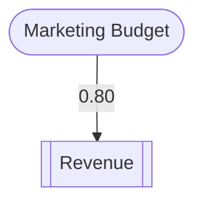

# Visual Export Demonstration

This document demonstrates the visual export capabilities of DeepThinking MCP v2.5.0.

## Test Results

✅ **All 13 visual export tests passing**

### Test Coverage
1. Causal Graph Exports (3 tests)
   - ✅ Mermaid format
   - ✅ DOT format
   - ✅ ASCII format

2. Temporal Timeline Exports (3 tests)
   - ✅ Mermaid Gantt chart
   - ✅ ASCII format
   - ✅ DOT format

3. Game Theory Exports (2 tests)
   - ✅ Mermaid format
   - ✅ ASCII format

4. Bayesian Network Exports (2 tests)
   - ✅ Mermaid format
   - ✅ ASCII format

5. Export Options (3 tests)
   - ✅ Color schemes (default, pastel, monochrome)
   - ✅ Metrics inclusion
   - ✅ Error handling

## Example Outputs

### Causal Graph (Mermaid)


### Temporal Timeline (ASCII)
```
Timeline: Project Timeline (days)

t=   0 ⦿ Project Start
       Kickoff meeting

t=   5 ━ Development (duration: 10 days)
       Code implementation

t=  20 ⦿ Launch
       Product release
```

### Game Tree (Mermaid)


### Bayesian Network (Mermaid)


## Visual Export Formats

### 1. Mermaid Format
- **Use Case**: GitHub documentation, Markdown files, web documentation
- **Features**: Flowcharts, Gantt charts, network diagrams
- **Color Support**: Full color schemes
- **Rendering**: Compatible with GitHub, GitLab, many documentation generators

### 2. DOT Format
- **Use Case**: Professional publications, academic papers
- **Features**: Graphviz-compatible, high-quality rendering
- **Tools**: dot, neato, fdp, circo, twopi
- **Output**: PNG, PDF, SVG, PostScript

### 3. ASCII Format
- **Use Case**: Terminal output, logs, text-only environments
- **Features**: Plain text, accessible
- **Rendering**: No external tools required
- **Compatibility**: Universal text display

## Usage Through MCP

### Step 1: Create a Reasoning Session
Use any of the supported modes (causal, temporal, gametheory, bayesian) to create a thinking session.

### Step 2: Export to Visual Format
```json
{
  "action": "export",
  "sessionId": "your-session-id",
  "exportFormat": "mermaid"
}
```

Supported `exportFormat` values:
- `"mermaid"` - Mermaid diagrams
- `"dot"` - Graphviz DOT format
- `"ascii"` - ASCII text diagrams
- `"json"` - Standard JSON export
- `"markdown"` - Markdown export
- `"latex"` - LaTeX export
- `"html"` - HTML export
- `"jupyter"` - Jupyter notebook export

## Integration Examples

### GitHub Markdown
Simply paste the Mermaid output in your README.md:

````markdown

````

### Graphviz Rendering
Save DOT output and render:
```bash
dot -Tpng output.dot -o diagram.png
```

### Terminal Display
ASCII format displays directly in terminal:
```bash
npx deepthinking-mcp | grep -A 20 "Timeline:"
```

## Package Information

- **Version**: 2.5.0
- **Package Size**: 74.50 KB
- **Total Tests**: 157 passing
- **New in v2.5**: Visual export formats
- **npm**: https://www.npmjs.com/package/deepthinking-mcp
- **GitHub**: https://github.com/danielsimonjr/deepthinking-mcp

## Verification

Run tests to verify functionality:
```bash
npm test -- visual.test.ts --run
```

All 13 visual export tests passing ✅
