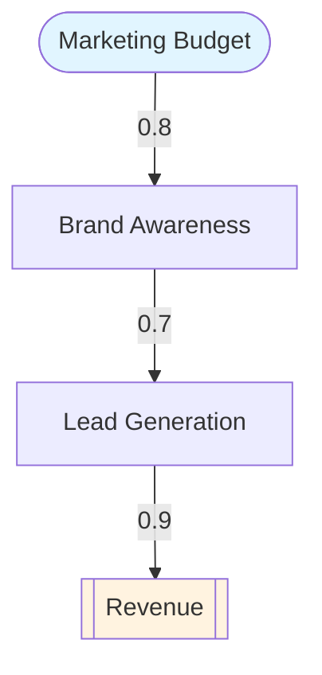

# DeepThinking MCP - Phase 3 Task Breakdown

Detailed task list for implementing Phase 3 (v2.1 - v2.6) with specific file locations, code snippets, and acceptance criteria.

---

## Phase 3A: Temporal Reasoning Mode (v2.1) - 40 hours

### Task 1.1: Create Temporal Type Definitions (4 hours)
**File**: `src/types/modes/temporal.ts`

**Implementation**:
```typescript
import { BaseThought } from '../core';

export interface TemporalThought extends BaseThought {
  mode: 'temporal';
  thoughtType:
    | 'event_definition'
    | 'interval_analysis'
    | 'temporal_constraint'
    | 'sequence_construction'
    | 'causality_timeline';

  timeline?: Timeline;
  events?: TemporalEvent[];
  intervals?: TimeInterval[];
  constraints?: TemporalConstraint[];
  relations?: TemporalRelation[];
}

export interface Timeline {
  id: string;
  name: string;
  timeUnit: 'milliseconds' | 'seconds' | 'minutes' | 'hours' | 'days' | 'months' | 'years';
  startTime?: number;
  endTime?: number;
  events: string[];
}

export interface TemporalEvent {
  id: string;
  name: string;
  description: string;
  timestamp: number;
  duration?: number;
  type: 'instant' | 'interval';
  properties: Record<string, any>;
}

export interface TimeInterval {
  id: string;
  name: string;
  start: number;
  end: number;
  overlaps?: string[];
  contains?: string[];
}

export interface TemporalConstraint {
  id: string;
  type: 'before' | 'after' | 'during' | 'overlaps' | 'meets' | 'starts' | 'finishes' | 'equals';
  subject: string;
  object: string;
  confidence: number;
}

export interface TemporalRelation {
  id: string;
  from: string;
  to: string;
  relationType: 'causes' | 'enables' | 'prevents' | 'precedes' | 'follows';
  strength: number;
  delay?: number;
}

export function isTemporalThought(thought: BaseThought): thought is TemporalThought {
  return thought.mode === 'temporal';
}
```

**Acceptance Criteria**:
- ✅ All temporal interfaces defined
- ✅ Type guard implemented
- ✅ Exported from `src/types/index.ts`

---

### Task 1.2: Implement Temporal Validation (6 hours)
**File**: `src/validation/modes/temporal.ts`

**Implementation**:
```typescript
import { ValidationResult } from '../types';
import { TemporalThought } from '../../types/modes/temporal';

export function validateTemporal(thought: TemporalThought): ValidationResult {
  const errors: string[] = [];

  // Validate timeline
  if (thought.timeline) {
    if (!thought.timeline.timeUnit) {
      errors.push('Timeline must specify timeUnit');
    }
    if (thought.timeline.startTime !== undefined &&
        thought.timeline.endTime !== undefined &&
        thought.timeline.startTime >= thought.timeline.endTime) {
      errors.push('Timeline startTime must be before endTime');
    }
  }

  // Validate events
  if (thought.events) {
    for (const event of thought.events) {
      if (event.type === 'interval' && !event.duration) {
        errors.push(`Interval event ${event.id} must have duration`);
      }
      if (event.timestamp < 0) {
        errors.push(`Event ${event.id} has negative timestamp`);
      }
    }
  }

  // Validate intervals
  if (thought.intervals) {
    for (const interval of thought.intervals) {
      if (interval.start >= interval.end) {
        errors.push(`Interval ${interval.id} start must be before end`);
      }
    }
  }

  // Validate temporal constraints
  if (thought.constraints) {
    const eventIds = new Set(thought.events?.map(e => e.id) || []);
    const intervalIds = new Set(thought.intervals?.map(i => i.id) || []);

    for (const constraint of thought.constraints) {
      if (!eventIds.has(constraint.subject) && !intervalIds.has(constraint.subject)) {
        errors.push(`Constraint subject ${constraint.subject} not found`);
      }
      if (!eventIds.has(constraint.object) && !intervalIds.has(constraint.object)) {
        errors.push(`Constraint object ${constraint.object} not found`);
      }
      if (constraint.confidence < 0 || constraint.confidence > 1) {
        errors.push(`Constraint ${constraint.id} confidence must be 0-1`);
      }
    }
  }

  // Validate temporal relations
  if (thought.relations) {
    const eventIds = new Set(thought.events?.map(e => e.id) || []);

    for (const relation of thought.relations) {
      if (!eventIds.has(relation.from)) {
        errors.push(`Relation from event ${relation.from} not found`);
      }
      if (!eventIds.has(relation.to)) {
        errors.push(`Relation to event ${relation.to} not found`);
      }
      if (relation.strength < 0 || relation.strength > 1) {
        errors.push(`Relation ${relation.id} strength must be 0-1`);
      }
      if (relation.delay !== undefined && relation.delay < 0) {
        errors.push(`Relation ${relation.id} delay cannot be negative`);
      }
    }
  }

  return {
    valid: errors.length === 0,
    errors
  };
}
```

**Acceptance Criteria**:
- ✅ All temporal properties validated
- ✅ Constraint consistency checked
- ✅ Allen's interval algebra relations supported

---

### Task 1.3: Update Tool Schema (2 hours)
**File**: `src/tools/schema.ts`

**Changes**: Add temporal mode parameters to tool schema

```typescript
// Add to ThinkingMode enum
ThinkingMode: z.enum([
  'sequential', 'shannon', 'mathematics', 'physics', 'hybrid',
  'abductive', 'causal', 'bayesian', 'counterfactual', 'analogical',
  'temporal'  // NEW
]),

// Add temporal-specific properties
timeline: z.object({
  id: z.string(),
  name: z.string(),
  timeUnit: z.enum(['milliseconds', 'seconds', 'minutes', 'hours', 'days', 'months', 'years']),
  startTime: z.number().optional(),
  endTime: z.number().optional(),
  events: z.array(z.string())
}).optional(),

events: z.array(z.object({
  id: z.string(),
  name: z.string(),
  description: z.string(),
  timestamp: z.number(),
  duration: z.number().optional(),
  type: z.enum(['instant', 'interval']),
  properties: z.record(z.any())
})).optional(),

// ... add intervals, constraints, relations ...
```

**Acceptance Criteria**:
- ✅ Schema accepts temporal parameters
- ✅ Validation enforces temporal constraints
- ✅ JSON Schema updated for MCP

---

### Task 1.4: Update Session Manager (3 hours)
**File**: `src/session/manager.ts`

**Changes**: Add temporal thought handling

```typescript
private updateMetrics(session: ThinkingSession): void {
  // ... existing code ...

  // Temporal-specific metrics
  if (isTemporalThought(thought)) {
    if (thought.events) {
      metrics.customMetrics.set('totalEvents', thought.events.length);
    }
    if (thought.timeline) {
      metrics.customMetrics.set('timelineUnit', thought.timeline.timeUnit);
    }
    if (thought.relations) {
      const causalRelations = thought.relations.filter(r => r.relationType === 'causes');
      metrics.customMetrics.set('causalRelations', causalRelations.length);
    }
  }
}
```

**Acceptance Criteria**:
- ✅ Temporal thoughts tracked in sessions
- ✅ Metrics calculated correctly
- ✅ No regression in existing modes

---

### Task 1.5: Create Temporal Tests (15 hours)
**File**: `tests/unit/temporal.test.ts`

**Test Cases**:
1. Event creation and validation
2. Interval creation and overlap detection
3. Timeline construction
4. Temporal constraint validation (Allen's algebra)
5. Causal relation tracking
6. Invalid timestamp detection
7. Duration validation for interval events
8. Constraint reference validation
9. Timeline start/end consistency
10. Complex temporal scenario (debugging use case)
11. Event sequence construction
12. Relation strength validation
13. Delay validation
14. Full timeline export
15. Integration with session manager

**Acceptance Criteria**:
- ✅ 15 tests passing
- ✅ >90% code coverage for temporal module
- ✅ Edge cases covered

---

### Task 1.6: Documentation and Examples (10 hours)
**Files**: `README.md`, `docs/examples/temporal-example.md`

**README Updates**:
- Add temporal mode to feature list
- Update mode count to 11
- Add temporal parameters section

**Example**:
```markdown
### Example: Debugging with Temporal Reasoning

Problem: Application crashes every night at 3 AM, need to understand event sequence.

Thought 1: Define timeline and events
- mode: temporal
- timeline: { timeUnit: 'minutes', startTime: 0, endTime: 180 }
- events: [
    { id: 'e1', name: 'Cron job starts', timestamp: 0, type: 'instant' },
    { id: 'e2', name: 'Database backup begins', timestamp: 5, duration: 60, type: 'interval' },
    { id: 'e3', name: 'Memory spike detected', timestamp: 50, type: 'instant' },
    { id: 'e4', name: 'Application crash', timestamp: 65, type: 'instant' }
  ]

Thought 2: Add temporal relations
- relations: [
    { from: 'e1', to: 'e2', relationType: 'causes', strength: 0.9 },
    { from: 'e2', to: 'e3', relationType: 'causes', strength: 0.7, delay: 45 },
    { from: 'e3', to: 'e4', relationType: 'causes', strength: 0.95, delay: 15 }
  ]

Conclusion: Database backup causes memory spike which causes crash. Fix: Optimize backup process or increase memory limit during backup window.
```

**Acceptance Criteria**:
- ✅ README updated
- ✅ Comprehensive example provided
- ✅ Use cases documented

---

## Phase 3B: Game-Theoretic Mode (v2.2) - 35 hours

### Task 2.1: Create Game Theory Type Definitions (4 hours)
**File**: `src/types/modes/gametheory.ts`

**Implementation**:
```typescript
import { BaseThought } from '../core';

export interface GameTheoryThought extends BaseThought {
  mode: 'gametheory';
  thoughtType:
    | 'game_definition'
    | 'strategy_analysis'
    | 'equilibrium_computation'
    | 'payoff_evaluation'
    | 'mechanism_design';

  game?: Game;
  players?: Player[];
  strategies?: Strategy[];
  payoffs?: PayoffMatrix;
  equilibria?: Equilibrium[];
  analysis?: GameAnalysis;
}

export interface Game {
  id: string;
  name: string;
  type: 'normal-form' | 'extensive-form' | 'repeated' | 'cooperative' | 'Bayesian';
  players: string[];
  informationStructure: 'perfect' | 'imperfect' | 'complete' | 'incomplete';
  simultaneousMoves: boolean;
}

export interface Player {
  id: string;
  name: string;
  type: 'rational' | 'bounded-rational' | 'adversarial' | 'cooperative';
  preferences?: Record<string, number>;
  beliefs?: Record<string, number>;
}

export interface Strategy {
  id: string;
  playerId: string;
  name: string;
  description: string;
  type: 'pure' | 'mixed' | 'behavioral';
  actions: Action[];
  probability?: number;
}

export interface Action {
  id: string;
  name: string;
  description: string;
  conditions?: Record<string, any>;
}

export interface PayoffMatrix {
  dimensions: number;
  entries: PayoffEntry[];
}

export interface PayoffEntry {
  strategyProfile: string[];
  payoffs: number[];
  probability?: number;
}

export interface Equilibrium {
  id: string;
  type: 'Nash' | 'subgame-perfect' | 'Bayesian-Nash' | 'correlated' | 'dominant-strategy';
  strategyProfile: string[];
  payoffs: number[];
  stability: number;
  reasoning: string;
}

export interface GameAnalysis {
  dominantStrategies?: Record<string, string>;
  paretoOptimal?: string[];
  socialWelfare?: number;
  efficiency?: number;
  fairness?: number;
  recommendations: string[];
}

export function isGameTheoryThought(thought: BaseThought): thought is GameTheoryThought {
  return thought.mode === 'gametheory';
}
```

**Acceptance Criteria**:
- ✅ All game theory interfaces defined
- ✅ Type guard implemented
- ✅ Support for multiple game types

---

### Task 2.2: Implement Game Theory Validation (6 hours)
**File**: `src/validation/modes/gametheory.ts`

**Key Validations**:
- Game must have at least one player
- Player beliefs must sum to 1.0
- Strategy references valid player
- Mixed strategies have probability 0-1
- Payoff matrix dimensions match player count
- Equilibrium strategy profile matches player count
- Stability scores are 0-1

**Acceptance Criteria**:
- ✅ All game theory constraints validated
- ✅ Probability distributions checked
- ✅ Nash equilibrium properties verified

---

### Task 2.3: Implement Nash Equilibrium Finder (8 hours)
**File**: `src/modes/gametheory/equilibrium.ts`

**Implementation**:
```typescript
export class EquilibriumFinder {
  findNashEquilibria(game: Game, payoffs: PayoffMatrix, strategies: Strategy[]): Equilibrium[] {
    const equilibria: Equilibrium[] = [];

    // For each strategy profile, check if it's a Nash equilibrium
    const strategyProfiles = this.generateStrategyProfiles(game.players, strategies);

    for (const profile of strategyProfiles) {
      if (this.isNashEquilibrium(profile, payoffs, strategies)) {
        const payoff = this.getPayoffs(profile, payoffs);
        equilibria.push({
          id: `nash-${equilibria.length}`,
          type: 'Nash',
          strategyProfile: profile,
          payoffs: payoff,
          stability: this.calculateStability(profile, payoffs, strategies),
          reasoning: `No player can improve by unilaterally deviating`
        });
      }
    }

    return equilibria;
  }

  private isNashEquilibrium(
    profile: string[],
    payoffs: PayoffMatrix,
    strategies: Strategy[]
  ): boolean {
    // For each player, check if they can improve by changing strategy
    for (let i = 0; i < profile.length; i++) {
      const currentPayoff = this.getPayoffs(profile, payoffs)[i];
      const playerStrategies = strategies.filter(s => this.getPlayerIndex(s.playerId) === i);

      for (const altStrategy of playerStrategies) {
        if (altStrategy.id === profile[i]) continue;

        const altProfile = [...profile];
        altProfile[i] = altStrategy.id;
        const altPayoff = this.getPayoffs(altProfile, payoffs)[i];

        if (altPayoff > currentPayoff) {
          return false; // Player can improve, not Nash
        }
      }
    }

    return true;
  }

  private calculateStability(
    profile: string[],
    payoffs: PayoffMatrix,
    strategies: Strategy[]
  ): number {
    // Calculate how much worse alternative strategies are (higher = more stable)
    let totalGap = 0;
    let count = 0;

    for (let i = 0; i < profile.length; i++) {
      const currentPayoff = this.getPayoffs(profile, payoffs)[i];
      const playerStrategies = strategies.filter(s => this.getPlayerIndex(s.playerId) === i);

      for (const altStrategy of playerStrategies) {
        if (altStrategy.id === profile[i]) continue;

        const altProfile = [...profile];
        altProfile[i] = altStrategy.id;
        const altPayoff = this.getPayoffs(altProfile, payoffs)[i];
        const gap = currentPayoff - altPayoff;

        if (gap > 0) {
          totalGap += gap;
          count++;
        }
      }
    }

    return count > 0 ? Math.min(totalGap / count, 1.0) : 0.5;
  }
}
```

**Acceptance Criteria**:
- ✅ Pure strategy Nash equilibria found correctly
- ✅ Stability metric calculated
- ✅ Works for 2+ player games
- ✅ Performance tested on 3x3 games

---

### Task 2.4: Game Theory Tests (10 hours)
**File**: `tests/unit/gametheory.test.ts`

**Test Cases**:
1. Prisoner's Dilemma Nash equilibrium
2. Matching Pennies (no pure strategy equilibrium)
3. Dominant strategy detection
4. Mixed strategy equilibrium
5. Pareto optimality calculation
6. Social welfare computation
7. Invalid game structure rejection
8. Player belief validation
9. Strategy profile generation
10. Payoff matrix validation
11. Multi-player game (3+ players)
12. Repeated game analysis
13. Cooperative game detection
14. Equilibrium stability scoring
15. Integration test

**Acceptance Criteria**:
- ✅ 15 tests passing
- ✅ Classic game theory scenarios covered
- ✅ Edge cases handled

---

### Task 2.5: Documentation and Examples (7 hours)
**Files**: `README.md`, `docs/examples/gametheory-example.md`

**Example**: Competitive pricing strategy analysis

**Acceptance Criteria**:
- ✅ Game theory mode documented
- ✅ Business strategy example provided
- ✅ Nash equilibrium explanation clear

---

## Phase 3C: Evidential Reasoning Mode (v2.3) - 30 hours

### Task 3.1: Create Evidential Type Definitions (3 hours)
**File**: `src/types/modes/evidential.ts`

**Key Types**: `EvidentialThought`, `Evidence`, `BeliefFunction`, `MassAssignment`, `PlausibilityFunction`

**Acceptance Criteria**:
- ✅ Dempster-Shafer theory types defined
- ✅ Frame of discernment supported
- ✅ Type guard implemented

---

### Task 3.2: Implement Dempster-Shafer Combination (8 hours)
**File**: `src/modes/evidential/combination.ts`

**Implementation**:
```typescript
export class DempsterShaferCombiner {
  combine(bf1: BeliefFunction, bf2: BeliefFunction): BeliefFunction {
    const combined: MassAssignment[] = [];
    let conflictMass = 0;

    // Compute intersection of all focal sets
    for (const ma1 of bf1.massAssignments) {
      for (const ma2 of bf2.massAssignments) {
        const intersection = this.setIntersection(ma1.hypothesisSet, ma2.hypothesisSet);

        if (intersection.length === 0) {
          // Conflict
          conflictMass += ma1.mass * ma2.mass;
        } else {
          // Combine mass
          const existingMa = combined.find(m =>
            this.setsEqual(m.hypothesisSet, intersection)
          );

          if (existingMa) {
            existingMa.mass += ma1.mass * ma2.mass;
          } else {
            combined.push({
              hypothesisSet: intersection,
              mass: ma1.mass * ma2.mass,
              justification: `Combination of ${ma1.justification} and ${ma2.justification}`
            });
          }
        }
      }
    }

    // Normalize by (1 - conflict)
    const normalizationFactor = 1 - conflictMass;
    for (const ma of combined) {
      ma.mass /= normalizationFactor;
    }

    return {
      id: `combined-${bf1.id}-${bf2.id}`,
      source: 'combined',
      massAssignments: combined,
      conflictMass
    };
  }

  computePlausibility(bf: BeliefFunction, hypothesisSet: string[]): number {
    let plausibility = 0;

    for (const ma of bf.massAssignments) {
      if (this.setsIntersect(ma.hypothesisSet, hypothesisSet)) {
        plausibility += ma.mass;
      }
    }

    return plausibility;
  }

  computeBelief(bf: BeliefFunction, hypothesisSet: string[]): number {
    let belief = 0;

    for (const ma of bf.massAssignments) {
      if (this.isSubset(ma.hypothesisSet, hypothesisSet)) {
        belief += ma.mass;
      }
    }

    return belief;
  }
}
```

**Acceptance Criteria**:
- ✅ Dempster's rule of combination correct
- ✅ Conflict mass computed
- ✅ Normalization applied
- ✅ Belief/plausibility calculated correctly

---

### Task 3.3: Evidential Validation (5 hours)
**File**: `src/validation/modes/evidential.ts`

**Key Validations**:
- Mass assignments sum to 1.0
- Hypothesis sets valid
- Belief ≤ Plausibility
- Uncertainty intervals consistent

**Acceptance Criteria**:
- ✅ All evidential constraints validated
- ✅ Mathematical properties enforced

---

### Task 3.4: Evidential Tests (8 hours)
**File**: `tests/unit/evidential.test.ts`

**Test Cases** (12 tests):
1. Simple belief function creation
2. Mass assignment validation
3. Dempster combination (no conflict)
4. Dempster combination (with conflict)
5. Belief computation
6. Plausibility computation
7. Uncertainty interval calculation
8. Multiple evidence combination
9. Sensor fusion scenario
10. Diagnostic reasoning example
11. Invalid mass distribution rejection
12. Integration test

**Acceptance Criteria**:
- ✅ 12 tests passing
- ✅ Mathematical correctness verified
- ✅ Real-world scenarios tested

---

### Task 3.5: Documentation and Examples (6 hours)
**Example**: Sensor fusion for autonomous systems

**Acceptance Criteria**:
- ✅ Evidential mode documented
- ✅ Dempster-Shafer explained clearly
- ✅ Practical example provided

---

## Phase 3D: Mode Combination Recommendations (v2.4) - 25 hours

### Task 4.1: Create Recommendation Engine (12 hours)
**File**: `src/modes/recommendations.ts`

**Implementation**: `ModeRecommender` class with:
- `recommendModes(characteristics)`: Returns ranked mode recommendations
- `recommendCombinations(characteristics)`: Suggests mode combinations
- Scoring algorithms based on problem features

**Acceptance Criteria**:
- ✅ Recommendations based on problem characteristics
- ✅ Mode scoring algorithm implemented
- ✅ Combination suggestions generated

---

### Task 4.2: Integration with Hybrid Mode (6 hours)
**File**: `src/modes/hybrid.ts`

**Changes**: Use recommender to auto-select features from modes

**Acceptance Criteria**:
- ✅ Hybrid mode uses recommendations
- ✅ Smooth mode transitions
- ✅ No performance regression

---

### Task 4.3: Recommendation Tests (4 hours)
**File**: `tests/unit/recommendations.test.ts`

**Test Cases** (8 tests):
1. Time-dependent problem → temporal mode
2. Multi-agent problem → game theory mode
3. Incomplete info → evidential mode
4. Explanation needed → abductive mode
5. Combination recommendation: temporal + causal
6. Combination recommendation: abductive + bayesian
7. Mode scoring correctness
8. Integration with hybrid mode

**Acceptance Criteria**:
- ✅ 8 tests passing
- ✅ Recommendation quality verified
- ✅ Edge cases handled

---

### Task 4.4: Documentation (3 hours)
**Example**: Asking the system "What mode should I use for debugging?" and getting recommendations

**Acceptance Criteria**:
- ✅ Recommendation feature documented
- ✅ Problem characteristics explained
- ✅ Examples provided

---

## Phase 3E: Visual Output Formats (v2.5) - 30 hours

### Task 5.1: Create Visual Exporter (10 hours)
**File**: `src/export/visual.ts`

**Implementation**: `VisualExporter` class with methods:
- `exportCausalGraph(thought, options)` → Mermaid/DOT
- `exportTemporalTimeline(thought, options)` → Mermaid Gantt/ASCII
- `exportGameTree(thought, options)` → Mermaid tree/DOT
- `exportBayesianNetwork(thought, options)` → Mermaid graph

**Acceptance Criteria**:
- ✅ Mermaid format generation working
- ✅ DOT format for graphs
- ✅ ASCII fallback available
- ✅ All applicable modes supported

---

### Task 5.2: Mermaid Generation (8 hours)
**Causal Graph Example**:


**Acceptance Criteria**:
- ✅ Valid Mermaid syntax generated
- ✅ Proper node shapes for different types
- ✅ Edge labels with metrics
- ✅ Color coding applied

---

### Task 5.3: Visual Export Tests (7 hours)
**File**: `tests/unit/visual.test.ts`

**Test Cases** (10 tests):
1. Causal graph to Mermaid
2. Causal graph to DOT
3. Temporal timeline to Gantt chart
4. Temporal timeline to ASCII
5. Game tree to Mermaid
6. Bayesian network to Mermaid
7. Invalid thought type handling
8. Export options validation
9. Color scheme application
10. Integration test

**Acceptance Criteria**:
- ✅ 10 tests passing
- ✅ Output syntax validation
- ✅ Visual rendering verified (manual)

---

### Task 5.4: Documentation with Rendered Examples (5 hours)
**Files**: `README.md`, `docs/examples/visual-exports.md`

**Include**:
- Mermaid code snippets
- Rendered diagrams (screenshots or live rendering)
- DOT examples for Graphviz
- ASCII art examples

**Acceptance Criteria**:
- ✅ All export formats documented
- ✅ Visual examples provided
- ✅ Rendering instructions included

---

## Phase 3F: Specialized Format Export (v2.6) - 20 hours

### Task 6.1: GraphML Exporter (6 hours)
**File**: `src/export/specialized/graphml.ts`

**Implementation**:
```typescript
export class GraphMLExporter {
  exportCausalGraph(thought: CausalThought): string {
    let xml = this.graphMLHeader();

    xml += this.defineKeys();
    xml += '  <graph id="G" edgedefault="directed">\n';

    // Export nodes
    for (const node of thought.causalGraph.nodes) {
      xml += this.exportNode(node);
    }

    // Export edges
    for (const edge of thought.causalGraph.edges) {
      xml += this.exportEdge(edge);
    }

    xml += '  </graph>\n';
    xml += '</graphml>\n';

    return xml;
  }

  private graphMLHeader(): string {
    return `<?xml version="1.0" encoding="UTF-8"?>
<graphml xmlns="http://graphml.graphdrawing.org/xmlns"
  xmlns:xsi="http://www.w3.org/2001/XMLSchema-instance">
`;
  }

  private defineKeys(): string {
    return `  <key id="nodeType" for="node" attr.name="type" attr.type="string"/>
  <key id="edgeStrength" for="edge" attr.name="strength" attr.type="double"/>
  <key id="edgeConfidence" for="edge" attr.name="confidence" attr.type="double"/>
`;
  }
}
```

**Acceptance Criteria**:
- ✅ Valid GraphML XML generated
- ✅ Compatible with Gephi
- ✅ Compatible with Cytoscape
- ✅ Schema validation passes

---

### Task 6.2: PDDL Exporter (6 hours)
**File**: `src/export/specialized/pddl.ts`

**Implementation**: Convert game theory and temporal reasoning to PDDL planning problems

**Acceptance Criteria**:
- ✅ Valid PDDL syntax
- ✅ Compatible with Fast Downward planner
- ✅ Actions and predicates correctly defined

---

### Task 6.3: Specialized Export Tests (5 hours)
**File**: `tests/unit/specialized.test.ts`

**Test Cases** (8 tests):
1. GraphML export from causal thought
2. GraphML schema validation
3. PDDL export from game theory
4. PDDL syntax validation
5. Prolog export (future)
6. GeoJSON export (future)
7. Format detection
8. Integration test

**Acceptance Criteria**:
- ✅ 8 tests passing
- ✅ External tool compatibility verified
- ✅ Schema validation integrated

---

### Task 6.4: Documentation and Tool Integration Guide (3 hours)
**File**: `docs/SPECIALIZED_EXPORTS.md`

**Content**:
- How to import GraphML into Gephi
- How to use PDDL output with planners
- Format specifications
- Conversion workflows

**Acceptance Criteria**:
- ✅ All export formats documented
- ✅ Tool integration steps provided
- ✅ Example workflows included

---

## Final Tasks

### Task 7.1: Update Main README (3 hours)
**File**: `README.md`

**Updates**:
- Mode count: 10 → 13
- Add temporal, game theory, evidential modes to features
- Update roadmap (Phase 3 complete)
- Add visualization and export sections
- Update examples

**Acceptance Criteria**:
- ✅ All new features documented
- ✅ Examples comprehensive
- ✅ Links to detailed docs

---

### Task 7.2: Integration Testing (5 hours)
**File**: `tests/integration/phase3.test.ts`

**Test Scenarios**:
1. Use temporal mode, export to Mermaid Gantt
2. Use game theory, export to GraphML, import to Gephi
3. Use evidential, combine multiple evidence sources
4. Use recommendation engine to select mode
5. Combine temporal + causal, visualize
6. Export all modes to all applicable formats

**Acceptance Criteria**:
- ✅ End-to-end workflows tested
- ✅ No mode interaction issues
- ✅ Export pipeline robust

---

### Task 7.3: Performance Optimization (4 hours)
**Files**: Various

**Optimizations**:
- Nash equilibrium finder performance
- Dempster combination efficiency
- Export generation speed
- Memory usage for large graphs

**Acceptance Criteria**:
- ✅ No performance regressions
- ✅ Large graphs (100+ nodes) handled
- ✅ Benchmark tests passing

---

### Task 7.4: Changelog and Release Notes (2 hours)
**File**: `CHANGELOG.md`

**Content**:
```markdown
## [2.6.0] - 2025-MM-DD

### Added
- **Temporal Reasoning Mode**: Event timelines, temporal constraints, causality
- **Game-Theoretic Mode**: Nash equilibria, strategic analysis, payoff matrices
- **Evidential Reasoning Mode**: Dempster-Shafer theory, belief functions
- **Mode Recommendation System**: Intelligent mode and combination suggestions
- **Visual Exports**: Mermaid, DOT, ASCII diagram generation
- **Specialized Exports**: GraphML, PDDL format support

### Changed
- Mode count increased from 10 to 13
- Enhanced hybrid mode with recommendation engine
- Updated README with comprehensive examples

### Testing
- Test count: 145 total (68 new in Phase 3)
- Integration tests for all new modes
- Export format validation

[2.6.0]: https://github.com/danielsimonjr/deepthinking-mcp/compare/v2.0.1...v2.6.0
```

**Acceptance Criteria**:
- ✅ All changes documented
- ✅ Version links correct
- ✅ Release notes comprehensive

---

## Summary

### Total Tasks: 40
### Total Effort: ~180 hours
### Total Tests: +68 (77 → 145)
### New Modes: 3 (temporal, gametheory, evidential)
### Infrastructure: 3 features (recommendations, visual, specialized exports)

### Version Progression:
- v2.1: Temporal reasoning
- v2.2: Game theory
- v2.3: Evidential reasoning
- v2.4: Mode recommendations
- v2.5: Visual exports
- v2.6: Specialized exports

### Dependencies Between Tasks:
1. Types → Validation → Tests (for each mode)
2. Visual exporter depends on mode implementations
3. Specialized exports depend on visual exports
4. Recommendations depend on all modes being implemented
5. Integration tests depend on everything

### Critical Path:
Temporal (1.1-1.6) → Game Theory (2.1-2.5) → Evidential (3.1-3.5) → Recommendations (4.1-4.4) → Visual (5.1-5.4) → Specialized (6.1-6.4) → Final (7.1-7.4)

### Risk Areas:
- Nash equilibrium computation complexity
- Dempster-Shafer combination correctness
- GraphML/PDDL format compatibility
- Visual rendering quality
- Performance at scale
