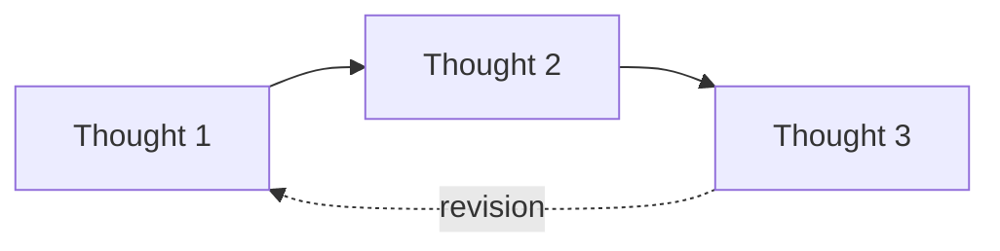
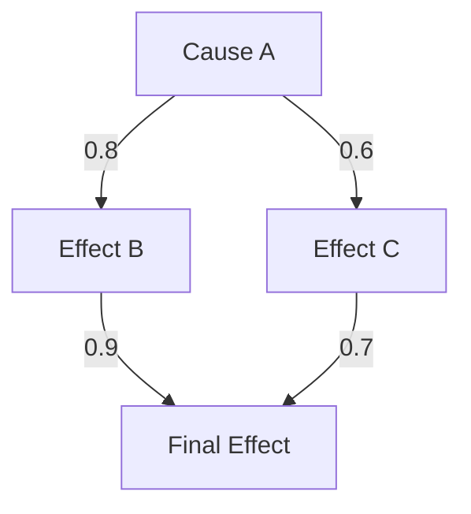
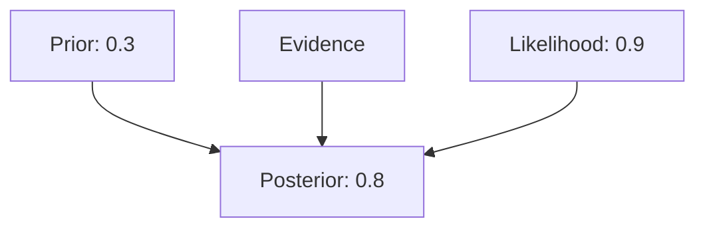
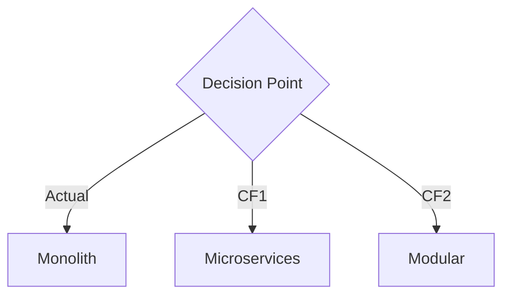
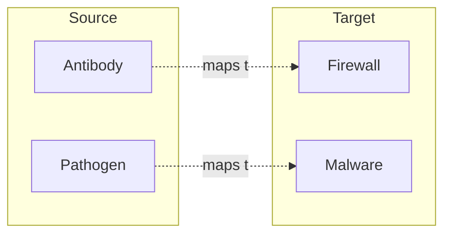

# DeepThinking MCP Phase 4 - Advanced Features Implementation Plan

## Overview
This document outlines the implementation plan for Phase 4 enhancements to DeepThinking MCP, building on the foundation of **13 reasoning modes** and **visual export capabilities** from Phase 3 (v2.6).

**Phase 4 builds upon Phase 3 completion**, which added temporal reasoning, game-theoretic, and evidential modes, plus Mermaid/DOT/GraphML exports.

## Current State (Phase 3 Complete - v2.6)
- **13 Reasoning Modes**: Sequential, Shannon, Mathematics, Physics, Hybrid, Abductive, Causal, Bayesian, Counterfactual, Analogical, **Temporal, Game-Theoretic, Evidential**
- **145 Passing Tests**: Comprehensive test coverage (77 + 68 from Phase 3)
- **Validation Engine**: Mode-specific validation for all 13 modes
- **Session Management**: In-memory session tracking with mode recommendations
- **Visual Exports**: Mermaid diagrams, DOT graphs, ASCII art (Phase 3)
- **Specialized Exports**: GraphML for graph tools, PDDL for planners (Phase 3)
- **Mode Recommendation System**: Intelligent mode selection based on problem characteristics (Phase 3)

## Target State (v4.0.0)
- **Advanced Export**: LaTeX and Jupyter notebook generation (building on Phase 3 visual exports)
- **Enhanced Visualization**: Extended Mermaid features, interactive diagrams (extends Phase 3)
- **Math Integration**: Integration with Math-MCP for symbolic computation
- **Persistence**: Database-backed session storage
- **Collaboration**: Multi-user thinking sessions
- **Pattern Learning**: ML-based pattern recognition from successful reasoning chains

---

## Feature 1: Export to LaTeX/Jupyter

### Purpose
Enable export of thinking sessions to professional document formats for publication, sharing, and archival. **Builds on Phase 3's visual export infrastructure** (Mermaid, DOT, GraphML).

### Components

#### 1.1 LaTeX Export
**File**: `src/export/latex.ts`

```typescript
export interface LaTeXExportOptions {
  documentClass: 'article' | 'report' | 'book';
  includeMetadata: boolean;
  includeTOC: boolean;
  includeValidation: boolean;
  syntaxHighlighting: boolean;
  packages: string[];
}

export class LaTeXExporter {
  async export(session: ThinkingSession, options: LaTeXExportOptions): Promise<string>;

  // Mode-specific exporters (original 10 modes)
  private exportSequential(thoughts: SequentialThought[]): string;
  private exportMathematics(thoughts: MathematicsThought[]): string;
  private exportCausal(thoughts: CausalThought[]): string;
  private exportBayesian(thoughts: BayesianThought[]): string;

  // NEW: Phase 3 mode exporters
  private exportTemporal(thoughts: TemporalThought[]): string;
  private exportGameTheory(thoughts: GameTheoryThought[]): string;
  private exportEvidential(thoughts: EvidentialThought[]): string;

  // Formatting helpers
  private formatEquation(latex: string): string;
  private formatCausalGraph(graph: CausalGraph): string;
  private formatThoughtChain(thoughts: Thought[]): string;
}
```

**Key Features**:
- Document templates for different modes
- Automatic equation formatting for mathematics mode
- TikZ diagrams for causal graphs, temporal timelines, game trees
- **Leverage Phase 3 Mermaid generation** for diagram inclusion
- Bibliography generation from evidence/sources
- Custom theorem environments for proof mode
- Support for all 13 reasoning modes (including temporal, game-theoretic, evidential)

#### 1.2 Jupyter Notebook Export
**File**: `src/export/jupyter.ts`

```typescript
export interface JupyterExportOptions {
  kernelName: 'python3' | 'julia' | 'r';
  includeCode: boolean;
  includeVisualization: boolean;
  executeOnExport: boolean;
}

export interface NotebookCell {
  cell_type: 'code' | 'markdown';
  source: string[];
  metadata: Record<string, any>;
  outputs?: any[];
}

export class JupyterExporter {
  async export(session: ThinkingSession, options: JupyterExportOptions): Promise<any>;

  // Convert thoughts to notebook cells
  private thoughtToCell(thought: Thought): NotebookCell[];

  // Generate visualization code
  private generateVisualizationCode(thought: Thought): string;

  // Mode-specific exporters (original modes)
  private exportMathToSymPy(thought: MathematicsThought): NotebookCell;
  private exportCausalToNetworkX(thought: CausalThought): NotebookCell;
  private exportBayesianToPyMC(thought: BayesianThought): NotebookCell;

  // NEW: Phase 3 mode exporters
  private exportTemporalToTimeline(thought: TemporalThought): NotebookCell;
  private exportGameTheoryToMatrix(thought: GameTheoryThought): NotebookCell;
  private exportEvidentialToDempsterShafer(thought: EvidentialThought): NotebookCell;
}
```

**Key Features**:
- Markdown cells for explanations
- Code cells for computations
- Visualization cells (matplotlib, networkx, seaborn)
- Symbolic math with SymPy (mathematics mode)
- Statistical modeling with PyMC3/Stan (Bayesian, evidential modes)
- **Temporal timeline visualization** with matplotlib/Gantt (Phase 3 temporal mode)
- **Game theory matrix visualization** (Phase 3 game-theoretic mode)
- **Dempster-Shafer belief visualization** (Phase 3 evidential mode)
- **Leverage Phase 3 GraphML export** for network analysis in notebooks

### Implementation Priority
**High** - Enables professional documentation and sharing

### Estimated Effort
- LaTeX Exporter: 12 hours
- Jupyter Exporter: 10 hours
- Testing: 6 hours
- Documentation: 2 hours
**Total: 30 hours (~4 days)**

---

## Feature 2: Enhanced Visualization

### Purpose
**Extend Phase 3's Mermaid/DOT/ASCII visualization** with interactive features, animations, and advanced diagram types.

**Note**: Phase 3 already implements basic Mermaid diagram generation for causal graphs, temporal timelines (Gantt), and game trees. Phase 4 adds interactive features and advanced visualizations.

### Components

#### 2.1 Enhanced Mermaid Features
**File**: `src/visualization/enhanced-mermaid.ts`

**Phase 3 provides** (already implemented in `src/export/visual.ts`):
- Basic Mermaid graph generation
- Causal graph visualization
- Temporal timeline (Gantt charts)
- Game tree diagrams
- Node styling and edge labels

**Phase 4 adds** (new enhancements):
```typescript
export interface EnhancedMermaidOptions extends VisualExportOptions {
  // NEW: Interactive features
  interactive: boolean;
  enableZoom: boolean;
  enableClickHandlers: boolean;

  // NEW: Animation
  animateThoughtFlow: boolean;
  animationSpeed: 'slow' | 'medium' | 'fast';

  // NEW: Advanced diagram types
  diagramType: 'flowchart' | 'sequence' | 'state' | 'mindmap' | 'timeline';

  // Theme extensions
  customTheme?: CustomThemeOptions;
}

export class EnhancedMermaidVisualizer {
  // Extends Phase 3 VisualExporter
  constructor(baseExporter: VisualExporter);

  // NEW: Interactive diagrams
  async generateInteractiveDiagram(
    session: ThinkingSession,
    options: EnhancedMermaidOptions
  ): Promise<InteractiveDiagram>;

  // NEW: Sequence diagrams for thought flow
  generateThoughtSequence(thoughts: Thought[]): string;

  // NEW: State diagrams for reasoning progression
  generateReasoningStateChart(session: ThinkingSession): string;

  // NEW: Mind maps for knowledge structures
  generateKnowledgeMindMap(session: ThinkingSession): string;
}
```

**Diagram Types**:

1. **Thought Flow** (Sequential/Shannon)


2. **Causal Graph**


3. **Bayesian Network**


4. **Counterfactual Tree**


5. **Analogical Mapping**


### Implementation Priority
**High** - Critical for understanding complex reasoning

### Estimated Effort
- Mermaid Generator: 10 hours
- Mode-specific diagrams: 8 hours
- Testing: 4 hours
- Documentation: 2 hours
**Total: 24 hours (~3 days)**

---

## Feature 3: Math-MCP Integration

### Purpose
Leverage Math-MCP for advanced symbolic computation, equation solving, and mathematical verification.

### Components

#### 3.1 Math-MCP Client
**File**: `src/integrations/math-mcp.ts`

```typescript
export interface MathMCPIntegration {
  // Evaluate mathematical expressions
  evaluate(expression: string, scope?: Record<string, number>): Promise<number>;

  // Simplify expressions
  simplify(expression: string, rules?: string[]): Promise<string>;

  // Solve equations
  solve(equation: string, variable: string): Promise<string[]>;

  // Calculate derivatives
  derivative(expression: string, variable: string): Promise<string>;

  // Matrix operations
  matrixOp(operation: string, matrixA: string, matrixB?: string): Promise<any>;

  // Statistics
  statistics(operation: string, data: string): Promise<number>;
}

export class MathMCPClient {
  constructor(serverUrl: string);

  // Integration with Mathematics mode
  async enhanceMathematicsThought(thought: MathematicsThought): Promise<MathematicsThought>;

  // Verify mathematical proofs
  async verifyProof(proof: ProofStrategy): Promise<VerificationResult>;

  // Symbolic computation
  async computeSymbolic(model: MathematicalModel): Promise<ComputationResult>;
}
```

**Use Cases**:
1. **Auto-verification** of mathematical proofs
2. **Symbolic simplification** of expressions
3. **Numerical computation** for validation
4. **Matrix operations** for physics mode
5. **Statistical analysis** for Bayesian mode

### Implementation Priority
**Medium** - Enhances mathematics mode significantly

### Estimated Effort
- MCP Client: 8 hours
- Integration layer: 6 hours
- Testing: 4 hours
- Documentation: 2 hours
**Total: 20 hours (~2.5 days)**

---

## Feature 4: Persistence Layer

### Purpose
Store thinking sessions in a database for retrieval, analysis, and long-term tracking.

### Components

#### 4.1 Database Schema
**File**: `src/persistence/schema.ts`

```typescript
export interface SessionRecord {
  id: string;
  title: string;
  mode: ThinkingMode;
  author: string;
  createdAt: Date;
  updatedAt: Date;
  isComplete: boolean;
  tags: string[];
  metadata: Record<string, any>;
}

export interface ThoughtRecord {
  id: string;
  sessionId: string;
  thoughtNumber: number;
  mode: ThinkingMode;
  content: string;
  timestamp: Date;
  // Mode-specific data stored as JSONB
  data: Record<string, any>;
}

export interface ValidationRecord {
  id: string;
  thoughtId: string;
  isValid: boolean;
  confidence: number;
  issues: ValidationIssue[];
  timestamp: Date;
}
```

#### 4.2 Repository Pattern
**File**: `src/persistence/repository.ts`

```typescript
export interface ThinkingRepository {
  // Session operations
  createSession(session: ThinkingSession): Promise<string>;
  getSession(id: string): Promise<ThinkingSession | null>;
  updateSession(id: string, session: Partial<ThinkingSession>): Promise<void>;
  deleteSession(id: string): Promise<void>;
  listSessions(filters: SessionFilters): Promise<SessionMetadata[]>;

  // Thought operations
  addThought(sessionId: string, thought: Thought): Promise<string>;
  getThoughts(sessionId: string): Promise<Thought[]>;
  updateThought(id: string, thought: Partial<Thought>): Promise<void>;

  // Analytics
  getSessionMetrics(sessionId: string): Promise<SessionMetrics>;
  searchSessions(query: string): Promise<SessionMetadata[]>;
  getSessionsByMode(mode: ThinkingMode): Promise<SessionMetadata[]>;
  getSessionsByTag(tag: string): Promise<SessionMetadata[]>;
}

export class SQLiteRepository implements ThinkingRepository {
  constructor(dbPath: string);
  // Implementation using better-sqlite3
}

export class PostgreSQLRepository implements ThinkingRepository {
  constructor(connectionString: string);
  // Implementation using pg
}
```

#### 4.3 Migration System
**File**: `src/persistence/migrations/`

```typescript
export interface Migration {
  version: number;
  name: string;
  up: (db: Database) => Promise<void>;
  down: (db: Database) => Promise<void>;
}

export class MigrationManager {
  async migrate(targetVersion?: number): Promise<void>;
  async rollback(steps?: number): Promise<void>;
  getCurrentVersion(): Promise<number>;
}
```

### Storage Options
1. **SQLite** (default) - Single-file database, perfect for local use
2. **PostgreSQL** - Production-grade for server deployments
3. **MongoDB** - Document-based, natural for JSONB data

### Implementation Priority
**High** - Essential for production use

### Estimated Effort
- Schema design: 4 hours
- SQLite implementation: 10 hours
- PostgreSQL implementation: 8 hours
- Migration system: 6 hours
- Testing: 8 hours
- Documentation: 4 hours
**Total: 40 hours (~5 days)**

---

## Feature 5: Collaborative Thinking Sessions

### Purpose
Enable multiple users to collaborate on thinking sessions in real-time.

### Components

#### 5.1 Collaboration Types
**File**: `src/collaboration/types.ts`

```typescript
export interface Collaborator {
  id: string;
  name: string;
  email?: string;
  role: 'owner' | 'editor' | 'viewer';
  joinedAt: Date;
  lastActive: Date;
}

export interface CollaborativeSession extends ThinkingSession {
  collaborators: Collaborator[];
  permissions: SessionPermissions;
  isPublic: boolean;
  shareLink?: string;
}

export interface SessionPermissions {
  canAddThoughts: string[]; // User IDs
  canEditThoughts: string[];
  canDeleteThoughts: string[];
  canInviteOthers: string[];
  canChangeMode: string[];
}

export interface ThoughtComment {
  id: string;
  thoughtId: string;
  authorId: string;
  content: string;
  timestamp: Date;
  replies?: ThoughtComment[];
}
```

#### 5.2 Real-time Sync
**File**: `src/collaboration/sync.ts`

```typescript
export interface SyncEvent {
  type: 'thought_added' | 'thought_updated' | 'thought_deleted' |
        'collaborator_joined' | 'collaborator_left' | 'comment_added';
  sessionId: string;
  userId: string;
  data: any;
  timestamp: Date;
}

export class CollaborationSync {
  // WebSocket-based real-time sync
  async connect(sessionId: string, userId: string): Promise<void>;
  async disconnect(): Promise<void>;

  // Event handlers
  onThoughtAdded(callback: (thought: Thought) => void): void;
  onCollaboratorJoined(callback: (collaborator: Collaborator) => void): void;

  // Broadcast changes
  async broadcastThought(thought: Thought): Promise<void>;
  async broadcastComment(comment: ThoughtComment): Promise<void>;

  // Conflict resolution
  async resolveConflict(conflictingThoughts: Thought[]): Promise<Thought>;
}
```

#### 5.3 Commenting System
**File**: `src/collaboration/comments.ts`

```typescript
export class CommentManager {
  async addComment(thoughtId: string, comment: ThoughtComment): Promise<string>;
  async getComments(thoughtId: string): Promise<ThoughtComment[]>;
  async updateComment(id: string, content: string): Promise<void>;
  async deleteComment(id: string): Promise<void>;

  // Threading
  async replyToComment(parentId: string, reply: ThoughtComment): Promise<string>;
  async getThread(parentId: string): Promise<ThoughtComment[]>;
}
```

### Implementation Priority
**Medium** - Valuable for team use cases

### Estimated Effort
- Collaboration types: 4 hours
- Real-time sync (WebSocket): 16 hours
- Commenting system: 8 hours
- Permissions system: 6 hours
- Testing: 10 hours
- Documentation: 4 hours
**Total: 48 hours (~6 days)**

---

## Feature 6: Pattern Learning

### Purpose
Learn from successful reasoning chains to suggest improvements and identify common patterns.

### Components

#### 6.1 Pattern Recognition
**File**: `src/learning/patterns.ts`

```typescript
export interface ReasoningPattern {
  id: string;
  name: string;
  description: string;
  mode: ThinkingMode;

  // Pattern characteristics
  thoughtSequence: string[]; // Sequence of thought types
  commonMetrics: PatternMetrics;
  successRate: number;

  // Context
  domains: string[]; // Where this pattern appears
  prerequisites: string[]; // Required prior knowledge

  // Examples
  exampleSessions: string[]; // Session IDs demonstrating pattern
}

export interface PatternMetrics {
  averageThoughts: number;
  averageRevisions: number;
  averageUncertainty: number;
  timeToCompletion: number;
}

export class PatternRecognizer {
  // Analyze sessions to find patterns
  async findPatterns(sessions: ThinkingSession[]): Promise<ReasoningPattern[]>;

  // Match session to known patterns
  async matchPattern(session: ThinkingSession): Promise<ReasoningPattern[]>;

  // Suggest next steps based on patterns
  async suggestNextThought(
    session: ThinkingSession,
    patterns: ReasoningPattern[]
  ): Promise<ThoughtSuggestion[]>;
}
```

#### 6.2 Success Metrics
**File**: `src/learning/metrics.ts`

```typescript
export interface SuccessIndicators {
  wasCompleted: boolean;
  lowUncertainty: boolean;
  fewRevisions: boolean;
  validationPassed: boolean;
  timeEfficient: boolean;

  // Overall success score (0-1)
  successScore: number;
}

export class SuccessAnalyzer {
  async analyzeSession(session: ThinkingSession): Promise<SuccessIndicators>;

  // Compare sessions
  async compareApproaches(
    sessionA: ThinkingSession,
    sessionB: ThinkingSession
  ): Promise<ComparisonResult>;

  // Identify best practices
  async extractBestPractices(
    successfulSessions: ThinkingSession[]
  ): Promise<BestPractice[]>;
}
```

#### 6.3 Recommendation Engine
**File**: `src/learning/recommendations.ts`

```typescript
export interface ThoughtSuggestion {
  content: string;
  mode: ThinkingMode;
  reasoning: string;
  confidence: number;
  basedOnPattern: string; // Pattern ID
}

export class RecommendationEngine {
  // Suggest improvements
  async suggestImprovements(session: ThinkingSession): Promise<Improvement[]>;

  // Suggest alternative modes
  async suggestModeSwitch(
    currentSession: ThinkingSession
  ): Promise<ModeSuggestion[]>;

  // Suggest related sessions
  async findSimilarSessions(session: ThinkingSession): Promise<SessionMetadata[]>;
}
```

### Machine Learning Approach
1. **Feature Extraction**: Convert sessions to feature vectors
2. **Clustering**: Group similar reasoning patterns
3. **Classification**: Predict success likelihood
4. **Sequence Modeling**: LSTM/Transformer for thought prediction
5. **Reinforcement Learning**: Optimize reasoning strategies

### Implementation Priority
**Low** - Advanced feature, requires substantial data

### Estimated Effort
- Pattern recognition: 20 hours
- Success metrics: 8 hours
- Recommendation engine: 16 hours
- ML model training: 20 hours
- Testing: 12 hours
- Documentation: 4 hours
**Total: 80 hours (~10 days)**

---

## Implementation Timeline

**Prerequisites**: Phase 3 must be complete (v2.6, all 145 tests passing, weeks 1-6)

**Phase 4 Timeline** begins after Phase 3 completion (week 7+)

### Phase 4A (v3.0.0) - Core Export & Enhanced Visualization
**Duration**: 2-3 weeks (Weeks 7-9)
- LaTeX Export with Phase 3 diagram integration (4 days)
- Jupyter Export leveraging Phase 3 GraphML/Mermaid (3 days)
- Enhanced Mermaid features (interactive, animations) (3 days)
- Testing & Documentation (2 days)

### Phase 4B (v3.1.0) - Persistence & Integration
**Duration**: 2-3 weeks (Weeks 10-12)
- Math-MCP Integration (2.5 days)
- Persistence Layer for all 13 modes (5 days)
- Testing & Documentation (2 days)

### Phase 4C (v3.2.0) - Collaboration
**Duration**: 2 weeks (Weeks 13-14)
- Collaborative Sessions (6 days)
- Testing & Documentation (2 days)

### Phase 4D (v4.0.0) - ML & Intelligence
**Duration**: 3-4 weeks (Weeks 15-18)
- Pattern Learning across all 13 modes (10 days)
- ML Model Training (4 days)
- Testing & Documentation (2 days)

---

## Risk Mitigation

### Technical Risks
1. **Export Complexity**: Different modes may require custom formatters
   - *Mitigation*: Start with most common modes, add others incrementally

2. **Real-time Sync**: WebSocket reliability and conflict resolution
   - *Mitigation*: Use proven libraries (Socket.io), implement CRDT for conflicts

3. **ML Data Requirements**: Need significant training data
   - *Mitigation*: Start with simpler pattern matching, evolve to ML

### Resource Risks
1. **Development Time**: Features are substantial
   - *Mitigation*: Implement in phases, prioritize by user value

2. **Testing Overhead**: Each feature needs comprehensive tests
   - *Mitigation*: Write tests alongside code, use TDD approach

---

## Success Criteria

**Starting Point**: Phase 3 complete with 145 passing tests, 13 modes, visual/specialized exports

### v3.0.0 (Phase 4A)
- [ ] Export sessions to valid LaTeX documents (all 13 modes)
- [ ] LaTeX includes embedded Mermaid diagrams from Phase 3
- [ ] Export sessions to executable Jupyter notebooks
- [ ] Jupyter notebooks leverage Phase 3 GraphML for network analysis
- [ ] Enhanced interactive Mermaid diagrams working
- [ ] 165+ passing tests (145 + 20 new)
- [ ] Complete documentation with examples for new modes

### v3.1.0 (Phase 4B)
- [ ] Successful Math-MCP integration
- [ ] Integration works with mathematics, physics, Bayesian modes
- [ ] Sessions persist to SQLite/PostgreSQL (all 13 modes)
- [ ] Migration system working
- [ ] Temporal, game-theoretic, evidential modes persist correctly
- [ ] 185+ passing tests (165 + 20 new)

### v3.2.0 (Phase 4C)
- [ ] Multi-user sessions functional
- [ ] Real-time sync working reliably for all modes
- [ ] Comment threading operational
- [ ] Collaboration supports Phase 3 mode recommendations
- [ ] 205+ passing tests (185 + 20 new)

### v4.0.0 (Phase 4D)
- [ ] Pattern recognition identifying common patterns across all 13 modes
- [ ] Recommendations leveraging Phase 3 mode recommender
- [ ] ML models trained on 1000+ sessions
- [ ] Pattern learning for temporal, game-theoretic, evidential modes
- [ ] 225+ passing tests (205 + 20 new)

---

## Phase 3 Dependencies

Phase 4 directly depends on the following Phase 3 features:

1. **Visual Exports** (Phase 3, v2.5):
   - Mermaid diagram generation → Used in LaTeX/Jupyter exports
   - DOT graph generation → Alternative format support
   - ASCII art → Terminal/console output

2. **Specialized Exports** (Phase 3, v2.6):
   - GraphML export → Jupyter notebook network analysis
   - PDDL export → Planning tool integration

3. **Mode Recommendation System** (Phase 3, v2.4):
   - Problem characteristics analysis → Pattern learning input
   - Mode combination suggestions → Enhanced by ML in Phase 4

4. **New Reasoning Modes** (Phase 3, v2.1-v2.3):
   - Temporal, Game-Theoretic, Evidential modes → Must support in all Phase 4 features
   - Mode-specific validation → Persistence layer requirements

## Next Steps

1. ✅ Complete Phase 3 implementation (v2.1 - v2.6)
2. ✅ Document Phase 3 and Phase 4 plans
3. Create detailed task breakdowns for each Phase 4 feature
4. Await Phase 3 completion and validation (145 tests passing)
5. Prioritize Phase 4 features based on Phase 3 usage patterns
6. Begin Phase 4 implementation with v3.0.0 (Export & Enhanced Visualization)
7. Iterate based on usage metrics and feedback
