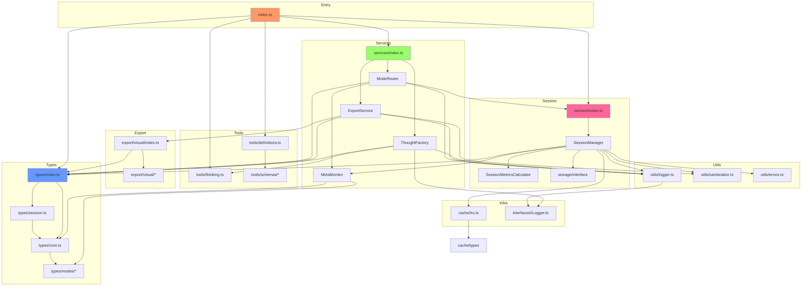

# DeepThinking MCP - Dependency Graph

**Version**: 6.0.0 | **Last Updated**: 2025-12-01

This document provides a comprehensive dependency graph of all files, components, imports, functions, and variables in the DeepThinking MCP codebase.

---

## Table of Contents

1. [Overview](#overview)
2. [Entry Point Dependencies](#entry-point-dependencies)
3. [Service Layer Dependencies](#service-layer-dependencies)
4. [Session Management Dependencies](#session-management-dependencies)
5. [Type System Dependencies](#type-system-dependencies)
6. [Tool System Dependencies](#tool-system-dependencies)
7. [Export System Dependencies](#export-system-dependencies)
8. [Utility Dependencies](#utility-dependencies)
9. [Interface Dependencies](#interface-dependencies)
10. [Cache System Dependencies](#cache-system-dependencies)
11. [Dependency Matrix](#dependency-matrix)
12. [Circular Dependency Analysis](#circular-dependency-analysis)
13. [Visual Dependency Graph](#visual-dependency-graph)

---

## Overview

The DeepThinking MCP codebase follows a layered architecture with clear dependency directions:

```
┌─────────────────────────────────────────────────────────────┐
│                    Entry Point (index.ts)                   │
├─────────────────────────────────────────────────────────────┤
│                     Tools Layer                             │
│        (definitions.ts, thinking.ts, schemas/*)             │
├─────────────────────────────────────────────────────────────┤
│                    Services Layer                           │
│  (ThoughtFactory, ExportService, ModeRouter, MetaMonitor)   │
├─────────────────────────────────────────────────────────────┤
│                   Session Layer                             │
│      (SessionManager, SessionMetricsCalculator)             │
├─────────────────────────────────────────────────────────────┤
│                    Export Layer                             │
│           (visual/*, document exporters)                    │
├─────────────────────────────────────────────────────────────┤
│              Types / Interfaces / Utils                     │
│      (core.ts, session.ts, modes/*, utils/*)                │
├─────────────────────────────────────────────────────────────┤
│              Infrastructure Layer                           │
│         (cache/, storage/, interfaces/)                     │
└─────────────────────────────────────────────────────────────┘
```

---

## Entry Point Dependencies

### `src/index.ts` - MCP Server Entry Point

**External Dependencies:**
| Package | Import | Usage |
|---------|--------|-------|
| `@modelcontextprotocol/sdk/server/index.js` | `Server` | MCP server class |
| `@modelcontextprotocol/sdk/server/stdio.js` | `StdioServerTransport` | stdio transport |
| `@modelcontextprotocol/sdk/types.js` | `CallToolRequestSchema`, `ListToolsRequestSchema` | Request schemas |

**Node.js Built-in Dependencies:**
| Module | Import | Usage |
|--------|--------|-------|
| `fs` | `readFileSync` | Package.json reading |
| `url` | `fileURLToPath` | ES module path resolution |
| `path` | `dirname`, `join` | Path manipulation |

**Internal Dependencies:**
| File | Imports | Usage |
|------|---------|-------|
| `./tools/definitions.js` | `toolList`, `toolSchemas`, `isValidTool`, `modeToToolMap` | Tool definitions |
| `./tools/thinking.js` | `thinkingTool`, `ThinkingToolSchema` | Legacy tool support |
| `./session/index.js` | `SessionManager` (type) | Session management |
| `./types/index.js` | `ThinkingMode` | Mode enumeration |
| `./services/index.js` | `ThoughtFactory`, `ExportService`, `ModeRouter` (types) | Lazy-loaded services |

**Exported Functions:**
| Function | Dependencies | Description |
|----------|--------------|-------------|
| `getSessionManager()` | `SessionManager` | Lazy initialization |
| `getThoughtFactory()` | `ThoughtFactory` | Lazy initialization |
| `getExportService()` | `ExportService` | Lazy initialization |
| `getModeRouter()` | `ModeRouter`, `getSessionManager()` | Lazy initialization |
| `handleAddThought()` | `getSessionManager()`, `getThoughtFactory()` | Thought creation |
| `handleSessionAction()` | `handleSummarize`, `handleExport`, etc. | Session operations |
| `handleSummarize()` | `getSessionManager()` | Summary generation |
| `handleExport()` | `getSessionManager()`, `getExportService()` | Session export |
| `handleSwitchMode()` | `getModeRouter()` | Mode switching |
| `handleGetSession()` | `getSessionManager()` | Session retrieval |
| `handleRecommendMode()` | `getModeRouter()` | Mode recommendations |

---

## Service Layer Dependencies

### `src/services/index.ts` - Service Barrel Export

**Exports:**
- `ThoughtFactory` from `./ThoughtFactory.js`
- `ExportService` from `./ExportService.js`
- `ModeRouter` from `./ModeRouter.js`

---

### `src/services/ThoughtFactory.ts` - Thought Creation Service

**Dependencies:**
| File | Imports | Usage |
|------|---------|-------|
| `crypto` | `randomUUID` | Thought ID generation |
| `../types/index.js` | `ThinkingMode`, `ShannonStage`, thought types (9 types) | Type definitions |
| `../tools/thinking.js` | `ThinkingToolInput` | Input type |
| `../utils/type-guards.js` | `toExtendedThoughtType` | Type conversion |
| `../interfaces/ILogger.js` | `ILogger` | Logger interface |
| `../utils/logger.js` | `createLogger`, `LogLevel` | Logger creation |

**Exported Classes:**
| Class | Methods | Description |
|-------|---------|-------------|
| `ThoughtFactory` | `createThought(input, sessionId)` | Creates mode-specific thoughts |

**Supported Modes (in switch statement):**
- `sequential`, `shannon`, `mathematics`, `physics`
- `inductive`, `deductive`, `abductive`, `causal`
- `bayesian`, `counterfactual`, `analogical`, `temporal`
- `gametheory`, `evidential`, `firstprinciples`, `metareasoning`
- `hybrid` (default)

---

### `src/services/ExportService.ts` - Export Service

**Dependencies:**
| File | Imports | Usage |
|------|---------|-------|
| `../types/index.js` | `ThinkingSession`, `ThinkingMode`, thought types, `isMetaReasoningThought` | Type definitions |
| `../export/visual/index.js` | `VisualExporter`, `VisualFormat` | Visual exports |
| `../utils/sanitization.js` | `escapeHtml`, `escapeLatex` | Security escaping |
| `../interfaces/ILogger.js` | `ILogger` | Logger interface |
| `../utils/logger.js` | `createLogger`, `LogLevel` | Logger creation |

**Exported Classes:**
| Class | Methods | Description |
|-------|---------|-------------|
| `ExportService` | `exportSession(session, format)` | Multi-format export |

**Private Methods:**
| Method | Output Format |
|--------|---------------|
| `exportVisual()` | mermaid, dot, ascii |
| `exportToJSON()` | json |
| `exportToMarkdown()` | markdown |
| `exportToLatex()` | latex |
| `exportToHTML()` | html |
| `exportToJupyter()` | jupyter notebook |

---

### `src/services/ModeRouter.ts` - Mode Routing Service

**Dependencies:**
| File | Imports | Usage |
|------|---------|-------|
| `../types/index.js` | `ThinkingMode`, `ModeRecommender`, `ProblemCharacteristics` | Types and classes |
| `../session/index.js` | `SessionManager` | Session management |
| `../interfaces/ILogger.js` | `ILogger` | Logger interface |
| `../utils/logger.js` | `createLogger`, `LogLevel` | Logger creation |
| `./MetaMonitor.js` | `metaMonitor`, `MetaMonitor` | Meta-reasoning integration |

**Exported Interfaces:**
| Interface | Fields |
|-----------|--------|
| `ModeRecommendation` | `mode`, `score`, `reasoning`, `strengths`, `limitations`, `examples` |
| `ModeCombinationRecommendation` | `modes`, `sequence`, `rationale`, `benefits`, `synergies` |

**Exported Classes:**
| Class | Key Methods | Description |
|-------|-------------|-------------|
| `ModeRouter` | `switchMode()`, `quickRecommend()`, `getRecommendations()`, `evaluateAndSuggestSwitch()`, `autoSwitchIfNeeded()` | Mode management |

---

### `src/services/MetaMonitor.ts` - Meta-Reasoning Monitor (v6.0.0)

**Dependencies:**
| File | Imports | Usage |
|------|---------|-------|
| `../types/core.js` | `Thought`, `ThinkingMode` | Core types |
| `../types/modes/metareasoning.js` | `StrategyEvaluation`, `AlternativeStrategy`, `QualityMetrics`, `SessionContext` | Meta-reasoning types |

**Internal Interfaces:**
| Interface | Fields |
|-----------|--------|
| `SessionHistoryEntry` | `thoughtId`, `mode`, `timestamp`, `content`, `uncertainty` |
| `StrategyPerformance` | `mode`, `thoughtsSpent`, `startTime`, `endTime`, `progressIndicators`, `issuesEncountered` |

**Exported Classes:**
| Class | Key Methods | Description |
|-------|-------------|-------------|
| `MetaMonitor` | `recordThought()`, `startStrategy()`, `evaluateStrategy()`, `suggestAlternatives()`, `calculateQualityMetrics()`, `getSessionContext()`, `clearSession()` | Session monitoring |

**Exported Instances:**
| Name | Type | Description |
|------|------|-------------|
| `metaMonitor` | `MetaMonitor` | Global singleton instance |

---

## Session Management Dependencies

### `src/session/index.ts` - Session Module Barrel

**Exports:**
- `SessionManager` from `./manager.js`

---

### `src/session/manager.ts` - Session Manager

**Dependencies:**
| File | Imports | Usage |
|------|---------|-------|
| `crypto` | `randomUUID` | Session ID generation |
| `../types/index.js` | `ThinkingSession`, `SessionConfig`, `SessionMetadata`, `Thought`, `ThinkingMode` | Type definitions |
| `../utils/errors.js` | `SessionNotFoundError` | Error handling |
| `../utils/sanitization.js` | `sanitizeString`, `sanitizeThoughtContent`, `validateSessionId`, `MAX_LENGTHS` | Input sanitization |
| `../utils/logger.js` | `createLogger`, `LogLevel` | Logging |
| `../interfaces/ILogger.js` | `ILogger` | Logger interface |
| `./storage/interface.js` | `SessionStorage` | Storage abstraction |
| `../cache/lru.js` | `LRUCache` | Session caching |
| `./SessionMetricsCalculator.js` | `SessionMetricsCalculator` | Metrics calculation |
| `../services/MetaMonitor.js` | `metaMonitor`, `MetaMonitor` | Meta-reasoning tracking |

**Exported Classes:**
| Class | Key Methods | Description |
|-------|-------------|-------------|
| `SessionManager` | `createSession()`, `getSession()`, `addThought()`, `switchMode()`, `listSessions()`, `deleteSession()`, `generateSummary()` | Session lifecycle |

**Internal Constants:**
| Name | Description |
|------|-------------|
| `DEFAULT_CONFIG` | Default session configuration |

---

### `src/session/SessionMetricsCalculator.ts` - Metrics Calculator

**Dependencies:**
| File | Imports | Usage |
|------|---------|-------|
| `../types/index.js` | `SessionMetrics`, `Thought` | Type definitions |

**Exported Classes:**
| Class | Key Methods |
|-------|-------------|
| `SessionMetricsCalculator` | `initializeMetrics()`, `updateMetrics()`, `calculateAverageUncertainty()` |

---

### `src/session/storage/interface.ts` - Storage Interface

**Dependencies:**
| File | Imports | Usage |
|------|---------|-------|
| `../../types/index.js` | `ThinkingSession`, `SessionMetadata` | Type definitions |

**Exported Interfaces:**
| Interface | Methods |
|-----------|---------|
| `SessionStorage` | `initialize()`, `saveSession()`, `loadSession()`, `deleteSession()`, `listSessions()`, `exists()`, `getStats()`, `cleanup()`, `close()` |
| `StorageStats` | Fields: `totalSessions`, `totalThoughts`, `storageSize`, etc. |
| `StorageConfig` | Fields: `autoSave`, `autoSaveDelay`, `enableCompression`, etc. |

**Exported Constants:**
| Name | Type |
|------|------|
| `DEFAULT_STORAGE_CONFIG` | `StorageConfig` |

---

## Type System Dependencies

### `src/types/index.ts` - Types Barrel Export

**Re-exports:**
- All from `./core.js`
- All from `./session.js`
- All from `./modes/recommendations.js`

---

### `src/types/core.ts` - Core Type Definitions

**Dependencies:**
| File | Imports | Usage |
|------|---------|-------|
| `./modes/temporal.js` | `TemporalThought` | Phase 3 types |
| `./modes/gametheory.js` | `GameTheoryThought` | Phase 3 types |
| `./modes/evidential.js` | `EvidentialThought` | Phase 3 types |
| `./modes/firstprinciples.js` | `FirstPrinciplesThought` | Phase 3 types |
| `./modes/systemsthinking.js` | `SystemsThinkingThought` | Phase 4 types |
| `./modes/scientificmethod.js` | `ScientificMethodThought` | Phase 4 types |
| `./modes/optimization.js` | `OptimizationThought` | Phase 4 types |
| `./modes/formallogic.js` | `FormalLogicThought` | Phase 4 types |
| `./modes/metareasoning.js` | `MetaReasoningThought` | Phase 6 types |

**Exported Enums:**
| Enum | Values Count | Description |
|------|--------------|-------------|
| `ThinkingMode` | 21 values | All thinking modes |
| `ShannonStage` | 5 values | Shannon methodology stages |

**Exported Constants:**
| Name | Type | Description |
|------|------|-------------|
| `FULLY_IMPLEMENTED_MODES` | `ReadonlyArray<ThinkingMode>` | 13 fully implemented modes |
| `EXPERIMENTAL_MODES` | `ReadonlyArray<ThinkingMode>` | 8 experimental modes |

**Exported Interfaces (22 total):**
| Interface | Base | Description |
|-----------|------|-------------|
| `BaseThought` | - | Base for all thoughts |
| `SequentialThought` | `BaseThought` | Sequential mode |
| `ShannonThought` | `BaseThought` | Shannon mode |
| `MathematicsThought` | `BaseThought` | Mathematics mode |
| `PhysicsThought` | `BaseThought` | Physics mode |
| `HybridThought` | `BaseThought` | Hybrid mode |
| `InductiveThought` | `BaseThought` | Inductive mode (v5.0.0) |
| `DeductiveThought` | `BaseThought` | Deductive mode (v5.0.0) |
| `AbductiveThought` | `BaseThought` | Abductive mode |
| `CausalThought` | `BaseThought` | Causal mode |
| `BayesianThought` | `BaseThought` | Bayesian mode |
| `CounterfactualThought` | `BaseThought` | Counterfactual mode |
| `AnalogicalThought` | `BaseThought` | Analogical mode |
| `MathematicalModel` | - | Math model structure |
| `TensorProperties` | - | Physics tensor properties |
| `PhysicalInterpretation` | - | Physics interpretation |
| `ProofStrategy` | - | Mathematical proof |
| `Theorem` | - | Theorem structure |
| `Reference` | - | External reference |
| ... | | Supporting interfaces |

**Exported Type Aliases:**
| Type | Definition |
|------|------------|
| `ExtendedThoughtType` | Union of 26 thought type strings |
| `Thought` | Union of 21 thought interfaces |

**Exported Functions (Type Guards):**
| Function | Returns | Description |
|----------|---------|-------------|
| `isSequentialThought()` | `thought is SequentialThought` | Type guard |
| `isShannonThought()` | `thought is ShannonThought` | Type guard |
| `isMathematicsThought()` | `thought is MathematicsThought` | Type guard |
| `isPhysicsThought()` | `thought is PhysicsThought` | Type guard |
| `isHybridThought()` | `thought is HybridThought` | Type guard |
| `isInductiveThought()` | `thought is InductiveThought` | Type guard |
| `isDeductiveThought()` | `thought is DeductiveThought` | Type guard |
| `isAbductiveThought()` | `thought is AbductiveThought` | Type guard |
| `isCausalThought()` | `thought is CausalThought` | Type guard |
| `isBayesianThought()` | `thought is BayesianThought` | Type guard |
| `isCounterfactualThought()` | `thought is CounterfactualThought` | Type guard |
| `isAnalogicalThought()` | `thought is AnalogicalThought` | Type guard |
| `isTemporalThought()` | `thought is TemporalThought` | Type guard |
| `isGameTheoryThought()` | `thought is GameTheoryThought` | Type guard |
| `isEvidentialThought()` | `thought is EvidentialThought` | Type guard |
| `isFirstPrinciplesThought()` | `thought is FirstPrinciplesThought` | Type guard |
| `isSystemsThinkingThought()` | `thought is SystemsThinkingThought` | Type guard |
| `isScientificMethodThought()` | `thought is ScientificMethodThought` | Type guard |
| `isOptimizationThought()` | `thought is OptimizationThought` | Type guard |
| `isFormalLogicThought()` | `thought is FormalLogicThought` | Type guard |
| `isMetaReasoningThought()` | `thought is MetaReasoningThought` | Type guard |
| `isFullyImplemented()` | `boolean` | Mode status check |

---

### `src/types/session.ts` - Session Types

**Dependencies:**
| File | Imports | Usage |
|------|---------|-------|
| `./core.js` | `Thought`, `ThinkingMode` | Core types |

**Exported Interfaces:**
| Interface | Key Fields |
|-----------|------------|
| `ThinkingSession` | `id`, `title`, `mode`, `thoughts`, `metrics`, `isComplete` |
| `SessionConfig` | `modeConfig`, `enableAutoSave`, `enableValidation`, `exportFormats` |
| `ModeConfig` | `mode`, `strictValidation`, `allowModeSwitch` |
| `SessionMetrics` | `totalThoughts`, `averageUncertainty`, `revisionCount`, `cacheStats` |
| `SessionMetadata` | `id`, `title`, `createdAt`, `thoughtCount`, `mode`, `isComplete` |
| `Attachment` | `id`, `filename`, `mimeType`, `size` |
| `ValidationResult` | `isValid`, `confidence`, `issues`, `strengthMetrics` |
| `ValidationIssue` | `severity`, `thoughtNumber`, `description`, `category` |

**Exported Type Aliases:**
| Type | Values |
|------|--------|
| `ExportFormat` | `'markdown'`, `'latex'`, `'json'`, `'html'`, `'jupyter'`, `'mermaid'` |

---

## Tool System Dependencies

### `src/tools/definitions.ts` - Tool Definitions

**Dependencies:**
| File | Imports | Usage |
|------|---------|-------|
| `./json-schemas.js` | `jsonSchemas` | Hand-written JSON schemas |
| `./schemas/base.js` | `SessionActionSchema` | Session schema |
| `./schemas/modes/core.js` | `CoreModeSchema`, `StandardSchema` | Core mode schemas |
| `./schemas/modes/mathematics.js` | `MathSchema` | Math schema |
| `./schemas/modes/temporal.js` | `TemporalSchema` | Temporal schema |
| `./schemas/modes/probabilistic.js` | `ProbabilisticSchema` | Probabilistic schema |
| `./schemas/modes/causal.js` | `CausalSchema` | Causal schema |
| `./schemas/modes/strategic.js` | `StrategicSchema` | Strategic schema |
| `./schemas/modes/analytical.js` | `AnalyticalSchema` | Analytical schema |
| `./schemas/modes/scientific.js` | `ScientificSchema` | Scientific schema |

**Exported Constants:**
| Name | Type | Description |
|------|------|-------------|
| `tools` | `Record<string, Schema>` | Tool name to schema map (10 tools) |
| `toolList` | `Schema[]` | Array for MCP ListTools |
| `toolSchemas` | `Record<string, ZodSchema>` | Tool to Zod schema map |
| `modeToToolMap` | `Record<string, string>` | Mode to tool routing (21 modes) |

**Exported Functions:**
| Function | Returns | Description |
|----------|---------|-------------|
| `getToolForMode(mode)` | `string` | Get tool name for mode |
| `isValidTool(toolName)` | `boolean` | Validate tool name |
| `getSchemaForTool(toolName)` | `ZodSchema` | Get Zod schema |

---

### `src/tools/thinking.ts` - Legacy Thinking Tool

**Dependencies:**
| File | Imports | Usage |
|------|---------|-------|
| `zod` | `z` | Schema validation |

**Exported Constants:**
| Name | Type | Description |
|------|------|-------------|
| `ThinkingToolSchema` | `ZodObject` | Complete Zod schema (~700 lines) |
| `thinkingTool` | `Tool` | Legacy MCP tool definition |

**Exported Types:**
| Type | Description |
|------|-------------|
| `ThinkingToolInput` | `z.infer<typeof ThinkingToolSchema>` |

---

## Export System Dependencies

### `src/export/visual/index.ts` - Visual Export Module

**Dependencies:**
| File | Imports | Usage |
|------|---------|-------|
| `./types.js` | `VisualFormat`, `VisualExportOptions` | Types |
| `./utils.js` | `sanitizeId` | Utility |
| `../../types/index.js` | 15 thought types | Mode-specific types |
| `./causal.js` | `exportCausalGraph` | Causal exporter |
| `./temporal.js` | `exportTemporalTimeline` | Temporal exporter |
| `./game-theory.js` | `exportGameTree` | Game theory exporter |
| `./bayesian.js` | `exportBayesianNetwork` | Bayesian exporter |
| `./sequential.js` | `exportSequentialDependencyGraph` | Sequential exporter |
| `./shannon.js` | `exportShannonStageFlow` | Shannon exporter |
| `./abductive.js` | `exportAbductiveHypotheses` | Abductive exporter |
| `./counterfactual.js` | `exportCounterfactualScenarios` | Counterfactual exporter |
| `./analogical.js` | `exportAnalogicalMapping` | Analogical exporter |
| `./evidential.js` | `exportEvidentialBeliefs` | Evidential exporter |
| `./first-principles.js` | `exportFirstPrinciplesDerivation` | First principles exporter |
| `./systems-thinking.js` | `exportSystemsThinkingCausalLoops` | Systems thinking exporter |
| `./scientific-method.js` | `exportScientificMethodExperiment` | Scientific method exporter |
| `./optimization.js` | `exportOptimizationSolution` | Optimization exporter |
| `./formal-logic.js` | `exportFormalLogicProof` | Formal logic exporter |

**Exported Classes:**
| Class | Methods | Description |
|-------|---------|-------------|
| `VisualExporter` | 15 export methods | Unified visual exporter |

---

## Utility Dependencies

### `src/utils/logger.ts` - Logging Utility

**Dependencies:**
| File | Imports | Usage |
|------|---------|-------|
| `../interfaces/ILogger.js` | `ILogger` | Interface implementation |

**Exported Enums:**
| Enum | Values |
|------|--------|
| `LogLevel` | `DEBUG`, `INFO`, `WARN`, `ERROR`, `SILENT` |

**Exported Interfaces:**
| Interface | Description |
|-----------|-------------|
| `LogEntry` | Log entry structure |
| `LoggerConfig` | Logger configuration |

**Exported Classes:**
| Class | Implements | Description |
|-------|------------|-------------|
| `Logger` | `ILogger` | Logger implementation |

**Exported Constants/Functions:**
| Name | Type | Description |
|------|------|-------------|
| `logger` | `Logger` | Global logger instance |
| `createLogger(config)` | `Logger` | Logger factory |

---

### `src/utils/sanitization.ts` - Input Sanitization

**Dependencies:** None (standalone)

**Exported Constants:**
| Name | Type | Description |
|------|------|-------------|
| `MAX_LENGTHS` | `Record<string, number>` | Maximum field lengths |

**Exported Functions:**
| Function | Parameters | Description |
|----------|------------|-------------|
| `sanitizeString()` | `input`, `maxLength`, `fieldName` | String sanitization |
| `sanitizeOptionalString()` | `input`, `maxLength`, `fieldName` | Optional string |
| `validateSessionId()` | `sessionId` | UUID v4 validation |
| `sanitizeNumber()` | `input`, `min`, `max`, `fieldName` | Number sanitization |
| `sanitizeStringArray()` | `input`, `maxLength`, `maxItems`, `fieldName` | Array sanitization |
| `sanitizeThoughtContent()` | `content` | Thought content |
| `sanitizeTitle()` | `title` | Session title |
| `sanitizeDomain()` | `domain` | Domain name |
| `sanitizeAuthor()` | `author` | Author name |
| `escapeHtml()` | `text` | XSS prevention |
| `escapeLatex()` | `text` | LaTeX escaping |

---

### `src/utils/errors.ts` - Error Utilities

**Dependencies:** None (standalone)

**Exported Classes:**
| Class | Extends | Code |
|-------|---------|------|
| `DeepThinkingError` | `Error` | Base class |
| `SessionError` | `DeepThinkingError` | `SESSION_ERROR` |
| `SessionNotFoundError` | `DeepThinkingError` | `SESSION_NOT_FOUND` |
| `SessionAlreadyExistsError` | `DeepThinkingError` | `SESSION_ALREADY_EXISTS` |
| `ValidationError` | `DeepThinkingError` | `VALIDATION_ERROR` |
| `InputValidationError` | `DeepThinkingError` | `INPUT_VALIDATION_ERROR` |
| `ConfigurationError` | `DeepThinkingError` | `CONFIGURATION_ERROR` |
| `InvalidModeError` | `DeepThinkingError` | `INVALID_MODE` |
| `ThoughtProcessingError` | `DeepThinkingError` | `THOUGHT_PROCESSING_ERROR` |
| `ExportError` | `DeepThinkingError` | `EXPORT_ERROR` |
| `ResourceLimitError` | `DeepThinkingError` | `RESOURCE_LIMIT_EXCEEDED` |
| `RateLimitError` | `DeepThinkingError` | `RATE_LIMIT_EXCEEDED` |
| `SecurityError` | `DeepThinkingError` | `SECURITY_ERROR` |
| `PathTraversalError` | `DeepThinkingError` | `PATH_TRAVERSAL_DETECTED` |
| `StorageError` | `DeepThinkingError` | `STORAGE_ERROR` |
| `BackupError` | `DeepThinkingError` | `BACKUP_ERROR` |
| `ErrorFactory` | - | Factory class |

---

## Interface Dependencies

### `src/interfaces/ILogger.ts` - Logger Interface

**Dependencies:**
| File | Imports | Usage |
|------|---------|-------|
| `../utils/logger.js` | `LogLevel`, `LogEntry` | Type definitions |

**Exported Interfaces:**
| Interface | Methods |
|-----------|---------|
| `ILogger` | `debug()`, `info()`, `warn()`, `error()`, `getLogs()`, `clearLogs()`, `setLevel()`, `exportLogs()` |

---

## Cache System Dependencies

### `src/cache/lru.ts` - LRU Cache

**Dependencies:**
| File | Imports | Usage |
|------|---------|-------|
| `./types.js` | `Cache`, `CacheConfig`, `CacheEntry`, `CacheStats` | Type definitions |

**Exported Classes:**
| Class | Implements | Description |
|-------|------------|-------------|
| `LRUCache<T>` | `Cache<T>` | LRU cache implementation |

**Key Methods:**
| Method | Description |
|--------|-------------|
| `get(key)` | Get with LRU update |
| `set(key, value, ttl?)` | Set with eviction |
| `delete(key)` | Delete entry |
| `clear()` | Clear all entries |
| `getStats()` | Get cache statistics |

---

## Dependency Matrix

### File Import/Export Matrix

| File | Imports From | Exports To |
|------|--------------|------------|
| `index.ts` | 8 files | - (entry point) |
| `services/ThoughtFactory.ts` | 5 files | `services/index.ts` |
| `services/ExportService.ts` | 5 files | `services/index.ts` |
| `services/ModeRouter.ts` | 5 files | `services/index.ts` |
| `services/MetaMonitor.ts` | 2 files | `services/ModeRouter.ts`, `session/manager.ts` |
| `session/manager.ts` | 9 files | `session/index.ts` |
| `types/core.ts` | 9 files | `types/index.ts` |
| `types/session.ts` | 1 file | `types/index.ts` |
| `utils/logger.ts` | 1 file | 5 files |
| `utils/sanitization.ts` | 0 files | 3 files |
| `utils/errors.ts` | 0 files | 2 files |
| `cache/lru.ts` | 1 file | `session/manager.ts` |

---

## Circular Dependency Analysis

**No circular dependencies detected.**

The dependency graph follows a strict top-down hierarchy:
1. Entry point (`index.ts`) depends on services and tools
2. Services depend on types, utilities, and session layer
3. Session layer depends on types, utilities, storage, and cache
4. Types are leaf nodes (only import from other types)
5. Utilities are leaf nodes (no internal dependencies)

---

## Visual Dependency Graph

### Mermaid Diagram



---

## Summary Statistics

| Category | Count |
|----------|-------|
| Total TypeScript Files | 185 |
| Entry Points | 1 |
| Service Classes | 4 |
| Type Definition Files | 25+ |
| Utility Modules | 5 |
| Visual Exporters | 15 |
| Tool Schemas | 10 |
| Thinking Modes | 21 |
| Type Guards | 22 |
| Error Classes | 17 |

---

*Last Updated*: 2025-12-01
*Version*: 6.0.0
