# deepthinking-mcp - Dependency Graph

**Version**: 6.1.0 | **Last Updated**: 2025-12-02

This document provides a comprehensive dependency graph of all files, components, imports, functions, and variables in the codebase.

---

## Table of Contents

1. [Overview](#overview)
2. [Analytics Dependencies](#analytics-dependencies)
3. [Backup Dependencies](#backup-dependencies)
4. [Batch Dependencies](#batch-dependencies)
5. [Cache Dependencies](#cache-dependencies)
6. [Collaboration Dependencies](#collaboration-dependencies)
7. [Comparison Dependencies](#comparison-dependencies)
8. [Config Dependencies](#config-dependencies)
9. [Export Dependencies](#export-dependencies)
10. [Entry Dependencies](#entry-dependencies)
11. [Interfaces Dependencies](#interfaces-dependencies)
12. [Ml Dependencies](#ml-dependencies)
13. [Modes Dependencies](#modes-dependencies)
14. [Rate limit Dependencies](#rate-limit-dependencies)
15. [Repositories Dependencies](#repositories-dependencies)
16. [Search Dependencies](#search-dependencies)
17. [Services Dependencies](#services-dependencies)
18. [Session Dependencies](#session-dependencies)
19. [Taxonomy Dependencies](#taxonomy-dependencies)
20. [Templates Dependencies](#templates-dependencies)
21. [Tools Dependencies](#tools-dependencies)
22. [Types Dependencies](#types-dependencies)
23. [Utils Dependencies](#utils-dependencies)
24. [Validation Dependencies](#validation-dependencies)
25. [Visualization Dependencies](#visualization-dependencies)
26. [Webhooks Dependencies](#webhooks-dependencies)
27. [Dependency Matrix](#dependency-matrix)
28. [Circular Dependency Analysis](#circular-dependency-analysis)
29. [Visual Dependency Graph](#visual-dependency-graph)
30. [Summary Statistics](#summary-statistics)

---

## Overview

The codebase is organized into the following modules:

- **analytics**: 2 files
- **backup**: 4 files
- **batch**: 3 files
- **cache**: 6 files
- **collaboration**: 5 files
- **comparison**: 5 files
- **config**: 1 file
- **export**: 26 files
- **entry**: 1 file
- **interfaces**: 2 files
- **ml**: 4 files
- **modes**: 6 files
- **rate-limit**: 4 files
- **repositories**: 4 files
- **search**: 5 files
- **services**: 5 files
- **session**: 7 files
- **taxonomy**: 7 files
- **templates**: 4 files
- **tools**: 16 files
- **types**: 21 files
- **utils**: 8 files
- **validation**: 34 files
- **visualization**: 5 files
- **webhooks**: 5 files

---

## Analytics Dependencies

### `src/analytics/index.ts` - Analytics Module Exports (v3.4.0)

**Internal Dependencies:**
| File | Imports | Type |
|------|---------|------|
| `./engine.js` | `AnalyticsEngine` | Re-export |
| `./dashboard.js` | `AnalyticsDashboard` | Re-export |
| `./time-series.js` | `TimeSeriesAnalyzer` | Re-export |
| `./quality-metrics.js` | `QualityMetrics` | Re-export |
| `./distribution.js` | `DistributionAnalyzer` | Re-export |

**Exports:**
- Re-exports: `AnalyticsEngine`, `AnalyticsDashboard`, `TimeSeriesAnalyzer`, `QualityMetrics`, `DistributionAnalyzer`

---

### `src/analytics/types.ts` - Analytics Types (v3.4.0)

**Internal Dependencies:**
| File | Imports | Type |
|------|---------|------|
| `../types/index.js` | `ThinkingMode` | Import (type-only) |

---

## Backup Dependencies

### `src/backup/backup-manager.ts` - Backup Manager (v3.4.0)

**Node.js Built-in Dependencies:**
| Module | Import |
|--------|--------|
| `crypto` | `crypto` |
| `zlib` | `zlib` |
| `util` | `promisify` |

**Internal Dependencies:**
| File | Imports | Type |
|------|---------|------|
| `./types.js` | `BackupConfig, BackupRecord, BackupProviderOptions, BackupManifest, BackupValidation, BackupStats, BackupType, BackupProvider, RestoreOptions, RestoreResult, RestoreProgress, CompressionFormat` | Import (type-only) |
| `./providers/local.js` | `LocalBackupProvider` | Import |
| `../interfaces/ILogger.js` | `ILogger` | Import |
| `../utils/logger.js` | `createLogger, LogLevel` | Import |

**Exports:**
- Classes: `BackupManager`

---

### `src/backup/index.ts` - Backup and Restore System Exports (v3.4.0)

**Internal Dependencies:**
| File | Imports | Type |
|------|---------|------|
| `./backup-manager.js` | `BackupManager` | Re-export |
| `./providers/local.js` | `LocalBackupProvider` | Re-export |

**Exports:**
- Re-exports: `BackupManager`, `LocalBackupProvider`

---

### `src/backup/providers/local.ts` - Local File System Backup Provider (v3.4.0)

**Node.js Built-in Dependencies:**
| Module | Import |
|--------|--------|
| `fs/promises` | `fs` |
| `path` | `path` |
| `crypto` | `crypto` |

**Internal Dependencies:**
| File | Imports | Type |
|------|---------|------|
| `../types.js` | `LocalBackupOptions, BackupManifest` | Import (type-only) |

**Exports:**
- Classes: `LocalBackupProvider`

---

### `src/backup/types.ts` - Backup and Restore System Types (v3.4.0)

---

## Batch Dependencies

### `src/batch/index.ts` - Batch Processing Module Exports (v3.4.0)

**Internal Dependencies:**
| File | Imports | Type |
|------|---------|------|
| `./processor.js` | `BatchProcessor` | Re-export |

**Exports:**
- Re-exports: `BatchProcessor`

---

### `src/batch/processor.ts` - Batch Processor (v3.4.0)

**Node.js Built-in Dependencies:**
| Module | Import |
|--------|--------|
| `crypto` | `randomUUID` |

**Internal Dependencies:**
| File | Imports | Type |
|------|---------|------|
| `./types.js` | `BatchJob, BatchJobType, BatchJobParams, BatchJobResult, BatchProcessorOptions` | Import (type-only) |
| `../interfaces/ILogger.js` | `ILogger` | Import |
| `../utils/logger.js` | `createLogger, LogLevel` | Import |
| `../session/manager.js` | `SessionManager` | Import (type-only) |
| `../services/ExportService.js` | `ExportService` | Import (type-only) |
| `../backup/backup-manager.js` | `BackupManager` | Import (type-only) |
| `../search/engine.js` | `SearchEngine` | Import (type-only) |

**Exports:**
- Classes: `BatchProcessor`
- Interfaces: `BatchProcessorDependencies`

---

### `src/batch/types.ts` - Batch Processing Types (v3.4.0)

---

## Cache Dependencies

### `src/cache/factory.ts` - Cache Factory (v3.4.0)

**Internal Dependencies:**
| File | Imports | Type |
|------|---------|------|
| `./types.js` | `Cache, CacheConfig` | Import (type-only) |
| `./lru.js` | `LRUCache` | Import |
| `./lfu.js` | `LFUCache` | Import |
| `./fifo.js` | `FIFOCache` | Import |

**Exports:**
- Classes: `CacheFactory`, `CacheManager`
- Functions: `createCache`

---

### `src/cache/fifo.ts` - FIFO Cache (v3.4.0)

**Internal Dependencies:**
| File | Imports | Type |
|------|---------|------|
| `./types.js` | `Cache, CacheConfig, CacheEntry, CacheStats` | Import (type-only) |

**Exports:**
- Classes: `FIFOCache`

---

### `src/cache/index.ts` - Cache Module Exports (v3.4.0)

**Internal Dependencies:**
| File | Imports | Type |
|------|---------|------|
| `./lru.js` | `LRUCache` | Re-export |
| `./lfu.js` | `LFUCache` | Re-export |
| `./fifo.js` | `FIFOCache` | Re-export |
| `./factory.js` | `createCache, CacheManager` | Re-export |

**Exports:**
- Re-exports: `LRUCache`, `LFUCache`, `FIFOCache`, `createCache`, `CacheManager`

---

### `src/cache/lfu.ts` - LFU Cache (v3.4.0)

**Internal Dependencies:**
| File | Imports | Type |
|------|---------|------|
| `./types.js` | `Cache, CacheConfig, CacheEntry, CacheStats` | Import (type-only) |

**Exports:**
- Classes: `LFUCache`

---

### `src/cache/lru.ts` - LRU Cache (v3.4.0)

**Internal Dependencies:**
| File | Imports | Type |
|------|---------|------|
| `./types.js` | `Cache, CacheConfig, CacheEntry, CacheStats` | Import (type-only) |

**Exports:**
- Classes: `LRUCache`

---

### `src/cache/types.ts` - Cache Types (v3.4.0)

---

## Collaboration Dependencies

### `src/collaboration/annotations.ts` - Collaborative Annotations (v3.4.0)

**Exports:**
- Classes: `AnnotationManager`
- Interfaces: `TextRange`, `Annotation`, `AnnotationVote`, `AnnotationFilter`, `AnnotationThread`, `AnnotationStats`

---

### `src/collaboration/conflict-resolution.ts` - Conflict Resolution for Divergent Thoughts (v3.4.0)

**Internal Dependencies:**
| File | Imports | Type |
|------|---------|------|
| `../types/index.js` | `Thought` | Import (type-only) |
| `../types/core.js` | `ThinkingMode` | Import (type-only) |

**Exports:**
- Classes: `ConflictResolutionManager`
- Interfaces: `DivergentThought`, `ThoughtConflict`, `ConflictResolution`, `ResolutionVote`, `ConsensusRequirement`, `Evidence`

---

### `src/collaboration/index.ts` - Collaboration Module - Index

**Internal Dependencies:**
| File | Imports | Type |
|------|---------|------|
| `./multi-agent.js` | `MultiAgentCollaboration, type CollaborativeAgent, type CollaborativeWorkspace, type AgentMessage, type AgentAssignment, type CoordinationRule, type AgentRole, type AgentStatus, type MessageType` | Re-export |
| `./session-sharing.js` | `SessionSharingManager, type SharedSession, type SessionComment, type MergeStrategy, type MergeMetadata, type MergeConflict, type ConflictType` | Re-export |
| `./annotations.js` | `AnnotationManager, type Annotation, type AnnotationType, type HighlightColor, type AnnotationVisibility, type TextRange, type AnnotationVote, type AnnotationFilter, type AnnotationThread, type AnnotationStats` | Re-export |
| `./conflict-resolution.js` | `ConflictResolutionManager, type ThoughtConflict, type ConflictResolution, type DivergentThought, type ResolutionVote, type ResolutionStrategy, type ResolutionStatus, type ConflictSeverity, type ConflictCategory, type ConsensusRequirement, type Evidence` | Re-export |

**Exports:**
- Re-exports: `MultiAgentCollaboration`, `type CollaborativeAgent`, `type CollaborativeWorkspace`, `type AgentMessage`, `type AgentAssignment`, `type CoordinationRule`, `type AgentRole`, `type AgentStatus`, `type MessageType`, `SessionSharingManager`, `type SharedSession`, `type SessionComment`, `type MergeStrategy`, `type MergeMetadata`, `type MergeConflict`, `type ConflictType`, `AnnotationManager`, `type Annotation`, `type AnnotationType`, `type HighlightColor`, `type AnnotationVisibility`, `type TextRange`, `type AnnotationVote`, `type AnnotationFilter`, `type AnnotationThread`, `type AnnotationStats`, `ConflictResolutionManager`, `type ThoughtConflict`, `type ConflictResolution`, `type DivergentThought`, `type ResolutionVote`, `type ResolutionStrategy`, `type ResolutionStatus`, `type ConflictSeverity`, `type ConflictCategory`, `type ConsensusRequirement`, `type Evidence`

---

### `src/collaboration/multi-agent.ts` - Multi-Agent Collaboration Infrastructure (v3.4.0)

**Internal Dependencies:**
| File | Imports | Type |
|------|---------|------|
| `../types/index.js` | `Thought` | Import (type-only) |
| `../types/core.js` | `ThinkingMode` | Import (type-only) |

**Exports:**
- Classes: `MultiAgentCollaboration`
- Interfaces: `CollaborativeAgent`, `AgentMessage`, `CollaborativeWorkspace`, `CoordinationRule`, `AgentAssignment`

---

### `src/collaboration/session-sharing.ts` - Session Sharing and Merging (v3.4.0)

**Internal Dependencies:**
| File | Imports | Type |
|------|---------|------|
| `../types/index.js` | `ThinkingSession, Thought` | Import (type-only) |
| `../types/core.js` | `ThinkingMode` | Import (type-only) |

**Exports:**
- Classes: `SessionSharingManager`
- Interfaces: `MergeConflict`, `MergeMetadata`, `SharedSession`, `SessionComment`

---

## Comparison Dependencies

### `src/comparison/comparator.ts` - Session Comparator (v3.4.0)

**Internal Dependencies:**
| File | Imports | Type |
|------|---------|------|
| `./types.js` | `ComparisonResult, Difference, ComparisonSummary, ComparisonMetrics, DiffOptions, SimilarityMetrics, ThoughtComparison` | Import (type-only) |
| `../types/session.js` | `ThinkingSession` | Import (type-only) |

**Exports:**
- Classes: `SessionComparator`

---

### `src/comparison/diff-generator.ts` - Diff Generator (v3.4.0)

**Internal Dependencies:**
| File | Imports | Type |
|------|---------|------|
| `./types.js` | `TextDiff, ComparisonTimeline, TimelineEvent, DivergencePoint, ConvergencePoint` | Import (type-only) |
| `../types/session.js` | `ThinkingSession` | Import (type-only) |

**Exports:**
- Classes: `DiffGenerator`

---

### `src/comparison/index.ts` - Session Comparison Exports (v3.4.0)

**Internal Dependencies:**
| File | Imports | Type |
|------|---------|------|
| `./comparator.js` | `SessionComparator` | Re-export |
| `./multi-comparator.js` | `MultiSessionComparator` | Re-export |
| `./diff-generator.js` | `DiffGenerator` | Re-export |

**Exports:**
- Re-exports: `SessionComparator`, `MultiSessionComparator`, `DiffGenerator`

---

### `src/comparison/multi-comparator.ts` - Multi-Session Comparator (v3.4.0)

**Internal Dependencies:**
| File | Imports | Type |
|------|---------|------|
| `./types.js` | `MultiSessionComparison, SessionCluster, ComparisonResult` | Import (type-only) |
| `../types/session.js` | `ThinkingSession` | Import (type-only) |
| `./comparator.js` | `SessionComparator` | Import |

**Exports:**
- Classes: `MultiSessionComparator`

---

### `src/comparison/types.ts` - Session Comparison Types (v3.4.0)

**Internal Dependencies:**
| File | Imports | Type |
|------|---------|------|
| `../types/core.js` | `ThinkingMode` | Import (type-only) |

---

## Config Dependencies

### `src/config/index.ts` - Centralized configuration for DeepThinking MCP Server

**Exports:**
- Interfaces: `ServerConfig`
- Functions: `getConfig`, `updateConfig`, `resetConfig`, `validateConfig`
- Constants: `CONFIG`

---

## Export Dependencies

### `src/export/index.ts` - Export module index (v4.3.0)

**Internal Dependencies:**
| File | Imports | Type |
|------|---------|------|
| `./visual/index.js` | `type VisualFormat, type VisualExportOptions, sanitizeId, VisualExporter, exportCausalGraph, exportTemporalTimeline, exportGameTree, exportBayesianNetwork, exportSequentialDependencyGraph, exportShannonStageFlow, exportAbductiveHypotheses, exportCounterfactualScenarios, exportAnalogicalMapping, exportEvidentialBeliefs, exportFirstPrinciplesDerivation, exportSystemsThinkingCausalLoops, exportScientificMethodExperiment, exportOptimizationSolution, exportFormalLogicProof` | Re-export |
| `./latex.js` | `LaTeXExporter, type LaTeXExportOptions` | Re-export |

**Exports:**
- Re-exports: `type VisualFormat`, `type VisualExportOptions`, `sanitizeId`, `VisualExporter`, `exportCausalGraph`, `exportTemporalTimeline`, `exportGameTree`, `exportBayesianNetwork`, `exportSequentialDependencyGraph`, `exportShannonStageFlow`, `exportAbductiveHypotheses`, `exportCounterfactualScenarios`, `exportAnalogicalMapping`, `exportEvidentialBeliefs`, `exportFirstPrinciplesDerivation`, `exportSystemsThinkingCausalLoops`, `exportScientificMethodExperiment`, `exportOptimizationSolution`, `exportFormalLogicProof`, `LaTeXExporter`, `type LaTeXExportOptions`

---

### `src/export/latex-mermaid-integration.ts` - LaTeX-Mermaid Integration (v3.4.0)

**Internal Dependencies:**
| File | Imports | Type |
|------|---------|------|
| `../types/index.js` | `ThinkingSession, Thought` | Import (type-only) |
| `./visual/index.js` | `VisualExporter, VisualExportOptions` | Import |

**Exports:**
- Classes: `LatexMermaidIntegrator`
- Interfaces: `MermaidLatexOptions`

---

### `src/export/latex.ts` - LaTeX Export Module (v3.2.0)

**Internal Dependencies:**
| File | Imports | Type |
|------|---------|------|
| `../types/session.js` | `ThinkingSession` | Import (type-only) |
| `../types/index.js` | `Thought, MathematicsThought, PhysicsThought, CausalThought, BayesianThought, AnalogicalThought, TemporalThought, GameTheoryThought, EvidentialThought, FirstPrinciplesThought` | Import (type-only) |
| `./visual/index.js` | `VisualExporter` | Import |

**Exports:**
- Classes: `LaTeXExporter`
- Interfaces: `LaTeXExportOptions`

---

### `src/export/visual/abductive.ts` - Abductive Visual Exporter (v4.3.0)

**Internal Dependencies:**
| File | Imports | Type |
|------|---------|------|
| `../../types/index.js` | `AbductiveThought` | Import (type-only) |
| `./types.js` | `VisualExportOptions` | Import (type-only) |
| `./utils.js` | `sanitizeId` | Import |

**Exports:**
- Functions: `exportAbductiveHypotheses`

---

### `src/export/visual/analogical.ts` - Analogical Visual Exporter (v4.3.0)

**Internal Dependencies:**
| File | Imports | Type |
|------|---------|------|
| `../../types/index.js` | `AnalogicalThought` | Import (type-only) |
| `./types.js` | `VisualExportOptions` | Import (type-only) |
| `./utils.js` | `sanitizeId` | Import |

**Exports:**
- Functions: `exportAnalogicalMapping`

---

### `src/export/visual/bayesian.ts` - Bayesian Visual Exporter (v4.3.0)

**Internal Dependencies:**
| File | Imports | Type |
|------|---------|------|
| `../../types/index.js` | `BayesianThought` | Import (type-only) |
| `./types.js` | `VisualExportOptions` | Import (type-only) |

**Exports:**
- Functions: `exportBayesianNetwork`

---

### `src/export/visual/causal.ts` - Causal Visual Exporter (v4.3.0)

**Internal Dependencies:**
| File | Imports | Type |
|------|---------|------|
| `../../types/index.js` | `CausalThought` | Import (type-only) |
| `./types.js` | `VisualExportOptions` | Import (type-only) |
| `./utils.js` | `sanitizeId` | Import |

**Exports:**
- Functions: `exportCausalGraph`

---

### `src/export/visual/counterfactual.ts` - Counterfactual Visual Exporter (v4.3.0)

**Internal Dependencies:**
| File | Imports | Type |
|------|---------|------|
| `../../types/index.js` | `CounterfactualThought` | Import (type-only) |
| `./types.js` | `VisualExportOptions` | Import (type-only) |
| `./utils.js` | `sanitizeId` | Import |

**Exports:**
- Functions: `exportCounterfactualScenarios`

---

### `src/export/visual/evidential.ts` - Evidential Visual Exporter (v4.3.0)

**Internal Dependencies:**
| File | Imports | Type |
|------|---------|------|
| `../../types/index.js` | `EvidentialThought` | Import (type-only) |
| `./types.js` | `VisualExportOptions` | Import (type-only) |
| `./utils.js` | `sanitizeId` | Import |

**Exports:**
- Functions: `exportEvidentialBeliefs`

---

### `src/export/visual/first-principles.ts` - First Principles Visual Exporter (v4.3.0)

**Internal Dependencies:**
| File | Imports | Type |
|------|---------|------|
| `../../types/index.js` | `FirstPrinciplesThought` | Import (type-only) |
| `./types.js` | `VisualExportOptions` | Import (type-only) |
| `./utils.js` | `sanitizeId` | Import |

**Exports:**
- Functions: `exportFirstPrinciplesDerivation`

---

### `src/export/visual/formal-logic.ts` - Formal Logic Visual Exporter (v4.3.0)

**Internal Dependencies:**
| File | Imports | Type |
|------|---------|------|
| `../../types/index.js` | `FormalLogicThought` | Import (type-only) |
| `./types.js` | `VisualExportOptions` | Import (type-only) |
| `./utils.js` | `sanitizeId` | Import |

**Exports:**
- Functions: `exportFormalLogicProof`

---

### `src/export/visual/game-theory.ts` - Game Theory Visual Exporter (v4.3.0)

**Internal Dependencies:**
| File | Imports | Type |
|------|---------|------|
| `../../types/index.js` | `GameTheoryThought` | Import (type-only) |
| `./types.js` | `VisualExportOptions` | Import (type-only) |
| `./utils.js` | `sanitizeId` | Import |

**Exports:**
- Functions: `exportGameTree`

---

### `src/export/visual/hybrid.ts` - Hybrid Visual Exporter (v6.1.0)

**Internal Dependencies:**
| File | Imports | Type |
|------|---------|------|
| `../../types/core.js` | `HybridThought` | Import (type-only) |
| `./types.js` | `VisualExportOptions` | Import (type-only) |
| `./utils.js` | `sanitizeId` | Import |

**Exports:**
- Functions: `exportHybridOrchestration`

---

### `src/export/visual/index.ts` - Visual Export Module (v4.3.0)

**Internal Dependencies:**
| File | Imports | Type |
|------|---------|------|
| `../../types/index.js` | `CausalThought, TemporalThought, GameTheoryThought, BayesianThought, SequentialThought, ShannonThought, AbductiveThought, CounterfactualThought, AnalogicalThought, EvidentialThought, FirstPrinciplesThought, SystemsThinkingThought, ScientificMethodThought, OptimizationThought, FormalLogicThought, HybridThought` | Import (type-only) |
| `../../types/modes/mathematics.js` | `MathematicsThought` | Import (type-only) |
| `../../types/modes/physics.js` | `PhysicsThought` | Import (type-only) |
| `../../types/modes/metareasoning.js` | `MetaReasoningThought` | Import (type-only) |
| `./types.js` | `VisualExportOptions` | Import (type-only) |
| `./causal.js` | `exportCausalGraph` | Import |
| `./temporal.js` | `exportTemporalTimeline` | Import |
| `./game-theory.js` | `exportGameTree` | Import |
| `./bayesian.js` | `exportBayesianNetwork` | Import |
| `./sequential.js` | `exportSequentialDependencyGraph` | Import |
| `./shannon.js` | `exportShannonStageFlow` | Import |
| `./abductive.js` | `exportAbductiveHypotheses` | Import |
| `./counterfactual.js` | `exportCounterfactualScenarios` | Import |
| `./analogical.js` | `exportAnalogicalMapping` | Import |
| `./evidential.js` | `exportEvidentialBeliefs` | Import |
| `./first-principles.js` | `exportFirstPrinciplesDerivation` | Import |
| `./systems-thinking.js` | `exportSystemsThinkingCausalLoops` | Import |
| `./scientific-method.js` | `exportScientificMethodExperiment` | Import |
| `./optimization.js` | `exportOptimizationSolution` | Import |
| `./formal-logic.js` | `exportFormalLogicProof` | Import |
| `./mathematics.js` | `exportMathematicsDerivation` | Import |
| `./physics.js` | `exportPhysicsVisualization` | Import |
| `./hybrid.js` | `exportHybridOrchestration` | Import |
| `./metareasoning.js` | `exportMetaReasoningVisualization` | Import |
| `./types.js` | `type VisualFormat, type VisualExportOptions` | Re-export |
| `./utils.js` | `sanitizeId` | Re-export |
| `./causal.js` | `exportCausalGraph` | Re-export |
| `./temporal.js` | `exportTemporalTimeline` | Re-export |
| `./game-theory.js` | `exportGameTree` | Re-export |
| `./bayesian.js` | `exportBayesianNetwork` | Re-export |
| `./sequential.js` | `exportSequentialDependencyGraph` | Re-export |
| `./shannon.js` | `exportShannonStageFlow` | Re-export |
| `./abductive.js` | `exportAbductiveHypotheses` | Re-export |
| `./counterfactual.js` | `exportCounterfactualScenarios` | Re-export |
| `./analogical.js` | `exportAnalogicalMapping` | Re-export |
| `./evidential.js` | `exportEvidentialBeliefs` | Re-export |
| `./first-principles.js` | `exportFirstPrinciplesDerivation` | Re-export |
| `./systems-thinking.js` | `exportSystemsThinkingCausalLoops` | Re-export |
| `./scientific-method.js` | `exportScientificMethodExperiment` | Re-export |
| `./optimization.js` | `exportOptimizationSolution` | Re-export |
| `./formal-logic.js` | `exportFormalLogicProof` | Re-export |
| `./mathematics.js` | `exportMathematicsDerivation` | Re-export |
| `./physics.js` | `exportPhysicsVisualization` | Re-export |
| `./hybrid.js` | `exportHybridOrchestration` | Re-export |
| `./metareasoning.js` | `exportMetaReasoningVisualization` | Re-export |

**Exports:**
- Classes: `VisualExporter`
- Re-exports: `type VisualFormat`, `type VisualExportOptions`, `sanitizeId`, `exportCausalGraph`, `exportTemporalTimeline`, `exportGameTree`, `exportBayesianNetwork`, `exportSequentialDependencyGraph`, `exportShannonStageFlow`, `exportAbductiveHypotheses`, `exportCounterfactualScenarios`, `exportAnalogicalMapping`, `exportEvidentialBeliefs`, `exportFirstPrinciplesDerivation`, `exportSystemsThinkingCausalLoops`, `exportScientificMethodExperiment`, `exportOptimizationSolution`, `exportFormalLogicProof`, `exportMathematicsDerivation`, `exportPhysicsVisualization`, `exportHybridOrchestration`, `exportMetaReasoningVisualization`

---

### `src/export/visual/mathematics.ts` - Mathematics Visual Exporter (v6.1.0)

**Internal Dependencies:**
| File | Imports | Type |
|------|---------|------|
| `../../types/modes/mathematics.js` | `MathematicsThought` | Import (type-only) |
| `./types.js` | `VisualExportOptions` | Import (type-only) |
| `./utils.js` | `sanitizeId` | Import |

**Exports:**
- Functions: `exportMathematicsDerivation`

---

### `src/export/visual/metareasoning.ts` - MetaReasoning Visual Exporter (v6.1.0)

**Internal Dependencies:**
| File | Imports | Type |
|------|---------|------|
| `../../types/modes/metareasoning.js` | `MetaReasoningThought` | Import (type-only) |
| `./types.js` | `VisualExportOptions` | Import (type-only) |
| `./utils.js` | `sanitizeId` | Import |

**Exports:**
- Functions: `exportMetaReasoningVisualization`

---

### `src/export/visual/optimization.ts` - Optimization Visual Exporter (v4.3.0)

**Internal Dependencies:**
| File | Imports | Type |
|------|---------|------|
| `../../types/index.js` | `OptimizationThought` | Import (type-only) |
| `./types.js` | `VisualExportOptions` | Import (type-only) |
| `./utils.js` | `sanitizeId` | Import |

**Exports:**
- Functions: `exportOptimizationSolution`

---

### `src/export/visual/physics.ts` - Physics Visual Exporter (v6.1.0)

**Internal Dependencies:**
| File | Imports | Type |
|------|---------|------|
| `../../types/modes/physics.js` | `PhysicsThought` | Import (type-only) |
| `./types.js` | `VisualExportOptions` | Import (type-only) |
| `./utils.js` | `sanitizeId` | Import |

**Exports:**
- Functions: `exportPhysicsVisualization`

---

### `src/export/visual/scientific-method.ts` - Scientific Method Visual Exporter (v4.3.0)

**Internal Dependencies:**
| File | Imports | Type |
|------|---------|------|
| `../../types/index.js` | `ScientificMethodThought` | Import (type-only) |
| `./types.js` | `VisualExportOptions` | Import (type-only) |
| `./utils.js` | `sanitizeId` | Import |

**Exports:**
- Functions: `exportScientificMethodExperiment`

---

### `src/export/visual/sequential.ts` - Sequential Visual Exporter (v4.3.0)

**Internal Dependencies:**
| File | Imports | Type |
|------|---------|------|
| `../../types/index.js` | `SequentialThought` | Import (type-only) |
| `./types.js` | `VisualExportOptions` | Import (type-only) |
| `./utils.js` | `sanitizeId` | Import |

**Exports:**
- Functions: `exportSequentialDependencyGraph`

---

### `src/export/visual/shannon.ts` - Shannon Visual Exporter (v4.3.0)

**Internal Dependencies:**
| File | Imports | Type |
|------|---------|------|
| `../../types/index.js` | `ShannonThought` | Import (type-only) |
| `./types.js` | `VisualExportOptions` | Import (type-only) |
| `./utils.js` | `sanitizeId` | Import |

**Exports:**
- Functions: `exportShannonStageFlow`

---

### `src/export/visual/systems-thinking.ts` - Systems Thinking Visual Exporter (v4.3.0)

**Internal Dependencies:**
| File | Imports | Type |
|------|---------|------|
| `../../types/index.js` | `SystemsThinkingThought` | Import (type-only) |
| `./types.js` | `VisualExportOptions` | Import (type-only) |
| `./utils.js` | `sanitizeId` | Import |

**Exports:**
- Functions: `exportSystemsThinkingCausalLoops`

---

### `src/export/visual/temporal.ts` - Temporal Visual Exporter (v4.3.0)

**Internal Dependencies:**
| File | Imports | Type |
|------|---------|------|
| `../../types/index.js` | `TemporalThought` | Import (type-only) |
| `./types.js` | `VisualExportOptions` | Import (type-only) |
| `./utils.js` | `sanitizeId` | Import |

**Exports:**
- Functions: `exportTemporalTimeline`

---

### `src/export/visual/types.ts` - Visual Export Types (v4.3.0)

---

### `src/export/visual/utils.ts` - Visual Export Utilities (v4.3.0)

**Exports:**
- Functions: `sanitizeId`

---

### `src/export/visual.ts` - Visual Export Module (v3.2.0)

**Internal Dependencies:**
| File | Imports | Type |
|------|---------|------|
| `../types/index.js` | `CausalThought, TemporalThought, GameTheoryThought, BayesianThought, SequentialThought, ShannonThought, AbductiveThought, CounterfactualThought, AnalogicalThought, EvidentialThought, FirstPrinciplesThought, SystemsThinkingThought, ScientificMethodThought, OptimizationThought, FormalLogicThought` | Import (type-only) |

**Exports:**
- Classes: `VisualExporter`
- Interfaces: `VisualExportOptions`

---

## Entry Dependencies

### `src/index.ts` - DeepThinking MCP Server (v6.1.0)

**External Dependencies:**
| Package | Import |
|---------|--------|
| `@modelcontextprotocol/sdk/server/index.js` | `Server` |
| `@modelcontextprotocol/sdk/server/stdio.js` | `StdioServerTransport` |
| `@modelcontextprotocol/sdk/types.js` | `CallToolRequestSchema, ListToolsRequestSchema` |

**Node.js Built-in Dependencies:**
| Module | Import |
|--------|--------|
| `fs` | `readFileSync` |
| `url` | `fileURLToPath` |
| `path` | `dirname, join` |

**Internal Dependencies:**
| File | Imports | Type |
|------|---------|------|
| `./tools/definitions.js` | `toolList, toolSchemas, isValidTool, modeToToolMap` | Import |
| `./tools/thinking.js` | `thinkingTool` | Import |
| `./session/index.js` | `SessionManager` | Import (type-only) |
| `./types/index.js` | `ThinkingMode` | Import |
| `./services/index.js` | `ThoughtFactory, ExportService, ModeRouter` | Import (type-only) |

---

## Interfaces Dependencies

### `src/interfaces/ILogger.ts` - Logger Interface (v3.4.5)

**Internal Dependencies:**
| File | Imports | Type |
|------|---------|------|
| `../utils/logger-types.js` | `LogLevel, LogEntry` | Import (type-only) |

---

### `src/interfaces/index.ts` - Dependency Injection Interfaces (v3.4.5)

**Internal Dependencies:**
| File | Imports | Type |
|------|---------|------|
| `./interfaces/index.js` | `ILogger` | Import |
| `./cache/types.js` | `Cache` | Import |
| `./ILogger.js` | `ILogger` | Re-export |
| `../cache/types.js` | `Cache, CacheConfig, CacheStats` | Re-export |

**Exports:**
- Re-exports: `ILogger`, `Cache`, `CacheConfig`, `CacheStats`

---

## Ml Dependencies

### `src/ml/index.ts` - Machine Learning Module (v3.4.0)

**Internal Dependencies:**
| File | Imports | Type |
|------|---------|------|
| `./pattern-recognition.js` | `PatternRecognizer` | Re-export |
| `./success-metrics.js` | `SuccessMetricsAnalyzer` | Re-export |
| `./recommendation-engine.js` | `RecommendationEngine` | Re-export |

**Exports:**
- Re-exports: `PatternRecognizer`, `SuccessMetricsAnalyzer`, `RecommendationEngine`

---

### `src/ml/pattern-recognition.ts` - Pattern Recognition System (v3.4.1)

**Internal Dependencies:**
| File | Imports | Type |
|------|---------|------|
| `../types/session.js` | `ThinkingSession` | Import (type-only) |
| `../types/core.js` | `Thought` | Import (type-only) |

**Exports:**
- Classes: `PatternRecognizer`
- Interfaces: `Pattern`, `PatternExample`, `PatternMetadata`, `PatternRecognitionResult`, `PatternSimilarity`

---

### `src/ml/recommendation-engine.ts` - Recommendation Engine (v3.4.0)

**Internal Dependencies:**
| File | Imports | Type |
|------|---------|------|
| `../types/session.js` | `ThinkingSession` | Import (type-only) |
| `../types/core.js` | `ThinkingMode` | Import (type-only) |
| `./pattern-recognition.js` | `PatternRecognizer` | Import |
| `./success-metrics.js` | `SuccessMetricsAnalyzer, SuccessAnalysis, SuccessFactor` | Import |

**Exports:**
- Classes: `RecommendationEngine`
- Interfaces: `Recommendation`, `RecommendationRequest`, `RecommendationResult`

---

### `src/ml/success-metrics.ts` - Success Metrics Analyzer (v3.4.0)

**Internal Dependencies:**
| File | Imports | Type |
|------|---------|------|
| `../types/session.js` | `ThinkingSession` | Import (type-only) |
| `../types/core.js` | `ThinkingMode` | Import (type-only) |

**Exports:**
- Classes: `SuccessMetricsAnalyzer`
- Interfaces: `SuccessMetric`, `SuccessAnalysis`, `SuccessFactor`, `SuccessInsights`

---

## Modes Dependencies

### `src/modes/constraint-reasoning.ts` - Constraint-Based Reasoning Mode (v3.4.0)

**Internal Dependencies:**
| File | Imports | Type |
|------|---------|------|
| `../types/index.js` | `BaseThought, ThinkingMode` | Import (type-only) |

**Exports:**
- Classes: `ConstraintReasoningEngine`
- Interfaces: `Variable`, `Constraint`, `CSP`, `ObjectiveFunction`, `Assignment`, `Solution`, `ConstraintReasoningThought`, `ConstraintPropagation`, `ConstraintAnalysis`

---

### `src/modes/meta-reasoning.ts` - Meta-Reasoning Mode (v3.4.0)

**Internal Dependencies:**
| File | Imports | Type |
|------|---------|------|
| `../types/index.js` | `ThinkingSession, BaseThought` | Import (type-only) |
| `../types/core.js` | `ThinkingMode` | Import (type-only) |

**Exports:**
- Classes: `MetaReasoningEngine`
- Interfaces: `MetacognitiveJudgment`, `ReasoningStrategy`, `CognitiveBias`, `MetaReasoningThought`

---

### `src/modes/modal-reasoning.ts` - Modal Reasoning Mode (v3.4.0)

**Internal Dependencies:**
| File | Imports | Type |
|------|---------|------|
| `../types/index.js` | `BaseThought, ThinkingMode` | Import (type-only) |

**Exports:**
- Classes: `ModalReasoningEngine`
- Interfaces: `ModalProposition`, `PossibleWorld`, `ModalInference`, `ModalAnalysis`, `ModalReasoningThought`

---

### `src/modes/optimization-reasoning.ts` - Optimization Reasoning Mode (v3.4.0)

**Exports:**
- Classes: `OptimizationReasoningEngine`
- Interfaces: `OptimizationVariable`, `ObjectiveFunction`, `OptimizationConstraint`, `OptimizationProblem`, `OptimizationSolution`, `ParetoFront`, `OptimizationIteration`, `OptimizationReasoningThought`, `OptimizationAnalysis`, `SensitivityAnalysis`

---

### `src/modes/recursive-reasoning.ts` - Recursive Reasoning Mode (v3.4.0)

**Internal Dependencies:**
| File | Imports | Type |
|------|---------|------|
| `../types/index.js` | `BaseThought, ThinkingMode` | Import (type-only) |

**Exports:**
- Classes: `RecursiveReasoningEngine`
- Interfaces: `RecursiveProblem`, `BaseCase`, `RecursiveCase`, `RecursiveCall`, `CallTreeNode`, `RecursionTrace`, `RecurrenceRelation`, `RecursiveSolution`, `RecursionAnalysis`, `RecursiveReasoningThought`

---

### `src/modes/stochastic-reasoning.ts` - Stochastic Reasoning Mode (v3.4.0)

**Internal Dependencies:**
| File | Imports | Type |
|------|---------|------|
| `../types/index.js` | `BaseThought, ThinkingMode` | Import (type-only) |

**Exports:**
- Classes: `StochasticReasoningEngine`
- Interfaces: `RandomVariable`, `ProbabilityDistribution`, `StochasticProcess`, `SimulationResult`, `Trajectory`, `StochasticEvent`, `SimulationStatistics`, `ConvergenceInfo`, `MarkovChainAnalysis`, `StochasticReasoningThought`, `StochasticAnalysis`

---

## Rate limit Dependencies

### `src/rate-limit/index.ts` - Rate Limiting Module Exports (v3.4.0)

**Internal Dependencies:**
| File | Imports | Type |
|------|---------|------|
| `./limiter.js` | `RateLimiter` | Re-export |
| `./quota.js` | `QuotaManager` | Re-export |
| `./types.js` | `TIER_LIMITS` | Re-export |

**Exports:**
- Re-exports: `RateLimiter`, `QuotaManager`, `TIER_LIMITS`

---

### `src/rate-limit/limiter.ts` - Rate Limiter (v3.4.0)

**Internal Dependencies:**
| File | Imports | Type |
|------|---------|------|
| `./types.js` | `RateLimitConfig, RateLimitInfo` | Import (type-only) |

**Exports:**
- Classes: `RateLimiter`

---

### `src/rate-limit/quota.ts` - Quota Manager (v3.4.0)

**Internal Dependencies:**
| File | Imports | Type |
|------|---------|------|
| `./types.js` | `QuotaConfig, QuotaUsage, QuotaStatus, UserTier` | Import (type-only) |
| `./types.js` | `TIER_LIMITS` | Import |

**Exports:**
- Classes: `QuotaManager`

---

### `src/rate-limit/types.ts` - Rate Limiting Types (v3.4.0)

**Exports:**
- Interfaces: `RateLimitConfig`, `RateLimitInfo`, `QuotaConfig`, `QuotaFeatures`, `QuotaUsage`, `QuotaStatus`
- Constants: `TIER_LIMITS`

---

## Repositories Dependencies

### `src/repositories/FileSessionRepository.ts` - File-based Session Repository Implementation (v3.4.5)

**Internal Dependencies:**
| File | Imports | Type |
|------|---------|------|
| `./ISessionRepository.js` | `ISessionRepository` | Import |
| `../session/storage/interface.js` | `SessionStorage` | Import |
| `../types/index.js` | `ThinkingSession, SessionMetadata, ThinkingMode` | Import |
| `../utils/logger.js` | `logger` | Import |
| `../utils/errors.js` | `StorageError` | Import |

**Exports:**
- Classes: `FileSessionRepository`

---

### `src/repositories/index.ts` - Repository module exports (v3.4.5)

**Internal Dependencies:**
| File | Imports | Type |
|------|---------|------|
| `./ISessionRepository.js` | `ISessionRepository` | Re-export |
| `./FileSessionRepository.js` | `FileSessionRepository` | Re-export |
| `./MemorySessionRepository.js` | `MemorySessionRepository` | Re-export |

**Exports:**
- Re-exports: `ISessionRepository`, `FileSessionRepository`, `MemorySessionRepository`

---

### `src/repositories/ISessionRepository.ts` - Session Repository Interface (v3.4.5)

**Internal Dependencies:**
| File | Imports | Type |
|------|---------|------|
| `../types/index.js` | `ThinkingSession, SessionMetadata, ThinkingMode` | Import |

---

### `src/repositories/MemorySessionRepository.ts` - In-Memory Session Repository Implementation (v3.4.5)

**Internal Dependencies:**
| File | Imports | Type |
|------|---------|------|
| `./ISessionRepository.js` | `ISessionRepository` | Import |
| `../types/index.js` | `ThinkingSession, SessionMetadata, ThinkingMode` | Import |

**Exports:**
- Classes: `MemorySessionRepository`

---

## Search Dependencies

### `src/search/engine.ts` - Search Engine (v3.5.0)

**Internal Dependencies:**
| File | Imports | Type |
|------|---------|------|
| `../types/index.js` | `ThinkingSession, ThinkingMode` | Import (type-only) |
| `./types.js` | `SearchQuery, SearchResults, SearchResult, SearchHighlight, FacetedResults, SortField` | Import (type-only) |
| `./index.js` | `SearchIndex` | Import |
| `./tokenizer.js` | `Tokenizer` | Import |
| `../interfaces/ILogger.js` | `ILogger` | Import |
| `../utils/logger.js` | `createLogger, LogLevel` | Import |

**Exports:**
- Classes: `SearchEngine`

---

### `src/search/index.export.ts` - Search Module Exports (v3.4.0)

**Internal Dependencies:**
| File | Imports | Type |
|------|---------|------|
| `./engine.js` | `SearchEngine` | Re-export |
| `./index.js` | `SearchIndex` | Re-export |
| `./tokenizer.js` | `Tokenizer, DEFAULT_TOKENIZER_OPTIONS` | Re-export |

**Exports:**
- Re-exports: `SearchEngine`, `SearchIndex`, `Tokenizer`, `DEFAULT_TOKENIZER_OPTIONS`

---

### `src/search/index.ts` - Search Index (v3.4.0)

**Internal Dependencies:**
| File | Imports | Type |
|------|---------|------|
| `../types/index.js` | `ThinkingSession, ThinkingMode` | Import (type-only) |
| `./types.js` | `SearchIndexEntry, SearchStats` | Import (type-only) |
| `./tokenizer.js` | `Tokenizer` | Import |
| `../taxonomy/classifier.js` | `TaxonomyClassifier` | Import |

**Exports:**
- Classes: `SearchIndex`

---

### `src/search/tokenizer.ts` - Text Tokenizer (v3.4.0)

**Exports:**
- Classes: `Tokenizer`
- Interfaces: `TokenizerOptions`
- Constants: `DEFAULT_TOKENIZER_OPTIONS`

---

### `src/search/types.ts` - Search and Query Types (v3.4.0)

**Internal Dependencies:**
| File | Imports | Type |
|------|---------|------|
| `../types/index.js` | `ThinkingSession, ThinkingMode` | Import (type-only) |

---

## Services Dependencies

### `src/services/ExportService.ts` - Export Service (v3.4.5)

**Internal Dependencies:**
| File | Imports | Type |
|------|---------|------|
| `../types/index.js` | `ThinkingSession, ThinkingMode, CausalThought, TemporalThought, GameTheoryThought, BayesianThought, FirstPrinciplesThought, isMetaReasoningThought, HybridThought, // Sprint 1: Visual export integration types
  SequentialThought, ShannonThought, AbductiveThought, CounterfactualThought, AnalogicalThought, EvidentialThought, SystemsThinkingThought, ScientificMethodThought, OptimizationThought, FormalLogicThought` | Import |
| `../types/modes/mathematics.js` | `MathematicsThought` | Import (type-only) |
| `../types/modes/physics.js` | `PhysicsThought` | Import (type-only) |
| `../types/modes/metareasoning.js` | `MetaReasoningThought` | Import (type-only) |
| `../export/visual/index.js` | `VisualExporter, VisualFormat` | Import |
| `../utils/sanitization.js` | `escapeHtml, escapeLatex` | Import |
| `../interfaces/ILogger.js` | `ILogger` | Import |
| `../utils/logger.js` | `createLogger, LogLevel` | Import |

**Exports:**
- Classes: `ExportService`

---

### `src/services/index.ts` - Services module exports (v3.4.5)

**Internal Dependencies:**
| File | Imports | Type |
|------|---------|------|
| `./ThoughtFactory.js` | `ThoughtFactory` | Re-export |
| `./ExportService.js` | `ExportService` | Re-export |
| `./ModeRouter.js` | `ModeRouter` | Re-export |

**Exports:**
- Re-exports: `ThoughtFactory`, `ExportService`, `ModeRouter`

---

### `src/services/MetaMonitor.ts` - Meta-Reasoning Monitor Service (v6.0.0)

**Internal Dependencies:**
| File | Imports | Type |
|------|---------|------|
| `../types/core.js` | `Thought, ThinkingMode` | Import |
| `../types/modes/metareasoning.js` | `StrategyEvaluation, AlternativeStrategy, QualityMetrics, SessionContext` | Import |

**Exports:**
- Classes: `MetaMonitor`
- Constants: `metaMonitor`

---

### `src/services/ModeRouter.ts` - Mode Router Service (v6.0.0)

**Internal Dependencies:**
| File | Imports | Type |
|------|---------|------|
| `../types/index.js` | `ThinkingMode, ModeRecommender, ProblemCharacteristics` | Import |
| `../session/index.js` | `SessionManager` | Import |
| `../interfaces/ILogger.js` | `ILogger` | Import |
| `../utils/logger.js` | `createLogger, LogLevel` | Import |
| `./MetaMonitor.js` | `metaMonitor, MetaMonitor` | Import |

**Exports:**
- Classes: `ModeRouter`
- Interfaces: `ModeRecommendation`, `ModeCombinationRecommendation`

---

### `src/services/ThoughtFactory.ts` - Thought Factory Service (v3.4.5)

**Node.js Built-in Dependencies:**
| Module | Import |
|--------|--------|
| `crypto` | `randomUUID` |

**Internal Dependencies:**
| File | Imports | Type |
|------|---------|------|
| `../types/index.js` | `ThinkingMode, ShannonStage, SequentialThought, ShannonThought, MathematicsThought, PhysicsThought, InductiveThought, DeductiveThought, AbductiveThought, CausalThought, Thought` | Import |
| `../tools/thinking.js` | `ThinkingToolInput` | Import |
| `../utils/type-guards.js` | `toExtendedThoughtType` | Import |
| `../interfaces/ILogger.js` | `ILogger` | Import |
| `../utils/logger.js` | `createLogger, LogLevel` | Import |

**Exports:**
- Classes: `ThoughtFactory`

---

## Session Dependencies

### `src/session/index.ts` - Session module exports (v4.3.0)

**Internal Dependencies:**
| File | Imports | Type |
|------|---------|------|
| `./manager.js` | `SessionManager` | Re-export |

**Exports:**
- Re-exports: `SessionManager`

---

### `src/session/manager.ts` - Session Manager for DeepThinking MCP (v6.0.0)

**Node.js Built-in Dependencies:**
| Module | Import |
|--------|--------|
| `crypto` | `randomUUID` |

**Internal Dependencies:**
| File | Imports | Type |
|------|---------|------|
| `../types/index.js` | `ThinkingSession, SessionConfig, SessionMetadata, Thought, ThinkingMode` | Import |
| `../utils/errors.js` | `SessionNotFoundError` | Import |
| `../utils/sanitization.js` | `sanitizeString, sanitizeThoughtContent, validateSessionId, MAX_LENGTHS` | Import |
| `../utils/logger.js` | `createLogger, LogLevel` | Import |
| `../interfaces/ILogger.js` | `ILogger` | Import |
| `./storage/interface.js` | `SessionStorage` | Import |
| `../cache/lru.js` | `LRUCache` | Import |
| `./SessionMetricsCalculator.js` | `SessionMetricsCalculator` | Import |
| `../services/MetaMonitor.js` | `metaMonitor, MetaMonitor` | Import |
| `./utils/logger.js` | `createLogger, LogLevel` | Import |
| `./storage/file-store.js` | `FileSessionStore` | Import |

**Exports:**
- Classes: `SessionManager`

---

### `src/session/persistence.ts` - Session persistence layer

**Node.js Built-in Dependencies:**
| Module | Import |
|--------|--------|
| `fs` | `promises` |
| `path` | `join` |

**Internal Dependencies:**
| File | Imports | Type |
|------|---------|------|
| `../types/session.js` | `ThinkingSession` | Import |
| `../config/index.js` | `getConfig` | Import |
| `../utils/logger.js` | `logger` | Import |

**Exports:**
- Classes: `InMemorySessionStore`, `FileSessionStore`
- Interfaces: `ISessionStore`
- Functions: `createSessionStore`

---

### `src/session/SessionMetricsCalculator.ts` - Session Metrics Calculator (v3.4.5)

**Internal Dependencies:**
| File | Imports | Type |
|------|---------|------|
| `../types/index.js` | `ThinkingSession, SessionMetrics, Thought` | Import |
| `../types/core.js` | `isTemporalThought, isGameTheoryThought, isEvidentialThought` | Import |
| `../validation/cache.js` | `validationCache` | Import |

**Exports:**
- Classes: `SessionMetricsCalculator`

---

### `src/session/storage/file-store.ts` - File-based Session Storage Implementation

**Node.js Built-in Dependencies:**
| Module | Import |
|--------|--------|
| `fs` | `promises` |
| `path` | `* as path` |

**Internal Dependencies:**
| File | Imports | Type |
|------|---------|------|
| `../../types/index.js` | `ThinkingSession, SessionMetadata` | Import |
| `./interface.js` | `SessionStorage, StorageStats, StorageConfig, DEFAULT_STORAGE_CONFIG` | Import |
| `../../utils/logger.js` | `logger` | Import |

**Exports:**
- Classes: `FileSessionStore`

---

### `src/session/storage/index.ts` - Session Storage Module

**Internal Dependencies:**
| File | Imports | Type |
|------|---------|------|
| `./interface.js` | `SessionStorage, StorageStats, StorageConfig, DEFAULT_STORAGE_CONFIG` | Re-export |
| `./file-store.js` | `FileSessionStore` | Re-export |

**Exports:**
- Re-exports: `SessionStorage`, `StorageStats`, `StorageConfig`, `DEFAULT_STORAGE_CONFIG`, `FileSessionStore`

---

### `src/session/storage/interface.ts` - Storage Interface for Session Persistence

**Internal Dependencies:**
| File | Imports | Type |
|------|---------|------|
| `../../types/index.js` | `ThinkingSession, SessionMetadata` | Import |

**Exports:**
- Interfaces: `SessionStorage`, `StorageStats`, `StorageConfig`
- Constants: `DEFAULT_STORAGE_CONFIG`

---

## Taxonomy Dependencies

### `src/taxonomy/adaptive-selector.ts` - Adaptive Mode Selector with Taxonomy Insights (v3.4.0)

**Internal Dependencies:**
| File | Imports | Type |
|------|---------|------|
| `./suggestion-engine.js` | `SuggestionEngine, ProblemCharacteristics, EnhancedMetadata` | Import |
| `./multi-modal-analyzer.js` | `MultiModalAnalyzer` | Import |
| `../types/core.js` | `ThinkingMode` | Import |
| `../types/index.js` | `ThinkingSession, Thought` | Import (type-only) |

**Exports:**
- Classes: `AdaptiveModeSelector`
- Interfaces: `SelectionContext`, `ModeRecommendation`, `AdaptationTrigger`, `SessionLearning`

---

### `src/taxonomy/classifier.ts` - Taxonomy Classifier (v3.4.0)

**Internal Dependencies:**
| File | Imports | Type |
|------|---------|------|
| `../types/index.js` | `Thought` | Import (type-only) |
| `./reasoning-types.js` | `REASONING_TAXONOMY, ReasoningType, ReasoningCategory` | Import |

**Exports:**
- Classes: `TaxonomyClassifier`
- Interfaces: `ThoughtClassification`

---

### `src/taxonomy/multi-modal-analyzer.ts` - Multi-Modal Reasoning Analyzer (v3.4.0)

**Internal Dependencies:**
| File | Imports | Type |
|------|---------|------|
| `../types/index.js` | `ThinkingSession` | Import (type-only) |
| `../types/core.js` | `ThinkingMode, Thought` | Import |
| `./reasoning-types.js` | `ReasoningCategory` | Import |

**Exports:**
- Classes: `MultiModalAnalyzer`
- Interfaces: `ModeTransition`, `ModeCombination`, `ReasoningFlow`, `MultiModalPattern`, `ModeSynergy`, `MultiModalRecommendation`

---

### `src/taxonomy/navigator.ts` - Taxonomy Navigator and Query System (v3.4.0)

**Internal Dependencies:**
| File | Imports | Type |
|------|---------|------|
| `./reasoning-types.js` | `REASONING_TAXONOMY, getReasoningTypesByCategory, searchReasoningTypes, getTaxonomyStats, ReasoningType, ReasoningCategory` | Import |

**Exports:**
- Classes: `TaxonomyNavigator`
- Interfaces: `TaxonomyQuery`, `QueryResult`, `NavigationPath`, `NavigationStep`, `TaxonomyExploration`

---

### `src/taxonomy/reasoning-types.ts` - Reasoning Types Taxonomy (v3.4.0)

**Exports:**
- Interfaces: `ReasoningType`
- Functions: `getReasoningType`, `getReasoningTypesByCategory`, `searchReasoningTypes`, `getRelatedTypes`, `getTaxonomyStats`
- Constants: `REASONING_TAXONOMY`

---

### `src/taxonomy/suggestion-engine.ts` - Reasoning Type Suggestion Engine with Enhanced Metadata (v3.4.0)

**Internal Dependencies:**
| File | Imports | Type |
|------|---------|------|
| `./navigator.js` | `TaxonomyNavigator` | Import |
| `./reasoning-types.js` | `getReasoningType, ReasoningType, ReasoningCategory` | Import |
| `../types/index.js` | `ThinkingSession` | Import (type-only) |

**Exports:**
- Classes: `SuggestionEngine`
- Interfaces: `QualityMetrics`, `EnhancedMetadata`, `ProblemCharacteristics`, `ReasoningSuggestion`, `SessionAnalysis`

---

### `src/taxonomy/taxonomy-latex.ts` - Taxonomy LaTeX Integration (v3.4.0)

**Internal Dependencies:**
| File | Imports | Type |
|------|---------|------|
| `../types/index.js` | `ThinkingSession` | Import (type-only) |
| `./reasoning-types.js` | `getReasoningType` | Import |
| `./suggestion-engine.js` | `SuggestionEngine` | Import |
| `./multi-modal-analyzer.js` | `MultiModalAnalyzer` | Import |

**Exports:**
- Classes: `TaxonomyLatexExporter`
- Interfaces: `TaxonomyLatexOptions`

---

## Templates Dependencies

### `src/templates/built-in.ts` - Built-in Templates (v3.4.0)

**Internal Dependencies:**
| File | Imports | Type |
|------|---------|------|
| `./types.js` | `SessionTemplate` | Import (type-only) |
| `../types/index.js` | `ThinkingMode` | Import |

**Exports:**
- Functions: `getTemplateById`, `getTemplateIds`, `getTemplatesByCategory`, `getTemplatesByMode`
- Constants: `BUILT_IN_TEMPLATES`

---

### `src/templates/index.ts` - Templates Module Exports (v3.4.0)

**Internal Dependencies:**
| File | Imports | Type |
|------|---------|------|
| `./manager.js` | `TemplateManager` | Re-export |
| `./built-in.js` | `BUILT_IN_TEMPLATES, getTemplateById, getTemplateIds, getTemplatesByCategory, getTemplatesByMode` | Re-export |

**Exports:**
- Re-exports: `TemplateManager`, `BUILT_IN_TEMPLATES`, `getTemplateById`, `getTemplateIds`, `getTemplatesByCategory`, `getTemplatesByMode`

---

### `src/templates/manager.ts` - Template Manager (v3.4.0)

**Internal Dependencies:**
| File | Imports | Type |
|------|---------|------|
| `./types.js` | `SessionTemplate, TemplateQuery, TemplateStats, TemplateInstantiationOptions, TemplateCategory` | Import (type-only) |
| `../types/index.js` | `ThinkingSession, ThinkingMode` | Import (type-only) |
| `./built-in.js` | `BUILT_IN_TEMPLATES` | Import |

**Exports:**
- Classes: `TemplateManager`

---

### `src/templates/types.ts` - Template System Types (v3.4.0)

**Internal Dependencies:**
| File | Imports | Type |
|------|---------|------|
| `../types/index.js` | `ThinkingMode, SessionConfig` | Import (type-only) |

---

## Tools Dependencies

### `src/tools/definitions.ts` - Focused Tool Definitions (v4.4.0)

**Internal Dependencies:**
| File | Imports | Type |
|------|---------|------|
| `./json-schemas.js` | `jsonSchemas` | Import |
| `./schemas/base.js` | `SessionActionSchema` | Import |
| `./schemas/modes/core.js` | `CoreModeSchema, StandardSchema` | Import |
| `./schemas/modes/mathematics.js` | `MathSchema` | Import |
| `./schemas/modes/temporal.js` | `TemporalSchema` | Import |
| `./schemas/modes/probabilistic.js` | `ProbabilisticSchema` | Import |
| `./schemas/modes/causal.js` | `CausalSchema` | Import |
| `./schemas/modes/strategic.js` | `StrategicSchema` | Import |
| `./schemas/modes/analytical.js` | `AnalyticalSchema` | Import |
| `./schemas/modes/scientific.js` | `ScientificSchema` | Import |

**Exports:**
- Functions: `getToolForMode`, `isValidTool`, `getSchemaForTool`
- Constants: `tools`, `toolList`, `toolSchemas`, `modeToToolMap`

---

### `src/tools/json-schemas.ts` - Hand-Written JSON Schemas for MCP Tools (v4.4.0)

**Exports:**
- Constants: `deepthinking_core_schema`, `deepthinking_standard_schema`, `deepthinking_math_schema`, `deepthinking_temporal_schema`, `deepthinking_probabilistic_schema`, `deepthinking_causal_schema`, `deepthinking_strategic_schema`, `deepthinking_analytical_schema`, `deepthinking_scientific_schema`, `deepthinking_session_schema`, `jsonSchemas`

---

### `src/tools/schemas/base.ts` - Base Thought Schema (v4.1.0)

**External Dependencies:**
| Package | Import |
|---------|--------|
| `zod` | `z` |

**Internal Dependencies:**
| File | Imports | Type |
|------|---------|------|
| `./shared.js` | `ConfidenceSchema, PositiveIntSchema, SessionActionEnum, ExportFormatEnum, LevelEnum` | Import |

**Exports:**
- Constants: `BaseThoughtSchema`, `SessionActionSchema`

---

### `src/tools/schemas/index.ts` - Schema Index (v4.3.0)

**Internal Dependencies:**
| File | Imports | Type |
|------|---------|------|
| `./base.js` | `BaseThoughtSchema, SessionActionSchema, type BaseThoughtInput, type SessionActionInput` | Re-export |
| `./modes/core.js` | `CoreSchema, type CoreInput` | Re-export |
| `./modes/mathematics.js` | `MathSchema, type MathInput` | Re-export |
| `./modes/temporal.js` | `TemporalSchema, type TemporalInput` | Re-export |
| `./modes/probabilistic.js` | `ProbabilisticSchema, type ProbabilisticInput` | Re-export |
| `./modes/causal.js` | `CausalSchema, type CausalInput` | Re-export |
| `./modes/strategic.js` | `StrategicSchema, type StrategicInput` | Re-export |
| `./modes/analytical.js` | `AnalyticalSchema, type AnalyticalInput` | Re-export |
| `./modes/scientific.js` | `ScientificSchema, type ScientificInput` | Re-export |

**Exports:**
- Re-exports: `BaseThoughtSchema`, `SessionActionSchema`, `type BaseThoughtInput`, `type SessionActionInput`, `CoreSchema`, `type CoreInput`, `MathSchema`, `type MathInput`, `TemporalSchema`, `type TemporalInput`, `ProbabilisticSchema`, `type ProbabilisticInput`, `CausalSchema`, `type CausalInput`, `StrategicSchema`, `type StrategicInput`, `AnalyticalSchema`, `type AnalyticalInput`, `ScientificSchema`, `type ScientificInput`

---

### `src/tools/schemas/modes/analytical.ts` - Analytical Mode Schemas (v6.0.0)

**External Dependencies:**
| Package | Import |
|---------|--------|
| `zod` | `z` |

**Internal Dependencies:**
| File | Imports | Type |
|------|---------|------|
| `../base.js` | `BaseThoughtSchema` | Import |

**Exports:**
- Constants: `AnalyticalSchema`

---

### `src/tools/schemas/modes/causal.ts` - Causal Mode Schemas (v4.1.0)

**External Dependencies:**
| Package | Import |
|---------|--------|
| `zod` | `z` |

**Internal Dependencies:**
| File | Imports | Type |
|------|---------|------|
| `../base.js` | `BaseThoughtSchema` | Import |

**Exports:**
- Constants: `CausalSchema`

---

### `src/tools/schemas/modes/core.ts` - Core Mode Schemas (v5.0.0)

**External Dependencies:**
| Package | Import |
|---------|--------|
| `zod` | `z` |

**Internal Dependencies:**
| File | Imports | Type |
|------|---------|------|
| `../base.js` | `BaseThoughtSchema` | Import |
| `../shared.js` | `ShannonStageEnum` | Import |

**Exports:**
- Constants: `StandardSchema`, `CoreModeSchema`, `CoreSchema`

---

### `src/tools/schemas/modes/index.ts` - Mode Schemas Index (v4.0.0)

**Internal Dependencies:**
| File | Imports | Type |
|------|---------|------|
| `./core.js` | `CoreSchema, type CoreInput` | Re-export |
| `./mathematics.js` | `MathSchema, type MathInput` | Re-export |
| `./temporal.js` | `TemporalSchema, type TemporalInput` | Re-export |
| `./probabilistic.js` | `ProbabilisticSchema, type ProbabilisticInput` | Re-export |
| `./causal.js` | `CausalSchema, type CausalInput` | Re-export |
| `./strategic.js` | `StrategicSchema, type StrategicInput` | Re-export |
| `./analytical.js` | `AnalyticalSchema, type AnalyticalInput` | Re-export |
| `./scientific.js` | `ScientificSchema, type ScientificInput` | Re-export |

**Exports:**
- Re-exports: `CoreSchema`, `type CoreInput`, `MathSchema`, `type MathInput`, `TemporalSchema`, `type TemporalInput`, `ProbabilisticSchema`, `type ProbabilisticInput`, `CausalSchema`, `type CausalInput`, `StrategicSchema`, `type StrategicInput`, `AnalyticalSchema`, `type AnalyticalInput`, `ScientificSchema`, `type ScientificInput`

---

### `src/tools/schemas/modes/mathematics.ts` - Mathematics Mode Schemas (v4.1.0)

**External Dependencies:**
| Package | Import |
|---------|--------|
| `zod` | `z` |

**Internal Dependencies:**
| File | Imports | Type |
|------|---------|------|
| `../base.js` | `BaseThoughtSchema` | Import |
| `../shared.js` | `ProofTypeEnum, TransformationEnum` | Import |

**Exports:**
- Constants: `MathSchema`

---

### `src/tools/schemas/modes/probabilistic.ts` - Probabilistic Mode Schemas (v4.1.0)

**External Dependencies:**
| Package | Import |
|---------|--------|
| `zod` | `z` |

**Internal Dependencies:**
| File | Imports | Type |
|------|---------|------|
| `../base.js` | `BaseThoughtSchema` | Import |
| `../shared.js` | `ConfidenceSchema` | Import |

**Exports:**
- Constants: `ProbabilisticSchema`

---

### `src/tools/schemas/modes/scientific.ts` - Scientific Mode Schemas (v4.1.0)

**External Dependencies:**
| Package | Import |
|---------|--------|
| `zod` | `z` |

**Internal Dependencies:**
| File | Imports | Type |
|------|---------|------|
| `../base.js` | `BaseThoughtSchema` | Import |

**Exports:**
- Constants: `ScientificSchema`

---

### `src/tools/schemas/modes/strategic.ts` - Strategic Mode Schemas (v4.1.0)

**External Dependencies:**
| Package | Import |
|---------|--------|
| `zod` | `z` |

**Internal Dependencies:**
| File | Imports | Type |
|------|---------|------|
| `../base.js` | `BaseThoughtSchema` | Import |
| `../shared.js` | `ConfidenceSchema` | Import |

**Exports:**
- Constants: `StrategicSchema`

---

### `src/tools/schemas/modes/temporal.ts` - Temporal Mode Schema (v4.1.0)

**External Dependencies:**
| Package | Import |
|---------|--------|
| `zod` | `z` |

**Internal Dependencies:**
| File | Imports | Type |
|------|---------|------|
| `../base.js` | `BaseThoughtSchema` | Import |
| `../shared.js` | `ConfidenceSchema, TimeUnitEnum, TemporalConstraintEnum, TemporalRelationEnum, EventTypeEnum` | Import |

**Exports:**
- Constants: `TemporalSchema`

---

### `src/tools/schemas/shared.ts` - Shared Schema Components (v4.1.0)

**External Dependencies:**
| Package | Import |
|---------|--------|
| `zod` | `z` |

**Exports:**
- Constants: `ConfidenceSchema`, `PositiveIntSchema`, `LevelEnum`, `ImpactEnum`, `ExportFormatEnum`, `SessionActionEnum`, `ProofTypeEnum`, `TimeUnitEnum`, `TemporalConstraintEnum`, `TemporalRelationEnum`, `EventTypeEnum`, `TransformationEnum`, `ShannonStageEnum`, `EntitySchema`, `DescribedEntitySchema`

---

### `src/tools/schemas/version.ts` - Schema Versioning (v4.0.0)

**Exports:**
- Interfaces: `BreakingChange`, `Deprecation`
- Functions: `isCompatibleVersion`, `getDeprecationWarning`
- Constants: `SCHEMA_VERSION`, `schemaMetadata`

---

### `src/tools/thinking.ts` - Legacy thinking tool for DeepThinking MCP v4.4.0

**External Dependencies:**
| Package | Import |
|---------|--------|
| `zod` | `z` |

**Exports:**
- Constants: `ThinkingToolSchema`, `thinkingTool`

---

## Types Dependencies

### `src/types/core.ts` - Core type definitions for the DeepThinking MCP server v3.2.0

**Internal Dependencies:**
| File | Imports | Type |
|------|---------|------|
| `./modes/temporal.js` | `TemporalThought` | Import (type-only) |
| `./modes/gametheory.js` | `GameTheoryThought` | Import (type-only) |
| `./modes/evidential.js` | `EvidentialThought` | Import (type-only) |
| `./modes/firstprinciples.js` | `FirstPrinciplesThought` | Import (type-only) |
| `./modes/systemsthinking.js` | `SystemsThinkingThought` | Import (type-only) |
| `./modes/scientificmethod.js` | `ScientificMethodThought` | Import (type-only) |
| `./modes/optimization.js` | `OptimizationThought` | Import (type-only) |
| `./modes/formallogic.js` | `FormalLogicThought` | Import (type-only) |
| `./modes/metareasoning.js` | `MetaReasoningThought` | Import (type-only) |

**Exports:**
- Interfaces: `BaseThought`, `MathematicalModel`, `TensorProperties`, `PhysicalInterpretation`, `ProofStrategy`, `Theorem`, `Reference`, `SequentialThought`, `ShannonThought`, `MathematicsThought`, `PhysicsThought`, `HybridThought`, `Observation`, `Hypothesis`, `Evidence`, `EvaluationCriteria`, `AbductiveThought`, `InductiveThought`, `DeductiveThought`, `CausalNode`, `CausalEdge`, `CausalGraph`, `Intervention`, `CausalMechanism`, `Confounder`, `CounterfactualScenario`, `CausalThought`, `BayesianHypothesis`, `PriorProbability`, `Likelihood`, `BayesianEvidence`, `PosteriorProbability`, `SensitivityAnalysis`, `BayesianThought`, `Condition`, `Outcome`, `Scenario`, `Difference`, `CausalChain`, `InterventionPoint`, `CounterfactualComparison`, `CounterfactualThought`, `Entity`, `Relation`, `Property`, `Domain`, `Mapping`, `Insight`, `Inference`, `AnalogicalThought`
- Enums: `ThinkingMode`, `ShannonStage`
- Functions: `isFullyImplemented`, `isSequentialThought`, `isShannonThought`, `isMathematicsThought`, `isPhysicsThought`, `isHybridThought`, `isInductiveThought`, `isDeductiveThought`, `isAbductiveThought`, `isCausalThought`, `isBayesianThought`, `isCounterfactualThought`, `isAnalogicalThought`, `isTemporalThought`, `isGameTheoryThought`, `isEvidentialThought`, `isFirstPrinciplesThought`, `isSystemsThinkingThought`, `isScientificMethodThought`, `isOptimizationThought`, `isFormalLogicThought`, `isMetaReasoningThought`
- Constants: `FULLY_IMPLEMENTED_MODES`, `EXPERIMENTAL_MODES`

---

### `src/types/index.ts` - Type definitions index

**Internal Dependencies:**
| File | Imports | Type |
|------|---------|------|
| `./core.js` | `*` | Re-export |
| `./session.js` | `*` | Re-export |
| `./modes/recommendations.js` | `*` | Re-export |

**Exports:**
- Re-exports: `* from ./core.js`, `* from ./session.js`, `* from ./modes/recommendations.js`

---

### `src/types/modes/analogical.ts` - Analogical Reasoning Mode - Type Definitions

**Internal Dependencies:**
| File | Imports | Type |
|------|---------|------|
| `../core.js` | `BaseThought, ThinkingMode` | Import |

**Exports:**
- Interfaces: `Entity`, `Relation`, `Property`, `Domain`, `Mapping`, `Insight`, `Inference`, `AnalogicalThought`
- Functions: `isAnalogicalThought`

---

### `src/types/modes/bayesian.ts` - Bayesian Reasoning Mode - Type Definitions

**Internal Dependencies:**
| File | Imports | Type |
|------|---------|------|
| `../core.js` | `BaseThought, ThinkingMode` | Import |

**Exports:**
- Interfaces: `BayesianHypothesis`, `PriorProbability`, `Likelihood`, `BayesianEvidence`, `PosteriorProbability`, `SensitivityAnalysis`, `BayesianThought`
- Functions: `isBayesianThought`

---

### `src/types/modes/causal.ts` - Causal Reasoning Mode - Type Definitions

**Internal Dependencies:**
| File | Imports | Type |
|------|---------|------|
| `../core.js` | `BaseThought, ThinkingMode` | Import |

**Exports:**
- Interfaces: `CausalNode`, `CausalEdge`, `CausalGraph`, `Intervention`, `CausalMechanism`, `Confounder`, `CounterfactualScenario`, `CausalThought`
- Functions: `isCausalThought`

---

### `src/types/modes/counterfactual.ts` - Counterfactual Reasoning Mode - Type Definitions

**Internal Dependencies:**
| File | Imports | Type |
|------|---------|------|
| `../core.js` | `BaseThought, ThinkingMode` | Import |

**Exports:**
- Interfaces: `Condition`, `Outcome`, `Scenario`, `CounterfactualComparison`, `InterventionPoint`, `CausalChain`, `CounterfactualThought`
- Functions: `isCounterfactualThought`

---

### `src/types/modes/evidential.ts` - Evidential Reasoning Mode - Type Definitions

**Internal Dependencies:**
| File | Imports | Type |
|------|---------|------|
| `../core.js` | `BaseThought, ThinkingMode` | Import |

**Exports:**
- Interfaces: `EvidentialThought`, `Hypothesis`, `Evidence`, `BeliefFunction`, `MassAssignment`, `PlausibilityFunction`, `PlausibilityAssignment`, `Decision`, `Alternative`
- Functions: `isEvidentialThought`

---

### `src/types/modes/firstprinciples.ts` - First-Principles Reasoning Mode - Type Definitions

**Internal Dependencies:**
| File | Imports | Type |
|------|---------|------|
| `../core.js` | `BaseThought, ThinkingMode` | Import |

**Exports:**
- Interfaces: `FirstPrinciplesThought`, `FoundationalPrinciple`, `DerivationStep`, `Conclusion`
- Functions: `isFirstPrinciplesThought`

---

### `src/types/modes/formallogic.ts` - Formal Logic Mode - Type Definitions

**Internal Dependencies:**
| File | Imports | Type |
|------|---------|------|
| `../core.js` | `BaseThought, ThinkingMode` | Import |

**Exports:**
- Interfaces: `FormalLogicThought`, `Proposition`, `LogicalFormula`, `Inference`, `LogicalProof`, `ProofStep`, `TruthTable`, `TruthTableRow`, `SatisfiabilityResult`, `ValidityResult`, `LogicalArgument`, `Contradiction`, `LogicalEquivalence`, `NormalForm`
- Functions: `isFormalLogicThought`

---

### `src/types/modes/gametheory.ts` - Game-Theoretic Reasoning Mode - Type Definitions

**Internal Dependencies:**
| File | Imports | Type |
|------|---------|------|
| `../core.js` | `BaseThought, ThinkingMode` | Import |

**Exports:**
- Interfaces: `GameTheoryThought`, `Game`, `Player`, `Strategy`, `PayoffMatrix`, `PayoffEntry`, `NashEquilibrium`, `DominantStrategy`, `GameTree`, `GameNode`, `InformationSet`, `BackwardInduction`
- Functions: `isGameTheoryThought`

---

### `src/types/modes/mathematics.ts` - Mathematics Reasoning Mode - Type Definitions

**Internal Dependencies:**
| File | Imports | Type |
|------|---------|------|
| `../core.js` | `BaseThought, ThinkingMode` | Import |

**Exports:**
- Interfaces: `MathematicalModel`, `ProofStrategy`, `Theorem`, `Reference`, `LogicalForm`, `MathematicsThought`
- Functions: `isMathematicsThought`

---

### `src/types/modes/metareasoning.ts` - Meta-Reasoning Mode - Type Definitions

**Internal Dependencies:**
| File | Imports | Type |
|------|---------|------|
| `../core.js` | `BaseThought, ThinkingMode` | Import |

**Exports:**
- Interfaces: `CurrentStrategy`, `StrategyEvaluation`, `AlternativeStrategy`, `StrategyRecommendation`, `ResourceAllocation`, `QualityMetrics`, `SessionContext`, `MetaReasoningThought`
- Functions: `isMetaReasoningThought`

---

### `src/types/modes/optimization.ts` - Constraint Optimization Mode - Type Definitions

**Internal Dependencies:**
| File | Imports | Type |
|------|---------|------|
| `../core.js` | `BaseThought, ThinkingMode` | Import |

**Exports:**
- Interfaces: `OptimizationThought`, `OptimizationProblem`, `DecisionVariable`, `Constraint`, `Objective`, `Solution`, `ParetoSolution`, `FeasibleRegion`, `SensitivityAnalysis`, `ParameterSensitivity`, `ConstraintRelaxation`, `TradeoffAnalysis`
- Functions: `isOptimizationThought`

---

### `src/types/modes/physics.ts` - Physics Reasoning Mode - Type Definitions

**Internal Dependencies:**
| File | Imports | Type |
|------|---------|------|
| `../core.js` | `BaseThought, ThinkingMode` | Import |

**Exports:**
- Interfaces: `TensorProperties`, `PhysicalInterpretation`, `FieldTheoryContext`, `PhysicsThought`
- Functions: `isPhysicsThought`

---

### `src/types/modes/recommendations.ts` - Mode Recommendation System (v2.4)

**Internal Dependencies:**
| File | Imports | Type |
|------|---------|------|
| `../core.js` | `ThinkingMode` | Import |

**Exports:**
- Classes: `ModeRecommender`
- Interfaces: `ProblemCharacteristics`, `ModeRecommendation`, `CombinationRecommendation`

---

### `src/types/modes/scientificmethod.ts` - Scientific Method Mode - Type Definitions

**Internal Dependencies:**
| File | Imports | Type |
|------|---------|------|
| `../core.js` | `BaseThought, ThinkingMode` | Import |

**Exports:**
- Interfaces: `ScientificMethodThought`, `ResearchQuestion`, `Hypothesis`, `ExperimentDesign`, `Variable`, `DataCollection`, `Observation`, `Measurement`, `StatisticalAnalysis`, `StatisticalTest`, `ScientificConclusion`
- Functions: `isScientificMethodThought`

---

### `src/types/modes/sequential.ts` - Sequential Reasoning Mode - Type Definitions

**Internal Dependencies:**
| File | Imports | Type |
|------|---------|------|
| `../core.js` | `BaseThought, ThinkingMode` | Import |

**Exports:**
- Interfaces: `SequentialThought`
- Functions: `isSequentialThought`

---

### `src/types/modes/shannon.ts` - Shannon Methodology Mode - Type Definitions

**Internal Dependencies:**
| File | Imports | Type |
|------|---------|------|
| `../core.js` | `BaseThought, ThinkingMode, ShannonStage` | Import |

**Exports:**
- Interfaces: `ShannonThought`
- Functions: `isShannonThought`

---

### `src/types/modes/systemsthinking.ts` - Systems Thinking Mode - Type Definitions

**Internal Dependencies:**
| File | Imports | Type |
|------|---------|------|
| `../core.js` | `BaseThought, ThinkingMode` | Import |

**Exports:**
- Interfaces: `SystemsThinkingThought`, `SystemDefinition`, `SystemComponent`, `FeedbackLoop`, `CausalLink`, `LeveragePoint`, `EmergentBehavior`, `StockFlow`, `SystemDelay`
- Functions: `isSystemsThinkingThought`

---

### `src/types/modes/temporal.ts` - Temporal Reasoning Mode - Type Definitions

**Internal Dependencies:**
| File | Imports | Type |
|------|---------|------|
| `../core.js` | `BaseThought, ThinkingMode` | Import |

**Exports:**
- Interfaces: `TemporalThought`, `Timeline`, `TemporalEvent`, `TimeInterval`, `TemporalConstraint`, `TemporalRelation`
- Functions: `isTemporalThought`

---

### `src/types/session.ts` - Session types for managing thinking sessions

**Internal Dependencies:**
| File | Imports | Type |
|------|---------|------|
| `./core.js` | `Thought, ThinkingMode` | Import |

---

## Utils Dependencies

### `src/utils/errors.ts` - Custom error classes for DeepThinking MCP

**Exports:**
- Classes: `DeepThinkingError`, `SessionError`, `SessionNotFoundError`, `SessionAlreadyExistsError`, `ValidationError`, `InputValidationError`, `ConfigurationError`, `InvalidModeError`, `ThoughtProcessingError`, `ExportError`, `ResourceLimitError`, `ErrorFactory`, `RateLimitError`, `SecurityError`, `PathTraversalError`, `StorageError`, `BackupError`

---

### `src/utils/log-sanitizer.ts` - Log Sanitization Utilities (v3.4.5)

**Exports:**
- Functions: `sanitizeForLogging`, `sanitizeSession`, `sanitizeError`, `sanitizeBatch`, `sanitizeSummary`

---

### `src/utils/logger-types.ts` - Logger Types (v6.1.0)

**Exports:**
- Interfaces: `LogEntry`, `LoggerConfig`
- Enums: `LogLevel`

---

### `src/utils/logger.ts` - Logging utility for DeepThinking MCP

**Internal Dependencies:**
| File | Imports | Type |
|------|---------|------|
| `../interfaces/ILogger.js` | `ILogger` | Import (type-only) |
| `./logger-types.js` | `LogLevel, LogEntry, LoggerConfig` | Import |
| `./logger-types.js` | `LogLevel, type LogEntry, type LoggerConfig` | Re-export |

**Exports:**
- Classes: `Logger`
- Functions: `createLogger`
- Constants: `logger`
- Re-exports: `LogLevel`, `type LogEntry`, `type LoggerConfig`

---

### `src/utils/rate-limiter.ts` - Rate Limiter (v3.4.5)

**Internal Dependencies:**
| File | Imports | Type |
|------|---------|------|
| `./errors.js` | `RateLimitError` | Import |

**Exports:**
- Classes: `RateLimiter`
- Interfaces: `RateLimiterConfig`, `RateLimitStatus`
- Constants: `sessionRateLimiter`, `thoughtRateLimiter`

---

### `src/utils/sanitization.ts` - Input sanitization utilities for DeepThinking MCP

**Exports:**
- Functions: `sanitizeString`, `sanitizeOptionalString`, `validateSessionId`, `sanitizeNumber`, `sanitizeStringArray`, `sanitizeThoughtContent`, `sanitizeTitle`, `sanitizeDomain`, `sanitizeAuthor`, `escapeHtml`, `escapeLatex`
- Constants: `MAX_LENGTHS`

---

### `src/utils/sanitize.ts` - File and Input Sanitization Utilities (v3.4.5)

**Node.js Built-in Dependencies:**
| Module | Import |
|--------|--------|
| `path` | `* as path` |

**Internal Dependencies:**
| File | Imports | Type |
|------|---------|------|
| `./errors.js` | `PathTraversalError, InputValidationError` | Import |

**Exports:**
- Functions: `sanitizeFilename`, `validatePath`, `isValidSessionId`, `validateSessionId`, `safePathJoin`, `safeSessionPath`

---

### `src/utils/type-guards.ts` - Type guards for runtime type checking

**Internal Dependencies:**
| File | Imports | Type |
|------|---------|------|
| `../types/core.js` | `ExtendedThoughtType` | Import |

**Exports:**
- Functions: `isExtendedThoughtType`, `toExtendedThoughtType`, `isNumber`, `isNonEmptyString`, `isArray`, `isPlainObject`, `safeCast`

---

## Validation Dependencies

### `src/validation/cache.ts` - Validation result caching for performance optimization

**Node.js Built-in Dependencies:**
| Module | Import |
|--------|--------|
| `crypto` | `createHash` |

**Internal Dependencies:**
| File | Imports | Type |
|------|---------|------|
| `../config/index.js` | `getConfig` | Import |
| `../types/session.js` | `ValidationResult` | Import |

**Exports:**
- Classes: `ValidationCache`
- Interfaces: `ValidationCacheEntry`
- Constants: `validationCache`

---

### `src/validation/constants.ts` - Validation Constants and Types (v6.1.0)

**Internal Dependencies:**
| File | Imports | Type |
|------|---------|------|
| `../types/core.js` | `Thought` | Import (type-only) |

**Exports:**
- Interfaces: `ValidationContext`
- Functions: `isInRange`, `isValidProbability`, `isValidConfidence`
- Constants: `IssueSeverity`, `IssueCategory`, `ValidationThresholds`, `ValidationMessages`

---

### `src/validation/index.ts` - Validation module exports (v4.3.0)

**Internal Dependencies:**
| File | Imports | Type |
|------|---------|------|
| `./constants.js` | `IssueSeverity, IssueCategory, ValidationThresholds, ValidationMessages, isInRange, isValidProbability, isValidConfidence` | Re-export |
| `./validator.js` | `ThoughtValidator, type ValidationContext` | Re-export |
| `./schemas.js` | `SessionIdSchema, ThinkingModeSchema, CreateSessionSchema, type CreateSessionInput, AddThoughtSchema, type AddThoughtInput, CompleteSessionSchema, type CompleteSessionInput, GetSessionSchema, type GetSessionInput, ListSessionsSchema, type ListSessionsInput, ExportSessionSchema, type ExportSessionInput, SearchSessionsSchema, type SearchSessionsInput, BatchOperationSchema, type BatchOperationInput, validateInput, safeValidateInput` | Re-export |

**Exports:**
- Re-exports: `IssueSeverity`, `IssueCategory`, `ValidationThresholds`, `ValidationMessages`, `isInRange`, `isValidProbability`, `isValidConfidence`, `ThoughtValidator`, `type ValidationContext`, `SessionIdSchema`, `ThinkingModeSchema`, `CreateSessionSchema`, `type CreateSessionInput`, `AddThoughtSchema`, `type AddThoughtInput`, `CompleteSessionSchema`, `type CompleteSessionInput`, `GetSessionSchema`, `type GetSessionInput`, `ListSessionsSchema`, `type ListSessionsInput`, `ExportSessionSchema`, `type ExportSessionInput`, `SearchSessionsSchema`, `type SearchSessionsInput`, `BatchOperationSchema`, `type BatchOperationInput`, `validateInput`, `safeValidateInput`

---

### `src/validation/schemas.ts` - Input Validation Schemas (v3.4.5)

**External Dependencies:**
| Package | Import |
|---------|--------|
| `zod` | `z` |

**Internal Dependencies:**
| File | Imports | Type |
|------|---------|------|
| `../types/index.js` | `ThinkingMode` | Import |

**Exports:**
- Functions: `validateInput`, `safeValidateInput`
- Constants: `SessionIdSchema`, `ThinkingModeSchema`, `CreateSessionSchema`, `AddThoughtSchema`, `CompleteSessionSchema`, `GetSessionSchema`, `ListSessionsSchema`, `ExportSessionSchema`, `SearchSessionsSchema`, `BatchOperationSchema`

---

### `src/validation/validator.ts` - Validation engine for DeepThinking MCP (v4.3.0)

**Internal Dependencies:**
| File | Imports | Type |
|------|---------|------|
| `../types/core.js` | `Thought` | Import |
| `../types/session.js` | `ValidationResult, ValidationIssue` | Import |
| `./cache.js` | `validationCache` | Import |
| `../config/index.js` | `getConfig` | Import |
| `./validators/index.js` | `getValidatorForMode` | Import |
| `./constants.js` | `ValidationContext` | Import (type-only) |

**Exports:**
- Classes: `ThoughtValidator`

---

### `src/validation/validators/base.ts` - Base Validator Interface and Abstract Class (v4.3.0)

**Internal Dependencies:**
| File | Imports | Type |
|------|---------|------|
| `../../types/index.js` | `Thought, ValidationIssue` | Import |
| `../constants.js` | `IssueSeverity, IssueCategory, ValidationThresholds, ValidationMessages, isInRange, ValidationContext` | Import |

---

### `src/validation/validators/index.ts` - Validator Module Exports

**Internal Dependencies:**
| File | Imports | Type |
|------|---------|------|
| `./base.js` | `ModeValidator, BaseValidator` | Re-export |
| `./modes/sequential.js` | `SequentialValidator` | Re-export |
| `./modes/shannon.js` | `ShannonValidator` | Re-export |
| `./modes/mathematics.js` | `MathematicsValidator` | Re-export |
| `./modes/physics.js` | `PhysicsValidator` | Re-export |
| `./modes/hybrid.js` | `HybridValidator` | Re-export |
| `./modes/inductive.js` | `InductiveValidator` | Re-export |
| `./modes/deductive.js` | `DeductiveValidator` | Re-export |
| `./modes/abductive.js` | `AbductiveValidator` | Re-export |
| `./modes/causal.js` | `CausalValidator` | Re-export |
| `./modes/bayesian.js` | `BayesianValidator` | Re-export |
| `./modes/counterfactual.js` | `CounterfactualValidator` | Re-export |
| `./modes/analogical.js` | `AnalogicalValidator` | Re-export |
| `./modes/temporal.js` | `TemporalValidator` | Re-export |
| `./modes/gametheory.js` | `GameTheoryValidator` | Re-export |
| `./modes/evidential.js` | `EvidentialValidator` | Re-export |
| `./modes/meta.js` | `MetaValidator` | Re-export |
| `./modes/modal.js` | `ModalValidator` | Re-export |
| `./modes/constraint.js` | `ConstraintValidator` | Re-export |
| `./modes/optimization.js` | `OptimizationValidator` | Re-export |
| `./modes/stochastic.js` | `StochasticValidator` | Re-export |
| `./modes/recursive.js` | `RecursiveValidator` | Re-export |
| `./modes/metareasoning.js` | `MetaReasoningValidator` | Re-export |
| `./registry.js` | `validatorRegistry, getValidatorForMode, getValidatorForModeSync, hasValidatorForMode, getSupportedModes, preloadValidators` | Re-export |

**Exports:**
- Re-exports: `ModeValidator`, `BaseValidator`, `SequentialValidator`, `ShannonValidator`, `MathematicsValidator`, `PhysicsValidator`, `HybridValidator`, `InductiveValidator`, `DeductiveValidator`, `AbductiveValidator`, `CausalValidator`, `BayesianValidator`, `CounterfactualValidator`, `AnalogicalValidator`, `TemporalValidator`, `GameTheoryValidator`, `EvidentialValidator`, `MetaValidator`, `ModalValidator`, `ConstraintValidator`, `OptimizationValidator`, `StochasticValidator`, `RecursiveValidator`, `MetaReasoningValidator`, `validatorRegistry`, `getValidatorForMode`, `getValidatorForModeSync`, `hasValidatorForMode`, `getSupportedModes`, `preloadValidators`

---

### `src/validation/validators/modes/abductive.ts` - Abductive Mode Validator

**Internal Dependencies:**
| File | Imports | Type |
|------|---------|------|
| `../../../types/index.js` | `AbductiveThought, ValidationIssue` | Import |
| `../../validator.js` | `ValidationContext` | Import (type-only) |
| `../base.js` | `BaseValidator` | Import |

**Exports:**
- Classes: `AbductiveValidator`

---

### `src/validation/validators/modes/analogical.ts` - Analogical Mode Validator

**Internal Dependencies:**
| File | Imports | Type |
|------|---------|------|
| `../../../types/index.js` | `AnalogicalThought, ValidationIssue` | Import |
| `../../validator.js` | `ValidationContext` | Import (type-only) |
| `../base.js` | `BaseValidator` | Import |

**Exports:**
- Classes: `AnalogicalValidator`

---

### `src/validation/validators/modes/bayesian.ts` - Bayesian Mode Validator

**Internal Dependencies:**
| File | Imports | Type |
|------|---------|------|
| `../../../types/index.js` | `BayesianThought, ValidationIssue` | Import |
| `../../validator.js` | `ValidationContext` | Import (type-only) |
| `../base.js` | `BaseValidator` | Import |

**Exports:**
- Classes: `BayesianValidator`

---

### `src/validation/validators/modes/causal.ts` - Causal Mode Validator

**Internal Dependencies:**
| File | Imports | Type |
|------|---------|------|
| `../../../types/index.js` | `CausalThought, ValidationIssue` | Import |
| `../../validator.js` | `ValidationContext` | Import (type-only) |
| `../base.js` | `BaseValidator` | Import |

**Exports:**
- Classes: `CausalValidator`

---

### `src/validation/validators/modes/constraint.ts` - Constraint-Based Reasoning Mode Validator (v3.4.0)

**Internal Dependencies:**
| File | Imports | Type |
|------|---------|------|
| `../../../types/index.js` | `Thought, ValidationIssue` | Import |
| `../../validator.js` | `ValidationContext` | Import (type-only) |
| `../base.js` | `BaseValidator` | Import |

**Exports:**
- Classes: `ConstraintValidator`

---

### `src/validation/validators/modes/counterfactual.ts` - Counterfactual Mode Validator

**Internal Dependencies:**
| File | Imports | Type |
|------|---------|------|
| `../../../types/index.js` | `CounterfactualThought, ValidationIssue` | Import |
| `../../validator.js` | `ValidationContext` | Import (type-only) |
| `../base.js` | `BaseValidator` | Import |

**Exports:**
- Classes: `CounterfactualValidator`

---

### `src/validation/validators/modes/deductive.ts` - Deductive Mode Validator

**Internal Dependencies:**
| File | Imports | Type |
|------|---------|------|
| `../../../types/index.js` | `DeductiveThought, ValidationIssue` | Import |
| `../../validator.js` | `ValidationContext` | Import (type-only) |
| `../base.js` | `BaseValidator` | Import |

**Exports:**
- Classes: `DeductiveValidator`

---

### `src/validation/validators/modes/evidential.ts` - Evidential Mode Validator

**Internal Dependencies:**
| File | Imports | Type |
|------|---------|------|
| `../../../types/index.js` | `EvidentialThought, ValidationIssue` | Import |
| `../../validator.js` | `ValidationContext` | Import (type-only) |
| `../base.js` | `BaseValidator` | Import |

**Exports:**
- Classes: `EvidentialValidator`

---

### `src/validation/validators/modes/firstprinciples.ts` - First-Principles Mode Validator

**Internal Dependencies:**
| File | Imports | Type |
|------|---------|------|
| `../../../types/index.js` | `FirstPrinciplesThought, ValidationIssue` | Import |
| `../../validator.js` | `ValidationContext` | Import (type-only) |
| `../base.js` | `BaseValidator` | Import |

**Exports:**
- Classes: `FirstPrinciplesValidator`

---

### `src/validation/validators/modes/formallogic.ts` - Formal Logic Mode Validator

**Internal Dependencies:**
| File | Imports | Type |
|------|---------|------|
| `../../../types/index.js` | `FormalLogicThought, ValidationIssue` | Import |
| `../../validator.js` | `ValidationContext` | Import (type-only) |
| `../base.js` | `BaseValidator` | Import |

**Exports:**
- Classes: `FormalLogicValidator`

---

### `src/validation/validators/modes/gametheory.ts` - Game Theory Mode Validator

**Internal Dependencies:**
| File | Imports | Type |
|------|---------|------|
| `../../../types/index.js` | `GameTheoryThought, ValidationIssue` | Import |
| `../../validator.js` | `ValidationContext` | Import (type-only) |
| `../base.js` | `BaseValidator` | Import |

**Exports:**
- Classes: `GameTheoryValidator`

---

### `src/validation/validators/modes/hybrid.ts` - Hybrid Mode Validator

**Internal Dependencies:**
| File | Imports | Type |
|------|---------|------|
| `../../../types/index.js` | `HybridThought, ValidationIssue` | Import |
| `../../validator.js` | `ValidationContext` | Import (type-only) |
| `../base.js` | `BaseValidator` | Import |

**Exports:**
- Classes: `HybridValidator`

---

### `src/validation/validators/modes/inductive.ts` - Inductive Mode Validator

**Internal Dependencies:**
| File | Imports | Type |
|------|---------|------|
| `../../../types/index.js` | `InductiveThought, ValidationIssue` | Import |
| `../../validator.js` | `ValidationContext` | Import (type-only) |
| `../base.js` | `BaseValidator` | Import |

**Exports:**
- Classes: `InductiveValidator`

---

### `src/validation/validators/modes/mathematics.ts` - Mathematics Mode Validator

**Internal Dependencies:**
| File | Imports | Type |
|------|---------|------|
| `../../../types/index.js` | `MathematicsThought, ValidationIssue` | Import |
| `../../validator.js` | `ValidationContext` | Import (type-only) |
| `../base.js` | `BaseValidator` | Import |

**Exports:**
- Classes: `MathematicsValidator`

---

### `src/validation/validators/modes/meta.ts` - Meta-Reasoning Mode Validator (v3.4.0)

**Internal Dependencies:**
| File | Imports | Type |
|------|---------|------|
| `../../../types/index.js` | `Thought, ValidationIssue` | Import |
| `../../validator.js` | `ValidationContext` | Import (type-only) |
| `../base.js` | `BaseValidator` | Import |

**Exports:**
- Classes: `MetaValidator`

---

### `src/validation/validators/modes/metareasoning.ts` - Meta-Reasoning Mode Validator

**Internal Dependencies:**
| File | Imports | Type |
|------|---------|------|
| `../../../types/index.js` | `MetaReasoningThought, ValidationIssue` | Import |
| `../../validator.js` | `ValidationContext` | Import (type-only) |
| `../base.js` | `BaseValidator` | Import |

**Exports:**
- Classes: `MetaReasoningValidator`

---

### `src/validation/validators/modes/modal.ts` - Modal Logic Mode Validator (v3.4.0)

**Internal Dependencies:**
| File | Imports | Type |
|------|---------|------|
| `../../../types/index.js` | `Thought, ValidationIssue` | Import |
| `../../validator.js` | `ValidationContext` | Import (type-only) |
| `../base.js` | `BaseValidator` | Import |

**Exports:**
- Classes: `ModalValidator`

---

### `src/validation/validators/modes/optimization.ts` - Optimization Mode Validator

**Internal Dependencies:**
| File | Imports | Type |
|------|---------|------|
| `../../../types/index.js` | `OptimizationThought, ValidationIssue` | Import |
| `../../validator.js` | `ValidationContext` | Import (type-only) |
| `../base.js` | `BaseValidator` | Import |

**Exports:**
- Classes: `OptimizationValidator`

---

### `src/validation/validators/modes/physics.ts` - Physics Mode Validator

**Internal Dependencies:**
| File | Imports | Type |
|------|---------|------|
| `../../../types/index.js` | `PhysicsThought, ValidationIssue` | Import |
| `../../validator.js` | `ValidationContext` | Import (type-only) |
| `../base.js` | `BaseValidator` | Import |

**Exports:**
- Classes: `PhysicsValidator`

---

### `src/validation/validators/modes/recursive.ts` - Recursive Reasoning Mode Validator (v3.4.0)

**Internal Dependencies:**
| File | Imports | Type |
|------|---------|------|
| `../../../types/index.js` | `Thought, ValidationIssue` | Import |
| `../../validator.js` | `ValidationContext` | Import (type-only) |
| `../base.js` | `BaseValidator` | Import |

**Exports:**
- Classes: `RecursiveValidator`

---

### `src/validation/validators/modes/scientificmethod.ts` - Scientific Method Mode Validator

**Internal Dependencies:**
| File | Imports | Type |
|------|---------|------|
| `../../../types/index.js` | `ScientificMethodThought, ValidationIssue` | Import |
| `../../validator.js` | `ValidationContext` | Import (type-only) |
| `../base.js` | `BaseValidator` | Import |

**Exports:**
- Classes: `ScientificMethodValidator`

---

### `src/validation/validators/modes/sequential.ts` - Sequential Mode Validator

**Internal Dependencies:**
| File | Imports | Type |
|------|---------|------|
| `../../../types/index.js` | `SequentialThought, ValidationIssue` | Import |
| `../../validator.js` | `ValidationContext` | Import (type-only) |
| `../base.js` | `BaseValidator` | Import |

**Exports:**
- Classes: `SequentialValidator`

---

### `src/validation/validators/modes/shannon.ts` - Shannon Mode Validator

**Internal Dependencies:**
| File | Imports | Type |
|------|---------|------|
| `../../../types/index.js` | `ShannonThought, ValidationIssue` | Import |
| `../../validator.js` | `ValidationContext` | Import (type-only) |
| `../base.js` | `BaseValidator` | Import |

**Exports:**
- Classes: `ShannonValidator`

---

### `src/validation/validators/modes/stochastic.ts` - Stochastic Reasoning Mode Validator (v3.4.0)

**Internal Dependencies:**
| File | Imports | Type |
|------|---------|------|
| `../../../types/index.js` | `Thought, ValidationIssue` | Import |
| `../../validator.js` | `ValidationContext` | Import (type-only) |
| `../base.js` | `BaseValidator` | Import |

**Exports:**
- Classes: `StochasticValidator`

---

### `src/validation/validators/modes/systemsthinking.ts` - Systems Thinking Mode Validator

**Internal Dependencies:**
| File | Imports | Type |
|------|---------|------|
| `../../../types/index.js` | `SystemsThinkingThought, ValidationIssue` | Import |
| `../../validator.js` | `ValidationContext` | Import (type-only) |
| `../base.js` | `BaseValidator` | Import |

**Exports:**
- Classes: `SystemsThinkingValidator`

---

### `src/validation/validators/modes/temporal.ts` - Temporal Mode Validator

**Internal Dependencies:**
| File | Imports | Type |
|------|---------|------|
| `../../../types/index.js` | `TemporalThought, ValidationIssue` | Import |
| `../../validator.js` | `ValidationContext` | Import (type-only) |
| `../base.js` | `BaseValidator` | Import |

**Exports:**
- Classes: `TemporalValidator`

---

### `src/validation/validators/registry.ts` - Validator Registry and Factory (v4.3.0)

**Internal Dependencies:**
| File | Imports | Type |
|------|---------|------|
| `./base.js` | `ModeValidator` | Import (type-only) |

**Exports:**
- Functions: `getValidatorForMode`, `getValidatorForModeSync`, `hasValidatorForMode`, `getSupportedModes`, `preloadValidators`
- Constants: `validatorRegistry`

---

## Visualization Dependencies

### `src/visualization/interactive.ts` - Interactive Mermaid Features (v3.3.0)

**External Dependencies:**
| Package | Import |
|---------|--------|
| `https://cdn.jsdelivr.net/npm/mermaid@10/dist/mermaid.esm.min.mjs` | `mermaid` |

**Exports:**
- Classes: `InteractiveMermaid`
- Interfaces: `AnimationConfig`, `EventHandler`

---

### `src/visualization/mermaid.ts` - Enhanced Mermaid Diagram Generator (v3.3.0)

**External Dependencies:**
| Package | Import |
|---------|--------|
| `https://cdn.jsdelivr.net/npm/mermaid@10/dist/mermaid.esm.min.mjs` | `mermaid` |

**Exports:**
- Classes: `MermaidGenerator`
- Interfaces: `MermaidConfig`, `InteractiveElement`, `FlowchartNode`, `FlowchartEdge`, `SequenceInteraction`, `StateNode`, `StateTransition`, `MindmapNode`, `GanttTask`

---

### `src/visualization/mindmap.ts` - Knowledge Mind Map Generator (v3.3.0)

**External Dependencies:**
| Package | Import |
|---------|--------|
| `https://cdn.jsdelivr.net/npm/mermaid@10/dist/mermaid.esm.min.mjs` | `mermaid` |

**Internal Dependencies:**
| File | Imports | Type |
|------|---------|------|
| `../types/session.js` | `ThinkingSession` | Import (type-only) |
| `../types/index.js` | `Thought, MathematicsThought, CausalThought, FirstPrinciplesThought` | Import (type-only) |
| `../types/index.js` | `ThinkingMode` | Import |
| `./mermaid.js` | `MermaidGenerator, MindmapNode` | Import |

**Exports:**
- Classes: `KnowledgeMindMap`
- Interfaces: `KnowledgeNode`

---

### `src/visualization/state-charts.ts` - Reasoning State Chart Diagrams (v3.3.0)

**External Dependencies:**
| Package | Import |
|---------|--------|
| `https://cdn.jsdelivr.net/npm/mermaid@10/dist/mermaid.esm.min.mjs` | `mermaid` |

**Internal Dependencies:**
| File | Imports | Type |
|------|---------|------|
| `../types/session.js` | `ThinkingSession` | Import (type-only) |
| `../types/index.js` | `Thought` | Import (type-only) |
| `./mermaid.js` | `MermaidGenerator, StateNode, StateTransition` | Import |

**Exports:**
- Classes: `ReasoningStateChart`

---

### `src/visualization/thought-flow.ts` - Thought Flow Visualization (v3.3.0)

**External Dependencies:**
| Package | Import |
|---------|--------|
| `https://cdn.jsdelivr.net/npm/mermaid@10/dist/mermaid.esm.min.mjs` | `mermaid` |

**Internal Dependencies:**
| File | Imports | Type |
|------|---------|------|
| `../types/session.js` | `ThinkingSession` | Import (type-only) |
| `../types/index.js` | `Thought` | Import (type-only) |
| `./mermaid.js` | `MermaidGenerator, SequenceInteraction` | Import |

**Exports:**
- Classes: `ThoughtFlowVisualizer`
- Functions: `createThoughtFlowPage`

---

## Webhooks Dependencies

### `src/webhooks/event-bus.ts` - Event Bus (v3.4.0)

**Internal Dependencies:**
| File | Imports | Type |
|------|---------|------|
| `./types.js` | `EventBusConfig, EventListener, EventHandler, WebhookEvent, WebhookEventType` | Import (type-only) |

**Exports:**
- Classes: `EventBus`

---

### `src/webhooks/event-emitter.ts` - Event Emitter (v3.4.0)

**Internal Dependencies:**
| File | Imports | Type |
|------|---------|------|
| `./event-bus.js` | `EventBus` | Import (type-only) |
| `./webhook-manager.js` | `WebhookManager` | Import (type-only) |
| `./types.js` | `WebhookEvent, SessionEventData, ThoughtEventData, ValidationEventData, ExportEventData, SearchEventData, AnalyticsEventData` | Import (type-only) |

**Exports:**
- Classes: `EventEmitter`

---

### `src/webhooks/index.ts` - Webhook and Event System Exports (v3.4.0)

**Internal Dependencies:**
| File | Imports | Type |
|------|---------|------|
| `./event-bus.js` | `EventBus` | Re-export |
| `./webhook-manager.js` | `WebhookManager` | Re-export |
| `./event-emitter.js` | `EventEmitter` | Re-export |

**Exports:**
- Re-exports: `EventBus`, `WebhookManager`, `EventEmitter`

---

### `src/webhooks/types.ts` - Webhook and Event System Types (v3.4.0)

---

### `src/webhooks/webhook-manager.ts` - Webhook Manager (v3.4.0)

**Node.js Built-in Dependencies:**
| Module | Import |
|--------|--------|
| `crypto` | `crypto` |

**Internal Dependencies:**
| File | Imports | Type |
|------|---------|------|
| `./types.js` | `WebhookConfig, WebhookEvent, WebhookDelivery, WebhookStats, WebhookStatus, WebhookValidation, WebhookEventType` | Import (type-only) |

**Exports:**
- Classes: `WebhookManager`

---

## Dependency Matrix

### File Import/Export Matrix

| File | Imports From | Exports To |
|------|--------------|------------|
| `index` | 5 files | 0 files |
| `types` | 1 files | 0 files |
| `backup-manager` | 4 files | 2 files |
| `index` | 2 files | 0 files |
| `local` | 1 files | 2 files |
| `types` | 0 files | 2 files |
| `index` | 1 files | 0 files |
| `processor` | 7 files | 1 files |
| `types` | 0 files | 1 files |
| `factory` | 4 files | 1 files |
| `fifo` | 1 files | 2 files |
| `index` | 4 files | 0 files |
| `lfu` | 1 files | 2 files |
| `lru` | 1 files | 3 files |
| `types` | 0 files | 5 files |
| `annotations` | 0 files | 1 files |
| `conflict-resolution` | 2 files | 1 files |
| `index` | 4 files | 0 files |
| `multi-agent` | 2 files | 1 files |
| `session-sharing` | 2 files | 1 files |
| `comparator` | 2 files | 2 files |
| `diff-generator` | 2 files | 1 files |
| `index` | 3 files | 0 files |
| `multi-comparator` | 3 files | 1 files |
| `types` | 1 files | 3 files |
| `index` | 0 files | 3 files |
| `index` | 2 files | 0 files |
| `latex-mermaid-integration` | 2 files | 0 files |
| `latex` | 3 files | 1 files |
| `abductive` | 3 files | 1 files |

---

## Circular Dependency Analysis

**31 circular dependencies detected:**

- **Runtime cycles**: 0 (require attention)
- **Type-only cycles**: 31 (safe, no runtime impact)

### Type-Only Circular Dependencies

These cycles only involve type imports and are safe (erased at runtime):

- src/types/core.ts -> src/types/modes/temporal.ts -> src/types/core.ts
- src/types/core.ts -> src/types/modes/gametheory.ts -> src/types/core.ts
- src/types/core.ts -> src/types/modes/evidential.ts -> src/types/core.ts
- src/types/core.ts -> src/types/modes/firstprinciples.ts -> src/types/core.ts
- src/types/core.ts -> src/types/modes/systemsthinking.ts -> src/types/core.ts
- src/types/core.ts -> src/types/modes/scientificmethod.ts -> src/types/core.ts
- src/types/core.ts -> src/types/modes/optimization.ts -> src/types/core.ts
- src/types/core.ts -> src/types/modes/formallogic.ts -> src/types/core.ts
- src/types/core.ts -> src/types/modes/metareasoning.ts -> src/types/core.ts
- src/validation/validator.ts -> src/validation/validators/index.ts -> src/validation/validators/modes/sequential.ts -> src/validation/validator.ts
- ... and 21 more

---

## Visual Dependency Graph

```mermaid
graph TD
    subgraph Analytics
        N0[index]
        N1[types]
    end

    subgraph Backup
        N2[backup-manager]
        N3[index]
        N4[local]
        N5[types]
    end

    subgraph Batch
        N6[index]
        N7[processor]
        N8[types]
    end

    subgraph Cache
        N9[factory]
        N10[fifo]
        N11[index]
        N12[lfu]
        N13[lru]
        N14[...1 more]
    end

    subgraph Collaboration
        N15[annotations]
        N16[conflict-resolution]
        N17[index]
        N18[multi-agent]
        N19[session-sharing]
    end

    subgraph Comparison
        N20[comparator]
        N21[diff-generator]
        N22[index]
        N23[multi-comparator]
        N24[types]
    end

    subgraph Config
        N25[index]
    end

    subgraph Export
        N26[index]
        N27[latex-mermaid-integration]
        N28[latex]
        N29[abductive]
        N30[analogical]
        N31[...21 more]
    end

    subgraph Entry
        N32[index]
    end

    subgraph Interfaces
        N33[ILogger]
        N34[index]
    end

    subgraph Ml
        N35[index]
        N36[pattern-recognition]
        N37[recommendation-engine]
        N38[success-metrics]
    end

    subgraph Modes
        N39[constraint-reasoning]
        N40[meta-reasoning]
        N41[modal-reasoning]
        N42[optimization-reasoning]
        N43[recursive-reasoning]
        N44[...1 more]
    end

    subgraph Rate-limit
        N45[index]
        N46[limiter]
        N47[quota]
        N48[types]
    end

    subgraph Repositories
        N49[FileSessionRepository]
        N50[index]
        N51[ISessionRepository]
        N52[MemorySessionRepository]
    end

    subgraph Search
        N53[engine]
        N54[index.export]
        N55[index]
        N56[tokenizer]
        N57[types]
    end

    subgraph Services
        N58[ExportService]
        N59[index]
        N60[MetaMonitor]
        N61[ModeRouter]
        N62[ThoughtFactory]
    end

    subgraph Session
        N63[index]
        N64[manager]
        N65[persistence]
        N66[SessionMetricsCalculator]
        N67[file-store]
        N68[...2 more]
    end

    subgraph Taxonomy
        N69[adaptive-selector]
        N70[classifier]
        N71[multi-modal-analyzer]
        N72[navigator]
        N73[reasoning-types]
        N74[...2 more]
    end

    subgraph Templates
        N75[built-in]
        N76[index]
        N77[manager]
        N78[types]
    end

    subgraph Tools
        N79[definitions]
        N80[json-schemas]
        N81[base]
        N82[index]
        N83[analytical]
        N84[...11 more]
    end

    subgraph Types
        N85[core]
        N86[index]
        N87[analogical]
        N88[bayesian]
        N89[causal]
        N90[...16 more]
    end

    subgraph Utils
        N91[errors]
        N92[log-sanitizer]
        N93[logger-types]
        N94[logger]
        N95[rate-limiter]
        N96[...3 more]
    end

    subgraph Validation
        N97[cache]
        N98[constants]
        N99[index]
        N100[schemas]
        N101[validator]
        N102[...29 more]
    end

    subgraph Visualization
        N103[interactive]
        N104[mermaid]
        N105[mindmap]
        N106[state-charts]
        N107[thought-flow]
    end

    subgraph Webhooks
        N108[event-bus]
        N109[event-emitter]
        N110[index]
        N111[types]
        N112[webhook-manager]
    end

    N1 --> N86
    N2 --> N5
    N2 --> N4
    N2 --> N33
    N2 --> N94
    N3 --> N2
    N3 --> N4
    N4 --> N5
    N6 --> N7
    N7 --> N8
    N7 --> N33
    N7 --> N94
    N7 --> N64
    N7 --> N58
    N7 --> N2
    N7 --> N53
    N9 --> N13
    N9 --> N12
    N9 --> N10
    N11 --> N13
    N11 --> N12
    N11 --> N10
    N11 --> N9
    N16 --> N86
    N16 --> N85
    N17 --> N18
    N17 --> N19
    N17 --> N15
    N17 --> N16
    N18 --> N86
```

---

## Summary Statistics

| Category | Count |
|----------|-------|
| Total TypeScript Files | 190 |
| Total Modules | 25 |
| Total Lines of Code | 52521 |
| Total Exports | 535 |
| Total Re-exports | 232 |
| Total Classes | 107 |
| Total Interfaces | 427 |
| Total Functions | 120 |
| Total Type Guards | 50 |
| Total Enums | 3 |
| Type-only Imports | 156 |
| Runtime Circular Deps | 0 |
| Type-only Circular Deps | 31 |

---

*Last Updated*: 2025-12-02
*Version*: 6.1.0
