# deepthinking-mcp - Dependency Graph

**Version**: 7.1.0 | **Last Updated**: 2025-12-07

This document provides a comprehensive dependency graph of all files, components, imports, functions, and variables in the codebase.

---

## Table of Contents

1. [Overview](#overview)
2. [Cache Dependencies](#cache-dependencies)
3. [Config Dependencies](#config-dependencies)
4. [Export Dependencies](#export-dependencies)
5. [Entry Dependencies](#entry-dependencies)
6. [Interfaces Dependencies](#interfaces-dependencies)
7. [Modes Dependencies](#modes-dependencies)
8. [Proof Dependencies](#proof-dependencies)
9. [Repositories Dependencies](#repositories-dependencies)
10. [Search Dependencies](#search-dependencies)
11. [Services Dependencies](#services-dependencies)
12. [Session Dependencies](#session-dependencies)
13. [Taxonomy Dependencies](#taxonomy-dependencies)
14. [Tools Dependencies](#tools-dependencies)
15. [Types Dependencies](#types-dependencies)
16. [Utils Dependencies](#utils-dependencies)
17. [Validation Dependencies](#validation-dependencies)
18. [Dependency Matrix](#dependency-matrix)
19. [Circular Dependency Analysis](#circular-dependency-analysis)
20. [Visual Dependency Graph](#visual-dependency-graph)
21. [Summary Statistics](#summary-statistics)

---

## Overview

The codebase is organized into the following modules:

- **cache**: 6 files
- **config**: 1 file
- **export**: 40 files
- **entry**: 1 file
- **interfaces**: 2 files
- **modes**: 7 files
- **proof**: 8 files
- **repositories**: 4 files
- **search**: 5 files
- **services**: 5 files
- **session**: 7 files
- **taxonomy**: 7 files
- **tools**: 16 files
- **types**: 24 files
- **utils**: 6 files
- **validation**: 39 files

---

## Cache Dependencies

### `src/cache/factory.ts` - Cache Factory (v3.4.0)

**Internal Dependencies:**
| File | Imports | Type |
|------|---------|------|
| `./types.js` | `Cache, CacheConfig` | Import (type-only) |
| `./lru.js` | `LRUCache` | Import |
| `./lfu.js` | `LFUCache` | Import |
| `./fifo.js` | `FIFOCache` | Import |

**Exports:**
- Classes: `CacheFactory`, `CacheManager`
- Functions: `createCache`

---

### `src/cache/fifo.ts` - FIFO Cache (v3.4.0)

**Internal Dependencies:**
| File | Imports | Type |
|------|---------|------|
| `./types.js` | `Cache, CacheConfig, CacheEntry, CacheStats` | Import (type-only) |

**Exports:**
- Classes: `FIFOCache`

---

### `src/cache/index.ts` - Cache Module Exports (v3.4.0)

**Internal Dependencies:**
| File | Imports | Type |
|------|---------|------|
| `./lru.js` | `LRUCache` | Re-export |
| `./lfu.js` | `LFUCache` | Re-export |
| `./fifo.js` | `FIFOCache` | Re-export |
| `./factory.js` | `createCache, CacheManager` | Re-export |

**Exports:**
- Re-exports: `LRUCache`, `LFUCache`, `FIFOCache`, `createCache`, `CacheManager`

---

### `src/cache/lfu.ts` - LFU Cache (v3.4.0)

**Internal Dependencies:**
| File | Imports | Type |
|------|---------|------|
| `./types.js` | `Cache, CacheConfig, CacheEntry, CacheStats` | Import (type-only) |

**Exports:**
- Classes: `LFUCache`

---

### `src/cache/lru.ts` - LRU Cache (v3.4.0)

**Internal Dependencies:**
| File | Imports | Type |
|------|---------|------|
| `./types.js` | `Cache, CacheConfig, CacheEntry, CacheStats` | Import (type-only) |

**Exports:**
- Classes: `LRUCache`

---

### `src/cache/types.ts` - Cache Types (v3.4.0)

---

## Config Dependencies

### `src/config/index.ts` - Centralized configuration for DeepThinking MCP Server

**Exports:**
- Interfaces: `ServerConfig`
- Functions: `getConfig`, `updateConfig`, `resetConfig`, `validateConfig`
- Constants: `CONFIG`

---

## Export Dependencies

### `src/export/index.ts` - Export module index (v4.3.0)

**Internal Dependencies:**
| File | Imports | Type |
|------|---------|------|
| `./visual/index.js` | `type VisualFormat, type VisualExportOptions, sanitizeId, VisualExporter, exportCausalGraph, exportTemporalTimeline, exportGameTree, exportBayesianNetwork, exportSequentialDependencyGraph, exportShannonStageFlow, exportAbductiveHypotheses, exportCounterfactualScenarios, exportAnalogicalMapping, exportEvidentialBeliefs, exportFirstPrinciplesDerivation, exportSystemsThinkingCausalLoops, exportScientificMethodExperiment, exportOptimizationSolution, exportFormalLogicProof, // Phase 8: Proof decomposition
  exportProofDecomposition` | Re-export |
| `./latex.js` | `LaTeXExporter, type LaTeXExportOptions` | Re-export |

**Exports:**
- Re-exports: `type VisualFormat`, `type VisualExportOptions`, `sanitizeId`, `VisualExporter`, `exportCausalGraph`, `exportTemporalTimeline`, `exportGameTree`, `exportBayesianNetwork`, `exportSequentialDependencyGraph`, `exportShannonStageFlow`, `exportAbductiveHypotheses`, `exportCounterfactualScenarios`, `exportAnalogicalMapping`, `exportEvidentialBeliefs`, `exportFirstPrinciplesDerivation`, `exportSystemsThinkingCausalLoops`, `exportScientificMethodExperiment`, `exportOptimizationSolution`, `exportFormalLogicProof`, `// Phase 8: Proof decomposition
  exportProofDecomposition`, `LaTeXExporter`, `type LaTeXExportOptions`

---

### `src/export/latex-mermaid-integration.ts` - LaTeX-Mermaid Integration (v3.4.0)

**Internal Dependencies:**
| File | Imports | Type |
|------|---------|------|
| `../types/index.js` | `ThinkingSession, Thought` | Import (type-only) |
| `./visual/index.js` | `VisualExporter, VisualExportOptions` | Import |

**Exports:**
- Classes: `LatexMermaidIntegrator`
- Interfaces: `MermaidLatexOptions`

---

### `src/export/latex.ts` - LaTeX Export Module (v3.2.0)

**Internal Dependencies:**
| File | Imports | Type |
|------|---------|------|
| `../types/session.js` | `ThinkingSession` | Import (type-only) |
| `../types/index.js` | `Thought, MathematicsThought, PhysicsThought, CausalThought, BayesianThought, AnalogicalThought, TemporalThought, GameTheoryThought, EvidentialThought, FirstPrinciplesThought` | Import (type-only) |
| `./visual/index.js` | `VisualExporter` | Import |

**Exports:**
- Classes: `LaTeXExporter`
- Interfaces: `LaTeXExportOptions`

---

### `src/export/visual/abductive.ts` - Abductive Visual Exporter (v7.0.3)

**Internal Dependencies:**
| File | Imports | Type |
|------|---------|------|
| `../../types/index.js` | `AbductiveThought` | Import (type-only) |
| `./types.js` | `VisualExportOptions` | Import (type-only) |
| `./utils.js` | `sanitizeId` | Import |
| `./svg-utils.js` | `generateSVGHeader, generateSVGFooter, renderRectNode, renderEllipseNode, renderStadiumNode, renderEdge, renderMetricsPanel, renderLegend, getNodeColor, DEFAULT_SVG_OPTIONS, SVGNodePosition` | Import |
| `./graphml-utils.js` | `generateGraphML, GraphMLNode, GraphMLEdge` | Import |
| `./tikz-utils.js` | `generateTikZ, TikZNode, TikZEdge` | Import |
| `./html-utils.js` | `generateHTMLHeader, generateHTMLFooter, escapeHTML, renderMetricCard, renderSection, renderTable, renderBadge` | Import |
| `./modelica-utils.js` | `generateHierarchyModelica` | Import |
| `./uml-utils.js` | `generateUmlDiagram, UmlNode, UmlEdge` | Import |
| `./json-utils.js` | `generateHierarchyJson` | Import |
| `./markdown-utils.js` | `section, table, list, keyValueSection, mermaidBlock, document` | Import |

**Exports:**
- Functions: `exportAbductiveHypotheses`

---

### `src/export/visual/analogical.ts` - Analogical Visual Exporter (v7.0.3)

**Internal Dependencies:**
| File | Imports | Type |
|------|---------|------|
| `../../types/index.js` | `AnalogicalThought` | Import (type-only) |
| `./types.js` | `VisualExportOptions` | Import (type-only) |
| `./utils.js` | `sanitizeId` | Import |
| `./svg-utils.js` | `generateSVGHeader, generateSVGFooter, renderRectNode, renderEdge, renderMetricsPanel, renderLegend, getNodeColor, DEFAULT_SVG_OPTIONS, SVGNodePosition` | Import |
| `./graphml-utils.js` | `generateGraphML, GraphMLNode, GraphMLEdge, GraphMLOptions` | Import |
| `./tikz-utils.js` | `generateTikZ, getTikZColor, renderTikZMetrics, renderTikZLegend, TikZNode, TikZEdge, TikZOptions` | Import |
| `./html-utils.js` | `generateHTMLHeader, generateHTMLFooter, escapeHTML, renderMetricCard, renderSection, renderTable, renderProgressBar` | Import |
| `./modelica-utils.js` | `sanitizeModelicaId, escapeModelicaString` | Import |
| `./uml-utils.js` | `generateUmlDiagram, UmlNode, UmlEdge` | Import |
| `./json-utils.js` | `createJsonGraph, addNode, addEdge, addMetric, serializeGraph` | Import |
| `./markdown-utils.js` | `section, table, list, keyValueSection, mermaidBlock, document` | Import |

**Exports:**
- Functions: `exportAnalogicalMapping`

---

### `src/export/visual/ascii-utils.ts` - ASCII Art Utilities (v7.1.0)

**Exports:**
- Interfaces: `AsciiNode`, `AsciiEdge`, `AsciiSection`, `AsciiTableColumn`, `AsciiOptions`, `AsciiTreeNode`
- Functions: `truncateAscii`, `padAscii`, `wrapText`, `indentText`, `generateAsciiHeader`, `generateAsciiSectionHeader`, `generateAsciiBoxedTitle`, `generateAsciiBox`, `generateAsciiBulletList`, `generateAsciiNumberedList`, `generateAsciiTreeList`, `generateAsciiTable`, `getAsciiArrow`, `generateAsciiFlowDiagram`, `generateAsciiSection`, `generateAsciiDocument`, `generateAsciiProgressBar`, `generateAsciiMetric`, `generateAsciiMetricsPanel`, `generateAsciiGraph`, `generateLinearFlowAscii`, `generateHierarchyAscii`
- Constants: `BOX_CHARS`, `ARROWS`, `BULLETS`

---

### `src/export/visual/bayesian.ts` - Bayesian Visual Exporter (v7.0.3)

**Internal Dependencies:**
| File | Imports | Type |
|------|---------|------|
| `../../types/index.js` | `BayesianThought` | Import (type-only) |
| `./types.js` | `VisualExportOptions` | Import (type-only) |
| `./svg-utils.js` | `generateSVGHeader, generateSVGFooter, renderRectNode, renderEllipseNode, renderStadiumNode, renderEdge, renderMetricsPanel, renderLegend, getNodeColor, DEFAULT_SVG_OPTIONS, SVGNodePosition` | Import |
| `./graphml-utils.js` | `generateGraphML, GraphMLNode, GraphMLEdge` | Import |
| `./tikz-utils.js` | `generateTikZ, TikZNode, TikZEdge` | Import |
| `./html-utils.js` | `generateHTMLHeader, generateHTMLFooter, escapeHTML, renderMetricCard, renderSection, renderTable, renderProgressBar` | Import |
| `./modelica-utils.js` | `sanitizeModelicaId, escapeModelicaString` | Import |
| `./uml-utils.js` | `generateUmlDiagram, UmlNode, UmlEdge` | Import |
| `./json-utils.js` | `generateBayesianJson` | Import |
| `./markdown-utils.js` | `section, table, keyValueSection, progressBar, mermaidBlock, document` | Import |

**Exports:**
- Functions: `exportBayesianNetwork`

---

### `src/export/visual/causal.ts` - Causal Visual Exporter (v7.0.3)

**Internal Dependencies:**
| File | Imports | Type |
|------|---------|------|
| `../../types/index.js` | `CausalThought` | Import (type-only) |
| `./types.js` | `VisualExportOptions` | Import (type-only) |
| `./utils.js` | `sanitizeId` | Import |
| `./svg-utils.js` | `generateSVGHeader, generateSVGFooter, renderStadiumNode, renderRectNode, renderDiamondNode, renderEllipseNode, renderEdge, renderMetricsPanel, renderLegend, getNodeColor, layoutNodesInLayers, calculateSVGHeight, DEFAULT_SVG_OPTIONS` | Import |
| `./graphml-utils.js` | `generateGraphML, GraphMLNode, GraphMLEdge, GraphMLOptions` | Import |
| `./tikz-utils.js` | `generateTikZ, TikZNode, TikZEdge, TikZOptions` | Import |
| `./html-utils.js` | `generateHTMLHeader, generateHTMLFooter, escapeHTML, renderMetricCard, renderSection, renderTable, renderBadge` | Import |
| `./modelica-utils.js` | `sanitizeModelicaId, escapeModelicaString` | Import |
| `./uml-utils.js` | `generateUmlDiagram, UmlNode, UmlEdge` | Import |
| `./json-utils.js` | `generateCausalJson` | Import |
| `./markdown-utils.js` | `section, table, list, keyValueSection, mermaidBlock, document` | Import |

**Exports:**
- Functions: `exportCausalGraph`

---

### `src/export/visual/computability.ts` - Computability Visual Exporter (v7.2.0)

**Internal Dependencies:**
| File | Imports | Type |
|------|---------|------|
| `../../types/index.js` | `ComputabilityThought, TuringMachine, Reduction` | Import (type-only) |
| `./types.js` | `VisualExportOptions` | Import (type-only) |
| `./utils.js` | `sanitizeId` | Import |
| `./svg-utils.js` | `generateSVGHeader, generateSVGFooter, renderRectNode, renderEllipseNode, renderEdge, renderMetricsPanel, renderLegend, getNodeColor, DEFAULT_SVG_OPTIONS, SVGNodePosition` | Import |
| `./graphml-utils.js` | `generateGraphML, GraphMLNode, GraphMLEdge` | Import |
| `./tikz-utils.js` | `generateTikZ, TikZNode, TikZEdge` | Import |
| `./html-utils.js` | `generateHTMLHeader, generateHTMLFooter, escapeHTML, renderMetricCard, renderSection, renderTable, renderList, renderBadge` | Import |
| `./json-utils.js` | `createJsonGraph, addNode, addEdge, addMetric, addLegendItem, serializeGraph` | Import |
| `./markdown-utils.js` | `section, table, list, keyValueSection, mermaidBlock, document` | Import |

**Exports:**
- Functions: `exportComputability`

---

### `src/export/visual/counterfactual.ts` - Counterfactual Visual Exporter (v7.0.3)

**Internal Dependencies:**
| File | Imports | Type |
|------|---------|------|
| `../../types/index.js` | `CounterfactualThought` | Import (type-only) |
| `./types.js` | `VisualExportOptions` | Import (type-only) |
| `./utils.js` | `sanitizeId` | Import |
| `./svg-utils.js` | `generateSVGHeader, generateSVGFooter, renderRectNode, renderStadiumNode, renderEdge, renderMetricsPanel, renderLegend, getNodeColor, DEFAULT_SVG_OPTIONS, SVGNodePosition` | Import |
| `./graphml-utils.js` | `generateGraphML, GraphMLNode, GraphMLEdge, GraphMLOptions` | Import |
| `./tikz-utils.js` | `generateTikZ, TikZNode, TikZEdge, TikZOptions` | Import |
| `./html-utils.js` | `generateHTMLHeader, generateHTMLFooter, escapeHTML, renderMetricCard, renderSection, renderTable` | Import |
| `./modelica-utils.js` | `sanitizeModelicaId, escapeModelicaString` | Import |
| `./uml-utils.js` | `generateUmlDiagram, UmlNode, UmlEdge` | Import |
| `./json-utils.js` | `createJsonGraph, addNode, addEdge, addMetric, serializeGraph` | Import |
| `./markdown-utils.js` | `section, table, keyValueSection, mermaidBlock, document` | Import |

**Exports:**
- Functions: `exportCounterfactualScenarios`

---

### `src/export/visual/dot-utils.ts` - DOT/GraphViz Utilities (v7.1.0)

**Exports:**
- Interfaces: `DotNode`, `DotEdge`, `DotSubgraph`, `DotOptions`
- Functions: `sanitizeDotId`, `escapeDotString`, `truncateDotLabel`, `renderDotNodeAttrs`, `renderDotEdgeAttrs`, `renderDotNode`, `renderDotEdge`, `renderDotSubgraph`, `getDotColor`, `generateDotGraph`, `generateLinearFlowDot`, `generateHierarchyDot`, `generateNetworkDot`
- Constants: `DOT_COLORS`

---

### `src/export/visual/engineering.ts` - Engineering Visual Exporter (v7.1.0)

**Internal Dependencies:**
| File | Imports | Type |
|------|---------|------|
| `../../types/modes/engineering.js` | `EngineeringThought` | Import (type-only) |
| `./types.js` | `VisualExportOptions` | Import (type-only) |
| `./utils.js` | `sanitizeId` | Import |
| `./svg-utils.js` | `generateSVGHeader, generateSVGFooter, renderRectNode, renderStadiumNode, renderEdge, getNodeColor, renderMetricsPanel, DEFAULT_SVG_OPTIONS, SVGNodePosition` | Import |
| `./graphml-utils.js` | `generateGraphML, GraphMLNode, GraphMLEdge` | Import |
| `./tikz-utils.js` | `generateTikZ, TikZNode, TikZEdge` | Import |
| `./html-utils.js` | `generateHTMLHeader, generateHTMLFooter, escapeHTML, renderMetricCard, renderSection, renderTable, renderBadge, renderProgressBar` | Import |
| `./uml-utils.js` | `generateUmlDiagram, UmlNode, UmlEdge` | Import |
| `./json-utils.js` | `createJsonGraph, addNode, addEdge, addMetric, serializeGraph` | Import |
| `./markdown-utils.js` | `section, table, list, keyValueSection, mermaidBlock, document, progressBar` | Import |

**Exports:**
- Functions: `for`, `exportEngineeringAnalysis`

---

### `src/export/visual/evidential.ts` - Evidential Visual Exporter (v7.0.3)

**Internal Dependencies:**
| File | Imports | Type |
|------|---------|------|
| `../../types/index.js` | `EvidentialThought` | Import (type-only) |
| `./types.js` | `VisualExportOptions` | Import (type-only) |
| `./utils.js` | `sanitizeId` | Import |
| `./svg-utils.js` | `generateSVGHeader, generateSVGFooter, renderRectNode, renderEllipseNode, renderEdge, renderMetricsPanel, renderLegend, getNodeColor, DEFAULT_SVG_OPTIONS, SVGNodePosition` | Import |
| `./graphml-utils.js` | `generateGraphML, GraphMLNode, GraphMLEdge` | Import |
| `./tikz-utils.js` | `generateTikZ, TikZNode, TikZEdge` | Import |
| `./html-utils.js` | `generateHTMLHeader, generateHTMLFooter, escapeHTML, renderSection, renderTable` | Import |
| `./modelica-utils.js` | `sanitizeModelicaId, escapeModelicaString` | Import |
| `./uml-utils.js` | `generateUmlDiagram, UmlNode, UmlEdge` | Import |
| `./json-utils.js` | `createJsonGraph, addNode, addEdge, addMetric, serializeGraph` | Import |
| `./markdown-utils.js` | `section, table, list, keyValueSection, mermaidBlock, document` | Import |

**Exports:**
- Functions: `exportEvidentialBeliefs`

---

### `src/export/visual/first-principles.ts` - First Principles Visual Exporter (v7.0.3)

**Internal Dependencies:**
| File | Imports | Type |
|------|---------|------|
| `../../types/index.js` | `FirstPrinciplesThought` | Import (type-only) |
| `./types.js` | `VisualExportOptions` | Import (type-only) |
| `./utils.js` | `sanitizeId` | Import |
| `./svg-utils.js` | `generateSVGHeader, generateSVGFooter, renderRectNode, renderEllipseNode, renderStadiumNode, renderEdge, renderMetricsPanel, renderLegend, getNodeColor, calculateSVGHeight, DEFAULT_SVG_OPTIONS, SVGNodePosition` | Import |
| `./graphml-utils.js` | `generateGraphML, GraphMLNode, GraphMLEdge` | Import |
| `./tikz-utils.js` | `generateTikZ, TikZNode, TikZEdge` | Import |
| `./html-utils.js` | `generateHTMLHeader, generateHTMLFooter, escapeHTML, renderMetricCard, renderSection, renderTable, renderBadge, renderList` | Import |
| `./modelica-utils.js` | `sanitizeModelicaId, escapeModelicaString, generateModelicaPackageHeader, generateModelicaPackageFooter, generateModelicaRecord` | Import |
| `./uml-utils.js` | `generateUmlHeader, generateUmlFooter, renderUmlNode, renderUmlEdge, sanitizeUmlId, escapeUml, UmlNode, UmlEdge` | Import |
| `./json-utils.js` | `createJsonGraph, addNode, addEdge, addMetric, addLegendItem, serializeGraph` | Import |
| `./markdown-utils.js` | `section, table, list, keyValueSection, mermaidBlock, document` | Import |

**Exports:**
- Functions: `exportFirstPrinciplesDerivation`

---

### `src/export/visual/formal-logic.ts` - Formal Logic Visual Exporter (v7.0.3)

**Internal Dependencies:**
| File | Imports | Type |
|------|---------|------|
| `../../types/index.js` | `FormalLogicThought` | Import (type-only) |
| `./types.js` | `VisualExportOptions` | Import (type-only) |
| `./utils.js` | `sanitizeId` | Import |
| `./svg-utils.js` | `generateSVGHeader, generateSVGFooter, renderRectNode, renderEllipseNode, renderStadiumNode, renderEdge, renderMetricsPanel, renderLegend, getNodeColor, DEFAULT_SVG_OPTIONS, SVGNodePosition` | Import |
| `./graphml-utils.js` | `generateGraphML, GraphMLNode, GraphMLEdge` | Import |
| `./tikz-utils.js` | `generateTikZ, TikZNode, TikZEdge` | Import |
| `./html-utils.js` | `generateHTMLHeader, generateHTMLFooter, escapeHTML, renderMetricCard, renderSection, renderTable, renderBadge, renderProgressBar` | Import |
| `./modelica-utils.js` | `sanitizeModelicaId, escapeModelicaString` | Import |
| `./uml-utils.js` | `generateUmlDiagram, UmlNode, UmlEdge` | Import |
| `./json-utils.js` | `createJsonGraph, addNode, addEdge, addMetric, serializeGraph` | Import |
| `./markdown-utils.js` | `section, table, list, keyValueSection, mermaidBlock, document` | Import |

**Exports:**
- Functions: `exportFormalLogicProof`

---

### `src/export/visual/game-theory.ts` - Game Theory Visual Exporter (v7.0.3)

**Internal Dependencies:**
| File | Imports | Type |
|------|---------|------|
| `../../types/index.js` | `GameTheoryThought` | Import (type-only) |
| `./types.js` | `VisualExportOptions` | Import (type-only) |
| `./utils.js` | `sanitizeId` | Import |
| `./svg-utils.js` | `generateSVGHeader, generateSVGFooter, renderRectNode, renderEllipseNode, renderEdge, renderMetricsPanel, renderLegend, getNodeColor, DEFAULT_SVG_OPTIONS, SVGNodePosition` | Import |
| `./graphml-utils.js` | `createTreeGraphML, generateGraphML, GraphMLNode, GraphMLEdge` | Import |
| `./tikz-utils.js` | `createTreeTikZ, generateTikZ, TikZNode, TikZEdge` | Import |
| `./html-utils.js` | `generateHTMLHeader, generateHTMLFooter, escapeHTML, renderMetricCard, renderSection, renderTable, renderBadge` | Import |
| `./modelica-utils.js` | `sanitizeModelicaId, escapeModelicaString` | Import |
| `./uml-utils.js` | `generateUmlDiagram, UmlNode, UmlEdge` | Import |
| `./json-utils.js` | `createJsonGraph, addNode, addEdge, addMetric, addLegendItem, serializeGraph` | Import |
| `./markdown-utils.js` | `section, table, keyValueSection, mermaidBlock, document` | Import |

**Exports:**
- Functions: `exportGameTree`

---

### `src/export/visual/graphml-utils.ts` - GraphML Export Utilities (v7.0.3)

**Exports:**
- Interfaces: `GraphMLNode`, `GraphMLEdge`, `GraphMLOptions`
- Functions: `generateGraphMLHeader`, `generateGraphMLFooter`, `renderGraphMLNode`, `renderGraphMLEdge`, `generateGraphML`, `createLinearGraphML`, `createTreeGraphML`, `createLayeredGraphML`
- Constants: `DEFAULT_GRAPHML_OPTIONS`

---

### `src/export/visual/html-utils.ts` - HTML Export Utilities (v7.1.0)

**Exports:**
- Interfaces: `HTMLThemeColors`
- Functions: `getHTMLThemeColors`, `generateHTMLHeader`, `generateHTMLFooter`, `escapeHTML`, `renderMetricCard`, `renderProgressBar`, `renderBadge`, `renderTable`, `renderSection`, `renderList`

---

### `src/export/visual/hybrid.ts` - Hybrid Visual Exporter (v7.0.3)

**Internal Dependencies:**
| File | Imports | Type |
|------|---------|------|
| `../../types/core.js` | `HybridThought` | Import (type-only) |
| `./types.js` | `VisualExportOptions` | Import (type-only) |
| `./utils.js` | `sanitizeId` | Import |
| `./svg-utils.js` | `generateSVGHeader, generateSVGFooter, renderRectNode, renderEllipseNode, renderStadiumNode, renderEdge, renderMetricsPanel, renderLegend, getNodeColor, DEFAULT_SVG_OPTIONS, SVGNodePosition` | Import |
| `./graphml-utils.js` | `generateGraphML, GraphMLNode, GraphMLEdge` | Import |
| `./tikz-utils.js` | `generateTikZ, TikZNode, TikZEdge` | Import |
| `./html-utils.js` | `generateHTMLHeader, generateHTMLFooter, escapeHTML, renderMetricCard, renderSection, renderTable, renderBadge` | Import |
| `./modelica-utils.js` | `sanitizeModelicaId, escapeModelicaString` | Import |
| `./uml-utils.js` | `generateUmlDiagram, UmlNode, UmlEdge` | Import |
| `./json-utils.js` | `createJsonGraph, addNode, addEdge, addMetric, addLegendItem, serializeGraph` | Import |
| `./markdown-utils.js` | `section, table, list, keyValueSection, mermaidBlock, document` | Import |

**Exports:**
- Functions: `exportHybridOrchestration`

---

### `src/export/visual/index.ts` - Visual Export Module (v7.1.0)

**Internal Dependencies:**
| File | Imports | Type |
|------|---------|------|
| `../../types/index.js` | `CausalThought, TemporalThought, GameTheoryThought, BayesianThought, SequentialThought, ShannonThought, AbductiveThought, CounterfactualThought, AnalogicalThought, EvidentialThought, FirstPrinciplesThought, SystemsThinkingThought, ScientificMethodThought, OptimizationThought, FormalLogicThought, HybridThought` | Import (type-only) |
| `../../types/modes/mathematics.js` | `MathematicsThought, ProofDecomposition` | Import (type-only) |
| `../../types/modes/physics.js` | `PhysicsThought` | Import (type-only) |
| `../../types/modes/metareasoning.js` | `MetaReasoningThought` | Import (type-only) |
| `../../types/modes/engineering.js` | `EngineeringThought` | Import (type-only) |
| `../../types/modes/computability.js` | `ComputabilityThought` | Import (type-only) |
| `./types.js` | `VisualExportOptions` | Import (type-only) |
| `./causal.js` | `exportCausalGraph` | Import |
| `./temporal.js` | `exportTemporalTimeline` | Import |
| `./game-theory.js` | `exportGameTree` | Import |
| `./bayesian.js` | `exportBayesianNetwork` | Import |
| `./sequential.js` | `exportSequentialDependencyGraph` | Import |
| `./shannon.js` | `exportShannonStageFlow` | Import |
| `./abductive.js` | `exportAbductiveHypotheses` | Import |
| `./counterfactual.js` | `exportCounterfactualScenarios` | Import |
| `./analogical.js` | `exportAnalogicalMapping` | Import |
| `./evidential.js` | `exportEvidentialBeliefs` | Import |
| `./first-principles.js` | `exportFirstPrinciplesDerivation` | Import |
| `./systems-thinking.js` | `exportSystemsThinkingCausalLoops` | Import |
| `./scientific-method.js` | `exportScientificMethodExperiment` | Import |
| `./optimization.js` | `exportOptimizationSolution` | Import |
| `./formal-logic.js` | `exportFormalLogicProof` | Import |
| `./mathematics.js` | `exportMathematicsDerivation` | Import |
| `./physics.js` | `exportPhysicsVisualization` | Import |
| `./hybrid.js` | `exportHybridOrchestration` | Import |
| `./metareasoning.js` | `exportMetaReasoningVisualization` | Import |
| `./proof-decomposition.js` | `exportProofDecomposition` | Import |
| `./engineering.js` | `exportEngineeringAnalysis` | Import |
| `./computability.js` | `exportComputability` | Import |
| `./mermaid-utils.js` | `*` | Re-export |
| `./dot-utils.js` | `*` | Re-export |
| `./ascii-utils.js` | `*` | Re-export |
| `./svg-utils.js` | `*` | Re-export |
| `./graphml-utils.js` | `*` | Re-export |
| `./tikz-utils.js` | `*` | Re-export |
| `./html-utils.js` | `*` | Re-export |
| `./modelica-utils.js` | `*` | Re-export |
| `./uml-utils.js` | `*` | Re-export |
| `./json-utils.js` | `*` | Re-export |
| `./markdown-utils.js` | `*` | Re-export |
| `./types.js` | `type VisualFormat, type VisualExportOptions` | Re-export |
| `./utils.js` | `sanitizeId` | Re-export |
| `./causal.js` | `exportCausalGraph` | Re-export |
| `./temporal.js` | `exportTemporalTimeline` | Re-export |
| `./game-theory.js` | `exportGameTree` | Re-export |
| `./bayesian.js` | `exportBayesianNetwork` | Re-export |
| `./sequential.js` | `exportSequentialDependencyGraph` | Re-export |
| `./shannon.js` | `exportShannonStageFlow` | Re-export |
| `./abductive.js` | `exportAbductiveHypotheses` | Re-export |
| `./counterfactual.js` | `exportCounterfactualScenarios` | Re-export |
| `./analogical.js` | `exportAnalogicalMapping` | Re-export |
| `./evidential.js` | `exportEvidentialBeliefs` | Re-export |
| `./first-principles.js` | `exportFirstPrinciplesDerivation` | Re-export |
| `./systems-thinking.js` | `exportSystemsThinkingCausalLoops` | Re-export |
| `./scientific-method.js` | `exportScientificMethodExperiment` | Re-export |
| `./optimization.js` | `exportOptimizationSolution` | Re-export |
| `./formal-logic.js` | `exportFormalLogicProof` | Re-export |
| `./mathematics.js` | `exportMathematicsDerivation` | Re-export |
| `./physics.js` | `exportPhysicsVisualization` | Re-export |
| `./hybrid.js` | `exportHybridOrchestration` | Re-export |
| `./metareasoning.js` | `exportMetaReasoningVisualization` | Re-export |
| `./proof-decomposition.js` | `exportProofDecomposition` | Re-export |
| `./engineering.js` | `exportEngineeringAnalysis` | Re-export |
| `./computability.js` | `exportComputability` | Re-export |

**Exports:**
- Classes: `VisualExporter`
- Re-exports: `* from ./mermaid-utils.js`, `* from ./dot-utils.js`, `* from ./ascii-utils.js`, `* from ./svg-utils.js`, `* from ./graphml-utils.js`, `* from ./tikz-utils.js`, `* from ./html-utils.js`, `* from ./modelica-utils.js`, `* from ./uml-utils.js`, `* from ./json-utils.js`, `* from ./markdown-utils.js`, `type VisualFormat`, `type VisualExportOptions`, `sanitizeId`, `exportCausalGraph`, `exportTemporalTimeline`, `exportGameTree`, `exportBayesianNetwork`, `exportSequentialDependencyGraph`, `exportShannonStageFlow`, `exportAbductiveHypotheses`, `exportCounterfactualScenarios`, `exportAnalogicalMapping`, `exportEvidentialBeliefs`, `exportFirstPrinciplesDerivation`, `exportSystemsThinkingCausalLoops`, `exportScientificMethodExperiment`, `exportOptimizationSolution`, `exportFormalLogicProof`, `exportMathematicsDerivation`, `exportPhysicsVisualization`, `exportHybridOrchestration`, `exportMetaReasoningVisualization`, `exportProofDecomposition`, `exportEngineeringAnalysis`, `exportComputability`

---

### `src/export/visual/json-utils.ts` - JSON Visual Export Utilities (v7.1.0)

**Exports:**
- Interfaces: `JsonVisualNode`, `JsonVisualEdge`, `JsonVisualGraph`, `JsonVisualOptions`
- Functions: `createJsonGraph`, `addNode`, `addEdge`, `addMetric`, `addLegendItem`, `serializeGraph`, `generateLinearFlowJson`, `generateHierarchyJson`, `generateNetworkJson`, `generateBayesianJson`, `generateCausalJson`

---

### `src/export/visual/markdown-utils.ts` - Markdown Export Utilities (v7.1.0)

**Exports:**
- Functions: `heading`, `bold`, `italic`, `strikethrough`, `inlineCode`, `codeBlock`, `blockquote`, `horizontalRule`, `link`, `image`, `listItem`, `list`, `nestedList`, `table`, `definitionList`, `taskList`, `collapsible`, `badge`, `progressBar`, `metric`, `keyValueSection`, `mermaidBlock`, `section`, `frontmatter`, `document`, `graphNode`, `graphEdge`, `graph`, `escapeMarkdown`, `truncate`

---

### `src/export/visual/mathematics.ts` - Mathematics Visual Exporter (v7.0.3)

**Internal Dependencies:**
| File | Imports | Type |
|------|---------|------|
| `../../types/modes/mathematics.js` | `MathematicsThought` | Import (type-only) |
| `./types.js` | `VisualExportOptions` | Import (type-only) |
| `./utils.js` | `sanitizeId` | Import |
| `./svg-utils.js` | `generateSVGHeader, generateSVGFooter, renderRectNode, renderEllipseNode, renderStadiumNode, renderEdge, renderMetricsPanel, renderLegend, getNodeColor, DEFAULT_SVG_OPTIONS, SVGNodePosition` | Import |
| `./graphml-utils.js` | `generateGraphML, GraphMLNode, GraphMLEdge` | Import |
| `./tikz-utils.js` | `generateTikZ, TikZNode, TikZEdge` | Import |
| `./html-utils.js` | `generateHTMLHeader, generateHTMLFooter, escapeHTML, renderMetricCard, renderSection, renderBadge, renderProgressBar` | Import |
| `./modelica-utils.js` | `sanitizeModelicaId, escapeModelicaString` | Import |
| `./uml-utils.js` | `generateUmlDiagram, UmlNode, UmlEdge` | Import |
| `./json-utils.js` | `createJsonGraph, addNode, addEdge, addMetric, serializeGraph` | Import |
| `./markdown-utils.js` | `section, list, keyValueSection, mermaidBlock, document` | Import |

**Exports:**
- Functions: `exportMathematicsDerivation`

---

### `src/export/visual/mermaid-utils.ts` - Mermaid Utilities (v7.1.0)

**Exports:**
- Interfaces: `MermaidNode`, `MermaidEdge`, `MermaidSubgraph`, `MermaidOptions`
- Functions: `sanitizeMermaidId`, `escapeMermaidLabel`, `truncateLabel`, `getNodeShapeBrackets`, `renderMermaidNode`, `renderMermaidNodeStyle`, `getEdgeArrow`, `renderMermaidEdge`, `renderMermaidSubgraph`, `getMermaidColor`, `generateMermaidFlowchart`, `generateLinearFlowMermaid`, `generateHierarchyMermaid`, `generateMermaidStateDiagram`, `generateMermaidClassDiagram`
- Constants: `MERMAID_COLORS`

---

### `src/export/visual/metareasoning.ts` - MetaReasoning Visual Exporter (v7.0.3)

**Internal Dependencies:**
| File | Imports | Type |
|------|---------|------|
| `../../types/modes/metareasoning.js` | `MetaReasoningThought` | Import (type-only) |
| `./types.js` | `VisualExportOptions` | Import (type-only) |
| `./utils.js` | `sanitizeId` | Import |
| `./svg-utils.js` | `generateSVGHeader, generateSVGFooter, renderRectNode, renderEllipseNode, renderStadiumNode, renderEdge, renderMetricsPanel, renderLegend, getNodeColor, DEFAULT_SVG_OPTIONS, SVGNodePosition` | Import |
| `./graphml-utils.js` | `generateGraphML, GraphMLNode, GraphMLEdge, GraphMLOptions` | Import |
| `./tikz-utils.js` | `generateTikZ, TikZNode, TikZEdge, TikZOptions` | Import |
| `./html-utils.js` | `generateHTMLHeader, generateHTMLFooter, escapeHTML, renderMetricCard, renderSection, renderTable, renderBadge, renderProgressBar` | Import |
| `./modelica-utils.js` | `sanitizeModelicaId, escapeModelicaString` | Import |
| `./uml-utils.js` | `generateUmlDiagram, UmlNode, UmlEdge` | Import |
| `./json-utils.js` | `createJsonGraph, addNode, addEdge, addMetric, serializeGraph` | Import |
| `./markdown-utils.js` | `section, table, list, keyValueSection, mermaidBlock, document, progressBar` | Import |

**Exports:**
- Functions: `exportMetaReasoningVisualization`

---

### `src/export/visual/modelica-utils.ts` - Modelica Export Utilities (v7.1.0)

**Exports:**
- Interfaces: `ModelicaNode`, `ModelicaEdge`, `ModelicaOptions`
- Functions: `sanitizeModelicaId`, `escapeModelicaString`, `generateModelicaPackageHeader`, `generateModelicaPackageFooter`, `generateModelicaRecord`, `generateModelicaModel`, `generateLinearFlowModelica`, `generateHierarchyModelica`

---

### `src/export/visual/optimization.ts` - Optimization Visual Exporter (v7.0.3)

**Internal Dependencies:**
| File | Imports | Type |
|------|---------|------|
| `../../types/index.js` | `OptimizationThought` | Import (type-only) |
| `./types.js` | `VisualExportOptions` | Import (type-only) |
| `./utils.js` | `sanitizeId` | Import |
| `./svg-utils.js` | `generateSVGHeader, generateSVGFooter, renderRectNode, renderEllipseNode, renderStadiumNode, renderEdge, renderMetricsPanel, renderLegend, getNodeColor, DEFAULT_SVG_OPTIONS, SVGNodePosition` | Import |
| `./graphml-utils.js` | `generateGraphML, GraphMLNode, GraphMLEdge` | Import |
| `./tikz-utils.js` | `generateTikZ, TikZNode, TikZEdge` | Import |
| `./html-utils.js` | `generateHTMLHeader, generateHTMLFooter, escapeHTML, renderMetricCard, renderSection, renderTable, renderBadge` | Import |
| `./modelica-utils.js` | `sanitizeModelicaId, escapeModelicaString` | Import |
| `./uml-utils.js` | `generateUmlDiagram, UmlNode, UmlEdge` | Import |
| `./json-utils.js` | `createJsonGraph, addNode, addEdge, addMetric, serializeGraph` | Import |
| `./markdown-utils.js` | `section, table, list, keyValueSection, mermaidBlock, document` | Import |

**Exports:**
- Functions: `exportOptimizationSolution`

---

### `src/export/visual/physics.ts` - Physics Visual Exporter (v7.0.3)

**Internal Dependencies:**
| File | Imports | Type |
|------|---------|------|
| `../../types/modes/physics.js` | `PhysicsThought` | Import (type-only) |
| `./types.js` | `VisualExportOptions` | Import (type-only) |
| `./utils.js` | `sanitizeId` | Import |
| `./svg-utils.js` | `generateSVGHeader, generateSVGFooter, renderRectNode, renderEllipseNode, renderStadiumNode, renderEdge, renderMetricsPanel, renderLegend, getNodeColor, DEFAULT_SVG_OPTIONS, SVGNodePosition` | Import |
| `./graphml-utils.js` | `generateGraphML, GraphMLNode, GraphMLEdge, GraphMLOptions` | Import |
| `./tikz-utils.js` | `generateTikZ, renderTikZMetrics, TikZNode, TikZEdge, TikZOptions` | Import |
| `./html-utils.js` | `generateHTMLHeader, generateHTMLFooter, escapeHTML, renderMetricCard, renderSection, renderTable, renderBadge` | Import |
| `./modelica-utils.js` | `sanitizeModelicaId, escapeModelicaString` | Import |
| `./uml-utils.js` | `generateUmlDiagram, UmlNode, UmlEdge` | Import |
| `./json-utils.js` | `createJsonGraph, addNode, addEdge, addMetric, serializeGraph` | Import |
| `./markdown-utils.js` | `section, list, keyValueSection, mermaidBlock, document, progressBar` | Import |

**Exports:**
- Functions: `exportPhysicsVisualization`

---

### `src/export/visual/proof-decomposition.ts` - Proof Decomposition Visual Exporter (v7.0.0)

**Internal Dependencies:**
| File | Imports | Type |
|------|---------|------|
| `../../types/modes/mathematics.js` | `ProofDecomposition, AtomicStatement` | Import (type-only) |
| `./types.js` | `VisualExportOptions` | Import (type-only) |
| `./utils.js` | `sanitizeId` | Import |
| `./html-utils.js` | `generateHTMLHeader, generateHTMLFooter, escapeHTML, renderMetricCard, renderSection, renderTable, renderProgressBar` | Import |
| `./modelica-utils.js` | `sanitizeModelicaId, escapeModelicaString` | Import |
| `./uml-utils.js` | `generateUmlDiagram, UmlNode, UmlEdge` | Import |
| `./json-utils.js` | `createJsonGraph, addNode, addEdge, addMetric, serializeGraph` | Import |
| `./markdown-utils.js` | `section, table, keyValueSection, mermaidBlock, document, progressBar` | Import |

**Exports:**
- Functions: `exportProofDecomposition`

---

### `src/export/visual/scientific-method.ts` - Scientific Method Visual Exporter (v7.0.3)

**Internal Dependencies:**
| File | Imports | Type |
|------|---------|------|
| `../../types/index.js` | `ScientificMethodThought` | Import (type-only) |
| `./types.js` | `VisualExportOptions` | Import (type-only) |
| `./utils.js` | `sanitizeId` | Import |
| `./svg-utils.js` | `generateSVGHeader, generateSVGFooter, renderRectNode, renderEllipseNode, renderStadiumNode, renderEdge, renderMetricsPanel, renderLegend, getNodeColor, DEFAULT_SVG_OPTIONS, SVGNodePosition` | Import |
| `./graphml-utils.js` | `generateGraphML, GraphMLNode, GraphMLEdge` | Import |
| `./tikz-utils.js` | `generateTikZ, TikZNode, TikZEdge` | Import |
| `./html-utils.js` | `generateHTMLHeader, generateHTMLFooter, escapeHTML, renderMetricCard, renderSection, renderTable, renderBadge` | Import |
| `./modelica-utils.js` | `escapeModelicaString` | Import |
| `./uml-utils.js` | `generateActivityDiagram` | Import |
| `./json-utils.js` | `createJsonGraph, addNode, addEdge, addMetric, serializeGraph` | Import |
| `./markdown-utils.js` | `section, table, list, keyValueSection, mermaidBlock, document` | Import |

**Exports:**
- Functions: `exportScientificMethodExperiment`

---

### `src/export/visual/sequential.ts` - Sequential Visual Exporter (v7.1.0)

**Internal Dependencies:**
| File | Imports | Type |
|------|---------|------|
| `../../types/index.js` | `SequentialThought` | Import (type-only) |
| `./types.js` | `VisualExportOptions` | Import (type-only) |
| `./utils.js` | `sanitizeId` | Import |
| `./mermaid-utils.js` | `generateMermaidFlowchart, truncateLabel, getMermaidColor, MermaidNode, MermaidEdge` | Import |
| `./dot-utils.js` | `generateDotGraph, truncateDotLabel, DotNode, DotEdge` | Import |
| `./ascii-utils.js` | `generateAsciiHeader, generateAsciiSectionHeader, generateAsciiBulletList` | Import |
| `./svg-utils.js` | `generateSVGHeader, generateSVGFooter, renderRectNode, renderStadiumNode, renderEdge, renderLegend, getNodeColor, DEFAULT_SVG_OPTIONS, SVGNodePosition` | Import |
| `./graphml-utils.js` | `generateGraphML, GraphMLNode, GraphMLEdge` | Import |
| `./tikz-utils.js` | `generateTikZ, TikZNode, TikZEdge` | Import |
| `./html-utils.js` | `generateHTMLHeader, generateHTMLFooter, escapeHTML, renderMetricCard, renderSection, renderBadge, renderList` | Import |
| `./modelica-utils.js` | `sanitizeModelicaId, escapeModelicaString` | Import |
| `./uml-utils.js` | `generateActivityDiagram` | Import |
| `./json-utils.js` | `createJsonGraph, addNode, addEdge, addMetric, serializeGraph` | Import |
| `./markdown-utils.js` | `section, list, keyValueSection, mermaidBlock, document` | Import |

**Exports:**
- Functions: `exportSequentialDependencyGraph`

---

### `src/export/visual/shannon.ts` - Shannon Visual Exporter (v7.0.3)

**Internal Dependencies:**
| File | Imports | Type |
|------|---------|------|
| `../../types/index.js` | `ShannonThought` | Import (type-only) |
| `./types.js` | `VisualExportOptions` | Import (type-only) |
| `./utils.js` | `sanitizeId` | Import |
| `./svg-utils.js` | `generateSVGHeader, generateSVGFooter, renderRectNode, renderStadiumNode, renderHorizontalEdge, renderMetricsPanel, renderLegend, getNodeColor, layoutNodesHorizontally, DEFAULT_SVG_OPTIONS` | Import |
| `./graphml-utils.js` | `createLinearGraphML` | Import |
| `./tikz-utils.js` | `TikZNode, TikZEdge, generateTikZ` | Import |
| `./html-utils.js` | `generateHTMLHeader, generateHTMLFooter, escapeHTML, renderMetricCard, renderSection, renderList, renderProgressBar, renderBadge` | Import |
| `./modelica-utils.js` | `generateLinearFlowModelica` | Import |
| `./uml-utils.js` | `generateActivityDiagram` | Import |
| `./json-utils.js` | `generateLinearFlowJson` | Import |
| `./markdown-utils.js` | `section, list, keyValueSection, progressBar, mermaidBlock, document` | Import |

**Exports:**
- Functions: `exportShannonStageFlow`

---

### `src/export/visual/svg-utils.ts` - SVG Export Utilities (v7.0.2)

**Exports:**
- Interfaces: `SVGExportOptions`, `SVGNodePosition`, `SVGEdge`, `ColorPalette`
- Functions: `getNodeColor`, `escapeSVGText`, `truncateText`, `generateSVGHeader`, `generateSVGFooter`, `renderRectNode`, `renderStadiumNode`, `renderDiamondNode`, `renderHexagonNode`, `renderEllipseNode`, `renderParallelogramNode`, `renderSubroutineNode`, `renderEdge`, `renderHorizontalEdge`, `renderMetricsPanel`, `renderLegend`, `layoutNodesInLayers`, `layoutNodesHorizontally`, `calculateSVGHeight`
- Constants: `DEFAULT_SVG_OPTIONS`, `COLOR_PALETTES`

---

### `src/export/visual/systems-thinking.ts` - Systems Thinking Visual Exporter (v7.0.3)

**Internal Dependencies:**
| File | Imports | Type |
|------|---------|------|
| `../../types/index.js` | `SystemsThinkingThought` | Import (type-only) |
| `./types.js` | `VisualExportOptions` | Import (type-only) |
| `./utils.js` | `sanitizeId` | Import |
| `./svg-utils.js` | `generateSVGHeader, generateSVGFooter, renderRectNode, renderEllipseNode, renderEdge, renderMetricsPanel, renderLegend, getNodeColor, DEFAULT_SVG_OPTIONS, SVGNodePosition` | Import |
| `./graphml-utils.js` | `generateGraphML, GraphMLNode, GraphMLEdge` | Import |
| `./tikz-utils.js` | `generateTikZ, TikZNode, TikZEdge` | Import |
| `./html-utils.js` | `generateHTMLHeader, generateHTMLFooter, escapeHTML, renderMetricCard, renderSection, renderTable, renderBadge` | Import |
| `./modelica-utils.js` | `sanitizeModelicaId, escapeModelicaString` | Import |
| `./uml-utils.js` | `generateUmlDiagram, UmlNode, UmlEdge` | Import |
| `./json-utils.js` | `createJsonGraph, addNode, addEdge, addMetric, addLegendItem, serializeGraph` | Import |
| `./markdown-utils.js` | `section, table, list, keyValueSection, mermaidBlock, document` | Import |

**Exports:**
- Functions: `exportSystemsThinkingCausalLoops`

---

### `src/export/visual/temporal.ts` - Temporal Visual Exporter (v7.0.3)

**Internal Dependencies:**
| File | Imports | Type |
|------|---------|------|
| `../../types/index.js` | `TemporalThought` | Import (type-only) |
| `./types.js` | `VisualExportOptions` | Import (type-only) |
| `./utils.js` | `sanitizeId` | Import |
| `./svg-utils.js` | `generateSVGHeader, generateSVGFooter, renderRectNode, renderEllipseNode, renderHorizontalEdge, renderLegend, getNodeColor, layoutNodesHorizontally, DEFAULT_SVG_OPTIONS` | Import |
| `./graphml-utils.js` | `createLinearGraphML` | Import |
| `./tikz-utils.js` | `createLinearTikZ` | Import |
| `./html-utils.js` | `generateHTMLHeader, generateHTMLFooter, escapeHTML, renderMetricCard, renderSection, renderTable, renderBadge` | Import |
| `./modelica-utils.js` | `sanitizeModelicaId, escapeModelicaString` | Import |
| `./uml-utils.js` | `generateStateDiagram` | Import |
| `./json-utils.js` | `createJsonGraph, addNode, addEdge, addMetric, serializeGraph` | Import |
| `./markdown-utils.js` | `section, table, keyValueSection, mermaidBlock, document` | Import |

**Exports:**
- Functions: `exportTemporalTimeline`

---

### `src/export/visual/tikz-utils.ts` - TikZ Export Utilities (v7.0.3)

**Exports:**
- Interfaces: `TikZNode`, `TikZEdge`, `TikZOptions`
- Functions: `getTikZColor`, `generateTikZHeader`, `generateTikZFooter`, `renderTikZNode`, `renderTikZNodeRelative`, `renderTikZEdge`, `renderTikZMetrics`, `renderTikZLegend`, `generateTikZ`, `createLinearTikZ`, `createTreeTikZ`, `createLayeredTikZ`
- Constants: `DEFAULT_TIKZ_OPTIONS`

---

### `src/export/visual/types.ts` - Visual Export Types (v7.1.0)

---

### `src/export/visual/uml-utils.ts` - UML/PlantUML Export Utilities (v7.1.0)

**Exports:**
- Interfaces: `UmlNode`, `UmlEdge`, `UmlOptions`
- Functions: `sanitizeUmlId`, `escapeUml`, `generateUmlHeader`, `generateUmlFooter`, `renderUmlNode`, `renderUmlEdge`, `generateUmlDiagram`, `generateClassDiagram`, `generateComponentDiagram`, `generateActivityDiagram`, `generateStateDiagram`, `generateUseCaseDiagram`

---

### `src/export/visual/utils.ts` - Visual Export Utilities (v4.3.0)

**Exports:**
- Functions: `sanitizeId`

---

### `src/export/visual.ts` - Visual Export Module (v3.2.0)

**Internal Dependencies:**
| File | Imports | Type |
|------|---------|------|
| `../types/index.js` | `CausalThought, TemporalThought, GameTheoryThought, BayesianThought, SequentialThought, ShannonThought, AbductiveThought, CounterfactualThought, AnalogicalThought, EvidentialThought, FirstPrinciplesThought, SystemsThinkingThought, ScientificMethodThought, OptimizationThought, FormalLogicThought` | Import (type-only) |

**Exports:**
- Classes: `VisualExporter`
- Interfaces: `VisualExportOptions`

---

## Entry Dependencies

### `src/index.ts` - DeepThinking MCP Server (v6.1.0)

**External Dependencies:**
| Package | Import |
|---------|--------|
| `@modelcontextprotocol/sdk/server/index.js` | `Server` |
| `@modelcontextprotocol/sdk/server/stdio.js` | `StdioServerTransport` |
| `@modelcontextprotocol/sdk/types.js` | `CallToolRequestSchema, ListToolsRequestSchema` |

**Node.js Built-in Dependencies:**
| Module | Import |
|--------|--------|
| `fs` | `readFileSync` |
| `url` | `fileURLToPath` |
| `path` | `dirname, join` |

**Internal Dependencies:**
| File | Imports | Type |
|------|---------|------|
| `./tools/definitions.js` | `toolList, toolSchemas, isValidTool, modeToToolMap` | Import |
| `./tools/thinking.js` | `thinkingTool` | Import |
| `./session/index.js` | `SessionManager` | Import (type-only) |
| `./types/index.js` | `ThinkingMode` | Import |
| `./services/index.js` | `ThoughtFactory, ExportService, ModeRouter` | Import (type-only) |

---

## Interfaces Dependencies

### `src/interfaces/ILogger.ts` - Logger Interface (v3.4.5)

**Internal Dependencies:**
| File | Imports | Type |
|------|---------|------|
| `../utils/logger-types.js` | `LogLevel, LogEntry` | Import (type-only) |

---

### `src/interfaces/index.ts` - Dependency Injection Interfaces (v3.4.5)

**Internal Dependencies:**
| File | Imports | Type |
|------|---------|------|
| `./interfaces/index.js` | `ILogger` | Import |
| `./cache/types.js` | `Cache` | Import |
| `./ILogger.js` | `ILogger` | Re-export |
| `../cache/types.js` | `Cache, CacheConfig, CacheStats` | Re-export |

**Exports:**
- Re-exports: `ILogger`, `Cache`, `CacheConfig`, `CacheStats`

---

## Modes Dependencies

### `src/modes/constraint-reasoning.ts` - Constraint-Based Reasoning Mode (v3.4.0)

**Internal Dependencies:**
| File | Imports | Type |
|------|---------|------|
| `../types/index.js` | `BaseThought, ThinkingMode` | Import (type-only) |

**Exports:**
- Classes: `ConstraintReasoningEngine`
- Interfaces: `Variable`, `Constraint`, `CSP`, `ObjectiveFunction`, `Assignment`, `Solution`, `ConstraintReasoningThought`, `ConstraintPropagation`, `ConstraintAnalysis`

---

### `src/modes/mathematics-reasoning.ts` - Mathematics Reasoning Engine - Phase 8 Sprint 3

**Internal Dependencies:**
| File | Imports | Type |
|------|---------|------|
| `../types/modes/mathematics.js` | `MathematicsThought, MathematicsThoughtType, ProofDecomposition, ConsistencyReport, GapAnalysis, AssumptionAnalysis` | Import (type-only) |
| `../proof/decomposer.js` | `ProofDecomposer, ProofStep` | Import |
| `../proof/gap-analyzer.js` | `GapAnalyzer, GapAnalyzerConfig` | Import |
| `../proof/assumption-tracker.js` | `AssumptionTracker` | Import |
| `../proof/inconsistency-detector.js` | `InconsistencyDetector, InconsistencyDetectorConfig` | Import |
| `../proof/circular-detector.js` | `CircularReasoningDetector` | Import |

**Exports:**
- Classes: `MathematicsReasoningEngine`
- Interfaces: `MathematicsReasoningEngineConfig`, `ProofAnalysisResult`

---

### `src/modes/meta-reasoning.ts` - Meta-Reasoning Mode (v3.4.0)

**Internal Dependencies:**
| File | Imports | Type |
|------|---------|------|
| `../types/index.js` | `ThinkingSession, BaseThought` | Import (type-only) |
| `../types/core.js` | `ThinkingMode` | Import (type-only) |

**Exports:**
- Classes: `MetaReasoningEngine`
- Interfaces: `MetacognitiveJudgment`, `ReasoningStrategy`, `CognitiveBias`, `MetaReasoningThought`

---

### `src/modes/modal-reasoning.ts` - Modal Reasoning Mode (v3.4.0)

**Internal Dependencies:**
| File | Imports | Type |
|------|---------|------|
| `../types/index.js` | `BaseThought, ThinkingMode` | Import (type-only) |

**Exports:**
- Classes: `ModalReasoningEngine`
- Interfaces: `ModalProposition`, `PossibleWorld`, `ModalInference`, `ModalAnalysis`, `ModalReasoningThought`

---

### `src/modes/optimization-reasoning.ts` - Optimization Reasoning Mode (v3.4.0)

**Exports:**
- Classes: `OptimizationReasoningEngine`
- Interfaces: `OptimizationVariable`, `ObjectiveFunction`, `OptimizationConstraint`, `OptimizationProblem`, `OptimizationSolution`, `ParetoFront`, `OptimizationIteration`, `OptimizationReasoningThought`, `OptimizationAnalysis`, `SensitivityAnalysis`

---

### `src/modes/recursive-reasoning.ts` - Recursive Reasoning Mode (v3.4.0)

**Internal Dependencies:**
| File | Imports | Type |
|------|---------|------|
| `../types/index.js` | `BaseThought, ThinkingMode` | Import (type-only) |

**Exports:**
- Classes: `RecursiveReasoningEngine`
- Interfaces: `RecursiveProblem`, `BaseCase`, `RecursiveCase`, `RecursiveCall`, `CallTreeNode`, `RecursionTrace`, `RecurrenceRelation`, `RecursiveSolution`, `RecursionAnalysis`, `RecursiveReasoningThought`

---

### `src/modes/stochastic-reasoning.ts` - Stochastic Reasoning Mode (v3.4.0)

**Internal Dependencies:**
| File | Imports | Type |
|------|---------|------|
| `../types/index.js` | `BaseThought, ThinkingMode` | Import (type-only) |

**Exports:**
- Classes: `StochasticReasoningEngine`
- Interfaces: `RandomVariable`, `ProbabilityDistribution`, `StochasticProcess`, `SimulationResult`, `Trajectory`, `StochasticEvent`, `SimulationStatistics`, `ConvergenceInfo`, `MarkovChainAnalysis`, `StochasticReasoningThought`, `StochasticAnalysis`

---

## Proof Dependencies

### `src/proof/assumption-tracker.ts` - Assumption Tracker - Phase 8 Sprint 2

**Internal Dependencies:**
| File | Imports | Type |
|------|---------|------|
| `../types/modes/mathematics.js` | `DependencyGraph, AssumptionChain, AssumptionAnalysis, ImplicitAssumption, ProofDecomposition` | Import (type-only) |

**Exports:**
- Classes: `AssumptionTracker`

---

### `src/proof/circular-detector.ts` - Circular Reasoning Detector - Phase 8 Sprint 3

**Internal Dependencies:**
| File | Imports | Type |
|------|---------|------|
| `../types/modes/mathematics.js` | `AtomicStatement, DependencyGraph, CircularPath, ProofDecomposition` | Import (type-only) |

**Exports:**
- Classes: `CircularReasoningDetector`
- Interfaces: `CircularReasoningResult`

---

### `src/proof/decomposer.ts` - Proof Decomposer - Phase 8 Sprint 2

**Node.js Built-in Dependencies:**
| Module | Import |
|--------|--------|
| `crypto` | `randomUUID` |

**Internal Dependencies:**
| File | Imports | Type |
|------|---------|------|
| `../types/modes/mathematics.js` | `AtomicStatement, InferenceRule, ProofDecomposition, DependencyGraph, ProofGap, ImplicitAssumption, AssumptionChain` | Import (type-only) |
| `./dependency-graph.js` | `DependencyGraphBuilder` | Import |

**Exports:**
- Classes: `ProofDecomposer`
- Interfaces: `ProofStep`

---

### `src/proof/dependency-graph.ts` - Dependency Graph Builder (Phase 8 - v7.0.0)

**Node.js Built-in Dependencies:**
| Module | Import |
|--------|--------|
| `crypto` | `randomUUID` |

**Internal Dependencies:**
| File | Imports | Type |
|------|---------|------|
| `../types/modes/mathematics.js` | `AtomicStatement, DependencyEdge, DependencyGraph, InferenceRule` | Import (type-only) |

**Exports:**
- Classes: `DependencyGraphBuilder`

---

### `src/proof/gap-analyzer.ts` - Gap Analyzer - Phase 8 Sprint 2

**Internal Dependencies:**
| File | Imports | Type |
|------|---------|------|
| `../types/modes/mathematics.js` | `AtomicStatement, DependencyGraph, ProofGap, ImplicitAssumption, GapAnalysis, ProofDecomposition` | Import (type-only) |

**Exports:**
- Classes: `GapAnalyzer`
- Interfaces: `GapAnalyzerConfig`

---

### `src/proof/inconsistency-detector.ts` - Inconsistency Detector - Phase 8 Sprint 3

**Internal Dependencies:**
| File | Imports | Type |
|------|---------|------|
| `../types/modes/mathematics.js` | `AtomicStatement, DependencyGraph, Inconsistency, ProofDecomposition` | Import (type-only) |

**Exports:**
- Classes: `InconsistencyDetector`
- Interfaces: `InconsistencyDetectorConfig`

---

### `src/proof/index.ts` - Proof Analysis Module (Phase 8 - v7.0.0)

**Internal Dependencies:**
| File | Imports | Type |
|------|---------|------|
| `./dependency-graph.js` | `DependencyGraphBuilder` | Re-export |
| `./decomposer.js` | `ProofDecomposer, type ProofStep` | Re-export |
| `./gap-analyzer.js` | `GapAnalyzer, type GapAnalyzerConfig` | Re-export |
| `./assumption-tracker.js` | `AssumptionTracker` | Re-export |
| `./inconsistency-detector.js` | `InconsistencyDetector, type InconsistencyDetectorConfig` | Re-export |
| `./circular-detector.js` | `CircularReasoningDetector, type CircularReasoningResult` | Re-export |
| `./patterns/warnings.js` | `type WarningPattern, type WarningCategory, ALL_WARNING_PATTERNS, getPatternsByCategory, getPatternsBySeverity, checkStatement, checkProof` | Re-export |

**Exports:**
- Re-exports: `DependencyGraphBuilder`, `ProofDecomposer`, `type ProofStep`, `GapAnalyzer`, `type GapAnalyzerConfig`, `AssumptionTracker`, `InconsistencyDetector`, `type InconsistencyDetectorConfig`, `CircularReasoningDetector`, `type CircularReasoningResult`, `type WarningPattern`, `type WarningCategory`, `ALL_WARNING_PATTERNS`, `getPatternsByCategory`, `getPatternsBySeverity`, `checkStatement`, `checkProof`

---

### `src/proof/patterns/warnings.ts` - Mathematical Fallacy and Warning Patterns - Phase 8 Sprint 3

**Exports:**
- Interfaces: `WarningPattern`
- Functions: `getPatternsByCategory`, `getPatternsBySeverity`, `checkStatement`, `checkProof`
- Constants: `DIVISION_BY_HIDDEN_ZERO`, `ASSUMING_CONCLUSION`, `AFFIRMING_CONSEQUENT`, `DENYING_ANTECEDENT`, `HASTY_GENERALIZATION`, `AMBIGUOUS_MIDDLE`, `ILLEGAL_CANCELLATION`, `INFINITY_ARITHMETIC`, `NECESSARY_SUFFICIENT_CONFUSION`, `EXISTENTIAL_INSTANTIATION_ERROR`, `SQRT_SIGN_ERROR`, `LIMIT_EXCHANGE_ERROR`, `ALL_WARNING_PATTERNS`

---

## Repositories Dependencies

### `src/repositories/FileSessionRepository.ts` - File-based Session Repository Implementation (v3.4.5)

**Internal Dependencies:**
| File | Imports | Type |
|------|---------|------|
| `./ISessionRepository.js` | `ISessionRepository` | Import |
| `../session/storage/interface.js` | `SessionStorage` | Import |
| `../types/index.js` | `ThinkingSession, SessionMetadata, ThinkingMode` | Import |
| `../utils/logger.js` | `logger` | Import |
| `../utils/errors.js` | `StorageError` | Import |

**Exports:**
- Classes: `FileSessionRepository`

---

### `src/repositories/ISessionRepository.ts` - Session Repository Interface (v3.4.5)

**Internal Dependencies:**
| File | Imports | Type |
|------|---------|------|
| `../types/index.js` | `ThinkingSession, SessionMetadata, ThinkingMode` | Import |

---

### `src/repositories/MemorySessionRepository.ts` - In-Memory Session Repository Implementation (v3.4.5)

**Internal Dependencies:**
| File | Imports | Type |
|------|---------|------|
| `./ISessionRepository.js` | `ISessionRepository` | Import |
| `../types/index.js` | `ThinkingSession, SessionMetadata, ThinkingMode` | Import |

**Exports:**
- Classes: `MemorySessionRepository`

---

### `src/repositories/index.ts` - Repository module exports (v3.4.5)

**Internal Dependencies:**
| File | Imports | Type |
|------|---------|------|
| `./ISessionRepository.js` | `ISessionRepository` | Re-export |
| `./FileSessionRepository.js` | `FileSessionRepository` | Re-export |
| `./MemorySessionRepository.js` | `MemorySessionRepository` | Re-export |

**Exports:**
- Re-exports: `ISessionRepository`, `FileSessionRepository`, `MemorySessionRepository`

---

## Search Dependencies

### `src/search/engine.ts` - Search Engine (v3.5.0)

**Internal Dependencies:**
| File | Imports | Type |
|------|---------|------|
| `../types/index.js` | `ThinkingSession, ThinkingMode` | Import (type-only) |
| `./types.js` | `SearchQuery, SearchResults, SearchResult, SearchHighlight, FacetedResults, SortField` | Import (type-only) |
| `./index.js` | `SearchIndex` | Import |
| `./tokenizer.js` | `Tokenizer` | Import |
| `../interfaces/ILogger.js` | `ILogger` | Import |
| `../utils/logger.js` | `createLogger, LogLevel` | Import |

**Exports:**
- Classes: `SearchEngine`

---

### `src/search/index.export.ts` - Search Module Exports (v3.4.0)

**Internal Dependencies:**
| File | Imports | Type |
|------|---------|------|
| `./engine.js` | `SearchEngine` | Re-export |
| `./index.js` | `SearchIndex` | Re-export |
| `./tokenizer.js` | `Tokenizer, DEFAULT_TOKENIZER_OPTIONS` | Re-export |

**Exports:**
- Re-exports: `SearchEngine`, `SearchIndex`, `Tokenizer`, `DEFAULT_TOKENIZER_OPTIONS`

---

### `src/search/index.ts` - Search Index (v3.4.0)

**Internal Dependencies:**
| File | Imports | Type |
|------|---------|------|
| `../types/index.js` | `ThinkingSession, ThinkingMode` | Import (type-only) |
| `./types.js` | `SearchIndexEntry, SearchStats` | Import (type-only) |
| `./tokenizer.js` | `Tokenizer` | Import |
| `../taxonomy/classifier.js` | `TaxonomyClassifier` | Import |

**Exports:**
- Classes: `SearchIndex`

---

### `src/search/tokenizer.ts` - Text Tokenizer (v3.4.0)

**Exports:**
- Classes: `Tokenizer`
- Interfaces: `TokenizerOptions`
- Constants: `DEFAULT_TOKENIZER_OPTIONS`

---

### `src/search/types.ts` - Search and Query Types (v3.4.0)

**Internal Dependencies:**
| File | Imports | Type |
|------|---------|------|
| `../types/index.js` | `ThinkingSession, ThinkingMode` | Import (type-only) |

---

## Services Dependencies

### `src/services/ExportService.ts` - Export Service (v7.0.3)

**Internal Dependencies:**
| File | Imports | Type |
|------|---------|------|
| `../types/index.js` | `ThinkingSession, ThinkingMode, CausalThought, TemporalThought, GameTheoryThought, BayesianThought, FirstPrinciplesThought, isMetaReasoningThought, HybridThought, // Sprint 1: Visual export integration types
  SequentialThought, ShannonThought, AbductiveThought, CounterfactualThought, AnalogicalThought, EvidentialThought, SystemsThinkingThought, ScientificMethodThought, OptimizationThought, FormalLogicThought` | Import |
| `../types/modes/mathematics.js` | `MathematicsThought` | Import (type-only) |
| `../types/modes/physics.js` | `PhysicsThought` | Import (type-only) |
| `../types/modes/metareasoning.js` | `MetaReasoningThought` | Import (type-only) |
| `../types/modes/engineering.js` | `EngineeringThought` | Import (type-only) |
| `../export/visual/index.js` | `VisualExporter, VisualFormat` | Import |
| `../utils/sanitization.js` | `escapeHtml, escapeLatex` | Import |
| `../interfaces/ILogger.js` | `ILogger` | Import |
| `../utils/logger.js` | `createLogger, LogLevel` | Import |

**Exports:**
- Classes: `ExportService`

---

### `src/services/MetaMonitor.ts` - Meta-Reasoning Monitor Service (v6.0.0)

**Internal Dependencies:**
| File | Imports | Type |
|------|---------|------|
| `../types/core.js` | `Thought, ThinkingMode` | Import |
| `../types/modes/metareasoning.js` | `StrategyEvaluation, AlternativeStrategy, QualityMetrics, SessionContext` | Import |

**Exports:**
- Classes: `MetaMonitor`
- Constants: `metaMonitor`

---

### `src/services/ModeRouter.ts` - Mode Router Service (v6.0.0)

**Internal Dependencies:**
| File | Imports | Type |
|------|---------|------|
| `../types/index.js` | `ThinkingMode, ModeRecommender, ProblemCharacteristics` | Import |
| `../session/index.js` | `SessionManager` | Import |
| `../interfaces/ILogger.js` | `ILogger` | Import |
| `../utils/logger.js` | `createLogger, LogLevel` | Import |
| `./MetaMonitor.js` | `metaMonitor, MetaMonitor` | Import |

**Exports:**
- Classes: `ModeRouter`
- Interfaces: `ModeRecommendation`, `ModeCombinationRecommendation`

---

### `src/services/ThoughtFactory.ts` - Thought Factory Service (v3.4.5)

**Node.js Built-in Dependencies:**
| Module | Import |
|--------|--------|
| `crypto` | `randomUUID` |

**Internal Dependencies:**
| File | Imports | Type |
|------|---------|------|
| `../types/index.js` | `ThinkingMode, ShannonStage, SequentialThought, ShannonThought, MathematicsThought, PhysicsThought, InductiveThought, DeductiveThought, AbductiveThought, CausalThought, Thought, EngineeringThought` | Import |
| `../tools/thinking.js` | `ThinkingToolInput` | Import |
| `../utils/type-guards.js` | `toExtendedThoughtType` | Import |
| `../interfaces/ILogger.js` | `ILogger` | Import |
| `../utils/logger.js` | `createLogger, LogLevel` | Import |

**Exports:**
- Classes: `ThoughtFactory`

---

### `src/services/index.ts` - Services module exports (v3.4.5)

**Internal Dependencies:**
| File | Imports | Type |
|------|---------|------|
| `./ThoughtFactory.js` | `ThoughtFactory` | Re-export |
| `./ExportService.js` | `ExportService` | Re-export |
| `./ModeRouter.js` | `ModeRouter` | Re-export |

**Exports:**
- Re-exports: `ThoughtFactory`, `ExportService`, `ModeRouter`

---

## Session Dependencies

### `src/session/SessionMetricsCalculator.ts` - Session Metrics Calculator (v3.4.5)

**Internal Dependencies:**
| File | Imports | Type |
|------|---------|------|
| `../types/index.js` | `ThinkingSession, SessionMetrics, Thought` | Import |
| `../types/core.js` | `isTemporalThought, isGameTheoryThought, isEvidentialThought` | Import |
| `../validation/cache.js` | `validationCache` | Import |

**Exports:**
- Classes: `SessionMetricsCalculator`

---

### `src/session/index.ts` - Session module exports (v4.3.0)

**Internal Dependencies:**
| File | Imports | Type |
|------|---------|------|
| `./manager.js` | `SessionManager` | Re-export |

**Exports:**
- Re-exports: `SessionManager`

---

### `src/session/manager.ts` - Session Manager for DeepThinking MCP (v6.0.0)

**Node.js Built-in Dependencies:**
| Module | Import |
|--------|--------|
| `crypto` | `randomUUID` |

**Internal Dependencies:**
| File | Imports | Type |
|------|---------|------|
| `../types/index.js` | `ThinkingSession, SessionConfig, SessionMetadata, Thought, ThinkingMode` | Import |
| `../utils/errors.js` | `SessionNotFoundError` | Import |
| `../utils/sanitization.js` | `sanitizeString, sanitizeThoughtContent, validateSessionId, MAX_LENGTHS` | Import |
| `../utils/logger.js` | `createLogger, LogLevel` | Import |
| `../interfaces/ILogger.js` | `ILogger` | Import |
| `./storage/interface.js` | `SessionStorage` | Import |
| `../cache/lru.js` | `LRUCache` | Import |
| `./SessionMetricsCalculator.js` | `SessionMetricsCalculator` | Import |
| `../services/MetaMonitor.js` | `metaMonitor, MetaMonitor` | Import |
| `./utils/logger.js` | `createLogger, LogLevel` | Import |
| `./storage/file-store.js` | `FileSessionStore` | Import |

**Exports:**
- Classes: `SessionManager`

---

### `src/session/persistence.ts` - Session persistence layer

**Node.js Built-in Dependencies:**
| Module | Import |
|--------|--------|
| `fs` | `promises` |
| `path` | `join` |

**Internal Dependencies:**
| File | Imports | Type |
|------|---------|------|
| `../types/session.js` | `ThinkingSession` | Import |
| `../config/index.js` | `getConfig` | Import |
| `../utils/logger.js` | `logger` | Import |

**Exports:**
- Classes: `InMemorySessionStore`, `FileSessionStore`
- Interfaces: `ISessionStore`
- Functions: `createSessionStore`

---

### `src/session/storage/file-store.ts` - File-based Session Storage Implementation

**Node.js Built-in Dependencies:**
| Module | Import |
|--------|--------|
| `fs` | `promises` |
| `path` | `* as path` |

**Internal Dependencies:**
| File | Imports | Type |
|------|---------|------|
| `../../types/index.js` | `ThinkingSession, SessionMetadata` | Import |
| `./interface.js` | `SessionStorage, StorageStats, StorageConfig, DEFAULT_STORAGE_CONFIG` | Import |
| `../../utils/logger.js` | `logger` | Import |

**Exports:**
- Classes: `FileSessionStore`

---

### `src/session/storage/index.ts` - Session Storage Module

**Internal Dependencies:**
| File | Imports | Type |
|------|---------|------|
| `./interface.js` | `SessionStorage, StorageStats, StorageConfig, DEFAULT_STORAGE_CONFIG` | Re-export |
| `./file-store.js` | `FileSessionStore` | Re-export |

**Exports:**
- Re-exports: `SessionStorage`, `StorageStats`, `StorageConfig`, `DEFAULT_STORAGE_CONFIG`, `FileSessionStore`

---

### `src/session/storage/interface.ts` - Storage Interface for Session Persistence

**Internal Dependencies:**
| File | Imports | Type |
|------|---------|------|
| `../../types/index.js` | `ThinkingSession, SessionMetadata` | Import |

**Exports:**
- Interfaces: `SessionStorage`, `StorageStats`, `StorageConfig`
- Constants: `DEFAULT_STORAGE_CONFIG`

---

## Taxonomy Dependencies

### `src/taxonomy/adaptive-selector.ts` - Adaptive Mode Selector with Taxonomy Insights (v3.4.0)

**Internal Dependencies:**
| File | Imports | Type |
|------|---------|------|
| `./suggestion-engine.js` | `SuggestionEngine, ProblemCharacteristics, EnhancedMetadata` | Import |
| `./multi-modal-analyzer.js` | `MultiModalAnalyzer` | Import |
| `../types/core.js` | `ThinkingMode` | Import |
| `../types/index.js` | `ThinkingSession, Thought` | Import (type-only) |

**Exports:**
- Classes: `AdaptiveModeSelector`
- Interfaces: `SelectionContext`, `ModeRecommendation`, `AdaptationTrigger`, `SessionLearning`

---

### `src/taxonomy/classifier.ts` - Taxonomy Classifier (v3.4.0)

**Internal Dependencies:**
| File | Imports | Type |
|------|---------|------|
| `../types/index.js` | `Thought` | Import (type-only) |
| `./reasoning-types.js` | `REASONING_TAXONOMY, ReasoningType, ReasoningCategory` | Import |

**Exports:**
- Classes: `TaxonomyClassifier`
- Interfaces: `ThoughtClassification`

---

### `src/taxonomy/multi-modal-analyzer.ts` - Multi-Modal Reasoning Analyzer (v3.4.0)

**Internal Dependencies:**
| File | Imports | Type |
|------|---------|------|
| `../types/index.js` | `ThinkingSession` | Import (type-only) |
| `../types/core.js` | `ThinkingMode, Thought` | Import |
| `./reasoning-types.js` | `ReasoningCategory` | Import |

**Exports:**
- Classes: `MultiModalAnalyzer`
- Interfaces: `ModeTransition`, `ModeCombination`, `ReasoningFlow`, `MultiModalPattern`, `ModeSynergy`, `MultiModalRecommendation`

---

### `src/taxonomy/navigator.ts` - Taxonomy Navigator and Query System (v3.4.0)

**Internal Dependencies:**
| File | Imports | Type |
|------|---------|------|
| `./reasoning-types.js` | `REASONING_TAXONOMY, getReasoningTypesByCategory, searchReasoningTypes, getTaxonomyStats, ReasoningType, ReasoningCategory` | Import |

**Exports:**
- Classes: `TaxonomyNavigator`
- Interfaces: `TaxonomyQuery`, `QueryResult`, `NavigationPath`, `NavigationStep`, `TaxonomyExploration`

---

### `src/taxonomy/reasoning-types.ts` - Reasoning Types Taxonomy (v3.4.0)

**Exports:**
- Interfaces: `ReasoningType`
- Functions: `getReasoningType`, `getReasoningTypesByCategory`, `searchReasoningTypes`, `getRelatedTypes`, `getTaxonomyStats`
- Constants: `REASONING_TAXONOMY`

---

### `src/taxonomy/suggestion-engine.ts` - Reasoning Type Suggestion Engine with Enhanced Metadata (v3.4.0)

**Internal Dependencies:**
| File | Imports | Type |
|------|---------|------|
| `./navigator.js` | `TaxonomyNavigator` | Import |
| `./reasoning-types.js` | `getReasoningType, ReasoningType, ReasoningCategory` | Import |
| `../types/index.js` | `ThinkingSession` | Import (type-only) |

**Exports:**
- Classes: `SuggestionEngine`
- Interfaces: `QualityMetrics`, `EnhancedMetadata`, `ProblemCharacteristics`, `ReasoningSuggestion`, `SessionAnalysis`

---

### `src/taxonomy/taxonomy-latex.ts` - Taxonomy LaTeX Integration (v3.4.0)

**Internal Dependencies:**
| File | Imports | Type |
|------|---------|------|
| `../types/index.js` | `ThinkingSession` | Import (type-only) |
| `./reasoning-types.js` | `getReasoningType` | Import |
| `./suggestion-engine.js` | `SuggestionEngine` | Import |
| `./multi-modal-analyzer.js` | `MultiModalAnalyzer` | Import |

**Exports:**
- Classes: `TaxonomyLatexExporter`
- Interfaces: `TaxonomyLatexOptions`

---

## Tools Dependencies

### `src/tools/definitions.ts` - Focused Tool Definitions (v4.4.0)

**Internal Dependencies:**
| File | Imports | Type |
|------|---------|------|
| `./json-schemas.js` | `jsonSchemas` | Import |
| `./schemas/base.js` | `SessionActionSchema` | Import |
| `./schemas/modes/core.js` | `CoreModeSchema, StandardSchema` | Import |
| `./schemas/modes/mathematics.js` | `MathSchema` | Import |
| `./schemas/modes/temporal.js` | `TemporalSchema` | Import |
| `./schemas/modes/probabilistic.js` | `ProbabilisticSchema` | Import |
| `./schemas/modes/causal.js` | `CausalSchema` | Import |
| `./schemas/modes/strategic.js` | `StrategicSchema` | Import |
| `./schemas/modes/analytical.js` | `AnalyticalSchema` | Import |
| `./schemas/modes/scientific.js` | `ScientificSchema` | Import |

**Exports:**
- Functions: `getToolForMode`, `isValidTool`, `getSchemaForTool`
- Constants: `tools`, `toolList`, `toolSchemas`, `modeToToolMap`

---

### `src/tools/json-schemas.ts` - Hand-Written JSON Schemas for MCP Tools (v4.4.0)

**Exports:**
- Constants: `deepthinking_core_schema`, `deepthinking_standard_schema`, `deepthinking_math_schema`, `deepthinking_temporal_schema`, `deepthinking_probabilistic_schema`, `deepthinking_causal_schema`, `deepthinking_strategic_schema`, `deepthinking_analytical_schema`, `deepthinking_scientific_schema`, `deepthinking_session_schema`, `jsonSchemas`

---

### `src/tools/schemas/base.ts` - Base Thought Schema (v4.1.0)

**External Dependencies:**
| Package | Import |
|---------|--------|
| `zod` | `z` |

**Internal Dependencies:**
| File | Imports | Type |
|------|---------|------|
| `./shared.js` | `ConfidenceSchema, PositiveIntSchema, SessionActionEnum, ExportFormatEnum, LevelEnum` | Import |

**Exports:**
- Constants: `BaseThoughtSchema`, `SessionActionSchema`

---

### `src/tools/schemas/index.ts` - Schema Index (v4.3.0)

**Internal Dependencies:**
| File | Imports | Type |
|------|---------|------|
| `./base.js` | `BaseThoughtSchema, SessionActionSchema, type BaseThoughtInput, type SessionActionInput` | Re-export |
| `./modes/core.js` | `CoreSchema, type CoreInput` | Re-export |
| `./modes/mathematics.js` | `MathSchema, type MathInput` | Re-export |
| `./modes/temporal.js` | `TemporalSchema, type TemporalInput` | Re-export |
| `./modes/probabilistic.js` | `ProbabilisticSchema, type ProbabilisticInput` | Re-export |
| `./modes/causal.js` | `CausalSchema, type CausalInput` | Re-export |
| `./modes/strategic.js` | `StrategicSchema, type StrategicInput` | Re-export |
| `./modes/analytical.js` | `AnalyticalSchema, type AnalyticalInput` | Re-export |
| `./modes/scientific.js` | `ScientificSchema, type ScientificInput` | Re-export |

**Exports:**
- Re-exports: `BaseThoughtSchema`, `SessionActionSchema`, `type BaseThoughtInput`, `type SessionActionInput`, `CoreSchema`, `type CoreInput`, `MathSchema`, `type MathInput`, `TemporalSchema`, `type TemporalInput`, `ProbabilisticSchema`, `type ProbabilisticInput`, `CausalSchema`, `type CausalInput`, `StrategicSchema`, `type StrategicInput`, `AnalyticalSchema`, `type AnalyticalInput`, `ScientificSchema`, `type ScientificInput`

---

### `src/tools/schemas/modes/analytical.ts` - Analytical Mode Schemas (v6.0.0)

**External Dependencies:**
| Package | Import |
|---------|--------|
| `zod` | `z` |

**Internal Dependencies:**
| File | Imports | Type |
|------|---------|------|
| `../base.js` | `BaseThoughtSchema` | Import |

**Exports:**
- Constants: `AnalyticalSchema`

---

### `src/tools/schemas/modes/causal.ts` - Causal Mode Schemas (v4.1.0)

**External Dependencies:**
| Package | Import |
|---------|--------|
| `zod` | `z` |

**Internal Dependencies:**
| File | Imports | Type |
|------|---------|------|
| `../base.js` | `BaseThoughtSchema` | Import |

**Exports:**
- Constants: `CausalSchema`

---

### `src/tools/schemas/modes/core.ts` - Core Mode Schemas (v5.0.0)

**External Dependencies:**
| Package | Import |
|---------|--------|
| `zod` | `z` |

**Internal Dependencies:**
| File | Imports | Type |
|------|---------|------|
| `../base.js` | `BaseThoughtSchema` | Import |
| `../shared.js` | `ShannonStageEnum` | Import |

**Exports:**
- Constants: `StandardSchema`, `CoreModeSchema`, `CoreSchema`

---

### `src/tools/schemas/modes/index.ts` - Mode Schemas Index (v4.0.0)

**Internal Dependencies:**
| File | Imports | Type |
|------|---------|------|
| `./core.js` | `CoreSchema, type CoreInput` | Re-export |
| `./mathematics.js` | `MathSchema, type MathInput` | Re-export |
| `./temporal.js` | `TemporalSchema, type TemporalInput` | Re-export |
| `./probabilistic.js` | `ProbabilisticSchema, type ProbabilisticInput` | Re-export |
| `./causal.js` | `CausalSchema, type CausalInput` | Re-export |
| `./strategic.js` | `StrategicSchema, type StrategicInput` | Re-export |
| `./analytical.js` | `AnalyticalSchema, type AnalyticalInput` | Re-export |
| `./scientific.js` | `ScientificSchema, type ScientificInput` | Re-export |

**Exports:**
- Re-exports: `CoreSchema`, `type CoreInput`, `MathSchema`, `type MathInput`, `TemporalSchema`, `type TemporalInput`, `ProbabilisticSchema`, `type ProbabilisticInput`, `CausalSchema`, `type CausalInput`, `StrategicSchema`, `type StrategicInput`, `AnalyticalSchema`, `type AnalyticalInput`, `ScientificSchema`, `type ScientificInput`

---

### `src/tools/schemas/modes/mathematics.ts` - Mathematics Mode Schemas (v7.0.0)

**External Dependencies:**
| Package | Import |
|---------|--------|
| `zod` | `z` |

**Internal Dependencies:**
| File | Imports | Type |
|------|---------|------|
| `../base.js` | `BaseThoughtSchema` | Import |
| `../shared.js` | `ProofTypeEnum, TransformationEnum` | Import |

**Exports:**
- Constants: `MathSchema`

---

### `src/tools/schemas/modes/probabilistic.ts` - Probabilistic Mode Schemas (v4.1.0)

**External Dependencies:**
| Package | Import |
|---------|--------|
| `zod` | `z` |

**Internal Dependencies:**
| File | Imports | Type |
|------|---------|------|
| `../base.js` | `BaseThoughtSchema` | Import |
| `../shared.js` | `ConfidenceSchema` | Import |

**Exports:**
- Constants: `ProbabilisticSchema`

---

### `src/tools/schemas/modes/scientific.ts` - Scientific Mode Schemas (v4.1.0)

**External Dependencies:**
| Package | Import |
|---------|--------|
| `zod` | `z` |

**Internal Dependencies:**
| File | Imports | Type |
|------|---------|------|
| `../base.js` | `BaseThoughtSchema` | Import |

**Exports:**
- Constants: `ScientificSchema`

---

### `src/tools/schemas/modes/strategic.ts` - Strategic Mode Schemas (v4.1.0)

**External Dependencies:**
| Package | Import |
|---------|--------|
| `zod` | `z` |

**Internal Dependencies:**
| File | Imports | Type |
|------|---------|------|
| `../base.js` | `BaseThoughtSchema` | Import |
| `../shared.js` | `ConfidenceSchema` | Import |

**Exports:**
- Constants: `StrategicSchema`

---

### `src/tools/schemas/modes/temporal.ts` - Temporal Mode Schema (v4.1.0)

**External Dependencies:**
| Package | Import |
|---------|--------|
| `zod` | `z` |

**Internal Dependencies:**
| File | Imports | Type |
|------|---------|------|
| `../base.js` | `BaseThoughtSchema` | Import |
| `../shared.js` | `ConfidenceSchema, TimeUnitEnum, TemporalConstraintEnum, TemporalRelationEnum, EventTypeEnum` | Import |

**Exports:**
- Constants: `TemporalSchema`

---

### `src/tools/schemas/shared.ts` - Shared Schema Components (v4.1.0)

**External Dependencies:**
| Package | Import |
|---------|--------|
| `zod` | `z` |

**Exports:**
- Constants: `ConfidenceSchema`, `PositiveIntSchema`, `LevelEnum`, `ImpactEnum`, `ExportFormatEnum`, `SessionActionEnum`, `ProofTypeEnum`, `TimeUnitEnum`, `TemporalConstraintEnum`, `TemporalRelationEnum`, `EventTypeEnum`, `TransformationEnum`, `ShannonStageEnum`, `EntitySchema`, `DescribedEntitySchema`

---

### `src/tools/schemas/version.ts` - Schema Versioning (v4.0.0)

**Exports:**
- Interfaces: `BreakingChange`, `Deprecation`
- Functions: `isCompatibleVersion`, `getDeprecationWarning`
- Constants: `SCHEMA_VERSION`, `schemaMetadata`

---

### `src/tools/thinking.ts` - Legacy thinking tool for DeepThinking MCP v4.4.0

**External Dependencies:**
| Package | Import |
|---------|--------|
| `zod` | `z` |

**Exports:**
- Constants: `ThinkingToolSchema`, `thinkingTool`

---

## Types Dependencies

### `src/types/core.ts` - Core type definitions for the DeepThinking MCP server v7.1.0

**Internal Dependencies:**
| File | Imports | Type |
|------|---------|------|
| `./modes/temporal.js` | `TemporalThought` | Import (type-only) |
| `./modes/gametheory.js` | `GameTheoryThought` | Import (type-only) |
| `./modes/evidential.js` | `EvidentialThought` | Import (type-only) |
| `./modes/firstprinciples.js` | `FirstPrinciplesThought` | Import (type-only) |
| `./modes/systemsthinking.js` | `SystemsThinkingThought` | Import (type-only) |
| `./modes/scientificmethod.js` | `ScientificMethodThought` | Import (type-only) |
| `./modes/optimization.js` | `OptimizationThought` | Import (type-only) |
| `./modes/formallogic.js` | `FormalLogicThought` | Import (type-only) |
| `./modes/metareasoning.js` | `MetaReasoningThought` | Import (type-only) |
| `./modes/engineering.js` | `EngineeringThought` | Import (type-only) |
| `./modes/computability.js` | `ComputabilityThought` | Import (type-only) |
| `./modes/cryptanalytic.js` | `CryptanalyticThought` | Import (type-only) |

**Exports:**
- Interfaces: `BaseThought`, `MathematicalModel`, `TensorProperties`, `PhysicalInterpretation`, `ProofStrategy`, `Theorem`, `Reference`, `SequentialThought`, `ShannonThought`, `MathematicsThought`, `PhysicsThought`, `HybridThought`, `Observation`, `Hypothesis`, `Evidence`, `EvaluationCriteria`, `AbductiveThought`, `InductiveThought`, `DeductiveThought`, `CausalNode`, `CausalEdge`, `CausalGraph`, `Intervention`, `CausalMechanism`, `Confounder`, `CounterfactualScenario`, `CausalThought`, `BayesianHypothesis`, `PriorProbability`, `Likelihood`, `BayesianEvidence`, `PosteriorProbability`, `SensitivityAnalysis`, `BayesianThought`, `Condition`, `Outcome`, `Scenario`, `Difference`, `CausalChain`, `InterventionPoint`, `CounterfactualComparison`, `CounterfactualThought`, `Entity`, `Relation`, `Property`, `Domain`, `Mapping`, `Insight`, `Inference`, `AnalogicalThought`
- Enums: `ThinkingMode`, `ShannonStage`
- Functions: `isFullyImplemented`, `isSequentialThought`, `isShannonThought`, `isMathematicsThought`, `isPhysicsThought`, `isHybridThought`, `isInductiveThought`, `isDeductiveThought`, `isAbductiveThought`, `isCausalThought`, `isBayesianThought`, `isCounterfactualThought`, `isAnalogicalThought`, `isTemporalThought`, `isGameTheoryThought`, `isEvidentialThought`, `isFirstPrinciplesThought`, `isSystemsThinkingThought`, `isScientificMethodThought`, `isOptimizationThought`, `isFormalLogicThought`, `isMetaReasoningThought`, `isEngineeringThought`, `isComputabilityThought`, `isCryptanalyticThought`
- Constants: `FULLY_IMPLEMENTED_MODES`, `EXPERIMENTAL_MODES`

---

### `src/types/index.ts` - Type definitions index (v7.1.0)

**Internal Dependencies:**
| File | Imports | Type |
|------|---------|------|
| `./core.js` | `*` | Re-export |
| `./session.js` | `*` | Re-export |
| `./modes/recommendations.js` | `*` | Re-export |
| `./modes/engineering.js` | `type Requirement, type RequirementPriority, type RequirementSource, type RequirementStatus, type RequirementsTraceability, type TradeAlternative, type TradeCriterion, type TradeScore, type TradeStudy, type FailureMode, type FailureModeAnalysis, type SeverityRating, type OccurrenceRating, type DetectionRating, type DesignDecision, type DecisionStatus, type DecisionAlternative, type DesignDecisionLog, type EngineeringAnalysisType, isEngineeringThought` | Re-export |
| `./modes/computability.js` | `type ComputabilityThoughtType, type TuringTransition, type TuringMachine, type ComputationStep, type ComputationTrace, type DecisionProblem, type Reduction, type DiagonalizationArgument, type DecidabilityProof, type ComplexityAnalysis, type OracleAnalysis, type ClassicUndecidableProblem, isComputabilityThought, createSimpleMachine, reductionPreservesDecidability, isPolynomialReduction` | Re-export |
| `./modes/gametheory.js` | `type MinimaxAnalysis, type CooperativeGame, type CoalitionValue, type CoreAllocation, type CoalitionAnalysis, type ShapleyValueDetails, createCharacteristicFunction, checkSuperadditivity, calculateShapleyValue` | Re-export |
| `./modes/cryptanalytic.js` | `type CryptanalyticThoughtType, type DecibanEvidence, type EvidenceChain, type KeySpaceAnalysis, type FrequencyAnalysis, type BanburismusAnalysis, type CribAnalysis, type CipherType, type CryptographicHypothesis, type IsomorphismPattern, isCryptanalyticThought, toDecibans, fromDecibans, decibansToOdds, decibansToProbability, accumulateEvidence, calculateIndexOfCoincidence, LANGUAGE_IC, ENGLISH_FREQUENCIES` | Re-export |

**Exports:**
- Re-exports: `* from ./core.js`, `* from ./session.js`, `* from ./modes/recommendations.js`, `type Requirement`, `type RequirementPriority`, `type RequirementSource`, `type RequirementStatus`, `type RequirementsTraceability`, `type TradeAlternative`, `type TradeCriterion`, `type TradeScore`, `type TradeStudy`, `type FailureMode`, `type FailureModeAnalysis`, `type SeverityRating`, `type OccurrenceRating`, `type DetectionRating`, `type DesignDecision`, `type DecisionStatus`, `type DecisionAlternative`, `type DesignDecisionLog`, `type EngineeringAnalysisType`, `isEngineeringThought`, `type ComputabilityThoughtType`, `type TuringTransition`, `type TuringMachine`, `type ComputationStep`, `type ComputationTrace`, `type DecisionProblem`, `type Reduction`, `type DiagonalizationArgument`, `type DecidabilityProof`, `type ComplexityAnalysis`, `type OracleAnalysis`, `type ClassicUndecidableProblem`, `isComputabilityThought`, `createSimpleMachine`, `reductionPreservesDecidability`, `isPolynomialReduction`, `type MinimaxAnalysis`, `type CooperativeGame`, `type CoalitionValue`, `type CoreAllocation`, `type CoalitionAnalysis`, `type ShapleyValueDetails`, `createCharacteristicFunction`, `checkSuperadditivity`, `calculateShapleyValue`, `type CryptanalyticThoughtType`, `type DecibanEvidence`, `type EvidenceChain`, `type KeySpaceAnalysis`, `type FrequencyAnalysis`, `type BanburismusAnalysis`, `type CribAnalysis`, `type CipherType`, `type CryptographicHypothesis`, `type IsomorphismPattern`, `isCryptanalyticThought`, `toDecibans`, `fromDecibans`, `decibansToOdds`, `decibansToProbability`, `accumulateEvidence`, `calculateIndexOfCoincidence`, `LANGUAGE_IC`, `ENGLISH_FREQUENCIES`

---

### `src/types/modes/analogical.ts` - Analogical Reasoning Mode - Type Definitions

**Internal Dependencies:**
| File | Imports | Type |
|------|---------|------|
| `../core.js` | `BaseThought, ThinkingMode` | Import |

**Exports:**
- Interfaces: `Entity`, `Relation`, `Property`, `Domain`, `Mapping`, `Insight`, `Inference`, `AnalogicalThought`
- Functions: `isAnalogicalThought`

---

### `src/types/modes/bayesian.ts` - Bayesian Reasoning Mode - Type Definitions

**Internal Dependencies:**
| File | Imports | Type |
|------|---------|------|
| `../core.js` | `BaseThought, ThinkingMode` | Import |

**Exports:**
- Interfaces: `BayesianHypothesis`, `PriorProbability`, `Likelihood`, `BayesianEvidence`, `PosteriorProbability`, `SensitivityAnalysis`, `BayesianThought`
- Functions: `isBayesianThought`

---

### `src/types/modes/causal.ts` - Causal Reasoning Mode - Type Definitions

**Internal Dependencies:**
| File | Imports | Type |
|------|---------|------|
| `../core.js` | `BaseThought, ThinkingMode` | Import |

**Exports:**
- Interfaces: `CausalNode`, `CausalEdge`, `CausalGraph`, `Intervention`, `CausalMechanism`, `Confounder`, `CounterfactualScenario`, `CausalThought`
- Functions: `isCausalThought`

---

### `src/types/modes/computability.ts` - Computability Theory Mode - Type Definitions

**Internal Dependencies:**
| File | Imports | Type |
|------|---------|------|
| `../core.js` | `BaseThought, ThinkingMode` | Import |

**Exports:**
- Interfaces: `TuringTransition`, `TuringMachine`, `ComputationStep`, `ComputationTrace`, `DecisionProblem`, `Reduction`, `DiagonalizationArgument`, `DecidabilityProof`, `ComplexityAnalysis`, `OracleAnalysis`, `ComputabilityThought`
- Functions: `isComputabilityThought`, `createSimpleMachine`, `reductionPreservesDecidability`, `isPolynomialReduction`

---

### `src/types/modes/counterfactual.ts` - Counterfactual Reasoning Mode - Type Definitions

**Internal Dependencies:**
| File | Imports | Type |
|------|---------|------|
| `../core.js` | `BaseThought, ThinkingMode` | Import |

**Exports:**
- Interfaces: `Condition`, `Outcome`, `Scenario`, `ScenarioDifference`, `CounterfactualComparison`, `InterventionPoint`, `CausalChain`, `CounterfactualThought`
- Functions: `isCounterfactualThought`

---

### `src/types/modes/cryptanalytic.ts` - Cryptanalytic Reasoning Mode - Type Definitions

**Internal Dependencies:**
| File | Imports | Type |
|------|---------|------|
| `../core.js` | `BaseThought, ThinkingMode` | Import |

**Exports:**
- Interfaces: `DecibanEvidence`, `EvidenceChain`, `KeySpaceAnalysis`, `FrequencyAnalysis`, `BanburismusAnalysis`, `CribAnalysis`, `CryptographicHypothesis`, `IsomorphismPattern`, `CryptanalyticThought`
- Functions: `isCryptanalyticThought`, `toDecibans`, `fromDecibans`, `decibansToOdds`, `decibansToProbability`, `accumulateEvidence`, `calculateIndexOfCoincidence`
- Constants: `LANGUAGE_IC`, `ENGLISH_FREQUENCIES`

---

### `src/types/modes/engineering.ts` - Engineering Thought Type (v7.1.0)

**Internal Dependencies:**
| File | Imports | Type |
|------|---------|------|
| `../core.js` | `ThinkingMode, BaseThought` | Import |

**Exports:**
- Interfaces: `Requirement`, `RequirementsTraceability`, `TradeAlternative`, `TradeCriterion`, `TradeScore`, `TradeStudy`, `FailureMode`, `FailureModeAnalysis`, `DecisionAlternative`, `DesignDecision`, `DesignDecisionLog`, `EngineeringThought`
- Functions: `isEngineeringThought`

---

### `src/types/modes/evidential.ts` - Evidential Reasoning Mode - Type Definitions

**Internal Dependencies:**
| File | Imports | Type |
|------|---------|------|
| `../core.js` | `BaseThought, ThinkingMode` | Import |

**Exports:**
- Interfaces: `EvidentialThought`, `Hypothesis`, `Evidence`, `BeliefFunction`, `MassAssignment`, `PlausibilityFunction`, `PlausibilityAssignment`, `Decision`, `Alternative`
- Functions: `isEvidentialThought`

---

### `src/types/modes/firstprinciples.ts` - First-Principles Reasoning Mode - Type Definitions

**Internal Dependencies:**
| File | Imports | Type |
|------|---------|------|
| `../core.js` | `BaseThought, ThinkingMode` | Import |

**Exports:**
- Interfaces: `FirstPrinciplesThought`, `FoundationalPrinciple`, `DerivationStep`, `Conclusion`
- Functions: `isFirstPrinciplesThought`

---

### `src/types/modes/formallogic.ts` - Formal Logic Mode - Type Definitions

**Internal Dependencies:**
| File | Imports | Type |
|------|---------|------|
| `../core.js` | `BaseThought, ThinkingMode` | Import |

**Exports:**
- Interfaces: `FormalLogicThought`, `Proposition`, `LogicalFormula`, `Inference`, `LogicalProof`, `ProofStep`, `TruthTable`, `TruthTableRow`, `SatisfiabilityResult`, `ValidityResult`, `LogicalArgument`, `Contradiction`, `LogicalEquivalence`, `NormalForm`
- Functions: `isFormalLogicThought`

---

### `src/types/modes/gametheory.ts` - Game-Theoretic Reasoning Mode - Type Definitions

**Internal Dependencies:**
| File | Imports | Type |
|------|---------|------|
| `../core.js` | `BaseThought, ThinkingMode` | Import |

**Exports:**
- Interfaces: `GameTheoryThought`, `Game`, `Player`, `Strategy`, `PayoffMatrix`, `PayoffEntry`, `NashEquilibrium`, `DominantStrategy`, `GameTree`, `GameNode`, `InformationSet`, `BackwardInduction`, `MinimaxAnalysis`, `CooperativeGame`, `CoalitionValue`, `CoreAllocation`, `CoalitionAnalysis`, `ShapleyValueDetails`
- Functions: `isGameTheoryThought`, `createCharacteristicFunction`, `checkSuperadditivity`, `calculateShapleyValue`

---

### `src/types/modes/mathematics.ts` - Mathematics Reasoning Mode - Type Definitions

**Internal Dependencies:**
| File | Imports | Type |
|------|---------|------|
| `../core.js` | `BaseThought, ThinkingMode` | Import |

**Exports:**
- Interfaces: `AtomicStatement`, `DependencyEdge`, `DependencyGraph`, `ProofGap`, `ImplicitAssumption`, `AssumptionChain`, `ProofDecomposition`, `Inconsistency`, `CircularPath`, `ConsistencyReport`, `GapAnalysis`, `AssumptionAnalysis`, `MathematicalModel`, `ProofStrategy`, `Theorem`, `Reference`, `LogicalForm`, `MathematicsThought`
- Functions: `isMathematicsThought`

---

### `src/types/modes/metareasoning.ts` - Meta-Reasoning Mode - Type Definitions

**Internal Dependencies:**
| File | Imports | Type |
|------|---------|------|
| `../core.js` | `BaseThought, ThinkingMode` | Import |

**Exports:**
- Interfaces: `CurrentStrategy`, `StrategyEvaluation`, `AlternativeStrategy`, `StrategyRecommendation`, `ResourceAllocation`, `QualityMetrics`, `SessionContext`, `MetaReasoningThought`
- Functions: `isMetaReasoningThought`

---

### `src/types/modes/optimization.ts` - Constraint Optimization Mode - Type Definitions

**Internal Dependencies:**
| File | Imports | Type |
|------|---------|------|
| `../core.js` | `BaseThought, ThinkingMode` | Import |

**Exports:**
- Interfaces: `OptimizationThought`, `OptimizationProblem`, `DecisionVariable`, `Constraint`, `Objective`, `Solution`, `ParetoSolution`, `FeasibleRegion`, `SensitivityAnalysis`, `ParameterSensitivity`, `ConstraintRelaxation`, `TradeoffAnalysis`
- Functions: `isOptimizationThought`

---

### `src/types/modes/physics.ts` - Physics Reasoning Mode - Type Definitions

**Internal Dependencies:**
| File | Imports | Type |
|------|---------|------|
| `../core.js` | `BaseThought, ThinkingMode` | Import |

**Exports:**
- Interfaces: `TensorProperties`, `PhysicalInterpretation`, `FieldTheoryContext`, `PhysicsThought`
- Functions: `isPhysicsThought`

---

### `src/types/modes/recommendations.ts` - Mode Recommendation System (v2.4)

**Internal Dependencies:**
| File | Imports | Type |
|------|---------|------|
| `../core.js` | `ThinkingMode` | Import |

**Exports:**
- Classes: `ModeRecommender`
- Interfaces: `ProblemCharacteristics`, `ModeRecommendation`, `CombinationRecommendation`

---

### `src/types/modes/scientificmethod.ts` - Scientific Method Mode - Type Definitions

**Internal Dependencies:**
| File | Imports | Type |
|------|---------|------|
| `../core.js` | `BaseThought, ThinkingMode` | Import |

**Exports:**
- Interfaces: `ScientificMethodThought`, `ResearchQuestion`, `Hypothesis`, `ExperimentDesign`, `Variable`, `DataCollection`, `Observation`, `Measurement`, `StatisticalAnalysis`, `StatisticalTest`, `ScientificConclusion`
- Functions: `isScientificMethodThought`

---

### `src/types/modes/sequential.ts` - Sequential Reasoning Mode - Type Definitions

**Internal Dependencies:**
| File | Imports | Type |
|------|---------|------|
| `../core.js` | `BaseThought, ThinkingMode` | Import |

**Exports:**
- Interfaces: `SequentialThought`
- Functions: `isSequentialThought`

---

### `src/types/modes/shannon.ts` - Shannon Methodology Mode - Type Definitions

**Internal Dependencies:**
| File | Imports | Type |
|------|---------|------|
| `../core.js` | `BaseThought, ThinkingMode, ShannonStage` | Import |

**Exports:**
- Interfaces: `ShannonThought`
- Functions: `isShannonThought`

---

### `src/types/modes/systemsthinking.ts` - Systems Thinking Mode - Type Definitions

**Internal Dependencies:**
| File | Imports | Type |
|------|---------|------|
| `../core.js` | `BaseThought, ThinkingMode` | Import |

**Exports:**
- Interfaces: `SystemsThinkingThought`, `SystemDefinition`, `SystemComponent`, `FeedbackLoop`, `CausalLink`, `LeveragePoint`, `EmergentBehavior`, `StockFlow`, `SystemDelay`
- Functions: `isSystemsThinkingThought`

---

### `src/types/modes/temporal.ts` - Temporal Reasoning Mode - Type Definitions

**Internal Dependencies:**
| File | Imports | Type |
|------|---------|------|
| `../core.js` | `BaseThought, ThinkingMode` | Import |

**Exports:**
- Interfaces: `TemporalThought`, `Timeline`, `TemporalEvent`, `TimeInterval`, `TemporalConstraint`, `TemporalRelation`
- Functions: `isTemporalThought`

---

### `src/types/session.ts` - Session types for managing thinking sessions

**Internal Dependencies:**
| File | Imports | Type |
|------|---------|------|
| `./core.js` | `Thought, ThinkingMode` | Import |

---

## Utils Dependencies

### `src/utils/errors.ts` - Custom error classes for DeepThinking MCP

**Exports:**
- Classes: `DeepThinkingError`, `SessionError`, `SessionNotFoundError`, `SessionAlreadyExistsError`, `ValidationError`, `InputValidationError`, `ConfigurationError`, `InvalidModeError`, `ThoughtProcessingError`, `ExportError`, `ResourceLimitError`, `ErrorFactory`, `RateLimitError`, `SecurityError`, `PathTraversalError`, `StorageError`, `BackupError`

---

### `src/utils/log-sanitizer.ts` - Log Sanitization Utilities (v3.4.5)

**Exports:**
- Functions: `sanitizeForLogging`, `sanitizeSession`, `sanitizeError`, `sanitizeBatch`, `sanitizeSummary`

---

### `src/utils/logger-types.ts` - Logger Types (v6.1.0)

**Exports:**
- Interfaces: `LogEntry`, `LoggerConfig`
- Enums: `LogLevel`

---

### `src/utils/logger.ts` - Logging utility for DeepThinking MCP

**Internal Dependencies:**
| File | Imports | Type |
|------|---------|------|
| `../interfaces/ILogger.js` | `ILogger` | Import (type-only) |
| `./logger-types.js` | `LogLevel, LogEntry, LoggerConfig` | Import |
| `./logger-types.js` | `LogLevel, type LogEntry, type LoggerConfig` | Re-export |

**Exports:**
- Classes: `Logger`
- Functions: `createLogger`
- Constants: `logger`
- Re-exports: `LogLevel`, `type LogEntry`, `type LoggerConfig`

---

### `src/utils/sanitization.ts` - Input sanitization utilities for DeepThinking MCP

**Exports:**
- Functions: `sanitizeString`, `sanitizeOptionalString`, `validateSessionId`, `sanitizeNumber`, `sanitizeStringArray`, `sanitizeThoughtContent`, `sanitizeTitle`, `sanitizeDomain`, `sanitizeAuthor`, `escapeHtml`, `escapeLatex`
- Constants: `MAX_LENGTHS`

---

### `src/utils/type-guards.ts` - Type guards for runtime type checking

**Internal Dependencies:**
| File | Imports | Type |
|------|---------|------|
| `../types/core.js` | `ExtendedThoughtType` | Import |

**Exports:**
- Functions: `isExtendedThoughtType`, `toExtendedThoughtType`, `isNumber`, `isNonEmptyString`, `isArray`, `isPlainObject`, `safeCast`

---

## Validation Dependencies

### `src/validation/cache.ts` - Validation result caching for performance optimization

**Node.js Built-in Dependencies:**
| Module | Import |
|--------|--------|
| `crypto` | `createHash` |

**Internal Dependencies:**
| File | Imports | Type |
|------|---------|------|
| `../config/index.js` | `getConfig` | Import |
| `../types/session.js` | `ValidationResult` | Import |

**Exports:**
- Classes: `ValidationCache`
- Interfaces: `ValidationCacheEntry`
- Constants: `validationCache`

---

### `src/validation/constants.ts` - Validation Constants and Types (v6.1.0)

**Internal Dependencies:**
| File | Imports | Type |
|------|---------|------|
| `../types/core.js` | `Thought` | Import (type-only) |

**Exports:**
- Interfaces: `ValidationContext`
- Functions: `isInRange`, `isValidProbability`, `isValidConfidence`
- Constants: `IssueSeverity`, `IssueCategory`, `ValidationThresholds`, `ValidationMessages`

---

### `src/validation/index.ts` - Validation module exports (v7.1.0)

**Internal Dependencies:**
| File | Imports | Type |
|------|---------|------|
| `./constants.js` | `IssueSeverity, IssueCategory, ValidationThresholds, ValidationMessages, isInRange, isValidProbability, isValidConfidence` | Re-export |
| `./validator.js` | `ThoughtValidator, type ValidationContext` | Re-export |
| `./schemas.js` | `SessionIdSchema, ThinkingModeSchema, CreateSessionSchema, type CreateSessionInput, AddThoughtSchema, type AddThoughtInput, CompleteSessionSchema, type CompleteSessionInput, GetSessionSchema, type GetSessionInput, ListSessionsSchema, type ListSessionsInput, ExportSessionSchema, type ExportSessionInput, SearchSessionsSchema, type SearchSessionsInput, BatchOperationSchema, type BatchOperationInput, validateInput, safeValidateInput` | Re-export |
| `./schema-utils.js` | `// Primitive schemas
  probabilitySchema, confidenceSchema, progressSchema, weightSchema, nonNegativeSchema, positiveSchema, nonEmptyStringSchema, uuidSchema, timestampSchema, // Composite schemas - Hypothesis & Evidence
  hypothesisSchema, probabilityWithJustificationSchema, probabilityWithCalculationSchema, evidenceSchema, evidenceWithSupportSchema, type HypothesisInput, type ProbabilityWithJustification, type ProbabilityWithCalculation, type EvidenceInput, type EvidenceWithSupport, // Graph schemas
  createNodeSchema, createEdgeSchema, nodeSchema, weightedNodeSchema, edgeSchema, weightedEdgeSchema, causalEdgeSchema, type NodeInput, type WeightedNodeInput, type EdgeInput, type WeightedEdgeInput, type CausalEdgeInput, // Temporal schemas
  timePointSchema, timeIntervalSchema, temporalEventSchema, type TimePointInput, type TimeIntervalInput, type TemporalEventInput, // Mathematical schemas
  mathExpressionSchema, valueWithUnitSchema, measurementSchema, type MathExpressionInput, type ValueWithUnitInput, type MeasurementInput, // Game Theory schemas
  playerSchema, strategySchema, payoffSchema, type PlayerInput, type StrategyInput, type PayoffInput, // Reasoning schemas
  reasoningStepSchema, propositionSchema, inferenceRuleSchema, type ReasoningStepInput, type PropositionInput, type InferenceRuleInput, // Optimization schemas
  constraintSchema, objectiveSchema, solutionSchema, type ConstraintInput, type ObjectiveInput, type SolutionInput, // Base schemas
  baseThoughtSchema, sequentialThoughtExtensionSchema, bayesianThoughtExtensionSchema, type BaseThoughtInput, // Helpers
  createRangeSchema, createEnumSchema, createOptionalStringWithDefault, createOptionalNumberWithDefault, createOptionalBooleanWithDefault, uniqueIdArraySchema, createGraphSchema, // Namespace export
  SchemaUtils` | Re-export |

**Exports:**
- Re-exports: `IssueSeverity`, `IssueCategory`, `ValidationThresholds`, `ValidationMessages`, `isInRange`, `isValidProbability`, `isValidConfidence`, `ThoughtValidator`, `type ValidationContext`, `SessionIdSchema`, `ThinkingModeSchema`, `CreateSessionSchema`, `type CreateSessionInput`, `AddThoughtSchema`, `type AddThoughtInput`, `CompleteSessionSchema`, `type CompleteSessionInput`, `GetSessionSchema`, `type GetSessionInput`, `ListSessionsSchema`, `type ListSessionsInput`, `ExportSessionSchema`, `type ExportSessionInput`, `SearchSessionsSchema`, `type SearchSessionsInput`, `BatchOperationSchema`, `type BatchOperationInput`, `validateInput`, `safeValidateInput`, `// Primitive schemas
  probabilitySchema`, `confidenceSchema`, `progressSchema`, `weightSchema`, `nonNegativeSchema`, `positiveSchema`, `nonEmptyStringSchema`, `uuidSchema`, `timestampSchema`, `// Composite schemas - Hypothesis & Evidence
  hypothesisSchema`, `probabilityWithJustificationSchema`, `probabilityWithCalculationSchema`, `evidenceSchema`, `evidenceWithSupportSchema`, `type HypothesisInput`, `type ProbabilityWithJustification`, `type ProbabilityWithCalculation`, `type EvidenceInput`, `type EvidenceWithSupport`, `// Graph schemas
  createNodeSchema`, `createEdgeSchema`, `nodeSchema`, `weightedNodeSchema`, `edgeSchema`, `weightedEdgeSchema`, `causalEdgeSchema`, `type NodeInput`, `type WeightedNodeInput`, `type EdgeInput`, `type WeightedEdgeInput`, `type CausalEdgeInput`, `// Temporal schemas
  timePointSchema`, `timeIntervalSchema`, `temporalEventSchema`, `type TimePointInput`, `type TimeIntervalInput`, `type TemporalEventInput`, `// Mathematical schemas
  mathExpressionSchema`, `valueWithUnitSchema`, `measurementSchema`, `type MathExpressionInput`, `type ValueWithUnitInput`, `type MeasurementInput`, `// Game Theory schemas
  playerSchema`, `strategySchema`, `payoffSchema`, `type PlayerInput`, `type StrategyInput`, `type PayoffInput`, `// Reasoning schemas
  reasoningStepSchema`, `propositionSchema`, `inferenceRuleSchema`, `type ReasoningStepInput`, `type PropositionInput`, `type InferenceRuleInput`, `// Optimization schemas
  constraintSchema`, `objectiveSchema`, `solutionSchema`, `type ConstraintInput`, `type ObjectiveInput`, `type SolutionInput`, `// Base schemas
  baseThoughtSchema`, `sequentialThoughtExtensionSchema`, `bayesianThoughtExtensionSchema`, `type BaseThoughtInput`, `// Helpers
  createRangeSchema`, `createEnumSchema`, `createOptionalStringWithDefault`, `createOptionalNumberWithDefault`, `createOptionalBooleanWithDefault`, `uniqueIdArraySchema`, `createGraphSchema`, `// Namespace export
  SchemaUtils`

---

### `src/validation/schema-utils.ts` - Schema Utilities (v7.1.0)

**External Dependencies:**
| Package | Import |
|---------|--------|
| `zod` | `z` |

**Internal Dependencies:**
| File | Imports | Type |
|------|---------|------|
| `./constants.js` | `ValidationThresholds, ValidationMessages` | Import |

**Exports:**
- Functions: `createNodeSchema`, `createEdgeSchema`, `createRangeSchema`, `createEnumSchema`, `createOptionalStringWithDefault`, `createOptionalNumberWithDefault`, `createOptionalBooleanWithDefault`, `uniqueIdArraySchema`, `createGraphSchema`
- Constants: `probabilitySchema`, `confidenceSchema`, `progressSchema`, `weightSchema`, `nonNegativeSchema`, `positiveSchema`, `nonEmptyStringSchema`, `uuidSchema`, `timestampSchema`, `hypothesisSchema`, `probabilityWithJustificationSchema`, `probabilityWithCalculationSchema`, `evidenceSchema`, `evidenceWithSupportSchema`, `nodeSchema`, `weightedNodeSchema`, `edgeSchema`, `weightedEdgeSchema`, `causalEdgeSchema`, `timePointSchema`, `timeIntervalSchema`, `temporalEventSchema`, `mathExpressionSchema`, `valueWithUnitSchema`, `measurementSchema`, `playerSchema`, `strategySchema`, `payoffSchema`, `reasoningStepSchema`, `propositionSchema`, `inferenceRuleSchema`, `constraintSchema`, `objectiveSchema`, `solutionSchema`, `baseThoughtSchema`, `sequentialThoughtExtensionSchema`, `bayesianThoughtExtensionSchema`, `SchemaUtils`

---

### `src/validation/schemas.ts` - Input Validation Schemas (v3.4.5)

**External Dependencies:**
| Package | Import |
|---------|--------|
| `zod` | `z` |

**Internal Dependencies:**
| File | Imports | Type |
|------|---------|------|
| `../types/index.js` | `ThinkingMode` | Import |

**Exports:**
- Functions: `validateInput`, `safeValidateInput`
- Constants: `SessionIdSchema`, `ThinkingModeSchema`, `CreateSessionSchema`, `AddThoughtSchema`, `CompleteSessionSchema`, `GetSessionSchema`, `ListSessionsSchema`, `ExportSessionSchema`, `SearchSessionsSchema`, `BatchOperationSchema`

---

### `src/validation/validator.ts` - Validation engine for DeepThinking MCP (v4.3.0)

**Internal Dependencies:**
| File | Imports | Type |
|------|---------|------|
| `../types/core.js` | `Thought` | Import |
| `../types/session.js` | `ValidationResult, ValidationIssue` | Import |
| `./cache.js` | `validationCache` | Import |
| `../config/index.js` | `getConfig` | Import |
| `./validators/index.js` | `getValidatorForMode` | Import |
| `./constants.js` | `ValidationContext` | Import (type-only) |

**Exports:**
- Classes: `ThoughtValidator`

---

### `src/validation/validators/base.ts` - Base Validator Interface and Abstract Class (v4.3.0)

**Internal Dependencies:**
| File | Imports | Type |
|------|---------|------|
| `../../types/index.js` | `Thought, ValidationIssue` | Import |
| `../constants.js` | `IssueSeverity, IssueCategory, ValidationThresholds, ValidationMessages, isInRange, ValidationContext` | Import |

---

### `src/validation/validators/index.ts` - Validator Module Exports

**Internal Dependencies:**
| File | Imports | Type |
|------|---------|------|
| `./base.js` | `ModeValidator, BaseValidator` | Re-export |
| `./modes/sequential.js` | `SequentialValidator` | Re-export |
| `./modes/shannon.js` | `ShannonValidator` | Re-export |
| `./modes/mathematics.js` | `MathematicsValidator` | Re-export |
| `./modes/physics.js` | `PhysicsValidator` | Re-export |
| `./modes/hybrid.js` | `HybridValidator` | Re-export |
| `./modes/inductive.js` | `InductiveValidator` | Re-export |
| `./modes/deductive.js` | `DeductiveValidator` | Re-export |
| `./modes/abductive.js` | `AbductiveValidator` | Re-export |
| `./modes/causal.js` | `CausalValidator` | Re-export |
| `./modes/bayesian.js` | `BayesianValidator` | Re-export |
| `./modes/counterfactual.js` | `CounterfactualValidator` | Re-export |
| `./modes/analogical.js` | `AnalogicalValidator` | Re-export |
| `./modes/temporal.js` | `TemporalValidator` | Re-export |
| `./modes/gametheory.js` | `GameTheoryValidator` | Re-export |
| `./modes/evidential.js` | `EvidentialValidator` | Re-export |
| `./modes/meta.js` | `MetaValidator` | Re-export |
| `./modes/modal.js` | `ModalValidator` | Re-export |
| `./modes/constraint.js` | `ConstraintValidator` | Re-export |
| `./modes/optimization.js` | `OptimizationValidator` | Re-export |
| `./modes/stochastic.js` | `StochasticValidator` | Re-export |
| `./modes/recursive.js` | `RecursiveValidator` | Re-export |
| `./modes/metareasoning.js` | `MetaReasoningValidator` | Re-export |
| `./modes/computability.js` | `ComputabilityValidator` | Re-export |
| `./modes/cryptanalytic.js` | `CryptanalyticValidator` | Re-export |
| `./registry.js` | `validatorRegistry, getValidatorForMode, getValidatorForModeSync, hasValidatorForMode, getSupportedModes, preloadValidators` | Re-export |

**Exports:**
- Re-exports: `ModeValidator`, `BaseValidator`, `SequentialValidator`, `ShannonValidator`, `MathematicsValidator`, `PhysicsValidator`, `HybridValidator`, `InductiveValidator`, `DeductiveValidator`, `AbductiveValidator`, `CausalValidator`, `BayesianValidator`, `CounterfactualValidator`, `AnalogicalValidator`, `TemporalValidator`, `GameTheoryValidator`, `EvidentialValidator`, `MetaValidator`, `ModalValidator`, `ConstraintValidator`, `OptimizationValidator`, `StochasticValidator`, `RecursiveValidator`, `MetaReasoningValidator`, `ComputabilityValidator`, `CryptanalyticValidator`, `validatorRegistry`, `getValidatorForMode`, `getValidatorForModeSync`, `hasValidatorForMode`, `getSupportedModes`, `preloadValidators`

---

### `src/validation/validators/modes/abductive.ts` - Abductive Mode Validator (v7.1.0)

**Internal Dependencies:**
| File | Imports | Type |
|------|---------|------|
| `../../../types/index.js` | `AbductiveThought, ValidationIssue` | Import |
| `../../validator.js` | `ValidationContext` | Import (type-only) |
| `../base.js` | `BaseValidator` | Import |
| `../../constants.js` | `IssueCategory, IssueSeverity` | Import |

**Exports:**
- Classes: `AbductiveValidator`

---

### `src/validation/validators/modes/analogical.ts` - Analogical Mode Validator (v7.1.0)

**Internal Dependencies:**
| File | Imports | Type |
|------|---------|------|
| `../../../types/index.js` | `AnalogicalThought, ValidationIssue` | Import |
| `../../validator.js` | `ValidationContext` | Import (type-only) |
| `../base.js` | `BaseValidator` | Import |
| `../../constants.js` | `IssueCategory, IssueSeverity` | Import |

**Exports:**
- Classes: `AnalogicalValidator`

---

### `src/validation/validators/modes/bayesian.ts` - Bayesian Mode Validator (v7.1.0)

**Internal Dependencies:**
| File | Imports | Type |
|------|---------|------|
| `../../../types/index.js` | `BayesianThought, ValidationIssue` | Import |
| `../../validator.js` | `ValidationContext` | Import (type-only) |
| `../base.js` | `BaseValidator` | Import |
| `../../constants.js` | `IssueCategory, IssueSeverity` | Import |

**Exports:**
- Classes: `BayesianValidator`

---

### `src/validation/validators/modes/causal.ts` - Causal Mode Validator (v7.1.0)

**Internal Dependencies:**
| File | Imports | Type |
|------|---------|------|
| `../../../types/index.js` | `CausalThought, ValidationIssue` | Import |
| `../../validator.js` | `ValidationContext` | Import (type-only) |
| `../base.js` | `BaseValidator` | Import |
| `../../constants.js` | `IssueCategory, IssueSeverity` | Import |

**Exports:**
- Classes: `CausalValidator`

---

### `src/validation/validators/modes/computability.ts` - Computability Mode Validator (v7.2.0)

**Internal Dependencies:**
| File | Imports | Type |
|------|---------|------|
| `../../../types/index.js` | `ValidationIssue` | Import |
| `../../../types/modes/computability.js` | `ComputabilityThought, TuringMachine, Reduction, DecidabilityProof, DiagonalizationArgument` | Import (type-only) |
| `../../validator.js` | `ValidationContext` | Import (type-only) |
| `../base.js` | `BaseValidator` | Import |

**Exports:**
- Classes: `ComputabilityValidator`

---

### `src/validation/validators/modes/constraint.ts` - Constraint-Based Reasoning Mode Validator (v3.4.0)

**Internal Dependencies:**
| File | Imports | Type |
|------|---------|------|
| `../../../types/index.js` | `Thought, ValidationIssue` | Import |
| `../../validator.js` | `ValidationContext` | Import (type-only) |
| `../base.js` | `BaseValidator` | Import |

**Exports:**
- Classes: `ConstraintValidator`

---

### `src/validation/validators/modes/counterfactual.ts` - Counterfactual Mode Validator (v7.1.0)

**Internal Dependencies:**
| File | Imports | Type |
|------|---------|------|
| `../../../types/index.js` | `CounterfactualThought, ValidationIssue` | Import |
| `../../validator.js` | `ValidationContext` | Import (type-only) |
| `../base.js` | `BaseValidator` | Import |
| `../../constants.js` | `IssueCategory, IssueSeverity` | Import |

**Exports:**
- Classes: `CounterfactualValidator`

---

### `src/validation/validators/modes/cryptanalytic.ts` - Cryptanalytic Mode Validator (v7.2.0)

**Internal Dependencies:**
| File | Imports | Type |
|------|---------|------|
| `../../../types/index.js` | `ValidationIssue` | Import |
| `../../../types/modes/cryptanalytic.js` | `CryptanalyticThought, EvidenceChain, DecibanEvidence` | Import (type-only) |
| `../../validator.js` | `ValidationContext` | Import (type-only) |
| `../base.js` | `BaseValidator` | Import |

**Exports:**
- Classes: `CryptanalyticValidator`

---

### `src/validation/validators/modes/deductive.ts` - Deductive Mode Validator

**Internal Dependencies:**
| File | Imports | Type |
|------|---------|------|
| `../../../types/index.js` | `DeductiveThought, ValidationIssue` | Import |
| `../../validator.js` | `ValidationContext` | Import (type-only) |
| `../base.js` | `BaseValidator` | Import |

**Exports:**
- Classes: `DeductiveValidator`

---

### `src/validation/validators/modes/engineering.ts` - Engineering Mode Validator (v7.1.0)

**Internal Dependencies:**
| File | Imports | Type |
|------|---------|------|
| `../../../types/index.js` | `ValidationIssue` | Import |
| `../../../types/modes/engineering.js` | `EngineeringThought` | Import (type-only) |
| `../../validator.js` | `ValidationContext` | Import (type-only) |
| `../base.js` | `BaseValidator` | Import |

**Exports:**
- Classes: `EngineeringValidator`

---

### `src/validation/validators/modes/evidential.ts` - Evidential Mode Validator (v7.1.0)

**Internal Dependencies:**
| File | Imports | Type |
|------|---------|------|
| `../../../types/index.js` | `EvidentialThought, ValidationIssue` | Import |
| `../../validator.js` | `ValidationContext` | Import (type-only) |
| `../base.js` | `BaseValidator` | Import |
| `../../constants.js` | `IssueCategory, IssueSeverity` | Import |

**Exports:**
- Classes: `EvidentialValidator`

---

### `src/validation/validators/modes/firstprinciples.ts` - First-Principles Mode Validator (v7.1.0)

**Internal Dependencies:**
| File | Imports | Type |
|------|---------|------|
| `../../../types/index.js` | `FirstPrinciplesThought, ValidationIssue` | Import |
| `../../validator.js` | `ValidationContext` | Import (type-only) |
| `../base.js` | `BaseValidator` | Import |
| `../../constants.js` | `IssueCategory, IssueSeverity` | Import |

**Exports:**
- Classes: `FirstPrinciplesValidator`

---

### `src/validation/validators/modes/formallogic.ts` - Formal Logic Mode Validator

**Internal Dependencies:**
| File | Imports | Type |
|------|---------|------|
| `../../../types/index.js` | `FormalLogicThought, ValidationIssue` | Import |
| `../../validator.js` | `ValidationContext` | Import (type-only) |
| `../base.js` | `BaseValidator` | Import |

**Exports:**
- Classes: `FormalLogicValidator`

---

### `src/validation/validators/modes/gametheory.ts` - Game Theory Mode Validator (v7.1.0)

**Internal Dependencies:**
| File | Imports | Type |
|------|---------|------|
| `../../../types/index.js` | `GameTheoryThought, ValidationIssue` | Import |
| `../../validator.js` | `ValidationContext` | Import (type-only) |
| `../base.js` | `BaseValidator` | Import |
| `../../constants.js` | `IssueCategory, IssueSeverity` | Import |

**Exports:**
- Classes: `GameTheoryValidator`

---

### `src/validation/validators/modes/hybrid.ts` - Hybrid Mode Validator

**Internal Dependencies:**
| File | Imports | Type |
|------|---------|------|
| `../../../types/index.js` | `HybridThought, ValidationIssue` | Import |
| `../../validator.js` | `ValidationContext` | Import (type-only) |
| `../base.js` | `BaseValidator` | Import |

**Exports:**
- Classes: `HybridValidator`

---

### `src/validation/validators/modes/inductive.ts` - Inductive Mode Validator

**Internal Dependencies:**
| File | Imports | Type |
|------|---------|------|
| `../../../types/index.js` | `InductiveThought, ValidationIssue` | Import |
| `../../validator.js` | `ValidationContext` | Import (type-only) |
| `../base.js` | `BaseValidator` | Import |

**Exports:**
- Classes: `InductiveValidator`

---

### `src/validation/validators/modes/mathematics-extended.ts` - Mathematics Extended Validators (v7.0.0)

**External Dependencies:**
| Package | Import |
|---------|--------|
| `zod` | `z` |

**Exports:**
- Functions: `validateAtomicStatement`, `validateProofDecomposition`, `validateConsistencyReport`, `validateGapAnalysis`, `validateAssumptionAnalysis`, `safeValidateProofDecomposition`, `safeValidateConsistencyReport`
- Constants: `InferenceRuleSchema`, `AtomicStatementTypeSchema`, `SourceLocationSchema`, `AtomicStatementSchema`, `DependencyEdgeTypeSchema`, `DependencyEdgeSchema`, `DependencyGraphSchema`, `ProofGapTypeSchema`, `GapSeveritySchema`, `ProofGapSchema`, `ImplicitAssumptionTypeSchema`, `ImplicitAssumptionSchema`, `AssumptionChainSchema`, `RigorLevelSchema`, `ProofDecompositionSchema`, `InconsistencyTypeSchema`, `InconsistencySeveritySchema`, `InconsistencySchema`, `CircularPathSchema`, `ConsistencyReportSchema`, `GapAnalysisSchema`, `AssumptionAnalysisSchema`

---

### `src/validation/validators/modes/mathematics.ts` - Mathematics Mode Validator

**Internal Dependencies:**
| File | Imports | Type |
|------|---------|------|
| `../../../types/index.js` | `MathematicsThought, ValidationIssue` | Import |
| `../../validator.js` | `ValidationContext` | Import (type-only) |
| `../base.js` | `BaseValidator` | Import |

**Exports:**
- Classes: `MathematicsValidator`

---

### `src/validation/validators/modes/meta.ts` - Meta-Reasoning Mode Validator (v3.4.0)

**Internal Dependencies:**
| File | Imports | Type |
|------|---------|------|
| `../../../types/index.js` | `Thought, ValidationIssue` | Import |
| `../../validator.js` | `ValidationContext` | Import (type-only) |
| `../base.js` | `BaseValidator` | Import |

**Exports:**
- Classes: `MetaValidator`

---

### `src/validation/validators/modes/metareasoning.ts` - Meta-Reasoning Mode Validator

**Internal Dependencies:**
| File | Imports | Type |
|------|---------|------|
| `../../../types/index.js` | `MetaReasoningThought, ValidationIssue` | Import |
| `../../validator.js` | `ValidationContext` | Import (type-only) |
| `../base.js` | `BaseValidator` | Import |

**Exports:**
- Classes: `MetaReasoningValidator`

---

### `src/validation/validators/modes/modal.ts` - Modal Logic Mode Validator (v3.4.0)

**Internal Dependencies:**
| File | Imports | Type |
|------|---------|------|
| `../../../types/index.js` | `Thought, ValidationIssue` | Import |
| `../../validator.js` | `ValidationContext` | Import (type-only) |
| `../base.js` | `BaseValidator` | Import |

**Exports:**
- Classes: `ModalValidator`

---

### `src/validation/validators/modes/optimization.ts` - Optimization Mode Validator

**Internal Dependencies:**
| File | Imports | Type |
|------|---------|------|
| `../../../types/index.js` | `OptimizationThought, ValidationIssue` | Import |
| `../../validator.js` | `ValidationContext` | Import (type-only) |
| `../base.js` | `BaseValidator` | Import |

**Exports:**
- Classes: `OptimizationValidator`

---

### `src/validation/validators/modes/physics.ts` - Physics Mode Validator

**Internal Dependencies:**
| File | Imports | Type |
|------|---------|------|
| `../../../types/index.js` | `PhysicsThought, ValidationIssue` | Import |
| `../../validator.js` | `ValidationContext` | Import (type-only) |
| `../base.js` | `BaseValidator` | Import |

**Exports:**
- Classes: `PhysicsValidator`

---

### `src/validation/validators/modes/recursive.ts` - Recursive Reasoning Mode Validator (v3.4.0)

**Internal Dependencies:**
| File | Imports | Type |
|------|---------|------|
| `../../../types/index.js` | `Thought, ValidationIssue` | Import |
| `../../validator.js` | `ValidationContext` | Import (type-only) |
| `../base.js` | `BaseValidator` | Import |

**Exports:**
- Classes: `RecursiveValidator`

---

### `src/validation/validators/modes/scientificmethod.ts` - Scientific Method Mode Validator

**Internal Dependencies:**
| File | Imports | Type |
|------|---------|------|
| `../../../types/index.js` | `ScientificMethodThought, ValidationIssue` | Import |
| `../../validator.js` | `ValidationContext` | Import (type-only) |
| `../base.js` | `BaseValidator` | Import |

**Exports:**
- Classes: `ScientificMethodValidator`

---

### `src/validation/validators/modes/sequential.ts` - Sequential Mode Validator

**Internal Dependencies:**
| File | Imports | Type |
|------|---------|------|
| `../../../types/index.js` | `SequentialThought, ValidationIssue` | Import |
| `../../validator.js` | `ValidationContext` | Import (type-only) |
| `../base.js` | `BaseValidator` | Import |

**Exports:**
- Classes: `SequentialValidator`

---

### `src/validation/validators/modes/shannon.ts` - Shannon Mode Validator (v7.1.0)

**Internal Dependencies:**
| File | Imports | Type |
|------|---------|------|
| `../../../types/index.js` | `ShannonThought, ValidationIssue` | Import |
| `../../validator.js` | `ValidationContext` | Import (type-only) |
| `../base.js` | `BaseValidator` | Import |
| `../../constants.js` | `IssueCategory, IssueSeverity` | Import |

**Exports:**
- Classes: `ShannonValidator`

---

### `src/validation/validators/modes/stochastic.ts` - Stochastic Reasoning Mode Validator (v3.4.0)

**Internal Dependencies:**
| File | Imports | Type |
|------|---------|------|
| `../../../types/index.js` | `Thought, ValidationIssue` | Import |
| `../../validator.js` | `ValidationContext` | Import (type-only) |
| `../base.js` | `BaseValidator` | Import |

**Exports:**
- Classes: `StochasticValidator`

---

### `src/validation/validators/modes/systemsthinking.ts` - Systems Thinking Mode Validator (v7.1.0)

**Internal Dependencies:**
| File | Imports | Type |
|------|---------|------|
| `../../../types/index.js` | `SystemsThinkingThought, ValidationIssue` | Import |
| `../../validator.js` | `ValidationContext` | Import (type-only) |
| `../base.js` | `BaseValidator` | Import |
| `../../constants.js` | `IssueCategory, IssueSeverity` | Import |

**Exports:**
- Classes: `SystemsThinkingValidator`

---

### `src/validation/validators/modes/temporal.ts` - Temporal Mode Validator (v7.1.0)

**Internal Dependencies:**
| File | Imports | Type |
|------|---------|------|
| `../../../types/index.js` | `TemporalThought, ValidationIssue` | Import |
| `../../validator.js` | `ValidationContext` | Import (type-only) |
| `../base.js` | `BaseValidator` | Import |
| `../../constants.js` | `IssueCategory, IssueSeverity` | Import |

**Exports:**
- Classes: `TemporalValidator`

---

### `src/validation/validators/registry.ts` - Validator Registry and Factory (v4.3.0)

**Internal Dependencies:**
| File | Imports | Type |
|------|---------|------|
| `./base.js` | `ModeValidator` | Import (type-only) |

**Exports:**
- Functions: `getValidatorForMode`, `getValidatorForModeSync`, `hasValidatorForMode`, `getSupportedModes`, `preloadValidators`
- Constants: `validatorRegistry`

---

## Dependency Matrix

### File Import/Export Matrix

| File | Imports From | Exports To |
|------|--------------|------------|
| `factory` | 4 files | 1 files |
| `fifo` | 1 files | 2 files |
| `index` | 4 files | 0 files |
| `lfu` | 1 files | 2 files |
| `lru` | 1 files | 3 files |
| `types` | 0 files | 5 files |
| `index` | 0 files | 3 files |
| `index` | 2 files | 0 files |
| `latex-mermaid-integration` | 2 files | 0 files |
| `latex` | 3 files | 1 files |
| `abductive` | 11 files | 1 files |
| `analogical` | 11 files | 1 files |
| `ascii-utils` | 0 files | 2 files |
| `bayesian` | 10 files | 1 files |
| `causal` | 11 files | 1 files |
| `computability` | 9 files | 1 files |
| `counterfactual` | 11 files | 1 files |
| `dot-utils` | 0 files | 2 files |
| `engineering` | 10 files | 1 files |
| `evidential` | 11 files | 1 files |
| `first-principles` | 11 files | 1 files |
| `formal-logic` | 11 files | 1 files |
| `game-theory` | 11 files | 1 files |
| `graphml-utils` | 0 files | 22 files |
| `html-utils` | 0 files | 23 files |
| `hybrid` | 11 files | 1 files |
| `index` | 41 files | 4 files |
| `json-utils` | 0 files | 23 files |
| `markdown-utils` | 0 files | 23 files |
| `mathematics` | 11 files | 1 files |

---

## Circular Dependency Analysis

**36 circular dependencies detected:**

- **Runtime cycles**: 0 (require attention)
- **Type-only cycles**: 36 (safe, no runtime impact)

### Type-Only Circular Dependencies

These cycles only involve type imports and are safe (erased at runtime):

- src/types/core.ts -> src/types/modes/temporal.ts -> src/types/core.ts
- src/types/core.ts -> src/types/modes/gametheory.ts -> src/types/core.ts
- src/types/core.ts -> src/types/modes/evidential.ts -> src/types/core.ts
- src/types/core.ts -> src/types/modes/firstprinciples.ts -> src/types/core.ts
- src/types/core.ts -> src/types/modes/systemsthinking.ts -> src/types/core.ts
- src/types/core.ts -> src/types/modes/scientificmethod.ts -> src/types/core.ts
- src/types/core.ts -> src/types/modes/optimization.ts -> src/types/core.ts
- src/types/core.ts -> src/types/modes/formallogic.ts -> src/types/core.ts
- src/types/core.ts -> src/types/modes/metareasoning.ts -> src/types/core.ts
- src/types/core.ts -> src/types/modes/engineering.ts -> src/types/core.ts
- ... and 26 more

---

## Visual Dependency Graph

```mermaid
graph TD
    subgraph Cache
        N0[factory]
        N1[fifo]
        N2[index]
        N3[lfu]
        N4[lru]
        N5[...1 more]
    end

    subgraph Config
        N6[index]
    end

    subgraph Export
        N7[index]
        N8[latex-mermaid-integration]
        N9[latex]
        N10[abductive]
        N11[analogical]
        N12[...35 more]
    end

    subgraph Entry
        N13[index]
    end

    subgraph Interfaces
        N14[ILogger]
        N15[index]
    end

    subgraph Modes
        N16[constraint-reasoning]
        N17[mathematics-reasoning]
        N18[meta-reasoning]
        N19[modal-reasoning]
        N20[optimization-reasoning]
        N21[...2 more]
    end

    subgraph Proof
        N22[assumption-tracker]
        N23[circular-detector]
        N24[decomposer]
        N25[dependency-graph]
        N26[gap-analyzer]
        N27[...3 more]
    end

    subgraph Repositories
        N28[FileSessionRepository]
        N29[ISessionRepository]
        N30[MemorySessionRepository]
        N31[index]
    end

    subgraph Search
        N32[engine]
        N33[index.export]
        N34[index]
        N35[tokenizer]
        N36[types]
    end

    subgraph Services
        N37[ExportService]
        N38[MetaMonitor]
        N39[ModeRouter]
        N40[ThoughtFactory]
        N41[index]
    end

    subgraph Session
        N42[SessionMetricsCalculator]
        N43[index]
        N44[manager]
        N45[persistence]
        N46[file-store]
        N47[...2 more]
    end

    subgraph Taxonomy
        N48[adaptive-selector]
        N49[classifier]
        N50[multi-modal-analyzer]
        N51[navigator]
        N52[reasoning-types]
        N53[...2 more]
    end

    subgraph Tools
        N54[definitions]
        N55[json-schemas]
        N56[base]
        N57[index]
        N58[analytical]
        N59[...11 more]
    end

    subgraph Types
        N60[core]
        N61[index]
        N62[analogical]
        N63[bayesian]
        N64[causal]
        N65[...19 more]
    end

    subgraph Utils
        N66[errors]
        N67[log-sanitizer]
        N68[logger-types]
        N69[logger]
        N70[sanitization]
        N71[...1 more]
    end

    subgraph Validation
        N72[cache]
        N73[constants]
        N74[index]
        N75[schema-utils]
        N76[schemas]
        N77[...34 more]
    end

    N0 --> N4
    N0 --> N3
    N0 --> N1
    N2 --> N4
    N2 --> N3
    N2 --> N1
    N2 --> N0
    N7 --> N9
    N8 --> N61
    N9 --> N61
    N10 --> N61
    N11 --> N61
    N13 --> N54
    N13 --> N43
    N13 --> N61
    N13 --> N41
    N14 --> N68
    N15 --> N14
    N16 --> N61
    N17 --> N24
    N17 --> N26
    N17 --> N22
    N17 --> N23
    N18 --> N61
    N18 --> N60
    N19 --> N61
    N24 --> N25
    N28 --> N29
    N28 --> N61
    N28 --> N69
```

---

## Summary Statistics

| Category | Count |
|----------|-------|
| Total TypeScript Files | 178 |
| Total Modules | 16 |
| Total Lines of Code | 70593 |
| Total Exports | 888 |
| Total Re-exports | 340 |
| Total Classes | 92 |
| Total Interfaces | 388 |
| Total Functions | 311 |
| Total Type Guards | 56 |
| Total Enums | 3 |
| Type-only Imports | 137 |
| Runtime Circular Deps | 0 |
| Type-only Circular Deps | 36 |

---

*Last Updated*: 2025-12-07
*Version*: 7.1.0
