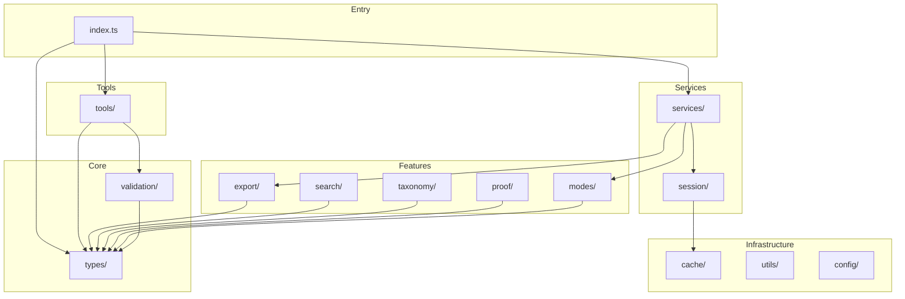

# Directory Structure Guide

**Version**: 9.0.0 | **Last Updated**: 2025-12-30

This document describes the purpose and organization of each directory in the DeepThinking MCP codebase.

---

## Overview

The codebase is organized into **15 modules** with **233 TypeScript files** totaling approximately **100,600 lines of code**.

```
src/
├── cache/             # Caching strategies (3 files)
├── config/            # Centralized configuration (1 file)
├── export/            # Export services (44 files)
│   └── visual/        # Per-mode visual exporters
├── interfaces/        # Dependency injection interfaces (1 file)
├── modes/             # Advanced reasoning implementations (52 files)
│   └── handlers/      # Mode-specific handlers (36 files)
├── proof/             # Proof decomposition & analysis (13 files)
├── search/            # Full-text search engine (3 files)
├── services/          # Business logic layer (2 files)
├── session/           # Session management (4 files)
│   └── storage/       # Storage adapters
├── taxonomy/          # Reasoning type classification (5 files)
├── tools/             # MCP tool definitions (18 files)
│   └── schemas/       # Zod validation schemas
├── types/             # Type definitions (36 files)
│   └── modes/         # Per-mode type definitions
├── utils/             # Utility functions (6 files)
├── validation/        # Input validation (44 files)
│   └── validators/    # Mode-specific validators
└── index.ts           # Entry point
```

---

## Directory Descriptions

### `cache/` - Caching Strategies
**Files**: 3 | **Purpose**: In-memory caching with multiple eviction strategies

- `lru.ts` - Least Recently Used cache implementation (exports `LRUCache`)
- `lfu.ts` - Least Frequently Used cache implementation
- `fifo.ts` - First-In-First-Out cache implementation

**Used by**: Session management, validation caching

---

### `config/` - Centralized Configuration
**Files**: 1 | **Purpose**: Environment-based configuration management

- `index.ts` - Server configuration with environment variable support

**Key exports**: `getConfig()`, `updateConfig()`, `ServerConfig`

---

### `export/` - Export Services
**Files**: 27 | **Purpose**: Multi-format export for thinking sessions

#### Root Files
- `latex.ts` - LaTeX document generation
- `latex-mermaid-integration.ts` - LaTeX with embedded diagrams
- `visual.ts` - Core visual export coordinator

#### `export/visual/` - Per-Mode Visual Exporters
One file per reasoning mode providing Mermaid, DOT, and ASCII diagram generation:
- `sequential.ts`, `shannon.ts`, `mathematics.ts`, `physics.ts`, etc.
- `index.ts` - VisualExporter class coordinating all exporters
- `utils.ts` - Shared utilities for diagram generation
- `proof-decomposition.ts` - Proof structure visualization

**Pattern**: Each mode has its own exporter file to:
- Enable tree-shaking (unused modes aren't bundled)
- Simplify mode-specific customization
- Reduce merge conflicts

---

### `interfaces/` - Dependency Injection
**Files**: 1 | **Purpose**: Interface definitions for loose coupling

- `ILogger.ts` - Logger interface for DI

---

### `modes/` - Advanced Reasoning Implementations
**Files**: 52 | **Purpose**: Runtime logic for complex reasoning modes and specialized handlers

#### Root Files
- `index.ts` - Barrel exports
- `registry.ts` - Mode handler registry exports

#### `modes/handlers/` - Specialized Mode Handlers (v8.x)
36 handlers implementing the ModeHandler pattern (all 33 modes covered):
- `ModeHandler.ts` - Handler interface definition
- `ModeHandlerRegistry.ts` - Singleton registry for handler management
- `GenericModeHandler.ts` - Fallback handler for non-specialized modes
- **Core (5)**: Sequential, Shannon, Mathematics, Physics, Hybrid handlers
- **Fundamental (3)**: Inductive, Deductive, Abductive handlers
- **Causal/Probabilistic (6)**: Causal, Bayesian, Counterfactual, Temporal, GameTheory, Evidential
- **Analogical (2)**: Analogical, FirstPrinciples handlers
- **Systems/Scientific (3)**: SystemsThinking, ScientificMethod, FormalLogic handlers
- **Academic (4)**: Synthesis, Argumentation, Critique, Analysis handlers
- **Engineering (4)**: Engineering, Computability, Cryptanalytic, Algorithmic handlers
- **Advanced Runtime (6)**: MetaReasoning, Recursive, Modal, Stochastic, Constraint, Optimization

---

### `proof/` - Proof Decomposition
**Files**: 13 | **Purpose**: Mathematical proof analysis and validation

- `decomposer.ts` - Breaks proofs into atomic statements
- `dependency-graph.ts` - Builds statement dependency DAGs
- `gap-analyzer.ts` - Identifies missing proof steps
- `assumption-tracker.ts` - Tracks explicit/implicit assumptions
- `inconsistency-detector.ts` - Finds logical contradictions
- `circular-detector.ts` - Detects circular reasoning
- `branch-analyzer.ts` - Analyzes proof branches
- `hierarchical-proof.ts` - Hierarchical proof management
- `strategy-recommender.ts` - Recommends proof strategies
- `verifier.ts` - Proof verification
- `index.ts` - Barrel exports
- `types.ts` - Proof-specific types
- `patterns/warnings.ts` - Common proof anti-patterns

---

### `search/` - Full-Text Search
**Files**: 3 | **Purpose**: Session and thought search with faceted filtering

- `index.ts` - SearchIndex class with TF-IDF scoring
- `tokenizer.ts` - Text tokenization and normalization
- `types.ts` - Search query and result types

---

### `services/` - Business Logic Layer
**Files**: 2 | **Purpose**: Core application services

- `ThoughtFactory.ts` - Creates mode-specific thought objects with ModeHandler integration
- `ExportService.ts` - Coordinates all export formats (8 formats + file export)

---

### `session/` - Session Management
**Files**: 4 | **Purpose**: Thinking session lifecycle management

- `manager.ts` - SessionManager class (main API)
- `SessionMetricsCalculator.ts` - Session analytics and incremental metrics
- `FileSessionStore.ts` - File system storage with cross-process locking
- `storage.ts` - Storage interface and configuration

---

### `taxonomy/` - Reasoning Classification
**Files**: 5 | **Purpose**: 69 reasoning types across 12 categories

- `reasoning-types.ts` - All reasoning type definitions
- `classifier.ts` - TaxonomyClassifier for thought classification
- `suggestion-engine.ts` - SuggestionEngine for mode recommendations
- `navigator.ts` - TaxonomyNavigator for taxonomy exploration
- `multi-modal-analyzer.ts` - MultiModalAnalyzer for cross-mode analysis

---

### `tools/` - MCP Tool Definitions
**Files**: 16 | **Purpose**: Model Context Protocol tool schemas

- `thinking.ts` - Legacy deepthinking tool (deprecated)
- `definitions.ts` - New focused tool definitions
- `json-schemas.ts` - JSON Schema exports

#### `tools/schemas/` - Zod Validation Schemas
- `base.ts` - Shared base schemas
- `shared.ts` - Common field schemas
- `version.ts` - Version information

#### `tools/schemas/modes/` - Per-Category Schemas
- `core.ts` - Core modes (sequential, shannon, hybrid)
- `analytical.ts` - Analytical modes
- `causal.ts` - Causal reasoning modes
- `probabilistic.ts` - Probabilistic modes
- `scientific.ts` - Scientific method modes
- `strategic.ts` - Strategic reasoning modes
- `temporal.ts` - Temporal reasoning modes

---

### `types/` - Type Definitions
**Files**: 21 | **Purpose**: TypeScript type definitions

- `core.ts` - ThinkingMode enum, Thought union type, base interfaces
- `session.ts` - Session-related types
- `index.ts` - Barrel export

#### `types/modes/` - Per-Mode Types
One file per reasoning mode with specific thought interfaces:
- `sequential.ts`, `shannon.ts`, `mathematics.ts`, etc.
- `recommendations.ts` - Mode recommendation types

**Pattern**: Separating mode types:
- Enables type-only imports (erased at runtime)
- Prevents circular dependency issues
- Allows independent mode type evolution

---

### `utils/` - Utility Functions
**Files**: 6 | **Purpose**: Shared utility functions

- `errors.ts` - Custom error classes (ValidationError, etc.)
- `logger.ts` - Logging implementation
- `logger-types.ts` - Logger type definitions
- `log-sanitizer.ts` - Sensitive data redaction
- `sanitization.ts` - Input sanitization and escaping
- `type-guards.ts` - Runtime type checking utilities

---

### `validation/` - Input Validation
**Files**: 35 | **Purpose**: Zod-based input validation

- `validator.ts` - Main validator class
- `schemas.ts` - Core validation schemas
- `cache.ts` - Validation result caching
- `constants.ts` - Validation constants

#### `validation/validators/modes/` - Per-Mode Validators
One file per reasoning mode with specific validation rules:
- 27 mode validator files
- Complex modes have extensive validation (e.g., `formallogic.ts`: 500+ lines)

---

## Per-Mode File Pattern Rationale

Several directories have many files following a "one file per mode" pattern:

| Directory | Files | Reason |
|-----------|-------|--------|
| `types/modes/` | 26 | Type-only imports prevent runtime overhead |
| `export/visual/` | 22 | Tree-shakeable mode-specific exporters |
| `validation/validators/modes/` | 35 | Mode-specific validation complexity |
| `tools/schemas/modes/` | 8 | Grouped by reasoning category |
| `modes/handlers/` | 36 | Specialized handler per mode |

**Benefits**:
1. **Easy navigation**: Find mode → find file
2. **Focused diffs**: PRs touch only relevant files
3. **Reduced conflicts**: Parallel mode development
4. **Tree-shaking**: Unused modes excluded from bundle

---

## Dependency Flow



---

## Statistics

| Metric | Value |
|--------|-------|
| Total TypeScript files | 233 |
| Total modules | 15 |
| Lines of code | ~100,600 |
| Reasoning modes | 33 (29 with thought types) |
| Specialized handlers | 36 (all modes covered) |
| Visual exporters | 41 files (22 mode-specific) |
| Builder classes | 14 fluent APIs |
| Mode validators | 35 |
| Total exports | 1,267 (568 re-exports) |
| Runtime circular deps | 0 |
| Type-only circular deps | 55 (safe) |

---

*Updated for Phase 15 Radical Simplification & v9.0.0 Architecture*
