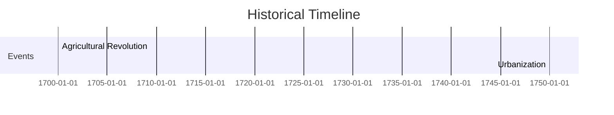

# Historical Reasoning Mode

**Version**: 9.1.0 | **Handler**: v9.1.0 (Specialized - Source Reliability)
**Tool**: `deepthinking_temporal`
**Status**: Stable (Fully Implemented)
**Source**: `src/types/modes/historical.ts`

## Dependencies

| Dependency | Type | Imports |
|------------|------|---------|
| `../core.js` | Internal | `BaseThought`, `ThinkingMode` |

## Exports

- **Types**: `HistoricalThoughtType`
- **Interfaces**: `HistoricalThought`, `HistoricalEvent`, `HistoricalSource`, `HistoricalPeriod`, `CausalChain`, `CausalLink`, `HistoricalActor`, `HistoricalPattern`, `HistoricalInterpretation`, `HistoricalMethodology`, `DateRange`, `SourceBias`, `PeriodTransition`, `ActorRelationship`
- **Functions**: `isHistoricalThought`

---

## Overview

Historical mode provides **comprehensive historical analysis** with source evaluation, pattern recognition, causal chain analysis, and historiographical reasoning. Designed for historians, researchers, and anyone analyzing historical events and their relationships.

This mode captures the structure of historical reasoning - from event identification through source criticism to pattern detection and periodization.

## Thought Types

| Type | Description |
|------|-------------|
| `event_analysis` | Analyze historical events and their context |
| `source_evaluation` | Evaluate primary/secondary/tertiary sources |
| `pattern_identification` | Identify patterns across time periods |
| `causal_chain` | Trace cause-effect relationships |
| `periodization` | Define and analyze historical periods |

## When to Use Historical Mode

Use historical mode when you need to:

- **Analyze events** - Study historical events with significance ratings
- **Evaluate sources** - Assess reliability, bias, and corroboration
- **Identify patterns** - Detect cyclical, structural, or contingent patterns
- **Trace causation** - Build causal chains with confidence scoring
- **Define periods** - Organize history into meaningful periods

### Problem Types Well-Suited for Historical Mode

- **Historical research** - Academic historical analysis
- **Source criticism** - Evaluating historical evidence
- **Historiography** - Understanding interpretive frameworks
- **Event analysis** - Detailed study of historical events
- **Comparative history** - Cross-period pattern identification

## Core Concepts

### Historical Event

```typescript
interface HistoricalEvent {
  id: string;
  name: string;
  date: string | DateRange;
  location?: string;
  description?: string;
  actors?: string[];        // References to HistoricalActor.id
  causes?: string[];        // References to other event IDs
  effects?: string[];       // References to other event IDs
  significance: 'minor' | 'moderate' | 'major' | 'transformative';
  sources?: string[];       // References to HistoricalSource.id
  tags?: string[];
  context?: string;
}
```

### Historical Source

```typescript
interface HistoricalSource {
  id: string;
  title: string;
  type: 'primary' | 'secondary' | 'tertiary';
  subtype?: 'document' | 'artifact' | 'oral' | 'visual' | 'archaeological' | 'statistical';
  author?: string;
  date?: string;
  location?: string;
  reliability: number;      // 0-1 scale
  bias?: SourceBias;
  corroboratedBy?: string[]; // Other source IDs
  contradictedBy?: string[];
  provenance?: string;
  limitations?: string[];
}
```

### Source Bias

```typescript
interface SourceBias {
  type: 'political' | 'religious' | 'cultural' | 'economic' | 'nationalistic' | 'ideological' | 'personal';
  direction?: string;
  severity: number; // 0-1 scale
  evidence?: string[];
}
```

### Historical Period

```typescript
interface HistoricalPeriod {
  id: string;
  name: string;
  startDate: string;
  endDate: string;
  characteristics: string[];
  keyEvents?: string[];     // Event IDs
  keyActors?: string[];     // Actor IDs
  transitions?: PeriodTransition[];
  themes?: string[];
}
```

### Causal Chain

```typescript
interface CausalChain {
  id: string;
  name: string;
  links: CausalLink[];
  confidence: number;       // 0-1 scale (aggregate)
  alternativeExplanations?: string[];
  historiographicalDebate?: string;
}

interface CausalLink {
  cause: string;            // Event ID
  effect: string;           // Event ID
  mechanism?: string;
  confidence: number;       // 0-1 scale
  timelag?: string;
  evidence?: string[];      // Source IDs
}
```

### Historical Actor

```typescript
interface HistoricalActor {
  id: string;
  name: string;
  type: 'individual' | 'group' | 'institution' | 'nation' | 'movement' | 'class';
  period?: string;          // Period ID
  dates?: DateRange;
  roles?: string[];
  motivations?: string[];
  relationships?: ActorRelationship[];
  significance?: 'minor' | 'moderate' | 'major' | 'transformative';
}
```

### Historical Pattern

```typescript
interface HistoricalPattern {
  id: string;
  name: string;
  type: 'cyclical' | 'linear' | 'dialectical' | 'contingent' | 'structural';
  instances: string[];      // Event IDs
  description: string;
  confidence: number;
  counterexamples?: string[];
}
```

### Historical Methodology

```typescript
interface HistoricalMethodology {
  approach: 'empiricist' | 'interpretive' | 'critical' | 'postmodern' | 'marxist' | 'annales' | 'microhistory' | 'quantitative';
  techniques: string[];
  limitations: string[];
  strengths: string[];
}
```

## Handler Features

The **HistoricalHandler** provides specialized validation and enhancements:

| Feature | Description |
|---------|-------------|
| **Aggregate Reliability** | Weighted calculation based on source type (primary=2x, secondary=1.5x) with corroboration bonus |
| **Causal Chain Validation** | Ensures continuity (each effect is cause of next link) |
| **Pattern Detection** | Auto-detects Revolutionary Periods and Causal Nexuses from events |
| **Temporal Span** | Calculates overall time range from events |
| **Reference Validation** | Cross-validates event ↔ source ↔ actor references |

### Aggregate Reliability Calculation

```typescript
// Weighted by source type
const weight = source.type === 'primary' ? 2 :
               source.type === 'secondary' ? 1.5 : 1;

// Corroboration bonus (up to 0.1)
const corroborationBonus = Math.min(0.1,
  (corroboratedCount / sources.length) * 0.1);

return Math.min(1, (weightedSum / totalWeight) + corroborationBonus);
```

### Auto-Detected Patterns

| Pattern | Trigger | Description |
|---------|---------|-------------|
| **Revolutionary Period** | 40%+ transformative events | High concentration of transformative change |
| **Causal Nexus** | 2+ events with 3+ causal connections | Events forming central nodes of causation |

## Usage Examples

### Basic Event Analysis

```typescript
{
  mode: 'historical',
  thoughtType: 'event_analysis',
  thought: 'Analyzing the causes and effects of the Industrial Revolution',
  events: [
    {
      id: 'evt-1',
      name: 'Agricultural Revolution',
      date: { start: '1700', end: '1850' },
      significance: 'transformative',
      effects: ['evt-2'],
      sources: ['src-1']
    },
    {
      id: 'evt-2',
      name: 'Urbanization',
      date: { start: '1750', end: '1900' },
      significance: 'major',
      causes: ['evt-1']
    }
  ]
}
```

### Source Evaluation

```typescript
{
  mode: 'historical',
  thoughtType: 'source_evaluation',
  thought: 'Evaluating sources on the French Revolution',
  sources: [
    {
      id: 'src-1',
      title: 'Memoirs of Madame Roland',
      type: 'primary',
      subtype: 'document',
      author: 'Madame Roland',
      date: '1793',
      reliability: 0.7,
      bias: {
        type: 'political',
        direction: 'Girondin',
        severity: 0.6
      },
      limitations: ['Written while imprisoned', 'Retrospective justification']
    },
    {
      id: 'src-2',
      title: 'Citizens: A Chronicle of the French Revolution',
      type: 'secondary',
      author: 'Simon Schama',
      date: '1989',
      reliability: 0.85,
      corroboratedBy: ['src-3']
    }
  ]
}
```

### Causal Chain Analysis

```typescript
{
  mode: 'historical',
  thoughtType: 'causal_chain',
  thought: 'Tracing causes of World War I',
  events: [
    { id: 'evt-1', name: 'Assassination of Franz Ferdinand', date: '1914-06-28', significance: 'transformative' },
    { id: 'evt-2', name: 'Austrian Ultimatum', date: '1914-07-23', significance: 'major' },
    { id: 'evt-3', name: 'Declaration of War', date: '1914-07-28', significance: 'transformative' }
  ],
  causalChains: [
    {
      id: 'chain-1',
      name: 'July Crisis Escalation',
      confidence: 0.9,
      links: [
        { cause: 'evt-1', effect: 'evt-2', mechanism: 'diplomatic pressure', confidence: 0.95 },
        { cause: 'evt-2', effect: 'evt-3', mechanism: 'alliance obligations', confidence: 0.9 }
      ]
    }
  ]
}
```

### Periodization

```typescript
{
  mode: 'historical',
  thoughtType: 'periodization',
  thought: 'Defining periods of Roman history',
  periods: [
    {
      id: 'period-1',
      name: 'Roman Republic',
      startDate: '-509',
      endDate: '-27',
      characteristics: ['Senate rule', 'Expansion', 'Civil conflicts'],
      keyEvents: ['evt-punic-wars', 'evt-caesar-assassination']
    },
    {
      id: 'period-2',
      name: 'Roman Empire',
      startDate: '-27',
      endDate: '476',
      characteristics: ['Imperial rule', 'Pax Romana', 'Decline'],
      transitions: [{
        fromPeriod: 'period-1',
        toPeriod: 'period-2',
        transitionType: 'revolutionary',
        catalysts: ['Civil wars', 'Augustus consolidation']
      }]
    }
  ]
}
```

## Visual Exports

Historical mode supports multiple visual export formats:

### Mermaid (Gantt Timeline)

Events organized by periods as Gantt chart sections.



### Mermaid (Causal Flowchart)

Causal chains as directed flowcharts with significance-based shapes.


### DOT (GraphViz)

Event graphs with:
- Significance-based colors
- Source subgraphs
- Actor subgraphs

### ASCII

Structured text document with:
- Event listings by significance
- Causal chain flow diagrams
- Source reliability indicators
- Period characteristics

## Historiographical Schools

The mode supports explicit historiographical positioning:

| School | Approach |
|--------|----------|
| `empiricist` | Evidence-based, objective truth seeking |
| `interpretive` | Meaning-focused, hermeneutic |
| `critical` | Power relations, ideology critique |
| `postmodern` | Narrative construction, multiple perspectives |
| `marxist` | Class conflict, economic determinism |
| `annales` | Long-term structures, mentalities |
| `microhistory` | Individual cases, cultural meaning |
| `quantitative` | Statistical analysis, cliometrics |

## Related Modes

| Mode | Relationship |
|------|--------------|
| **Temporal** | Shares timeline concepts; Historical adds source criticism |
| **Causal** | Shares causal graphs; Historical adds historiographical context |
| **Synthesis** | Similar source handling; Historical focuses on primary sources |

## Best Practices

1. **Always cite sources** - Every event should reference sources
2. **Rate reliability honestly** - Use the full 0-1 scale
3. **Document bias** - All sources have bias; make it explicit
4. **Build causal chains incrementally** - Start with well-documented links
5. **Consider counterarguments** - Use `alternativeExplanations`
6. **Specify methodology** - Make your historiographical approach explicit

## Validation Rules

| Rule | Severity | Description |
|------|----------|-------------|
| Event must have name | Error | Required field |
| Event must have date | Error | Required field |
| Date range start < end | Error | Chronological ordering |
| Source must have title | Error | Required field |
| Reliability in 0-1 range | Error | Valid probability |
| Chain link references valid events | Error | Referential integrity |
| Chain continuity | Warning | Effect should be next cause |
| Events should have sources | Warning | Best practice |
| Low reliability sources | Warning | < 0.5 triggers warning |

## See Also

- [Temporal Mode](./TEMPORAL.md) - Time-focused reasoning
- [Causal Mode](./CAUSAL.md) - Causal graph analysis
- [Synthesis Mode](./SYNTHESIS.md) - Literature review
