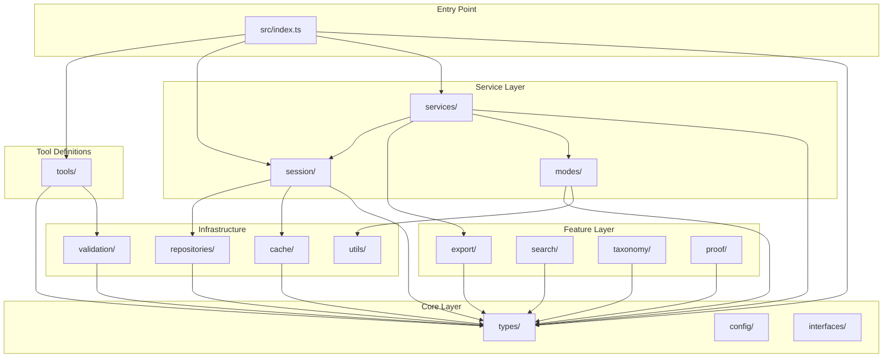

# Dependency Graph Analysis & Consolidation Plan (v7.0.1)

## Executive Summary

**Goal**: Consolidate the codebase structure by removing dead code, reducing folder count from 28 to 17 directories, and improving module organization for better maintainability.

**Current State Analysis**:
- **201 TypeScript files** across **28 source directories**
- **~58,500 lines** of TypeScript code
- **10 dead code directories** containing **~45 files** (not imported anywhere)
- **2 duplicate utility modules** with confusing names
- High file-count directories follow per-mode pattern (acceptable)

**Value Proposition**:
1. **Reduced Complexity**: Remove 10 unused directories (~82 KB of dead code)
2. **Clarity**: Rename confusing modules, consolidate overlapping concerns
3. **Faster Builds**: Fewer files = faster TypeScript compilation
4. **Easier Onboarding**: Simpler directory structure for new contributors
5. **Zero Breaking Changes**: No API changes, purely internal cleanup

**Approach**: Three-sprint implementation
- **Sprint 1**: Delete confirmed dead code (quick wins)
- **Sprint 2**: Consolidate small directories and rename confusing modules
- **Sprint 3**: Final cleanup and documentation update

**Total Effort**: 8-12 developer hours across 3 sprints

---

## Current Directory Structure (28 directories)

```
src/
├── analytics/          # 2 files  - ❌ DEAD CODE (no imports)
├── backup/             # 4 files  - ❌ DEAD CODE (only used by dead batch/)
├── batch/              # 3 files  - ❌ DEAD CODE (no imports)
├── cache/              # 6 files  - ✅ ACTIVE
├── collaboration/      # 5 files  - ❌ DEAD CODE (no imports)
├── comparison/         # 5 files  - ❌ DEAD CODE (no imports)
├── config/             # 1 file   - ✅ ACTIVE
├── export/             # 4 files  - ✅ ACTIVE
│   └── visual/         # 23 files - ✅ ACTIVE (1 per mode)
├── interfaces/         # 2 files  - ✅ ACTIVE
├── ml/                 # 4 files  - ❌ DEAD CODE (no imports)
├── modes/              # 7 files  - ✅ ACTIVE
├── proof/              # 7 files  - ✅ ACTIVE
│   └── patterns/       # ?        - Check usage
├── rate-limit/         # 4 files  - ❌ DEAD CODE (no imports)
├── repositories/       # 4 files  - ✅ ACTIVE
├── search/             # 5 files  - ✅ ACTIVE
├── services/           # 5 files  - ✅ ACTIVE
├── session/            # 4 files  - ✅ ACTIVE
│   └── storage/        # 3 files  - ✅ ACTIVE
├── taxonomy/           # 7 files  - ✅ ACTIVE
├── templates/          # 4 files  - ❌ DEAD CODE (no imports)
├── tools/              # 3 files  - ✅ ACTIVE
│   └── schemas/        # 4 files  - ✅ ACTIVE
│       └── modes/      # 9 files  - ✅ ACTIVE
├── types/              # 3 files  - ✅ ACTIVE
│   └── modes/          # 18 files - ✅ ACTIVE (1 per mode)
├── utils/              # 8 files  - ✅ ACTIVE (2 with confusing names)
├── validation/         # 5 files  - ✅ ACTIVE
│   └── validators/
│       └── modes/      # 27 files - ✅ ACTIVE (1 per mode)
├── visualization/      # 5 files  - ❌ DEAD CODE (shadowed by export/visual/)
├── webhooks/           # 5 files  - ❌ DEAD CODE (no imports)
└── index.ts            # Main entry point
```

### Legend
- ❌ DEAD CODE = No imports from any other module
- ✅ ACTIVE = Currently used by the application

---

## Dead Code Analysis

### Confirmed Dead Code Directories

| Directory | Files | Size | Status | Reason |
|-----------|-------|------|--------|--------|
| `visualization/` | 5 | ~83 KB | DELETE | Completely shadowed by `export/visual/` |
| `rate-limit/` | 4 | ~16 KB | DELETE | Never imported |
| `analytics/` | 2 | ~8 KB | DELETE | Never imported (future feature) |
| `ml/` | 4 | ~28 KB | DELETE | Never imported (ML patterns) |
| `webhooks/` | 5 | ~12 KB | DELETE | Never imported (event system) |
| `collaboration/` | 5 | ~28 KB | DELETE | Never imported (multi-agent) |
| `templates/` | 4 | ~20 KB | DELETE | Never imported (built-in templates) |
| `comparison/` | 5 | ~16 KB | DELETE | Never imported (session comparison) |
| `batch/` | 3 | ~12 KB | DELETE | Never imported (batch operations) |
| `backup/` | 4 | ~20 KB | DELETE | Only used by dead batch/ |
| **TOTAL** | **41** | **~243 KB** | | |

### Verification Commands

```bash
# Verify no imports exist for each directory
grep -r "from ['\"].*visualization" src/  # Returns 0 matches
grep -r "from ['\"].*rate-limit" src/     # Returns 0 matches
grep -r "from ['\"].*analytics" src/       # Returns 0 matches
# ... etc.
```

---

## Duplicate/Overlapping Modules

### 1. Sanitization Modules (Confusing Names)

**Problem**: Two files with similar names but different purposes:
- `src/utils/sanitization.ts` - Input validation + HTML/LaTeX escaping
- `src/utils/sanitize.ts` - Path security + UUID validation

**Solution**: Rename for clarity:
- Keep `src/utils/sanitization.ts` (input sanitization)
- Rename `src/utils/sanitize.ts` → `src/utils/path-security.ts`

### 2. Rate Limiter Modules (Duplicate Feature)

**Problem**: Two rate limiting implementations:
- `src/utils/rate-limiter.ts` - Simple rate limiter
- `src/rate-limit/` - Full rate limiting system with quotas

**Solution**: Both are dead code - DELETE both. If rate limiting is needed later, implement fresh with clear requirements.

### 3. Visualization vs Export/Visual

**Problem**: Two visualization directories:
- `src/visualization/` - Original visualization (mermaid, mindmap, etc.)
- `src/export/visual/` - Current visualization system (per-mode exporters)

**Solution**: DELETE `src/visualization/` - it's completely superseded.

---

## High-File-Count Directories (Analysis)

These directories have many files but follow a justified per-mode pattern:

| Directory | Files | Pattern | Assessment |
|-----------|-------|---------|------------|
| `validation/validators/modes/` | 27 | 1 per mode | ✅ KEEP - Good separation of concerns |
| `export/visual/` | 23 | 1 per mode | ✅ KEEP - Mode-specific exporters |
| `types/modes/` | 18 | 1 per mode | ✅ KEEP - Type definitions |
| `tools/schemas/modes/` | 9 | Grouped by category | ✅ KEEP - Schema organization |

**Recommendation**: Keep per-mode file structure. With 25 reasoning modes, one file per mode provides:
- Easy navigation (find mode → find file)
- Focused diffs in PRs
- Reduced merge conflicts
- Tree-shakeable imports

---

## Target Directory Structure (17 directories)

After consolidation:

```
src/
├── cache/              # 6 files  - Caching strategies
├── config/             # 1 file   - Centralized configuration
├── export/             # 4 files  - Export services
│   └── visual/         # 23 files - Visual exporters
├── interfaces/         # 2 files  - DI interfaces
├── modes/              # 7 files  - Mode implementations
├── proof/              # 7 files  - Proof decomposition
├── repositories/       # 4 files  - Repository pattern
├── search/             # 5 files  - Search engine
├── services/           # 5 files  - Business logic
├── session/            # 4 files  - Session management
│   └── storage/        # 3 files  - Storage adapters
├── taxonomy/           # 7 files  - Taxonomy system
├── tools/              # 3 files  - MCP tool definitions
│   └── schemas/        # 4 files  - Tool schemas
│       └── modes/      # 9 files  - Mode schemas
├── types/              # 3 files  - Core types
│   └── modes/          # 18 files - Mode types
├── utils/              # 7 files  - Utilities (sanitize.ts renamed)
├── validation/         # 5 files  - Validation
│   └── validators/
│       └── modes/      # 27 files - Mode validators
└── index.ts            # Entry point
```

**Reduction**: 28 → 17 directories (-11 directories, -39% folder count)

---

## Sprint Structure

### Sprint 1: Delete Dead Code (Week 1)
**Effort**: 2-3 hours | **Result**: -41 files, -243 KB

**Tasks**:

#### Delete Dead Directories (1 hour)
1. Delete `src/visualization/` - 5 files of dead visualization code
2. Delete `src/rate-limit/` - 4 files of unused rate limiting
3. Delete `src/analytics/` - 2 files of placeholder analytics
4. Delete `src/ml/` - 4 files of unused ML patterns
5. Delete `src/webhooks/` - 5 files of unused webhook system
6. Delete `src/collaboration/` - 5 files of unused multi-agent code
7. Delete `src/templates/` - 4 files of unused template system
8. Delete `src/comparison/` - 5 files of unused comparison tools
9. Delete `src/batch/` - 3 files of unused batch processor
10. Delete `src/backup/` - 4 files only used by dead batch/

#### Update Path Aliases (30 minutes)
11. Remove deleted directories from `tsconfig.json` path aliases
12. Update any build scripts referencing deleted paths

#### Verification (30 minutes)
13. Run `npm run typecheck` - verify no type errors
14. Run `npm run test:run` - verify all tests pass
15. Run `npm run build` - verify clean build

**Success Criteria**:
- All 41 dead files deleted
- Zero TypeScript errors
- All tests passing
- Build completes successfully

**Files Deleted**:
- `src/visualization/*` (5 files)
- `src/rate-limit/*` (4 files)
- `src/analytics/*` (2 files)
- `src/ml/*` (4 files)
- `src/webhooks/*` (5 files)
- `src/collaboration/*` (5 files)
- `src/templates/*` (4 files)
- `src/comparison/*` (5 files)
- `src/batch/*` (3 files)
- `src/backup/*` (4 files)

---

### Sprint 2: Consolidate & Rename (Week 2)
**Effort**: 3-4 hours | **Result**: Clearer module names

**Tasks**:

#### Rename Confusing Modules (1 hour)
1. Rename `src/utils/sanitize.ts` → `src/utils/path-security.ts`
2. Update all imports of the renamed file
3. Add JSDoc to clarify each sanitization module's purpose

#### Delete Unused Utils (30 minutes)
4. Delete `src/utils/rate-limiter.ts` - not imported anywhere
5. Verify no other dead utils files

#### Update Documentation (1 hour)
6. Update `CLAUDE.md` with new directory structure
7. Update any docs referencing deleted directories
8. Update path alias documentation

#### Testing (1 hour)
9. Run full test suite
10. Verify all imports resolve correctly
11. Test build output

**Success Criteria**:
- No confusing duplicate names
- All imports updated
- Documentation accurate
- Tests passing

**Files Modified**:
- `src/utils/sanitize.ts` → `src/utils/path-security.ts`
- All files importing the renamed module
- `tsconfig.json` (if needed)
- `CLAUDE.md`

---

### Sprint 3: Documentation & Cleanup (Week 3)
**Effort**: 2-4 hours | **Result**: Complete documentation

**Tasks**:

#### Architecture Documentation (2 hours)
1. Create `docs/architecture/DIRECTORY_STRUCTURE.md`
2. Document each directory's purpose and responsibilities
3. Add dependency graph diagram (Mermaid)
4. Document the per-mode file pattern rationale

#### Final Cleanup (1 hour)
5. Remove any orphaned type exports
6. Clean up any unused test fixtures
7. Update `package.json` files entry if needed

#### Version & Release (1 hour)
8. Update `CHANGELOG.md` with consolidation changes
9. Bump version to v7.0.1 (patch - no API changes)
10. Tag release

**Success Criteria**:
- Complete architecture documentation
- Clean git history with consolidation commit
- No orphaned code
- Ready for v7.0.1 release

**Files Created**:
- `docs/architecture/DIRECTORY_STRUCTURE.md`

**Files Modified**:
- `CHANGELOG.md`
- `package.json` (version bump)

---

## Dependency Graph (Active Modules)



---

## Risk Assessment

### Low Risk: Missing Dependencies

**Impact**: Deleting files might break something unexpected
**Mitigation**:
- Grep verification for each directory before deletion
- Full test suite run after each batch of deletions
- Keep deleted code in git history for easy recovery

### Low Risk: Path Alias Issues

**Impact**: Renamed modules might cause import errors
**Mitigation**:
- Update tsconfig.json path aliases
- Use IDE find-replace for import updates
- TypeScript will catch any missing imports

### Very Low Risk: Test Coverage

**Impact**: Dead code might have associated tests
**Mitigation**:
- Tests for dead code are also dead - safe to delete
- Run test suite after deletions to confirm

---

## Success Metrics

### Quantitative
- Directory count: 28 → 17 (-39%)
- Dead code files removed: 41 files (~243 KB)
- All 790+ tests passing
- Zero TypeScript errors
- Build time improvement (measured before/after)

### Qualitative
- Simpler onboarding for new contributors
- Clearer module naming (no confusion)
- Documentation matches reality
- No orphaned code

---

## Implementation Checklist

### Pre-Sprint Verification
- [ ] Run `npm run typecheck` - baseline passing
- [ ] Run `npm run test:run` - all tests passing
- [ ] Document current file/directory counts
- [ ] Create git branch for consolidation work

### Sprint 1 Checklist
- [ ] Delete `src/visualization/`
- [ ] Delete `src/rate-limit/`
- [ ] Delete `src/analytics/`
- [ ] Delete `src/ml/`
- [ ] Delete `src/webhooks/`
- [ ] Delete `src/collaboration/`
- [ ] Delete `src/templates/`
- [ ] Delete `src/comparison/`
- [ ] Delete `src/batch/`
- [ ] Delete `src/backup/`
- [ ] Update tsconfig.json path aliases
- [ ] Run typecheck, tests, build
- [ ] Commit: "chore: Remove 10 dead code directories"

### Sprint 2 Checklist
- [ ] Rename `sanitize.ts` → `path-security.ts`
- [ ] Update all imports
- [ ] Delete `src/utils/rate-limiter.ts`
- [ ] Update CLAUDE.md
- [ ] Run typecheck, tests, build
- [ ] Commit: "refactor: Rename sanitize.ts for clarity"

### Sprint 3 Checklist
- [ ] Create architecture documentation
- [ ] Update CHANGELOG.md
- [ ] Bump version to v7.0.1
- [ ] Final test run
- [ ] Commit: "docs: Add directory structure documentation"
- [ ] Tag v7.0.1 release

---

## References

- Phase 7 Implementation Plan (visual export integration)
- CLAUDE.md (project instructions)
- tsconfig.json (path aliases)
- Existing test suite coverage

---

## Appendix: Dead Code Verification Script

```bash
#!/bin/bash
# Verify dead code directories have no imports

DEAD_DIRS=(
    "visualization"
    "rate-limit"
    "analytics"
    "ml"
    "webhooks"
    "collaboration"
    "templates"
    "comparison"
    "batch"
)

echo "Checking for imports of dead directories..."
for dir in "${DEAD_DIRS[@]}"; do
    count=$(grep -r "from ['\"].*/$dir" src/ 2>/dev/null | wc -l)
    if [ "$count" -eq 0 ]; then
        echo "✅ $dir - No imports found (safe to delete)"
    else
        echo "❌ $dir - $count imports found (DO NOT DELETE)"
        grep -r "from ['\"].*/$dir" src/
    fi
done

# Special case: backup is imported by batch, but batch is dead
echo ""
echo "Checking backup (used only by dead batch)..."
grep -r "from ['\"].*backup" src/ | grep -v "batch/"
```
